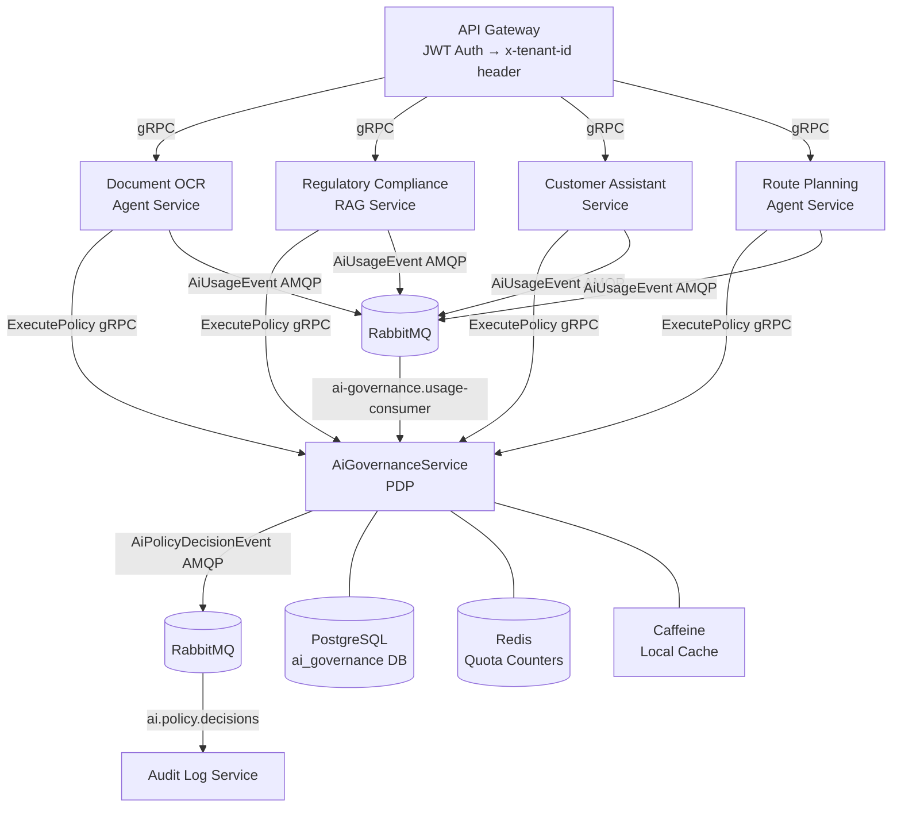
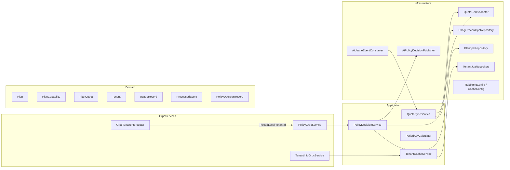
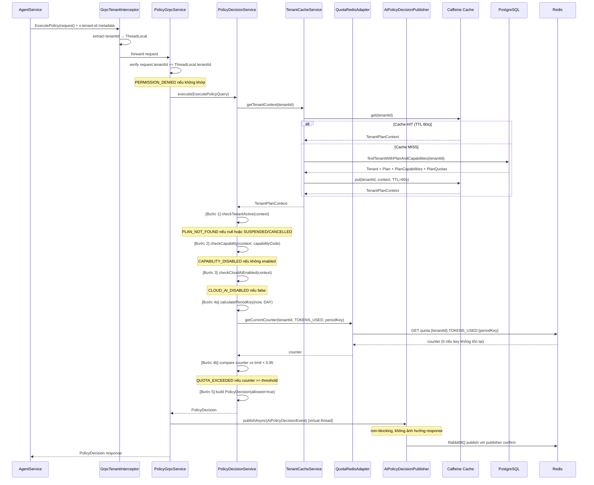
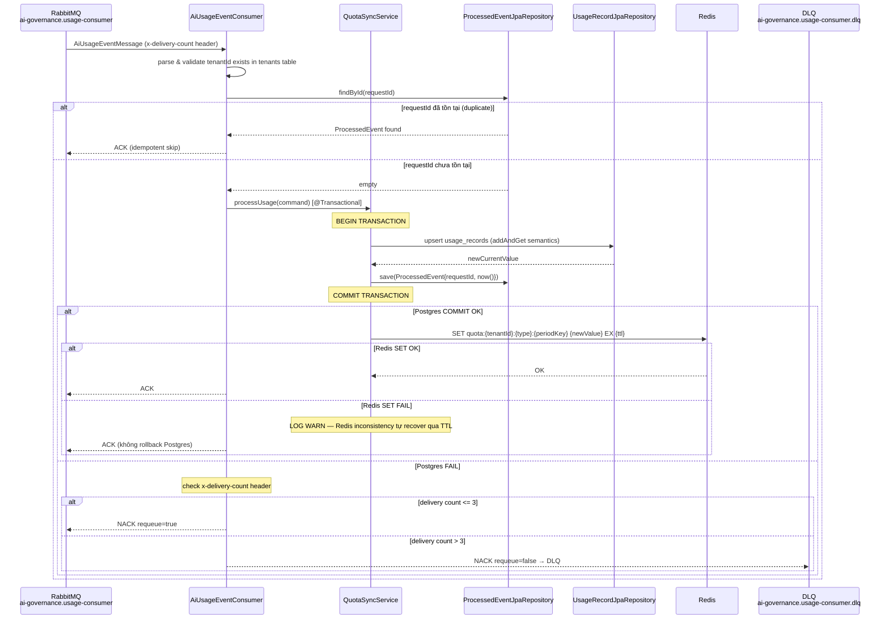

# Tài liệu Thiết kế — AiGovernanceService

## Tổng quan

AiGovernanceService là Policy Decision Point (PDP) trung tâm cho toàn bộ AI capabilities trong nền tảng logistics/hải quan multi-tenant SynchroCustoms. Mọi agent service đều phải gọi `ExecutePolicy()` trước khi thực hiện bất kỳ cuộc gọi AI nào. Service hoạt động như một gatekeeper nhẹ: đọc-nhiều, không có side effect trong critical path, và fail-closed để đảm bảo an toàn khi lỗi.

### Nguyên tắc thiết kế cốt lõi

- **Fail-Closed**: mọi exception hoặc dữ liệu thiếu đều dẫn đến `allowed=false` — không bao giờ để lỗi thành `allow`
- **Read-Only Critical Path**: `ExecutePolicy` chỉ đọc (Caffeine + Redis GET), không bao giờ ghi trong luồng chính
- **Check-Then-Report**: quyết định policy hoàn toàn độc lập với ghi nhận usage — loose coupling qua RabbitMQ
- **Buffer Threshold**: so sánh với `limit × 0.95` thay vì `limit` để hấp thụ race window trong mô hình async
- **Tenant Isolation**: `tenantId` chỉ được tin tưởng từ gRPC metadata (set bởi API Gateway), không bao giờ từ request body

### Vị trí trong hệ sinh thái



---

## Kiến trúc

### Kiến trúc phân lớp (Layered Architecture)

AiGovernanceService tuân theo kiến trúc phân lớp rõ ràng với 4 layer, phản chiếu đúng convention của devops-agent trong cùng project:

```
GrpcServices         ← Entry point, @GrpcService, xử lý metadata, delegat sang Application
Application          ← Business logic thuần: Commands/, Queries/, Services/
Domain               ← Entity (@Entity JPA), Enums, ValueObject (record)
Infrastructure       ← Persistence (JpaRepository), Cache, Messaging, Config
```

**Lưu ý quan trọng về convention thực tế của project**: Dù requirements mô tả CQRS không repository layer (dùng EntityManager trực tiếp), codebase thực tế của devops-agent (cùng project) dùng `JpaRepository`. Design này tuân theo convention thực tế để nhất quán với codebase hiện có.

### Sơ đồ component



---

## Components và Interfaces

### Cấu trúc Package chi tiết

```
com.aurora.aigovernance/
├── AiGovernanceApplication.java
├── Domain/
│   ├── Entity/
│   │   ├── Plan.java                   (@Entity, extends AuditableEntity)
│   │   ├── PlanCapability.java         (@Entity, @IdClass(PlanCapabilityId))
│   │   ├── PlanQuota.java              (@Entity, @IdClass(PlanQuotaId))
│   │   ├── Tenant.java                 (@Entity, extends AuditableEntity)
│   │   ├── UsageRecord.java            (@Entity, extends AuditableEntity)
│   │   └── ProcessedEvent.java         (@Entity, idempotency store)
│   ├── Enums/
│   │   ├── AutomationLevel.java        (MANUAL, RULES_ONLY, RULES_AI, FULL_AUTOMATION)
│   │   ├── AiProvider.java             (GEMINI, AZURE_OPENAI)
│   │   ├── QuotaPeriod.java            (DAY, MONTH)
│   │   ├── TenantStatus.java           (ACTIVE, SUSPENDED, CANCELLED)
│   │   └── DenyReason.java             (QUOTA_EXCEEDED, CAPABILITY_DISABLED, ...)
│   └── ValueObject/
│       ├── PolicyDecision.java         (record — immutable result)
│       ├── TenantPlanContext.java      (record — Caffeine cache value)
│       ├── QuotaKey.java               (record — key builder helper)
│       └── PeriodKey.java              (record + static factory methods)
├── Application/
│   ├── Commands/
│   │   └── ReportUsageCommand.java
│   ├── Queries/
│   │   ├── ExecutePolicyQuery.java
│   │   ├── GetTenantPlanQuery.java
│   │   └── GetCapabilitiesQuery.java
│   └── Services/
│       ├── PolicyDecisionService.java  (core ExecutePolicy logic)
│       ├── QuotaSyncService.java       (AiUsageEvent processing)
│       ├── TenantCacheService.java     (Caffeine @Cacheable wrapper)
│       ├── PeriodKeyCalculator.java    (pure date math — property-testable)
│       ├── ProviderRouter.java         (interface — v1: returns plan.provider)
│       ├── AutomationPolicyEvaluator.java (interface — v1: plan-level check)
│       └── ports/
│           ├── QuotaCheckPort.java     (interface — v1: Redis impl)
│           └── PolicyAuditPort.java    (interface — v1: RabbitMQ impl)
├── Infrastructure/
│   ├── Persistence/
│   │   ├── PlanJpaRepository.java
│   │   ├── PlanCapabilityJpaRepository.java
│   │   ├── PlanQuotaJpaRepository.java
│   │   ├── TenantJpaRepository.java
│   │   ├── UsageRecordJpaRepository.java
│   │   └── ProcessedEventJpaRepository.java
│   ├── Cache/
│   │   └── QuotaRedisAdapter.java      (implements QuotaCheckPort)
│   ├── Messaging/
│   │   ├── AiPolicyDecisionPublisher.java  (implements PolicyAuditPort)
│   │   ├── AiUsageEventConsumer.java       (@RabbitListener)
│   │   ├── AiUsageEventMessage.java        (POJO)
│   │   └── AiPolicyDecisionEventMessage.java (POJO)
│   └── Config/
│       ├── RabbitMqConfig.java
│       ├── CacheConfig.java
│       ├── HikariConfig.java
│       └── GrpcServerLifecycle.java             (tự build & start io.grpc.Server —
│                                                  grpc-java thuần, không dùng net.devh)
└── GrpcServices/
    ├── PolicyGrpcService.java              (@Component thường, KHÔNG có @GrpcService)
    └── TenantInfoGrpcService.java          (@Component thường)
```

### Interface quan trọng

```java
// application/Services/ports/QuotaCheckPort.java
public interface QuotaCheckPort {
    long getCurrentCounter(String tenantId, String quotaType, String periodKey);
    void syncCounter(String tenantId, String quotaType, String periodKey,
                     long newValue, long ttlSeconds);
    // TODO(v2): long reserveQuota(String tenantId, String quotaType,
    //           String periodKey, long tokens);
}

// application/Services/ports/PolicyAuditPort.java
public interface PolicyAuditPort {
    void publishDecision(AiPolicyDecisionEventMessage event);
    // TODO(v2): void publishDecisionWithRetry(event) — outbox pattern
}

// application/Services/ProviderRouter.java
public interface ProviderRouter {
    AiProvider selectProvider(Plan plan, String capabilityCode);
    // TODO(v2): dynamic routing based on load/cost/SLA
}

// application/Services/AutomationPolicyEvaluator.java
public interface AutomationPolicyEvaluator {
    boolean requiresApproval(AutomationLevel level, String capabilityCode);
    // TODO(v2): per-capability automation overrides
}
```

---

## Data Models

### Domain Entities

#### Plan

```java
@Entity
@Table(name = "plans")
public class Plan extends AuditableEntity {

    @Column(name = "code", nullable = false, unique = true, length = 50)
    private String code;                         // FREE | STANDARD | ENTERPRISE

    @Column(name = "name", nullable = false, length = 100)
    private String name;

    @Enumerated(EnumType.STRING)
    @Column(name = "provider", nullable = false, length = 50)
    private AiProvider provider;                 // GEMINI | AZURE_OPENAI

    @Enumerated(EnumType.STRING)
    @Column(name = "automation_level", nullable = false, length = 50)
    private AutomationLevel automationLevel;

    @Column(name = "cloud_ai_default", nullable = false)
    private boolean cloudAiDefault;

    @OneToMany(mappedBy = "plan", cascade = CascadeType.ALL, fetch = FetchType.LAZY)
    private List<PlanCapability> capabilities = new ArrayList<>();

    @OneToMany(mappedBy = "plan", cascade = CascadeType.ALL, fetch = FetchType.LAZY)
    private List<PlanQuota> quotas = new ArrayList<>();
}
```

#### PlanCapability (composite PK)

```java
@Entity
@Table(name = "plan_capabilities")
@IdClass(PlanCapabilityId.class)
public class PlanCapability {

    @Id
    @ManyToOne(fetch = FetchType.LAZY)
    @JoinColumn(name = "plan_id", nullable = false)
    private Plan plan;

    @Id
    @Column(name = "capability_code", nullable = false, length = 100)
    private String capabilityCode;

    @Column(name = "enabled", nullable = false)
    private boolean enabled;

    // Giới hạn token cho MỘT lần gọi AI — KHÁC với plan_quotas.limit_value
    // (đó là ceiling cho cả period DAY/MONTH, không phải cho 1 request)
    @Column(name = "max_tokens_per_call", nullable = false)
    private int maxTokensPerCall;
}

public record PlanCapabilityId(UUID plan, String capabilityCode) implements Serializable {}
```

#### PlanQuota (composite PK)

```java
@Entity
@Table(name = "plan_quotas")
@IdClass(PlanQuotaId.class)
public class PlanQuota {

    @Id
    @ManyToOne(fetch = FetchType.LAZY)
    @JoinColumn(name = "plan_id", nullable = false)
    private Plan plan;

    @Id
    @Column(name = "quota_type", nullable = false, length = 50)
    private String quotaType;                    // TOKENS_USED | ...

    @Id
    @Enumerated(EnumType.STRING)
    @Column(name = "period", nullable = false, length = 10)
    private QuotaPeriod period;                  // DAY | MONTH

    @Column(name = "limit_value", nullable = false)
    private long limitValue;
}

public record PlanQuotaId(UUID plan, String quotaType, QuotaPeriod period) implements Serializable {}
```

#### Tenant

```java
@Entity
@Table(name = "tenants")
public class Tenant extends AuditableEntity {

    @ManyToOne(fetch = FetchType.LAZY)
    @JoinColumn(name = "plan_id", nullable = false)
    private Plan plan;

    @Column(name = "cloud_ai_enabled", nullable = false)
    private boolean cloudAiEnabled;

    @Enumerated(EnumType.STRING)
    @Column(name = "status", nullable = false, length = 20)
    private TenantStatus status = TenantStatus.ACTIVE;
}
```

#### UsageRecord

```java
@Entity
@Table(name = "usage_records",
       uniqueConstraints = @UniqueConstraint(
           columnNames = {"tenant_id", "quota_type", "period_key"}))
public class UsageRecord extends AuditableEntity {

    @Column(name = "tenant_id", nullable = false)
    private UUID tenantId;

    @Column(name = "quota_type", nullable = false, length = 50)
    private String quotaType;

    @Column(name = "period_key", nullable = false, length = 10)
    private String periodKey;                    // yyyy-MM-dd | yyyy-MM

    @Column(name = "current_value", nullable = false)
    private long currentValue = 0L;
}
```

#### ProcessedEvent (idempotency store)

```java
@Entity
@Table(name = "processed_events")
public class ProcessedEvent {

    @Id
    @Column(name = "request_id", nullable = false, length = 100)
    private String requestId;

    @Column(name = "processed_at", nullable = false)
    private Instant processedAt;
}
```

### Value Objects (Records — không phải @Entity)

```java
// Kết quả ExecutePolicy — immutable, trả về cho gRPC layer
public record PolicyDecision(
    boolean allowed,
    AiProvider provider,           // null khi allowed=false
    int maxTokens,
    boolean requireApproval,
    DenyReason reason              // null khi allowed=true
) {
    public static PolicyDecision deny(DenyReason reason) {
        return new PolicyDecision(false, null, 0, false, reason);
    }
    public static PolicyDecision allow(AiProvider provider, int maxTokens, boolean requireApproval) {
        return new PolicyDecision(true, provider, maxTokens, requireApproval, null);
    }
}

// Cache value trong Caffeine — chứa đầy đủ dữ liệu cho ExecutePolicy
public record TenantPlanContext(
    UUID tenantId,
    TenantStatus status,
    boolean cloudAiEnabled,
    String planCode,
    AiProvider provider,
    AutomationLevel automationLevel,
    Set<String> enabledCapabilities,           // pre-computed set cho O(1) lookup
    Map<PlanQuotaId, Long> quotaLimits,         // (quotaType, period) → limitValue
    Map<String, Integer> maxTokensPerCall       // capabilityCode → max tokens/lần gọi
) {
    // Fallback an toàn nếu capability không có trong map
    public int maxTokensFor(String capabilityCode) {
        return maxTokensPerCall.getOrDefault(capabilityCode, 1000);
    }
}

// Helper để build Redis key
public record QuotaKey(String tenantId, String quotaType, String periodKey) {
    public String toRedisKey() {
        return "quota:" + tenantId + ":" + quotaType + ":" + periodKey;
    }
}

// PeriodKey calculation — core property-testable logic
public record PeriodKey(String value, QuotaPeriod period) {
    public static PeriodKey forDay(Instant now) {
        String key = DateTimeFormatter.ISO_LOCAL_DATE
            .format(now.atZone(ZoneOffset.UTC));
        return new PeriodKey(key, QuotaPeriod.DAY);
    }
    public static PeriodKey forMonth(Instant now) {
        String key = DateTimeFormatter.ofPattern("yyyy-MM")
            .format(now.atZone(ZoneOffset.UTC));
        return new PeriodKey(key, QuotaPeriod.MONTH);
    }
}
```

### Proto File — `root/protos/ai_governance.proto`

```proto
syntax = "proto3";

package aurora.aigovernance.v1;

option java_package = "com.aurora.aigovernance.grpc";
option java_multiple_files = true;

import "google/rpc/status.proto";

// ─── Service definition ───────────────────────────────────────────────────────

service AiGovernanceService {
  // Kiểm tra policy trước khi thực hiện AI call — đồng bộ, O(1), fail-closed
  rpc ExecutePolicy (ExecutePolicyRequest) returns (PolicyDecision);

  // Lấy thông tin plan hiện tại của tenant
  rpc GetTenantPlan (TenantRequest) returns (PlanInfo);

  // Lấy danh sách capabilities và trạng thái enabled/disabled của tenant
  rpc GetCapabilities (TenantRequest) returns (CapabilityList);
}

// ─── ExecutePolicy ────────────────────────────────────────────────────────────

message ExecutePolicyRequest {
  string tenant_id       = 1;  // Cross-check với x-tenant-id metadata
  string capability_code = 2;  // VD: OCR_EXTRACTION, COMPLIANCE_CHECK
  int32  estimated_tokens = 3; // Ước tính số tokens sẽ dùng

  // reserved 10 to 19;       // TODO(v2): quota_reservation_id, priority, ...
}

message PolicyDecision {
  bool   allowed          = 1;
  string provider         = 2;  // GEMINI | AZURE_OPENAI (empty khi denied)
  int32  max_tokens       = 3;
  bool   require_approval = 4;
  string reason           = 5;  // QUOTA_EXCEEDED | CAPABILITY_DISABLED |
                                 // CLOUD_AI_DISABLED | PLAN_NOT_FOUND | INTERNAL_ERROR

  // reserved 10 to 19;         // TODO(v2): quota_remaining, tier, ...
}

// ─── GetTenantPlan ────────────────────────────────────────────────────────────

message TenantRequest {
  string tenant_id = 1;
}

message PlanInfo {
  string plan_code       = 1;
  string provider        = 2;  // GEMINI | AZURE_OPENAI
  string automation_level = 3; // MANUAL | RULES_ONLY | RULES_AI | FULL_AUTOMATION
  bool   cloud_ai_default = 4;
}

// ─── GetCapabilities ──────────────────────────────────────────────────────────

message CapabilityList {
  repeated CapabilityInfo capabilities = 1;
}

message CapabilityInfo {
  string capability_code = 1;
  bool   enabled         = 2;
}
```

### RabbitMQ Message POJOs

```java
// Infrastructure/Messaging/AiUsageEventMessage.java
public record AiUsageEventMessage(
    String requestId,       // idempotency key
    String tenantId,
    String capabilityCode,
    long   tokensUsed,
    String provider,
    String occurredAt       // UTC ISO 8601
) {}

// Infrastructure/Messaging/AiPolicyDecisionEventMessage.java
public record AiPolicyDecisionEventMessage(
    String  requestId,
    String  tenantId,
    String  capabilityCode,
    boolean allowed,
    String  provider,
    String  reason,
    String  decidedAt       // UTC ISO 8601
    // NOTE: estimated_tokens KHÔNG được include vì yêu cầu bảo mật
) {}
```

---

## Luồng xử lý ExecutePolicy

### Sequence Diagram



### Pseudocode PolicyDecisionService

```java
@Service
public class PolicyDecisionService {

    private final TenantCacheService tenantCacheService;
    private final QuotaCheckPort quotaCheckPort;
    private final PolicyAuditPort policyAuditPort;
    private final PeriodKeyCalculator periodKeyCalculator;

    public PolicyDecision execute(ExecutePolicyQuery query) {
        String requestId = UUID.randomUUID().toString();
        long startMs = System.currentTimeMillis();

        try {
            // Bước 1: Load Tenant + Plan từ Caffeine cache
            TenantPlanContext ctx = tenantCacheService.getTenantContext(query.tenantId());
            if (ctx == null || ctx.status() != TenantStatus.ACTIVE) {
                return logAndReturn(PolicyDecision.deny(DenyReason.PLAN_NOT_FOUND),
                                    query, requestId, startMs);
            }

            // Bước 2: Kiểm tra Capability
            if (!ctx.enabledCapabilities().contains(query.capabilityCode())) {
                return logAndReturn(PolicyDecision.deny(DenyReason.CAPABILITY_DISABLED),
                                    query, requestId, startMs);
            }

            // Bước 3: Kiểm tra CloudAiEnabled
            if (!ctx.cloudAiEnabled()) {
                return logAndReturn(PolicyDecision.deny(DenyReason.CLOUD_AI_DISABLED),
                                    query, requestId, startMs);
            }

            // Bước 4: Kiểm tra Quota (DAY period)
            // Lưu ý: TẤT CẢ capability dùng CHUNG một quota pool "TOKENS_USED"
            // theo tenant/period — v1 KHÔNG tách quota riêng theo từng capability.
            String periodKey = periodKeyCalculator.dayKey(Instant.now());
            long counter = quotaCheckPort.getCurrentCounter(
                query.tenantId(), "TOKENS_USED", periodKey);
            long dayLimit = ctx.quotaLimits().getOrDefault(
                new PlanQuotaId(null, "TOKENS_USED", QuotaPeriod.DAY), Long.MAX_VALUE);

            if (counter >= (long)(dayLimit * 0.95)) {
                return logAndReturn(PolicyDecision.deny(DenyReason.QUOTA_EXCEEDED),
                                    query, requestId, startMs);
            }

            // Bước 5: Allow — tính requireApproval và trả về
            boolean requireApproval = automationPolicyEvaluator
                .requiresApproval(ctx.automationLevel(), query.capabilityCode());
            // maxTokens = giới hạn CHO MỘT LẦN GỌI (per-capability), KHÔNG PHẢI
            // dayLimit (đó là ceiling của cả period, dùng riêng cho check ở Bước 4)
            PolicyDecision decision = PolicyDecision.allow(
                ctx.provider(), ctx.maxTokensFor(query.capabilityCode()), requireApproval);

            // Publish audit event bất đồng bộ (non-blocking)
            Thread.ofVirtual().start(() ->
                policyAuditPort.publishDecision(buildAuditEvent(
                    query, decision, requestId)));

            return logAndReturn(decision, query, requestId, startMs);

        } catch (Exception e) {
            log.error("ExecutePolicy unexpected error tenantId={} capability={} requestId={}",
                      query.tenantId(), query.capabilityCode(), requestId, e);
            return PolicyDecision.deny(DenyReason.INTERNAL_ERROR);
        }
    }
}
```

---

## Luồng xử lý AiUsageEvent Consumer

### Sequence Diagram



### Pseudocode AiUsageEventConsumer

```java
@Component
public class AiUsageEventConsumer {

    @RabbitListener(queues = "ai-governance.usage-consumer",
                    containerFactory = "virtualThreadListenerContainerFactory")
    public void onMessage(Message message,
                          @Payload AiUsageEventMessage event,
                          Channel channel) throws IOException {
        long deliveryTag = message.getMessageProperties().getDeliveryTag();
        int deliveryCount = getDeliveryCount(message);

        // Validate tenant tồn tại (security: reject unknown tenants)
        if (!tenantJpaRepository.existsById(UUID.fromString(event.tenantId()))) {
            log.warn("Unknown tenantId in AiUsageEvent requestId={} tenantId={}",
                     event.requestId(), event.tenantId());
            channel.basicNack(deliveryTag, false, false); // không vào DLQ
            return;
        }

        try {
            quotaSyncService.processUsage(new ReportUsageCommand(
                event.requestId(), UUID.fromString(event.tenantId()),
                event.capabilityCode(), event.tokensUsed()));
            channel.basicAck(deliveryTag, false);
        } catch (Exception e) {
            if (deliveryCount > 3) {
                log.error("DLQ: AiUsageEvent failed after 3 retries requestId={}", event.requestId(), e);
                channel.basicNack(deliveryTag, false, false); // → DLQ
            } else {
                channel.basicNack(deliveryTag, false, true);  // requeue
            }
        }
    }
}
```

---

## Chiến lược Redis

### Key Pattern và TTL

```
Redis key:  quota:{tenantId}:{quotaType}:{periodKey}
Value:      số nguyên không âm (tổng tokens đã dùng trong kỳ)
Type:       String (SET command)

Ví dụ:
  quota:550e8400-e29b-41d4-a716-446655440000:TOKENS_USED:2025-07-15   → 125000
  quota:550e8400-e29b-41d4-a716-446655440000:TOKENS_USED:2025-07      → 3200000
```

### PeriodKeyCalculator — Pure Function (Property-Testable)

```java
@Component
public class PeriodKeyCalculator {

    /**
     * Trả về periodKey dạng yyyy-MM-dd cho kỳ DAY
     * Input: Instant bất kỳ; Output: String cố định format
     */
    public String dayKey(Instant now) {
        return DateTimeFormatter.ISO_LOCAL_DATE
            .format(now.atZone(ZoneOffset.UTC));
    }

    /**
     * Trả về periodKey dạng yyyy-MM cho kỳ MONTH
     */
    public String monthKey(Instant now) {
        return DateTimeFormatter.ofPattern("yyyy-MM")
            .format(now.atZone(ZoneOffset.UTC));
    }

    /**
     * Tính TTL = số giây còn lại đến hết kỳ (UTC) + 300s buffer
     * Ví dụ: now = 2025-07-15 10:00:00 UTC, period = DAY
     *   endOfDay = 2025-07-16 00:00:00 UTC
     *   TTL = (endOfDay - now).seconds + 300
     *       = 50400 + 300 = 50700 seconds
     */
    public long calculateTtlSeconds(Instant now, QuotaPeriod period) {
        ZonedDateTime nowUtc = now.atZone(ZoneOffset.UTC);
        ZonedDateTime endOfPeriod = switch (period) {
            case DAY   -> nowUtc.toLocalDate().plusDays(1)
                               .atStartOfDay(ZoneOffset.UTC);
            case MONTH -> nowUtc.toLocalDate().withDayOfMonth(1)
                               .plusMonths(1).atStartOfDay(ZoneOffset.UTC);
        };
        long seconds = Duration.between(now, endOfPeriod.toInstant()).getSeconds();
        return seconds + 300L;  // 300s buffer
    }
}
```

### Check-Then-Report Decision Tree

```
ExecutePolicy (read-only Redis path)
│
├── Redis GET counter
│   ├── Key tồn tại → counter = value
│   └── Key không tồn tại → counter = 0  (không deny)
│
├── counter < limit × 0.95 ?
│   ├── YES → allowed = true
│   └── NO  → allowed = false (QUOTA_EXCEEDED)
│
└── KHÔNG bao giờ ghi Redis trong ExecutePolicy

AiUsageEvent Consumer (write path — async)
│
├── Postgres UPSERT usage_records (current_value += tokensUsed)
└── Redis SET quota:{key} {newCurrentValue} EX {ttlSeconds}
    └── newCurrentValue = giá trị từ Postgres (không dùng INCR độc lập)
```

### Race Window Analysis

```
Scenario: limit = 500,000 tokens/day, buffer threshold = 475,000

Counter Redis = 473,000 (94.6% của limit)
→ N concurrent ExecutePolicy calls: tất cả đều thấy counter = 473,000
→ Tất cả pass check (473,000 < 475,000)
→ N AI calls thực hiện, mỗi call dùng ~2,000 tokens
→ AiUsageEvents được publish và consumer dần dần update Postgres + Redis
→ Sau khi consumer xử lý, Redis = 473,000 + N×2,000

Worst case overrun = N × estimatedTokens
Buffer 5% = 25,000 tokens (STANDARD daily)
→ Buffer hấp thụ tối đa ~12 concurrent requests × 2,000 tokens

// TODO(v2): Dùng Redis WATCH/MULTI/EXEC hoặc Lua script để giảm race window
//           xuống 0 request thay vì N requests
```

---

## RabbitMQ Topology

### Topology Diagram

```
┌─────────────────────────────────────────────────────────────────────┐
│  INBOUND (Agent Services → AiGovernanceService)                      │
│                                                                       │
│  [DocOCR/RAG/CA/RP] ──publish──► Exchange: ai.usage.events (topic)  │
│                                   routing key: ai.usage.#            │
│                                        │                             │
│                                        ▼                             │
│                          Queue: ai-governance.usage-consumer          │
│                          (durable, x-dead-letter-exchange:           │
│                           ai.usage.events.dlx)                       │
│                                        │                             │
│                          [AiUsageEventConsumer] ◄────────────────── │
│                                                                       │
│                          On NACK (>3 retries):                       │
│                          Exchange: ai.usage.events.dlx (fanout)      │
│                                        │                             │
│                                        ▼                             │
│                          DLQ: ai-governance.usage-consumer.dlq       │
│                          (monitor: alert khi depth > 100)            │
└─────────────────────────────────────────────────────────────────────┘

┌─────────────────────────────────────────────────────────────────────┐
│  OUTBOUND (AiGovernanceService → Audit Log Service)                  │
│                                                                       │
│  [AiPolicyDecisionPublisher] ──publish──►                            │
│    Exchange: ai.policy.decisions (topic, durable)                    │
│    routing key: ai.policy.decision.{tenantId}                        │
│         │                                                            │
│         ▼                                                            │
│  [Audit Log Service] subscribes và consume                           │
│                                                                       │
│  Publisher Confirm Flow:                                             │
│    publish → broker ACK within 5s → confirmed                       │
│    broker NACK / timeout → retry (1s, 2s, 4s) → log WARNING         │
│    (publish là best-effort, không block ExecutePolicy response)      │
└─────────────────────────────────────────────────────────────────────┘
```

### RabbitMqConfig

```java
@Configuration
public class RabbitMqConfig {

    // ── Inbound ──────────────────────────────────────────────────────
    public static final String USAGE_EXCHANGE     = "ai.usage.events";
    public static final String USAGE_QUEUE        = "ai-governance.usage-consumer";
    public static final String USAGE_DLX          = "ai.usage.events.dlx";
    public static final String USAGE_DLQ          = "ai-governance.usage-consumer.dlq";
    public static final String USAGE_ROUTING_KEY  = "ai.usage.#";

    // ── Outbound ─────────────────────────────────────────────────────
    public static final String DECISION_EXCHANGE  = "ai.policy.decisions";

    @Bean TopicExchange usageExchange() {
        return ExchangeBuilder.topicExchange(USAGE_EXCHANGE).durable(true).build();
    }

    @Bean FanoutExchange usageDlx() {
        return ExchangeBuilder.fanoutExchange(USAGE_DLX).durable(true).build();
    }

    @Bean Queue usageQueue() {
        // quorum queue: RabbitMQ tự sinh header x-delivery-count khi redeliver,
        // classic queue KHÔNG có header này — bắt buộc dùng quorum cho retry logic
        return QueueBuilder.durable(USAGE_QUEUE)
            .quorum()
            .withArgument("x-dead-letter-exchange", USAGE_DLX)
            .build();
    }

    @Bean Queue usageDlq() {
        return QueueBuilder.durable(USAGE_DLQ).build();
    }

    @Bean Binding usageBinding() {
        return BindingBuilder.bind(usageQueue()).to(usageExchange()).with(USAGE_ROUTING_KEY);
    }

    @Bean Binding dlqBinding() {
        return BindingBuilder.bind(usageDlq()).to(usageDlx());
    }

    @Bean TopicExchange decisionExchange() {
        return ExchangeBuilder.topicExchange(DECISION_EXCHANGE).durable(true).build();
    }
}
```

---

## Cấu hình HikariCP cho Virtual Threads

Với virtual threads, một pod có thể xử lý hàng nghìn request đồng thời — nếu HikariCP dùng default pool size (10), phần lớn virtual thread sẽ bị nghẽn chờ connection, và tệ hơn: JDBC driver có synchronized block trong lúc chờ connection có thể **pin virtual thread vào carrier thread**, làm giảm hẳn lợi ích của Loom. Cần set tường minh, không dùng default.

```yaml
# application.yml
spring:
  threads:
    virtual:
      enabled: true
  datasource:
    hikari:
      maximum-pool-size: 50 # tune theo tải thực tế, KHÔNG để default=10
      minimum-idle: 10
      connection-timeout: 3000 # ms — fail nhanh để giữ đúng nguyên tắc fail-closed
      max-lifetime: 1800000 # 30 phút
      validation-timeout: 2000
      leak-detection-threshold: 30000 # cảnh báo nếu connection giữ >30s (bất thường)
```

Lý do `connection-timeout` thấp (3s thay vì default 30s): `ExecutePolicy` phải fail-closed nhanh khi Postgres nghẽn/down, không được để request treo lâu chờ connection — timeout ngắn giúp exception được throw sớm, rơi vào nhánh `INTERNAL_ERROR` đúng như thiết kế thay vì làm agent gọi bị block.

---

## Flyway Migration Plan

### V1\_\_create_ai_governance_schema.sql

```sql
-- ── plans ─────────────────────────────────────────────────────────────────
CREATE TABLE plans (
    id               UUID        PRIMARY KEY DEFAULT gen_random_uuid(),
    code             VARCHAR(50) NOT NULL UNIQUE,
    name             VARCHAR(100) NOT NULL,
    provider         VARCHAR(50) NOT NULL CHECK (provider IN ('GEMINI','AZURE_OPENAI')),
    automation_level VARCHAR(50) NOT NULL CHECK (automation_level IN
                         ('MANUAL','RULES_ONLY','RULES_AI','FULL_AUTOMATION')),
    cloud_ai_default BOOLEAN     NOT NULL,
    created_at       TIMESTAMP   NOT NULL DEFAULT NOW(),
    updated_at       TIMESTAMP   NOT NULL DEFAULT NOW()
);

-- ── plan_capabilities ─────────────────────────────────────────────────────
CREATE TABLE plan_capabilities (
    plan_id             UUID         NOT NULL REFERENCES plans(id),
    capability_code     VARCHAR(100) NOT NULL,
    enabled             BOOLEAN      NOT NULL DEFAULT false,
    max_tokens_per_call INTEGER      NOT NULL DEFAULT 4000 CHECK (max_tokens_per_call > 0),
    PRIMARY KEY (plan_id, capability_code)
);
CREATE INDEX idx_plan_capabilities_lookup ON plan_capabilities (plan_id, capability_code);

-- ── plan_quotas ───────────────────────────────────────────────────────────
CREATE TABLE plan_quotas (
    plan_id     UUID        NOT NULL REFERENCES plans(id),
    quota_type  VARCHAR(50) NOT NULL,
    period      VARCHAR(10) NOT NULL CHECK (period IN ('DAY','MONTH')),
    limit_value BIGINT      NOT NULL CHECK (limit_value >= 0),
    PRIMARY KEY (plan_id, quota_type, period)
);

-- ── tenants ───────────────────────────────────────────────────────────────
CREATE TABLE tenants (
    id               UUID        PRIMARY KEY,
    plan_id          UUID        NOT NULL REFERENCES plans(id),
    cloud_ai_enabled BOOLEAN     NOT NULL DEFAULT false,
    status           VARCHAR(20) NOT NULL DEFAULT 'ACTIVE'
                     CHECK (status IN ('ACTIVE','SUSPENDED','CANCELLED')),
    created_at       TIMESTAMP   NOT NULL DEFAULT NOW(),
    updated_at       TIMESTAMP   NOT NULL DEFAULT NOW()
);
CREATE INDEX idx_tenants_plan_id ON tenants (plan_id);
CREATE INDEX idx_tenants_status  ON tenants (status);

-- ── usage_records ─────────────────────────────────────────────────────────
CREATE TABLE usage_records (
    id            UUID        PRIMARY KEY DEFAULT gen_random_uuid(),
    tenant_id     UUID        NOT NULL,
    quota_type    VARCHAR(50) NOT NULL,
    period_key    VARCHAR(10) NOT NULL,
    current_value BIGINT      NOT NULL DEFAULT 0,
    updated_at    TIMESTAMP   NOT NULL DEFAULT NOW(),
    UNIQUE (tenant_id, quota_type, period_key)
);
CREATE INDEX idx_usage_records_lookup ON usage_records (tenant_id, quota_type, period_key);

-- ── processed_events (idempotency store) ──────────────────────────────────
CREATE TABLE processed_events (
    request_id   VARCHAR(100) PRIMARY KEY,
    processed_at TIMESTAMP    NOT NULL DEFAULT NOW()
);
CREATE INDEX idx_processed_events_at ON processed_events (processed_at);
-- Index hỗ trợ cleanup job: DELETE FROM processed_events WHERE processed_at < now() - interval '30 days'
```

### V2\_\_seed_plans_and_capabilities.sql

```sql
-- ── Plans ─────────────────────────────────────────────────────────────────
INSERT INTO plans (id, code, name, provider, automation_level, cloud_ai_default) VALUES
    ('00000000-0000-0000-0000-000000000001', 'FREE',       'Free Plan',        'GEMINI',       'MANUAL',          false),
    ('00000000-0000-0000-0000-000000000002', 'STANDARD',   'Standard Plan',    'GEMINI',       'RULES_AI',        true),
    ('00000000-0000-0000-0000-000000000003', 'ENTERPRISE', 'Enterprise Plan',  'AZURE_OPENAI', 'FULL_AUTOMATION', true);

-- ── Plan Capabilities ─────────────────────────────────────────────────────
-- FREE: tất cả AI capabilities đều disabled
INSERT INTO plan_capabilities (plan_id, capability_code, enabled, max_tokens_per_call) VALUES
    ('00000000-0000-0000-0000-000000000001', 'OCR_EXTRACTION',    false, 1000),
    ('00000000-0000-0000-0000-000000000001', 'COMPLIANCE_CHECK',  false, 1000),
    ('00000000-0000-0000-0000-000000000001', 'ROUTE_PLANNING',    false, 1000),
    ('00000000-0000-0000-0000-000000000001', 'CUSTOMER_ASSIST',   false, 1000);

-- STANDARD: OCR_EXTRACTION và COMPLIANCE_CHECK enabled
INSERT INTO plan_capabilities (plan_id, capability_code, enabled, max_tokens_per_call) VALUES
    ('00000000-0000-0000-0000-000000000002', 'OCR_EXTRACTION',    true,  4000),
    ('00000000-0000-0000-0000-000000000002', 'COMPLIANCE_CHECK',  true,  4000),
    ('00000000-0000-0000-0000-000000000002', 'ROUTE_PLANNING',    false, 1000),
    ('00000000-0000-0000-0000-000000000002', 'CUSTOMER_ASSIST',   false, 1000);

-- ENTERPRISE: tất cả enabled, cap cao hơn
INSERT INTO plan_capabilities (plan_id, capability_code, enabled, max_tokens_per_call) VALUES
    ('00000000-0000-0000-0000-000000000003', 'OCR_EXTRACTION',    true, 8000),
    ('00000000-0000-0000-0000-000000000003', 'COMPLIANCE_CHECK',  true, 8000),
    ('00000000-0000-0000-0000-000000000003', 'ROUTE_PLANNING',    true, 8000),
    ('00000000-0000-0000-0000-000000000003', 'CUSTOMER_ASSIST',   true, 8000);

-- ── Plan Quotas ───────────────────────────────────────────────────────────
-- FREE: 0 tokens (không cho phép AI calls)
INSERT INTO plan_quotas (plan_id, quota_type, period, limit_value) VALUES
    ('00000000-0000-0000-0000-000000000001', 'TOKENS_USED', 'DAY',   0),
    ('00000000-0000-0000-0000-000000000001', 'TOKENS_USED', 'MONTH', 0);

-- STANDARD: 500K/day, 10M/month
INSERT INTO plan_quotas (plan_id, quota_type, period, limit_value) VALUES
    ('00000000-0000-0000-0000-000000000002', 'TOKENS_USED', 'DAY',   500000),
    ('00000000-0000-0000-0000-000000000002', 'TOKENS_USED', 'MONTH', 10000000);

-- ENTERPRISE: 5M/day, 100M/month
INSERT INTO plan_quotas (plan_id, quota_type, period, limit_value) VALUES
    ('00000000-0000-0000-0000-000000000003', 'TOKENS_USED', 'DAY',   5000000),
    ('00000000-0000-0000-0000-000000000003', 'TOKENS_USED', 'MONTH', 100000000);
```

---

## pom.xml Structure

```xml
<?xml version="1.0" encoding="UTF-8"?>
<project xmlns="http://maven.apache.org/POM/4.0.0"
         xmlns:xsi="http://www.w3.org/2001/XMLSchema-instance"
         xsi:schemaLocation="http://maven.apache.org/POM/4.0.0
             http://maven.apache.org/xsd/maven-4.0.0.xsd">
  <modelVersion>4.0.0</modelVersion>

  <groupId>com.aurora</groupId>
  <artifactId>ai-governance-service</artifactId>
  <version>1.0.0-SNAPSHOT</version>
  <packaging>jar</packaging>

  <parent>
    <groupId>org.springframework.boot</groupId>
    <artifactId>spring-boot-starter-parent</artifactId>
    <version>3.3.2</version>
    <relativePath/>
  </parent>

  <properties>
    <java.version>21</java.version>
    <maven.compiler.source>21</maven.compiler.source>
    <maven.compiler.target>21</maven.compiler.target>
    <project.build.sourceEncoding>UTF-8</project.build.sourceEncoding>
    <grpc.version>1.63.0</grpc.version>
    <protobuf-plugin.version>0.6.1</protobuf-plugin.version>
    <os-plugin.version>1.7.1</os-plugin.version>
    <jqwik.version>1.8.4</jqwik.version>
    <testcontainers.version>1.19.8</testcontainers.version>
    <caffeine.version>3.1.8</caffeine.version>
  </properties>

  <dependencies>
    <!-- Aurora Java Shared Library -->
    <dependency>
      <groupId>com.aurora</groupId>
      <artifactId>aurora-java-shared</artifactId>
      <version>1.0.0-SNAPSHOT</version>
    </dependency>

    <!-- Spring Boot Starters -->
    <dependency>
      <groupId>org.springframework.boot</groupId>
      <artifactId>spring-boot-starter-data-jpa</artifactId>
    </dependency>
    <dependency>
      <groupId>org.springframework.boot</groupId>
      <artifactId>spring-boot-starter-data-redis</artifactId>
    </dependency>
    <dependency>
      <groupId>org.springframework.boot</groupId>
      <artifactId>spring-boot-starter-amqp</artifactId>
    </dependency>
    <dependency>
      <groupId>org.springframework.boot</groupId>
      <artifactId>spring-boot-starter-actuator</artifactId>
    </dependency>
    <dependency>
      <groupId>org.springframework.boot</groupId>
      <artifactId>spring-boot-starter-cache</artifactId>
    </dependency>

    <!-- grpc-java thuần — KHÔNG dùng Spring gRPC starter nào, tự quản lý
         Server lifecycle qua GrpcServerLifecycle (xem Infrastructure/Config) -->
    <dependency>
      <groupId>io.grpc</groupId>
      <artifactId>grpc-stub</artifactId>
      <version>${grpc.version}</version>
    </dependency>
    <dependency>
      <groupId>io.grpc</groupId>
      <artifactId>grpc-protobuf</artifactId>
      <version>${grpc.version}</version>
    </dependency>
    <dependency>
      <groupId>io.grpc</groupId>
      <artifactId>grpc-netty-shaded</artifactId>
      <version>${grpc.version}</version>
    </dependency>
    <dependency>
      <groupId>io.grpc</groupId>
      <artifactId>grpc-services</artifactId>
      <version>${grpc.version}</version>
      <!-- health-check service (grpc.health.v1) — dùng cho AKS readiness/liveness probe -->
    </dependency>

    <!-- Caffeine local cache -->
    <dependency>
      <groupId>com.github.ben-manes.caffeine</groupId>
      <artifactId>caffeine</artifactId>
      <version>${caffeine.version}</version>
    </dependency>

    <!-- PostgreSQL + Flyway -->
    <dependency>
      <groupId>org.postgresql</groupId>
      <artifactId>postgresql</artifactId>
      <scope>runtime</scope>
    </dependency>
    <dependency>
      <groupId>org.flywaydb</groupId>
      <artifactId>flyway-core</artifactId>
    </dependency>
    <dependency>
      <groupId>org.flywaydb</groupId>
      <artifactId>flyway-database-postgresql</artifactId>
    </dependency>

    <!-- Micrometer + Prometheus -->
    <dependency>
      <groupId>io.micrometer</groupId>
      <artifactId>micrometer-registry-prometheus</artifactId>
    </dependency>

    <!-- Logstash encoder cho structured JSON logging -->
    <dependency>
      <groupId>net.logstash.logback</groupId>
      <artifactId>logstash-logback-encoder</artifactId>
      <version>7.4</version>
    </dependency>

    <!-- Spring Cloud Azure Key Vault -->
    <dependency>
      <groupId>com.azure.spring</groupId>
      <artifactId>spring-cloud-azure-starter-keyvault-secrets</artifactId>
      <version>5.13.0</version>
    </dependency>

    <!-- Testing -->
    <dependency>
      <groupId>org.springframework.boot</groupId>
      <artifactId>spring-boot-starter-test</artifactId>
      <scope>test</scope>
    </dependency>
    <dependency>
      <groupId>net.jqwik</groupId>
      <artifactId>jqwik</artifactId>
      <version>${jqwik.version}</version>
      <scope>test</scope>
    </dependency>
    <dependency>
      <groupId>org.testcontainers</groupId>
      <artifactId>testcontainers</artifactId>
      <version>${testcontainers.version}</version>
      <scope>test</scope>
    </dependency>
    <dependency>
      <groupId>org.testcontainers</groupId>
      <artifactId>postgresql</artifactId>
      <version>${testcontainers.version}</version>
      <scope>test</scope>
    </dependency>
    <dependency>
      <groupId>org.testcontainers</groupId>
      <artifactId>rabbitmq</artifactId>
      <version>${testcontainers.version}</version>
      <scope>test</scope>
    </dependency>
    <dependency>
      <groupId>com.redis</groupId>
      <artifactId>testcontainers-redis</artifactId>
      <version>2.2.2</version>
      <scope>test</scope>
    </dependency>
    <dependency>
      <groupId>io.grpc</groupId>
      <artifactId>grpc-testing</artifactId>
      <version>${grpc.version}</version>
      <scope>test</scope>
    </dependency>
  </dependencies>

  <build>
    <extensions>
      <extension>
        <groupId>kr.motd.maven</groupId>
        <artifactId>os-maven-plugin</artifactId>
        <version>${os-plugin.version}</version>
      </extension>
    </extensions>
    <plugins>
      <plugin>
        <groupId>org.springframework.boot</groupId>
        <artifactId>spring-boot-maven-plugin</artifactId>
      </plugin>
      <plugin>
        <groupId>org.xolstice.maven.plugins</groupId>
        <artifactId>protobuf-maven-plugin</artifactId>
        <version>${protobuf-plugin.version}</version>
        <configuration>
          <protocArtifact>com.google.protobuf:protoc:3.25.3:exe:${os.detected.classifier}</protocArtifact>
          <pluginId>grpc-java</pluginId>
          <pluginArtifact>io.grpc:protoc-gen-grpc-java:${grpc.version}:exe:${os.detected.classifier}</pluginArtifact>
          <!-- shared proto root — giống devops-agent convention -->
          <protoSourceRoot>${project.basedir}/../../protos</protoSourceRoot>
        </configuration>
        <executions>
          <execution>
            <goals>
              <goal>compile</goal>
              <goal>compile-custom</goal>
            </goals>
          </execution>
        </executions>
      </plugin>
      <plugin>
        <groupId>org.jacoco</groupId>
        <artifactId>jacoco-maven-plugin</artifactId>
        <version>0.8.12</version>
        <executions>
          <execution>
            <goals><goal>prepare-agent</goal></goals>
          </execution>
          <execution>
            <id>report</id>
            <phase>test</phase>
            <goals><goal>report</goal></goals>
          </execution>
          <execution>
            <id>check</id>
            <goals><goal>check</goal></goals>
            <configuration>
              <rules>
                <rule>
                  <element>PACKAGE</element>
                  <includes>
                    <include>com.aurora.aigovernance.Domain.*</include>
                    <include>com.aurora.aigovernance.Application.*</include>
                  </includes>
                  <limits>
                    <limit>
                      <counter>LINE</counter>
                      <value>COVEREDRATIO</value>
                      <minimum>0.80</minimum>
                    </limit>
                  </limits>
                </rule>
              </rules>
            </configuration>
          </execution>
        </executions>
      </plugin>
    </plugins>
  </build>
</project>
```

---

## Correctness Properties

_A property is a characteristic or behavior that should hold true across all valid executions of a system — essentially, a formal statement about what the system should do. Properties serve as the bridge between human-readable specifications and machine-verifiable correctness guarantees._

### Property 1: Định dạng Redis key luôn hợp lệ

_Với bất kỳ_ cặp `(tenantId, quotaType, periodKey)` hợp lệ, phương thức `QuotaKey.toRedisKey()` phải trả về String khớp với pattern `^quota:[0-9a-f-]{36}:[A-Z_]+:[0-9]{4}-[0-9]{2}(-[0-9]{2})?$`.

**Validates: Requirements 4.1**

### Property 2: TTL luôn nằm trong khoảng hợp lệ cho kỳ DAY

_Với bất kỳ_ `Instant t` nằm trong khoảng hợp lệ của năm 2025, `PeriodKeyCalculator.calculateTtlSeconds(t, DAY)` phải trả về giá trị trong khoảng `(300, 86700]` — nghĩa là luôn dương (có buffer), không bao giờ vượt quá 86400 giây (24h) + 300 giây buffer.

**Validates: Requirements 4.2, 9.8**

### Property 3: TTL luôn nằm trong khoảng hợp lệ cho kỳ MONTH

_Với bất kỳ_ `Instant t` nằm trong khoảng hợp lệ, `PeriodKeyCalculator.calculateTtlSeconds(t, MONTH)` phải trả về giá trị trong khoảng `(300, 2678700]` — không bao giờ vượt quá 31 ngày + 300 giây buffer.

**Validates: Requirements 4.2, 9.8**

### Property 4: PeriodKey DAY đúng format và monotonic

_Với bất kỳ_ hai `Instant t1 < t2` nằm trong cùng ngày UTC, `dayKey(t1)` == `dayKey(t2)`; với hai Instant ở hai ngày khác nhau, `dayKey(t1)` != `dayKey(t2)` và `dayKey(t1) < dayKey(t2)` (lexicographic ordering = chronological ordering vì format `yyyy-MM-dd`).

**Validates: Requirements 4.1, 9.8**

### Property 5: BufferThreshold deny logic đúng

_Với bất kỳ_ `limitValue > 0` và `counter >= 0`, policy check phải trả về `QUOTA_EXCEEDED` khi và chỉ khi `counter >= limitValue × 0.95`. Phép so sánh phải là `>=` (không phải `>`), và threshold luôn được làm tròn xuống (floor) để đảm bảo không bao giờ cho phép vượt quá limit.

**Validates: Requirements 4.4, 6.5**

### Property 6: RequireApproval chính xác theo AutomationLevel

_Với bất kỳ_ `AutomationLevel level`, `AutomationPolicyEvaluator.requiresApproval(level, anyCapabilityCode)` phải trả về `true` khi và chỉ khi `level == MANUAL || level == RULES_ONLY`, và trả về `false` khi `level == RULES_AI || level == FULL_AUTOMATION`.

**Validates: Requirements 6.6**

### Property 7: ExecutePolicy dừng tại bước fail đầu tiên (fail-first semantics)

_Với bất kỳ_ trạng thái tenant có nhiều điều kiện fail đồng thời (ví dụ: `status=SUSPENDED` VÀ `cloudAiEnabled=false`), `ExecutePolicy` phải trả về `reason` tương ứng với bước kiểm tra đầu tiên trong chuỗi 5 bước — không bao giờ trả về reason của bước sau khi bước trước đã fail.

**Validates: Requirements 6.1**

### Property 8: UsageRecord upsert preserves additive invariant

_Với bất kỳ_ `UsageRecord` ban đầu có `currentValue = V` và `AiUsageEvent` có `tokensUsed = T`, sau khi consumer xử lý thành công, `UsageRecord.currentValue` phải bằng `V + T` (không bao giờ là `V`, `T`, hay giá trị khác).

**Validates: Requirements 8.1**

### Property 9: AiUsageEvent idempotency — gửi N lần = gửi 1 lần

_Với bất kỳ_ `AiUsageEventMessage` có `requestId = R` và `tokensUsed = T`, publish event này N lần (N >= 1) với cùng `requestId` phải cho kết quả `UsageRecord.currentValue` tăng đúng một lần bằng `T` — không phụ thuộc vào N.

**Validates: Requirements 8.2, 9.6**

---

## Xử lý lỗi

### Nguyên tắc Fail-Closed

Mọi exception trong `ExecutePolicy` đều bị bắt ở layer `PolicyGrpcService` và trả về `PolicyDecision{allowed=false, reason=INTERNAL_ERROR}`. Không có exception nào được phép propagate thành gRPC `INTERNAL` error với stack trace.

```java
// KHÔNG có @GrpcService (đó là annotation của net.devh, không dùng nữa).
// Đây là @Component Spring thường; GrpcServerLifecycle sẽ tự inject và
// addService() vào io.grpc.Server khi khởi động.
@Component
public class PolicyGrpcService extends AiGovernanceServiceGrpc.AiGovernanceServiceImplBase {

    @Override
    public void executePolicy(ExecutePolicyRequest request,
                              StreamObserver<PolicyDecision> responseObserver) {
        try {
            // Verify tenant identity — zero-trust
            String metaTenantId = GrpcTenantContext.getCurrentTenantId();
            if (!request.getTenantId().equals(metaTenantId)) {
                responseObserver.onError(Status.PERMISSION_DENIED
                    .withDescription("tenant_id mismatch")
                    .asRuntimeException());
                return;
            }

            // Delegate sang PolicyDecisionService — mọi exception đều được catch bên trong
            PolicyDecision decision = policyDecisionService.execute(
                new ExecutePolicyQuery(metaTenantId, request.getCapabilityCode(),
                                       request.getEstimatedTokens()));

            // Map domain record → proto message
            com.aurora.aigovernance.grpc.PolicyDecision response =
                com.aurora.aigovernance.grpc.PolicyDecision.newBuilder()
                    .setAllowed(decision.allowed())
                    .setProvider(decision.provider() != null ? decision.provider().name() : "")
                    .setMaxTokens(decision.maxTokens())
                    .setRequireApproval(decision.requireApproval())
                    .setReason(decision.reason() != null ? decision.reason().name() : "")
                    .build();

            responseObserver.onNext(response);
            responseObserver.onCompleted();

        } catch (Exception e) {
            // Fail-closed: không để lỗi leak thông tin nhạy cảm
            log.error("PolicyGrpcService unexpected error", e);
            responseObserver.onNext(
                com.aurora.aigovernance.grpc.PolicyDecision.newBuilder()
                    .setAllowed(false)
                    .setReason("INTERNAL_ERROR")
                    .build());
            responseObserver.onCompleted();
        }
    }
}
```

### Error Handling Matrix

| Tình huống                            | Handler                         | Kết quả                              |
| ------------------------------------- | ------------------------------- | ------------------------------------ |
| Tenant không tồn tại trong DB         | PolicyDecisionService           | `allowed=false, PLAN_NOT_FOUND`      |
| Tenant.status = SUSPENDED/CANCELLED   | PolicyDecisionService           | `allowed=false, PLAN_NOT_FOUND`      |
| Capability không có trong plan        | PolicyDecisionService           | `allowed=false, CAPABILITY_DISABLED` |
| tenant.cloud_ai_enabled = false       | PolicyDecisionService           | `allowed=false, CLOUD_AI_DISABLED`   |
| Redis GET counter >= limit × 0.95     | PolicyDecisionService           | `allowed=false, QUOTA_EXCEEDED`      |
| Redis không khả dụng                  | QuotaRedisAdapter               | throw → catch → `INTERNAL_ERROR`     |
| Postgres không khả dụng (cache miss)  | TenantCacheService              | throw → catch → `INTERNAL_ERROR`     |
| Exception bất kỳ                      | PolicyGrpcService (outer catch) | `allowed=false, INTERNAL_ERROR`      |
| request.tenantId != metadata.tenantId | PolicyGrpcService               | gRPC `PERMISSION_DENIED`             |
| AiUsageEvent Postgres fail ≤ 3 lần    | AiUsageEventConsumer            | NACK + requeue                       |
| AiUsageEvent Postgres fail > 3 lần    | AiUsageEventConsumer            | NACK + DLQ                           |
| AiUsageEvent Redis sync fail          | QuotaSyncService                | LOG WARN + ACK (no rollback)         |
| AiUsageEvent unknown tenantId         | AiUsageEventConsumer            | LOG WARN + NACK (không vào DLQ)      |
| PublishDecision fail sau 3 retries    | AiPolicyDecisionPublisher       | LOG WARN (best-effort)               |

### GrpcTenantInterceptor

```java
@Component
public class GrpcTenantInterceptor implements ServerInterceptor {

    private static final Metadata.Key<String> TENANT_ID_KEY =
        Metadata.Key.of("x-tenant-id", Metadata.ASCII_STRING_MARSHALLER);

    @Override
    public <Req, Resp> ServerCall.Listener<Req> interceptCall(
            ServerCall<Req, Resp> call,
            Metadata headers,
            ServerCallHandler<Req, Resp> next) {

        String tenantId = headers.get(TENANT_ID_KEY);
        if (tenantId == null || tenantId.isBlank()) {
            call.close(Status.UNAUTHENTICATED
                .withDescription("x-tenant-id header missing"), new Metadata());
            return new ServerCall.Listener<>() {};
        }

        Context ctx = Context.current()
            .withValue(GrpcTenantContext.TENANT_ID_CONTEXT_KEY, tenantId);
        return Contexts.interceptCall(ctx, call, headers, next);
    }
}
```

### GrpcServerLifecycle — tự quản lý `io.grpc.Server` (thay cho net.devh)

Vì dùng grpc-java thuần, không có auto-configuration nào tự start server — cần một `SmartLifecycle` để server khởi động cùng Spring context và shutdown gracefully khi container dừng (quan trọng trên AKS khi pod bị terminate).

```java
@Component
public class GrpcServerLifecycle implements SmartLifecycle {

    @Value("${grpc.server.port:9090}")
    private int port;

    private final PolicyGrpcService policyGrpcService;
    private final TenantInfoGrpcService tenantInfoGrpcService;
    private final GrpcTenantInterceptor tenantInterceptor;

    private Server server;
    private volatile boolean running = false;

    @Override
    public void start() {
        try {
            server = ServerBuilder.forPort(port)
                .addService(policyGrpcService)
                .addService(tenantInfoGrpcService)
                .addService(new HealthStatusManager().getHealthService()) // grpc.health.v1
                .intercept(tenantInterceptor)
                .executor(Executors.newVirtualThreadPerTaskExecutor()) // virtual threads
                .build()
                .start();
            running = true;
            log.info("gRPC server started on port {}", port);
        } catch (IOException e) {
            throw new IllegalStateException("Failed to start gRPC server", e);
        }
    }

    @Override
    public void stop() {
        if (server != null) {
            server.shutdown();
            try {
                if (!server.awaitTermination(30, TimeUnit.SECONDS)) {
                    server.shutdownNow();
                }
            } catch (InterruptedException e) {
                server.shutdownNow();
                Thread.currentThread().interrupt();
            }
            running = false;
        }
    }

    @Override public boolean isRunning() { return running; }
    @Override public int getPhase() { return Integer.MAX_VALUE; }
}
```

`application.yml` cần thêm:

```yaml
grpc:
  server:
    port: 9090
```

---

## Chiến lược kiểm thử

### Tổng quan

Feature này sử dụng dual testing approach: unit tests cho logic cụ thể và property-based tests cho các invariant cần được kiểm chứng trên nhiều inputs. Integration tests dùng Testcontainers để kiểm chứng các kịch bản fail-closed và consumer pipeline.

PBT **phù hợp** với feature này vì: `PeriodKeyCalculator` và `BufferThreshold` logic là pure functions với input space lớn (mọi Instant, mọi limit value). Thư viện được chọn: **jqwik** (đã có trong devops-agent pom.xml với version 1.8.4).

### Unit Tests — `PolicyDecisionServiceTest`

```
src/test/java/com/aurora/aigovernance/Application/Services/
  PolicyDecisionServiceTest.java    ← JUnit 5 + Mockito

Test cases:
  - executePolicyWhenTenantNotFound_returnsDenyPlanNotFound
  - executePolicyWhenTenantSuspended_returnsDenyPlanNotFound
  - executePolicyWhenCapabilityDisabled_returnsDenyCapabilityDisabled
  - executePolicyWhenCloudAiDisabled_returnsDenyCloudAiDisabled
  - executePolicyWhenQuotaExceeded_returnsDenyQuotaExceeded
  - executePolicyWhenRedisThrowsException_returnsDenyInternalError
  - executePolicyWhenAllConditionsPass_returnsAllow
  - executePolicyWhenManualPlan_requiresApproval
  - executePolicyWhenFullAutomation_doesNotRequireApproval
  - executePolicyWhenMultipleFailConditions_returnsFirstFailReason
```

### Property-Based Tests — `PeriodKeyCalculatorPropertyTest`

```java
// Feature: ai-governance-service, Property 2 & 4: TTL và PeriodKey correctness
@ExtendWith(JqwikExtension.class)
class PeriodKeyCalculatorPropertyTest {

    @Property(tries = 1000)
    // Feature: ai-governance-service, Property 2: TTL DAY trong khoảng (300, 86700]
    void dayTtlAlwaysInValidRange(@ForAll("instantsIn2025") Instant t) {
        long ttl = calculator.calculateTtlSeconds(t, QuotaPeriod.DAY);
        assertThat(ttl).isGreaterThan(300L);
        assertThat(ttl).isLessThanOrEqualTo(86700L);
    }

    @Property(tries = 1000)
    // Feature: ai-governance-service, Property 3: TTL MONTH trong khoảng (300, 2678700]
    void monthTtlAlwaysInValidRange(@ForAll("instantsIn2025") Instant t) {
        long ttl = calculator.calculateTtlSeconds(t, QuotaPeriod.MONTH);
        assertThat(ttl).isGreaterThan(300L);
        assertThat(ttl).isLessThanOrEqualTo(2678700L); // 31days + 300s
    }

    @Property(tries = 1000)
    // Feature: ai-governance-service, Property 4: dayKey format yyyy-MM-dd
    void dayKeyAlwaysValidFormat(@ForAll("instantsIn2025") Instant t) {
        String key = calculator.dayKey(t);
        assertThat(key).matches("\\d{4}-\\d{2}-\\d{2}");
        // Verify parseable
        assertThatCode(() -> LocalDate.parse(key)).doesNotThrowAnyException();
    }

    @Property(tries = 1000)
    // Feature: ai-governance-service, Property 5: BufferThreshold deny logic
    void quotaDenyWhenCounterAtOrAboveThreshold(
            @ForAll @LongRange(min = 1) long limit,
            @ForAll @LongRange(min = 0) long counter) {
        long threshold = (long)(limit * 0.95);
        boolean shouldDeny = counter >= threshold;
        boolean actualDeny = policyDecisionService.isQuotaExceeded(counter, limit);
        assertThat(actualDeny).isEqualTo(shouldDeny);
    }

    @Provide
    Arbitrary<Instant> instantsIn2025() {
        return Arbitraries.longs()
            .between(
                Instant.parse("2025-01-01T00:00:00Z").getEpochSecond(),
                Instant.parse("2025-12-31T23:59:59Z").getEpochSecond()
            ).map(Instant::ofEpochSecond);
    }
}
```

### Integration Tests với Testcontainers

```
src/test/java/com/aurora/aigovernance/
  integration/
    ExecutePolicyIntegrationTest.java   ← @Testcontainers: postgres, redis
    AiUsageEventConsumerTest.java       ← @Testcontainers: postgres, redis, rabbitmq
    FailClosedTest.java                 ← @Testcontainers: postgres, redis
```

```java
// ExecutePolicyIntegrationTest.java — key scenarios
@Testcontainers
@SpringBootTest
class ExecutePolicyIntegrationTest {
    // Container reuse trong cùng class để giảm startup overhead
    @Container static PostgreSQLContainer<?> postgres = ...;
    @Container static RedisContainer redis = ...;

    // Test: quota không bị leak khi AI call thất bại
    @Test
    void quotaNotLeakedWhenAiCallFails() {
        // 1. ExecutePolicy → allowed=true
        // 2. AI call "fails" (không publish AiUsageEvent)
        // 3. Redis counter vẫn là 0 sau 2 seconds
    }

    // Test: race window — N concurrent requests đều pass khi counter < threshold
    @Test
    void raceWindow_allRequestsPassWhenCounterBelowThreshold() {
        // counter = limit × 0.93 (dưới threshold 0.95)
        // 10 concurrent ExecutePolicy calls → tất cả returned allowed=true
        // Document: trong kịch bản này, tối đa 10 requests có thể vượt qua
    }

    // Test: fail-closed khi Redis down
    @Test
    void failClosedWhenRedisDown() {
        // Stop redis container
        // ExecutePolicy → allowed=false, reason=INTERNAL_ERROR
        // Start redis container
        // ExecutePolicy (valid tenant, under quota) → allowed=true
    }

    // Test: fail-closed khi Postgres down + cache miss
    @Test
    void failClosedWhenPostgresDownAndCacheMiss() {
        // Evict Caffeine cache
        // Stop postgres container
        // ExecutePolicy → allowed=false
    }

    // Test: cache warm → Postgres down → vẫn trả về decision đúng
    @Test
    void cacheWarmWhenPostgresDown_returnsCorrectDecision() {
        // ExecutePolicy lần 1 → warm cache
        // Stop postgres container
        // ExecutePolicy lần 2 → returned từ Caffeine cache (correct decision)
    }
}

// AiUsageEventConsumerTest.java — idempotency
@Test
void consumerIdempotency_sameRequestIdTwice_onlyIncrementsOnce() {
    // Publish AiUsageEvent với requestId="req-001", tokensUsed=1000
    // Publish lần 2 cùng requestId
    // Wait for consumer
    // Assert: usage_records.current_value = 1000 (không phải 2000)
    // Assert: Redis counter = 1000
}

// AiUsageEventConsumerTest.java — Redis sync
@Test
void consumerUpdatesRedisAfterPostgresCommit() {
    // Publish AiUsageEvent với tokensUsed=5000
    // Wait max 1 second
    // Assert: Redis GET quota:... = 5000
}
```

### Test Configuration

```yaml
# src/test/resources/application-test.yml
spring:
  threads:
    virtual:
      enabled: true
  jpa:
    hibernate:
      ddl-auto: validate # Flyway manages schema
  flyway:
    enabled: true
  cache:
    type: caffeine
    caffeine:
      spec: maximumSize=100,expireAfterWrite=5s # short TTL for tests
```

### Coverage Configuration

JaCoCo enforced tối thiểu **80% line coverage** cho packages `Domain` và `Application`. Báo cáo được generate tại `target/site/jacoco/index.html` trong Maven build. CI sẽ fail build nếu coverage dưới threshold.

---

## V2 Extension Points

Các điểm mở rộng được đánh dấu `// TODO(v2)` tại các vị trí chiến lược trong code:

### Port Interfaces (Application layer)

```java
// QuotaCheckPort.java
public interface QuotaCheckPort {
    long getCurrentCounter(String tenantId, String quotaType, String periodKey);
    void syncCounter(String tenantId, String quotaType, String periodKey,
                     long newValue, long ttlSeconds);
    // TODO(v2): long reserveQuota(String tenantId, String quotaType,
    //           String periodKey, long tokens);
    //           Implement 2-phase quota reservation để eliminate race window
}

// PolicyAuditPort.java
public interface PolicyAuditPort {
    void publishDecision(AiPolicyDecisionEventMessage event);
    // TODO(v2): void publishDecisionWithRetry(AiPolicyDecisionEventMessage event);
    //           Implement outbox pattern nếu audit reliability cần tăng
}
```

### Strategy Interfaces (Application layer)

```java
// ProviderRouter.java
public interface ProviderRouter {
    AiProvider selectProvider(Plan plan, String capabilityCode);
    // TODO(v2): Dynamic routing based on load/cost/SLA
    //           Route to AZURE_OPENAI khi GEMINI rate limit bị hit
}

// AutomationPolicyEvaluator.java
public interface AutomationPolicyEvaluator {
    boolean requiresApproval(AutomationLevel level, String capabilityCode);
    // TODO(v2): Per-capability automation overrides via TenantOverridePolicy table
}
```

### Proto Reserved Fields

```proto
// ai_governance.proto
message ExecutePolicyRequest {
    // ...fields 1-3...
    // reserved 10 to 19;  // TODO(v2): quota_reservation_id, priority, request_context
}

message PolicyDecision {
    // ...fields 1-5...
    // reserved 10 to 19;  // TODO(v2): quota_remaining, tier, estimated_cost
}
```

### Future Flyway Migrations

```
V1__create_ai_governance_schema.sql    ← v1 base schema (5 tables + processed_events)
V2__seed_plans_and_capabilities.sql    ← v1 seed data
V3__add_tenant_override_policy.sql     ← TODO(v2): per-tenant quota overrides
V4__add_feature_flags.sql              ← TODO(v2): runtime feature flags table
V5__add_audit_outbox.sql               ← TODO(v2): outbox table cho PolicyAuditPort
```

### TODO Comments tại Code Level

| Location                      | TODO                                                                                                                                  |
| ----------------------------- | ------------------------------------------------------------------------------------------------------------------------------------- |
| `QuotaRedisAdapter`           | `// TODO(v2): Resilience4j circuit breaker — fallback sang Postgres khi Redis down`                                                   |
| `TenantCacheService`          | `// TODO(v2): Cache invalidation event via RabbitMQ khi tenant plan thay đổi`                                                         |
| `PolicyGrpcService`           | `// TODO(v2): Admin endpoints: UpdateTenantCloudAi, AssignTenantPlan với SYSTEM_ADMIN role`                                           |
| `AiUsageEventConsumer`        | `// TODO(v2): Spring AMQP MessageRecoverer với scheduled DLQ replay job`                                                              |
| `PlanCapabilityJpaRepository` | `// TODO(v2): Forward-compatible: unknown capability_code → treat as CAPABILITY_DISABLED`                                             |
| `PolicyDecisionService`       | `// TODO(v2): Tách quota_type riêng theo từng capability thay vì dùng chung 1 pool "TOKENS_USED" — cần bảng capability_quota_mapping` |
