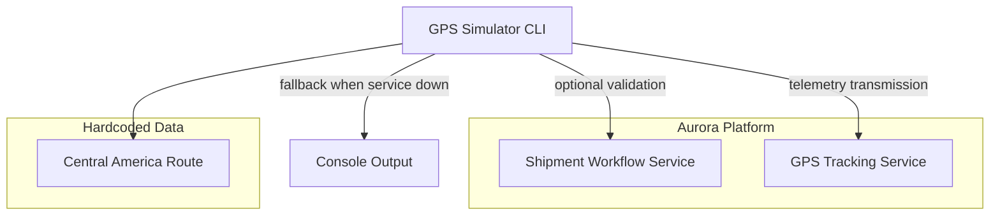
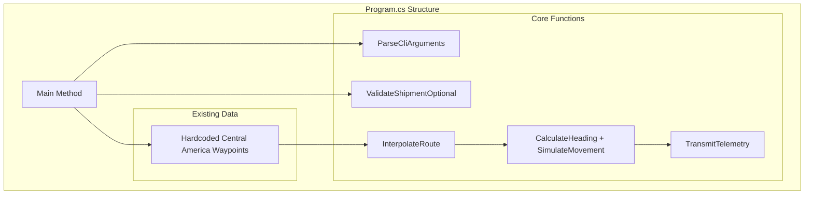

# GPS Simulator Technical Design Document

## Overview

The GPS Simulator is a lightweight command-line development tool that demonstrates GPS device behavior for shipment tracking within the Aurora logistics platform. The simulator enhances the existing single-file implementation in `Program.cs`, using a hardcoded Central America route to generate realistic movement patterns and transmit telemetry data through the GPS tracking infrastructure.

### Key Design Goals

- **Enhance Existing Implementation**: Polish and improve the current `Program.cs` rather than rewrite
- **Hardcoded Route Only**: Use the existing Central America waypoints, no external route services
- **Simple Architecture**: Maintain single-file approach with improved structure and error handling
- **Demo-Focused**: Reliable demonstration capability with console fallback when services unavailable
- **Minimal Dependencies**: Keep current gRPC dependencies, avoid over-engineering

## Architecture

### System Context



### Implementation Structure

The design maintains the existing single-file approach while improving organization through well-structured methods:



## Components and Interfaces

### CLI Argument Processing

**Current Implementation**: Basic manual parsing with string comparisons
**Enhancement**: Improve validation and error messages while maintaining simplicity

```csharp
// Enhanced argument processing (within Main method)
private static (string shipmentId, int interval, double speed, string grpcUrl, string tenantId) 
    ParseArguments(string[] args)
{
    // Improve existing parsing with better validation
    // Add help display for invalid arguments
    // Maintain current parameter names and defaults
}
```

### Shipment Validation (Optional)

**Purpose**: Optional shipment existence check for demo purposes
**Implementation**: Simple gRPC call with graceful failure handling

```csharp
// Optional shipment validation
private static async Task<bool> ValidateShipmentAsync(string shipmentId, string grpcUrl, string tenantId)
{
    // Optional call to Shipment Workflow Service
    // Continue simulation regardless of result
    // Display validation status for demo purposes
}
```

### Route Processing

**Current Implementation**: Hardcoded Central America waypoints with interpolation
**Enhancement**: Improve interpolation algorithm and coordinate validation

```csharp
// Enhanced route processing (existing method improved)
private static List<(double Lat, double Lng)> InterpolateRoute(
    (double Lat, double Lng)[] waypoints, 
    int stepsBetween)
{
    // Keep existing algorithm, add coordinate validation
    // Ensure smooth movement between points
    // Validate coordinate ranges
}
```

### Movement Simulation

**Current Implementation**: Basic heading calculation and speed variation
**Enhancement**: Improve accuracy and add better randomization

```csharp
// Enhanced movement simulation
private static double CalculateHeading(double lat1, double lon1, double lat2, double lon2)
{
    // Keep existing haversine-based calculation
    // Improve precision and edge case handling
}

private static double ApplySpeedVariation(double baseSpeed, Random random)
{
    // Enhanced speed variation with realistic bounds
    // ±3 km/h variation with normal distribution
}
```

### Telemetry Transmission

**Current Implementation**: gRPC call with basic error handling
**Enhancement**: Improve error handling and demo mode fallback

```csharp
// Enhanced telemetry transmission
private static async Task<bool> TransmitTelemetryAsync(
    IngestPositionRequest request, 
    GpsTrackingServiceClient client, 
    Metadata headers)
{
    // Try gRPC transmission first
    // Fall back to console output on failure
    // Maintain simulation progress regardless
}
```

## Data Models

### Configuration Data

```csharp
// Simple configuration structure (within Main method)
public record SimulatorSettings
{
    public string ShipmentId { get; init; }
    public int IntervalSeconds { get; init; }
    public double BaseSpeedKmh { get; init; }
    public string GpsGrpcUrl { get; init; }
    public string TenantId { get; init; }
}
```

### Route Data

```csharp
// Existing hardcoded waypoint structure
private static readonly (double Lat, double Lng)[] CentralAmericaRoute = 
{
    (9.9333, -84.0833), // San Jose Hub
    (9.8653, -83.9189), // Cartago
    (9.3789, -83.7042), // San Isidro
    (8.9667, -83.5167), // Palmar Norte
    (8.5333, -82.8333), // Paso Canoas Border
    (8.4333, -82.4333), // David Hub
    (8.2333, -81.7500), // Tole
    (8.1000, -80.9667), // Santiago
    (8.4000, -80.4167), // Penonome
    (8.9824, -79.5199), // Panama City Logistics Center
};
```

### Telemetry Message

```csharp
// gRPC message structure (from existing proto)
IngestPositionRequest {
    ExternalReadingId: "sim-{guid}"
    DeviceId: "sim-dev-{shipmentId}"
    VehicleId: "{shipmentId}"
    Latitude: double
    Longitude: double
    SpeedKph: double
    HeadingDegrees: double
    AccuracyMeters: 3.5
    RecordedAt: Timestamp (UTC)
}
```

## Correctness Properties

*A property is a characteristic or behavior that should hold true across all valid executions of a system-essentially, a formal statement about what the system should do. Properties serve as the bridge between human-readable specifications and machine-verifiable correctness guarantees.*

Based on the prework analysis, the following properties are suitable for property-based testing:

### Property 1: CLI Parameter Bounds Validation
*For any* numeric CLI parameter (interval, speed), the GPS Simulator SHALL enforce minimum bounds (interval ≥ 1 second, speed ≥ 10 km/h) regardless of input value
**Validates: Requirements 1.2, 1.3**

### Property 2: Shipment ID Format Validation  
*For any* string input as shipment ID, the validation logic SHALL correctly identify valid Aurora shipment ID patterns and reject invalid formats
**Validates: Requirements 2.4, 5.3**

### Property 3: Route Interpolation Consistency
*For any* set of waypoint coordinates, the interpolation algorithm SHALL create additional points that maintain sequential geographic progression between original waypoints
**Validates: Requirements 3.2**

### Property 4: Heading Calculation Accuracy
*For any* pair of coordinate points, the heading calculation SHALL produce values within 0-360 degrees using correct haversine formula mathematics
**Validates: Requirements 3.3**

### Property 5: Speed Variation Bounds
*For any* base speed value, applied speed variations SHALL remain within ±3 km/h bounds of the original speed
**Validates: Requirements 3.4**

### Property 6: Movement Sequential Progression
*For any* sequence of route coordinates, the movement simulation SHALL progress through points in sequential order without skipping or reordering
**Validates: Requirements 3.5**

### Property 7: Timestamp Interval Consistency
*For any* configured interval and position sequence, generated timestamps SHALL increment by exactly the specified interval duration
**Validates: Requirements 3.6**

### Property 8: Unique Identifier Generation
*For any* simulation run, all generated external reading IDs SHALL be unique and follow the "sim-{guid}" format pattern
**Validates: Requirements 3.7, 8.3**

### Property 9: Telemetry Field Population Completeness
*For any* movement state data, generated telemetry messages SHALL populate all required fields (coordinates, speed, heading, accuracy, timestamp) with valid values
**Validates: Requirements 4.3**

### Property 10: Device ID Format Consistency
*For any* shipment ID input, generated device IDs SHALL follow the exact format "sim-dev-{shipmentId}"
**Validates: Requirements 4.5**

### Property 11: Accuracy Value Bounds
*For any* generated accuracy value, it SHALL fall within the realistic range of 2-5 meters
**Validates: Requirements 4.6**

### Property 12: Progress Display Format Consistency
*For any* position data during simulation, console progress display SHALL follow the exact format "[N/Total] lat,lng | speed km/h"
**Validates: Requirements 7.2**

### Property 13: UTC Timestamp Format Compliance
*For any* generated timestamp, it SHALL be formatted in UTC format compatible with Google Protobuf Timestamp specification
**Validates: Requirements 8.1**

### Property 14: Coordinate Display Precision
*For any* coordinate values, display formatting SHALL show exactly 4 decimal places
**Validates: Requirements 8.2**

### Property 15: Message Format Schema Compliance
*For any* generated telemetry data, the IngestPositionRequest message SHALL comply with all field types and naming defined in gps_tracking.proto
**Validates: Requirements 8.4, 8.5**

### Property 16: Geographic Coordinate Validation
*For any* coordinate input or generation, latitude values SHALL be within -90 to 90 range and longitude values SHALL be within -180 to 180 range
**Validates: Requirements 8.6**

## Error Handling

### Service Connectivity Errors

**Shipment Service Unavailable:**
- Display clear error: "Failed to connect to Shipment Workflow Service at {url}. Check service availability and network connectivity."
- Terminate execution with exit code 1
- Log connection attempt details for troubleshooting

**Route Service Unavailable:**  
- Display clear error: "Failed to connect to Route Planning Service at {url}. Check service availability and network connectivity."
- Terminate execution with exit code 2
- Suggest verification of route ID assignment in shipment data

**GPS Tracking Service Unavailable:**
- Activate demo mode with notification: "GPS Tracking Service unavailable. Continuing in demo mode with console output."
- Continue simulation with console logging
- Display connection retry attempts and fallback reason

### Data Validation Errors

**Invalid Shipment ID Format:**
```
Error: Invalid shipment ID format '{shipmentId}'
Expected format: SHP-YYYY-NNNNN (e.g., SHP-2024-12345)
Use --help for usage information.
```

**Missing Route Assignment:**
```
Error: Shipment {shipmentId} does not have an assigned route.
Please assign a route to the shipment before running simulation.
```

**No ROAD Legs in Route:**
```
Error: Route {routeId} contains no ROAD transportation legs.
GPS simulation requires at least one ROAD segment with geometry data.
```

**Invalid Route Geometry:**
```
Error: Route geometry validation failed:
- Coordinate count: {count} (minimum 2 required)  
- Invalid coordinates: {invalidList}
- Geometry format: {format} (supported: LineString, MultiLineString)
```

### Runtime Error Recovery

**gRPC Transmission Failures:**
- Implement exponential backoff retry (1s, 2s, 4s, 8s, 16s)
- After 5 failed attempts, switch to demo mode
- Log retry attempts and failure reasons
- Continue simulation without data loss

**Memory and Performance Issues:**
- Monitor route point count and warn if >10,000 points
- Implement streaming processing for large routes
- Limit interpolation density to prevent memory exhaustion
- Provide progress estimates and allow graceful cancellation

**Configuration Errors:**
```
Error: Invalid configuration detected:
- Missing TENANT_ID: {status}
- Invalid GPS_GRPC_URL: {url} (must be valid HTTP/HTTPS URL)
- Service connectivity: {serviceHealth}

Use environment variables or update configuration.
```

## Testing Strategy

The GPS Simulator testing strategy employs a dual approach combining property-based testing for comprehensive input coverage with targeted unit and integration tests for specific scenarios and external service interactions.

### Property-Based Testing

**Framework**: Use [FsCheck.NET](https://github.com/fscheck/FsCheck) for property-based test generation with minimum 100 iterations per property to ensure thorough input space coverage.

**Test Configuration:**
- Each property test references the corresponding design property
- Tag format: `Feature: gps-simulator, Property {number}: {property_text}`  
- Custom generators for Aurora-specific data types (shipment IDs, route geometry, coordinates)
- Shrinking enabled to find minimal failing cases

**Core Property Tests:**

1. **CLI Argument Parsing Properties** - Test parameter validation across random input combinations
2. **Route Processing Properties** - Verify coordinate extraction and interpolation consistency  
3. **Movement Simulation Properties** - Test heading calculations and speed variations
4. **Telemetry Generation Properties** - Validate gRPC message format and field population
5. **Configuration Loading Properties** - Test environment variable handling and defaults

### Unit Testing

**Framework**: xUnit.NET with Moq for mocking external dependencies

**Focus Areas:**
- CLI argument edge cases and help display
- Default value application when parameters omitted
- Error message formatting and display
- Service connectivity failure scenarios
- Demo mode activation and console output formatting

**Key Test Cases:**
- Invalid shipment ID formats trigger help display
- Missing environment variables apply localhost defaults  
- Unavailable services trigger appropriate error messages and exit codes
- Demo mode logs maintain consistent format with transmission mode

### Integration Testing

**Framework**: ASP.NET Core Test Host with TestContainers for gRPC service mocking

**Service Integration Tests:**
- **Shipment Service Integration**: Test shipment retrieval with valid/invalid IDs
- **Route Service Integration**: Test route geometry extraction and ROAD leg identification  
- **GPS Tracking Integration**: Test telemetry transmission with proper headers and retry logic

**End-to-End Scenarios:**
- Complete simulation flow from shipment ID to telemetry transmission
- Service unavailability scenarios and fallback behavior
- Large route processing and performance characteristics
- Multi-tenant operation with different tenant configurations

### Performance Testing

**Objectives:**
- Validate simulator performance with large route datasets (1000+ waypoints)
- Test memory usage during route interpolation and processing
- Verify gRPC client throughput and connection management
- Measure simulation accuracy versus real-time progression

**Benchmarks:**
- Route processing: <100ms for routes with <500 waypoints
- Memory usage: <50MB for typical simulation runs
- gRPC throughput: Handle transmission intervals as low as 1 second
- Interpolation accuracy: Maintain <10m deviation from original route geometry

### Mock and Test Data Strategy

**gRPC Service Mocking:**
- Mock Shipment Service responses with various route assignments
- Mock Route Service with different geometry formats and leg types
- Mock GPS Tracking Service for transmission success/failure scenarios
- Test error conditions: network failures, invalid responses, timeout scenarios

**Test Data Generation:**
- Realistic Central American route coordinates for integration tests
- Edge case geometry: single points, duplicate coordinates, invalid ranges
- Various shipment ID formats: valid Aurora patterns and invalid formats
- Environment configurations: complete, partial, and missing variable sets

This comprehensive testing strategy ensures the GPS Simulator maintains reliability across the diverse input space while providing confidence in integration with Aurora's existing service ecosystem.

## Implementation Approach

### Phase 1: Core Infrastructure (Week 1)

**Objectives:**
- Establish robust CLI parsing and configuration management
- Implement gRPC client infrastructure with proper error handling
- Create basic service connectivity testing

**Key Deliverables:**
- Enhanced CLI parser using CommandLineParser library
- Configuration manager with environment variable support  
- gRPC service client base classes with retry policies
- Basic error handling and logging infrastructure
- Comprehensive unit tests for core components

**Technical Tasks:**
1. Replace manual argument parsing with CommandLineParser for robust validation
2. Implement configuration manager with environment variable loading
3. Create gRPC client base class with retry and circuit breaker patterns
4. Add structured logging using Microsoft.Extensions.Logging
5. Implement service connectivity tests and health checks

### Phase 2: Service Integration (Week 2)

**Objectives:**
- Integrate with Shipment Workflow and Route Planning services
- Implement route data processing and validation
- Handle service unavailability scenarios gracefully

**Key Deliverables:**
- Shipment service client with error handling
- Route service client with geometry processing
- Route validation and ROAD leg extraction logic
- Service unavailability detection and error reporting

**Technical Tasks:**
1. Implement ShipmentServiceClient with GetShipment integration
2. Implement RouteServiceClient with GetRoute integration and geometry parsing
3. Create route processor for ROAD leg extraction and coordinate validation
4. Add comprehensive error handling for missing routes and invalid geometry
5. Implement service health monitoring and startup diagnostics

### Phase 3: Movement Simulation Engine (Week 2-3)

**Objectives:**
- Build realistic movement simulation with proper algorithms
- Implement route interpolation and coordinate processing
- Generate accurate heading and speed calculations

**Key Deliverables:**
- Route geometry interpolation with configurable density
- Movement simulator with realistic speed variations
- Heading calculation using haversine formula
- Timestamp management with precise interval control

**Technical Tasks:**
1. Implement route interpolation algorithm for smooth movement simulation
2. Create movement simulator with speed variation and heading calculation
3. Add coordinate validation and geographic range checking
4. Implement timestamp generation with millisecond precision
5. Add route processing performance optimization for large datasets

### Phase 4: Telemetry and Transmission (Week 3)

**Objectives:**
- Generate compliant gRPC telemetry messages
- Implement reliable transmission with fallback to demo mode
- Add comprehensive progress reporting and monitoring

**Key Deliverables:**
- Telemetry generator producing valid IngestPositionRequest messages
- GPS tracking client with retry logic and demo mode fallback
- Progress reporter with real-time status updates
- Demo mode logger with formatted console output

**Technical Tasks:**
1. Implement telemetry generator with proper field mapping and validation
2. Create GPS tracking client with exponential backoff retry logic
3. Add demo mode detection and console logging fallback
4. Implement progress reporting with position tracking and time estimates
5. Add simulation metrics collection and completion reporting

### Phase 5: Testing and Polish (Week 4)

**Objectives:**
- Complete property-based and integration testing
- Performance optimization and memory management
- Documentation and deployment preparation

**Key Deliverables:**
- Comprehensive property-based test suite using FsCheck.NET
- Integration tests with mocked gRPC services
- Performance benchmarks and optimization
- Complete documentation and usage examples

**Technical Tasks:**
1. Implement property-based tests for all core properties using FsCheck.NET
2. Create integration test suite with TestContainers for gRPC mocking
3. Add performance testing and memory usage optimization
4. Complete error message review and user experience polish
5. Create deployment scripts and CI/CD pipeline integration

### Development Environment Setup

**Prerequisites:**
- .NET 10.0 SDK
- Aurora development environment access
- gRPC service endpoints (development/staging)

**Project Structure:**
```
tools/gps-simulator/
├── src/
│   ├── GpsSimulator/
│   │   ├── Program.cs (entry point)
│   │   ├── CLI/ (argument parsing, orchestration)
│   │   ├── Services/ (gRPC clients, service interfaces)
│   │   ├── Simulation/ (route processing, movement engine)
│   │   ├── Configuration/ (environment, settings)
│   │   └── Output/ (progress, logging, transmission)
│   └── GpsSimulator.Tests/
│       ├── Properties/ (property-based tests)
│       ├── Unit/ (component unit tests)  
│       ├── Integration/ (service integration tests)
│       └── TestData/ (mock data, generators)
├── docs/
│   ├── usage-guide.md
│   ├── configuration.md
│   └── troubleshooting.md
└── scripts/
    ├── build.sh
    ├── test.sh
    └── package.sh
```

**Dependencies:**
- CommandLineParser (CLI parsing)
- FsCheck.NET (property-based testing)
- Microsoft.Extensions.Logging (structured logging)
- Polly (retry policies, circuit breakers)
- TestContainers (integration testing)
- Grpc.Net.Client (gRPC communication)
- Google.Protobuf (message serialization)

### Deployment and Operations

**Build and Package:**
- Create self-contained executable for easy deployment
- Package with configuration templates and usage documentation
- Include service endpoint discovery scripts for different environments

**Monitoring and Observability:**
- Structured logging with correlation IDs for troubleshooting
- Metrics collection for simulation performance and success rates
- Health check endpoints for service dependency monitoring

**Maintenance and Updates:**
- Automated dependency updates and security patching
- Version compatibility testing with Aurora service changes
- Performance regression testing with route data updates

This implementation approach ensures systematic development with clear milestones while maintaining high quality through comprehensive testing and proper error handling throughout the development lifecycle.