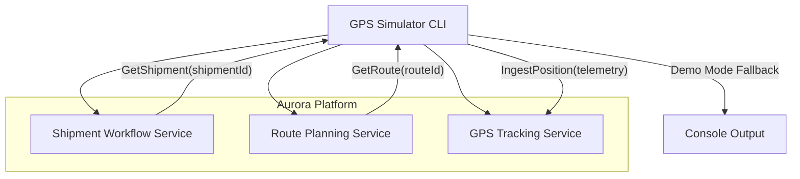
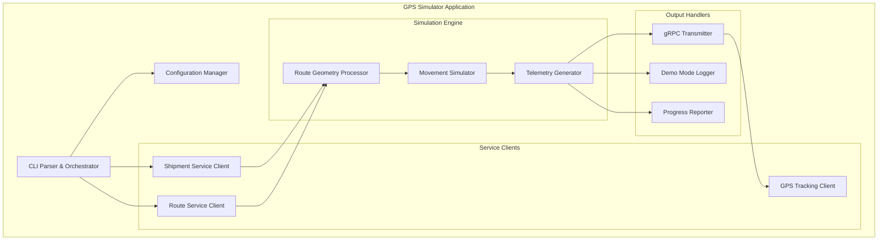

# GPS Simulator Technical Design Document

## Overview

The GPS Simulator is a command-line development tool that enables realistic demonstration of GPS device behavior for shipment tracking within the Aurora logistics platform. The simulator integrates with existing Aurora microservices to dynamically resolve shipment routes and generates realistic movement patterns along actual road geometry, transmitting telemetry data through the established GPS tracking infrastructure.

### Key Design Goals

- **Service Integration**: Seamlessly integrate with existing Aurora gRPC services (Shipment Workflow, Route Planning, GPS Tracking)
- **Realistic Simulation**: Generate natural movement patterns with proper speed variations, heading calculations, and timing
- **Developer Experience**: Provide intuitive CLI interface with comprehensive error handling and progress feedback
- **Resilience**: Graceful degradation to demo mode when services are unavailable
- **Extensibility**: Modular architecture that allows for future enhancements and additional simulation features

## Architecture

### System Context



### Component Architecture



## Components and Interfaces

### CLI Parser & Orchestrator

**Responsibilities:**
- Parse and validate command-line arguments
- Coordinate execution flow across all components
- Handle application lifecycle and error recovery

**Interface:**
```csharp
public class CliOptions
{
    public string ShipmentId { get; set; }
    public int IntervalSeconds { get; set; } = 3;
    public double SpeedKmh { get; set; } = 50.0;
}

public interface ICliOrchestrator
{
    Task<int> RunAsync(string[] args);
    void DisplayHelp();
    void DisplayStartupInfo(CliOptions options);
}
```

**Key Features:**
- Uses CommandLineParser library for robust argument parsing
- Validates shipment ID format (Aurora shipment number pattern)
- Enforces minimum values (interval ≥ 1s, speed ≥ 10 km/h)
- Provides comprehensive usage help and error messages

### Configuration Manager

**Responsibilities:**
- Manage environment variable configuration
- Provide service endpoint URLs and authentication settings
- Handle configuration defaults and validation

**Interface:**
```csharp
public class SimulatorConfig
{
    public string GpsGrpcUrl { get; set; }
    public string ShipmentGrpcUrl { get; set; }
    public string RouteGrpcUrl { get; set; }
    public string TenantId { get; set; }
    public string UserId { get; set; }
}

public interface IConfigurationManager
{
    SimulatorConfig LoadConfiguration();
    void ValidateConfiguration(SimulatorConfig config);
}
```

**Environment Variables:**
- `GPS_GRPC_URL` → GPS Tracking Service endpoint
- `SHIPMENT_GRPC_URL` → Shipment Workflow Service endpoint  
- `ROUTE_GRPC_URL` → Route Planning Service endpoint
- `TENANT_ID` → Multi-tenant identifier for gRPC metadata
- `USER_ID` → User identifier for gRPC metadata (defaults to system user)

### Service Clients

#### Shipment Service Client
**Responsibilities:**
- Retrieve shipment details via gRPC
- Extract route assignment information
- Handle service unavailability scenarios

**Interface:**
```csharp
public interface IShipmentServiceClient
{
    Task<ShipmentResponse> GetShipmentAsync(string shipmentId);
    Task<bool> TestConnectivityAsync();
}
```

#### Route Service Client  
**Responsibilities:**
- Retrieve route details and geometry data
- Extract ROAD leg segments for GPS simulation
- Handle missing or invalid route data

**Interface:**
```csharp
public interface IRouteServiceClient
{
    Task<RouteResponse> GetRouteAsync(string routeId);
    Task<bool> TestConnectivityAsync();
}
```

#### GPS Tracking Client
**Responsibilities:**
- Transmit telemetry data via IngestPosition API
- Handle transmission failures and retry logic
- Support demo mode fallback

**Interface:**
```csharp
public interface IGpsTrackingClient
{
    Task<bool> IngestPositionAsync(IngestPositionRequest request);
    Task<bool> TestConnectivityAsync();
}
```

### Route Geometry Processor

**Responsibilities:**
- Extract coordinate sequences from route geometry
- Interpolate additional waypoints for smooth movement
- Calculate distance and duration estimates

**Interface:**
```csharp
public class RoutePoint
{
    public double Latitude { get; set; }
    public double Longitude { get; set; }
    public double DistanceFromStart { get; set; }
}

public interface IRouteProcessor
{
    List<RoutePoint> ProcessRouteGeometry(RouteResponse route);
    List<RoutePoint> InterpolatePoints(List<RoutePoint> waypoints, double targetDensityKm);
    void ValidateGeometry(List<RoutePoint> points);
}
```

**Processing Algorithm:**
1. Extract ROAD leg segments from route data
2. Parse geometry coordinates (support multiple formats: GeoJSON, encoded polylines)
3. Interpolate points to achieve ~100m spacing for realistic movement
4. Calculate cumulative distances and validate coordinate ranges
5. Remove duplicate or invalid coordinates

### Movement Simulator

**Responsibilities:**
- Generate realistic movement patterns along route
- Calculate speed variations and heading values
- Manage simulation timing and progression

**Interface:**
```csharp
public class MovementState
{
    public RoutePoint CurrentPosition { get; set; }
    public double CurrentSpeedKmh { get; set; }
    public double HeadingDegrees { get; set; }
    public DateTime Timestamp { get; set; }
    public int PositionIndex { get; set; }
}

public interface IMovementSimulator
{
    IAsyncEnumerable<MovementState> SimulateMovementAsync(
        List<RoutePoint> route, 
        double baseSpeedKmh, 
        int intervalSeconds);
        
    double CalculateHeading(RoutePoint from, RoutePoint to);
    double ApplySpeedVariation(double baseSpeed);
}
```

**Movement Algorithm:**
1. **Speed Variation**: Apply random variation of ±3 km/h around base speed using normal distribution
2. **Heading Calculation**: Use haversine formula for accurate bearing between consecutive points
3. **Timestamp Management**: Increment timestamps by configured interval with millisecond precision
4. **Progression Control**: Maintain sequential order through route points with smooth transitions

### Telemetry Generator

**Responsibilities:**
- Convert movement states to gRPC telemetry messages
- Generate unique identifiers and metadata
- Format data according to GPS Tracking Service contract

**Interface:**
```csharp
public interface ITelemetryGenerator
{
    IngestPositionRequest GenerateTelemetry(
        MovementState movement, 
        string shipmentId, 
        string tenantId);
        
    string GenerateExternalReadingId();
    string GenerateDeviceId(string shipmentId);
    double GenerateAccuracyMeters();
}
```

**Data Generation:**
- **External Reading ID**: GUID with "sim-" prefix for traceability
- **Device ID**: Format "sim-dev-{shipmentId}" for identification  
- **Vehicle ID**: Direct mapping from shipment ID
- **Accuracy**: Random value between 2-5 meters (realistic GPS accuracy)
- **Timestamps**: UTC format compatible with Protobuf Timestamp

### Output Handlers

#### gRPC Transmitter
**Responsibilities:**
- Send telemetry to GPS Tracking Service
- Handle retry logic and error scenarios
- Manage gRPC metadata and authentication

**Interface:**
```csharp
public interface IGrpcTransmitter
{
    Task<bool> TransmitAsync(IngestPositionRequest request);
    Task<bool> TestConnectionAsync();
}
```

**Error Handling:**
- Exponential backoff retry for transient failures
- Circuit breaker pattern for sustained outages
- Automatic fallback to demo mode on connectivity loss

#### Demo Mode Logger
**Responsibilities:**
- Provide console output when gRPC transmission fails
- Format telemetry data for developer visibility
- Maintain simulation progress without external dependencies

**Interface:**
```csharp
public interface IDemoModeLogger
{
    void LogPosition(IngestPositionRequest telemetry, int positionIndex, int totalPositions);
    void LogDemoModeActivation(string reason);
}
```

#### Progress Reporter
**Responsibilities:**
- Display real-time simulation progress
- Show connection status and service health
- Provide completion statistics and summaries

**Interface:**
```csharp
public interface IProgressReporter
{
    void ReportStartup(CliOptions options, SimulatorConfig config);
    void ReportServiceStatus(Dictionary<string, bool> serviceStatus);
    void ReportProgress(int current, int total, MovementState state);
    void ReportCompletion(TimeSpan duration, int pointsProcessed);
}
```

## Data Models

### Route Processing Models

```csharp
public class RouteGeometry
{
    public string Type { get; set; } // "LineString", "MultiLineString"
    public List<List<double>> Coordinates { get; set; } // [longitude, latitude] pairs
}

public class RouteLeg  
{
    public string TransportMode { get; set; } // "ROAD", "SEA", "AIR", "RAIL"
    public RouteGeometry Geometry { get; set; }
    public double DistanceKm { get; set; }
    public int DurationMinutes { get; set; }
}

public class ProcessedRoute
{
    public List<RoutePoint> Points { get; set; }
    public double TotalDistanceKm { get; set; }
    public TimeSpan EstimatedDuration { get; set; }
    public string SourceRouteId { get; set; }
}
```

### Simulation State Models

```csharp
public class SimulationConfig
{
    public string ShipmentId { get; set; }
    public int IntervalSeconds { get; set; }
    public double BaseSpeedKmh { get; set; }
    public ProcessedRoute Route { get; set; }
    public SimulatorConfig ServiceConfig { get; set; }
}

public class SimulationMetrics
{
    public int TotalPoints { get; set; }
    public int ProcessedPoints { get; set; }
    public TimeSpan ElapsedTime { get; set; }
    public TimeSpan EstimatedRemaining { get; set; }
    public double AverageSpeed { get; set; }
    public int SuccessfulTransmissions { get; set; }
    public int FailedTransmissions { get; set; }
}
```

## Correctness Properties

*A property is a characteristic or behavior that should hold true across all valid executions of a system-essentially, a formal statement about what the system should do. Properties serve as the bridge between human-readable specifications and machine-verifiable correctness guarantees.*

### Property 1: CLI Argument Validation
*For any* CLI arguments provided to the GPS Simulator, parameter parsing SHALL correctly extract shipment ID and enforce minimum bounds for interval (≥1 second) and speed (≥10 km/h)
**Validates: Requirements 1.1, 1.2, 1.3**

### Property 2: Route Data Processing Consistency  
*For any* route geometry data retrieved from Route Planning Service, the route processor SHALL extract ROAD leg coordinates and maintain sequential order during interpolation
**Validates: Requirements 2.4, 2.6, 3.1**

### Property 3: Movement Simulation Accuracy
*For any* base speed and route geometry, the movement simulator SHALL generate heading values between 0-360 degrees and apply speed variations within ±3 km/h bounds while maintaining sequential coordinate progression
**Validates: Requirements 3.2, 3.3, 3.4**

### Property 4: Telemetry Data Format Compliance
*For any* movement state data, the telemetry generator SHALL produce gRPC messages compliant with IngestPositionRequest format, including valid coordinate ranges (-90 to 90 latitude, -180 to 180 longitude) and consistent field population
**Validates: Requirements 4.2, 4.3, 4.4, 4.5, 4.6, 8.4, 8.5, 8.6**

### Property 5: Unique Identifier Generation
*For any* simulation run, the GPS Simulator SHALL generate unique external reading IDs in GUID format with "sim-" prefix and device IDs in format "sim-dev-{shipmentId}"
**Validates: Requirements 3.6, 4.5, 8.3**

### Property 6: Timestamp Consistency
*For any* configured interval, the GPS Simulator SHALL generate timestamps that increment by the exact interval duration and format timestamps as UTC-compatible Protobuf Timestamp
**Validates: Requirements 3.5, 8.1**

### Property 7: Configuration Loading Reliability
*For any* environment variable configuration, the GPS Simulator SHALL correctly read service URLs and apply default localhost URLs when environment variables are not set
**Validates: Requirements 6.1, 6.2, 6.3, 6.4, 6.5, 6.6**

### Property 8: Progress Display Formatting
*For any* simulation state, the progress reporter SHALL format position display as "[N/Total] lat,lng | speed km/h" with coordinates rounded to 4 decimal places
**Validates: Requirements 7.2, 8.2**

### Property 9: Demo Mode Behavior Consistency
*For any* telemetry data in demo mode, the simulator SHALL log position data to console maintaining the same format and progression as normal transmission mode
**Validates: Requirements 5.4**

### Property 10: Service Header Propagation
*For any* gRPC service call, the GPS Simulator SHALL include required metadata headers (x-tenant-id, x-user-id) and maintain consistent header values throughout the simulation
**Validates: Requirements 4.2**

## Error Handling

### Service Connectivity Errors

**Shipment Service Unavailable:**
- Display clear error: "Failed to connect to Shipment Workflow Service at {url}. Check service availability and network connectivity."
- Terminate execution with exit code 1
- Log connection attempt details for troubleshooting

**Route Service Unavailable:**  
- Display clear error: "Failed to connect to Route Planning Service at {url}. Check service availability and network connectivity."
- Terminate execution with exit code 2
- Suggest verification of route ID assignment in shipment data

**GPS Tracking Service Unavailable:**
- Activate demo mode with notification: "GPS Tracking Service unavailable. Continuing in demo mode with console output."
- Continue simulation with console logging
- Display connection retry attempts and fallback reason

### Data Validation Errors

**Invalid Shipment ID Format:**
```
Error: Invalid shipment ID format '{shipmentId}'
Expected format: SHP-YYYY-NNNNN (e.g., SHP-2024-12345)
Use --help for usage information.
```

**Missing Route Assignment:**
```
Error: Shipment {shipmentId} does not have an assigned route.
Please assign a route to the shipment before running simulation.
```

**No ROAD Legs in Route:**
```
Error: Route {routeId} contains no ROAD transportation legs.
GPS simulation requires at least one ROAD segment with geometry data.
```

**Invalid Route Geometry:**
```
Error: Route geometry validation failed:
- Coordinate count: {count} (minimum 2 required)  
- Invalid coordinates: {invalidList}
- Geometry format: {format} (supported: LineString, MultiLineString)
```

### Runtime Error Recovery

**gRPC Transmission Failures:**
- Implement exponential backoff retry (1s, 2s, 4s, 8s, 16s)
- After 5 failed attempts, switch to demo mode
- Log retry attempts and failure reasons
- Continue simulation without data loss

**Memory and Performance Issues:**
- Monitor route point count and warn if >10,000 points
- Implement streaming processing for large routes
- Limit interpolation density to prevent memory exhaustion
- Provide progress estimates and allow graceful cancellation

**Configuration Errors:**
```
Error: Invalid configuration detected:
- Missing TENANT_ID: {status}
- Invalid GPS_GRPC_URL: {url} (must be valid HTTP/HTTPS URL)
- Service connectivity: {serviceHealth}

Use environment variables or update configuration.
```

## Testing Strategy

The GPS Simulator testing strategy employs a dual approach combining property-based testing for comprehensive input coverage with targeted unit and integration tests for specific scenarios and external service interactions.

### Property-Based Testing

**Framework**: Use [FsCheck.NET](https://github.com/fscheck/FsCheck) for property-based test generation with minimum 100 iterations per property to ensure thorough input space coverage.

**Test Configuration:**
- Each property test references the corresponding design property
- Tag format: `Feature: gps-simulator, Property {number}: {property_text}`  
- Custom generators for Aurora-specific data types (shipment IDs, route geometry, coordinates)
- Shrinking enabled to find minimal failing cases

**Core Property Tests:**

1. **CLI Argument Parsing Properties** - Test parameter validation across random input combinations
2. **Route Processing Properties** - Verify coordinate extraction and interpolation consistency  
3. **Movement Simulation Properties** - Test heading calculations and speed variations
4. **Telemetry Generation Properties** - Validate gRPC message format and field population
5. **Configuration Loading Properties** - Test environment variable handling and defaults

### Unit Testing

**Framework**: xUnit.NET with Moq for mocking external dependencies

**Focus Areas:**
- CLI argument edge cases and help display
- Default value application when parameters omitted
- Error message formatting and display
- Service connectivity failure scenarios
- Demo mode activation and console output formatting

**Key Test Cases:**
- Invalid shipment ID formats trigger help display
- Missing environment variables apply localhost defaults  
- Unavailable services trigger appropriate error messages and exit codes
- Demo mode logs maintain consistent format with transmission mode

### Integration Testing

**Framework**: ASP.NET Core Test Host with TestContainers for gRPC service mocking

**Service Integration Tests:**
- **Shipment Service Integration**: Test shipment retrieval with valid/invalid IDs
- **Route Service Integration**: Test route geometry extraction and ROAD leg identification  
- **GPS Tracking Integration**: Test telemetry transmission with proper headers and retry logic

**End-to-End Scenarios:**
- Complete simulation flow from shipment ID to telemetry transmission
- Service unavailability scenarios and fallback behavior
- Large route processing and performance characteristics
- Multi-tenant operation with different tenant configurations

### Performance Testing

**Objectives:**
- Validate simulator performance with large route datasets (1000+ waypoints)
- Test memory usage during route interpolation and processing
- Verify gRPC client throughput and connection management
- Measure simulation accuracy versus real-time progression

**Benchmarks:**
- Route processing: <100ms for routes with <500 waypoints
- Memory usage: <50MB for typical simulation runs
- gRPC throughput: Handle transmission intervals as low as 1 second
- Interpolation accuracy: Maintain <10m deviation from original route geometry

### Mock and Test Data Strategy

**gRPC Service Mocking:**
- Mock Shipment Service responses with various route assignments
- Mock Route Service with different geometry formats and leg types
- Mock GPS Tracking Service for transmission success/failure scenarios
- Test error conditions: network failures, invalid responses, timeout scenarios

**Test Data Generation:**
- Realistic Central American route coordinates for integration tests
- Edge case geometry: single points, duplicate coordinates, invalid ranges
- Various shipment ID formats: valid Aurora patterns and invalid formats
- Environment configurations: complete, partial, and missing variable sets

This comprehensive testing strategy ensures the GPS Simulator maintains reliability across the diverse input space while providing confidence in integration with Aurora's existing service ecosystem.

## Implementation Approach

### Phase 1: Core Infrastructure (Week 1)

**Objectives:**
- Establish robust CLI parsing and configuration management
- Implement gRPC client infrastructure with proper error handling
- Create basic service connectivity testing

**Key Deliverables:**
- Enhanced CLI parser using CommandLineParser library
- Configuration manager with environment variable support  
- gRPC service client base classes with retry policies
- Basic error handling and logging infrastructure
- Comprehensive unit tests for core components

**Technical Tasks:**
1. Replace manual argument parsing with CommandLineParser for robust validation
2. Implement configuration manager with environment variable loading
3. Create gRPC client base class with retry and circuit breaker patterns
4. Add structured logging using Microsoft.Extensions.Logging
5. Implement service connectivity tests and health checks

### Phase 2: Service Integration (Week 2)

**Objectives:**
- Integrate with Shipment Workflow and Route Planning services
- Implement route data processing and validation
- Handle service unavailability scenarios gracefully

**Key Deliverables:**
- Shipment service client with error handling
- Route service client with geometry processing
- Route validation and ROAD leg extraction logic
- Service unavailability detection and error reporting

**Technical Tasks:**
1. Implement ShipmentServiceClient with GetShipment integration
2. Implement RouteServiceClient with GetRoute integration and geometry parsing
3. Create route processor for ROAD leg extraction and coordinate validation
4. Add comprehensive error handling for missing routes and invalid geometry
5. Implement service health monitoring and startup diagnostics

### Phase 3: Movement Simulation Engine (Week 2-3)

**Objectives:**
- Build realistic movement simulation with proper algorithms
- Implement route interpolation and coordinate processing
- Generate accurate heading and speed calculations

**Key Deliverables:**
- Route geometry interpolation with configurable density
- Movement simulator with realistic speed variations
- Heading calculation using haversine formula
- Timestamp management with precise interval control

**Technical Tasks:**
1. Implement route interpolation algorithm for smooth movement simulation
2. Create movement simulator with speed variation and heading calculation
3. Add coordinate validation and geographic range checking
4. Implement timestamp generation with millisecond precision
5. Add route processing performance optimization for large datasets

### Phase 4: Telemetry and Transmission (Week 3)

**Objectives:**
- Generate compliant gRPC telemetry messages
- Implement reliable transmission with fallback to demo mode
- Add comprehensive progress reporting and monitoring

**Key Deliverables:**
- Telemetry generator producing valid IngestPositionRequest messages
- GPS tracking client with retry logic and demo mode fallback
- Progress reporter with real-time status updates
- Demo mode logger with formatted console output

**Technical Tasks:**
1. Implement telemetry generator with proper field mapping and validation
2. Create GPS tracking client with exponential backoff retry logic
3. Add demo mode detection and console logging fallback
4. Implement progress reporting with position tracking and time estimates
5. Add simulation metrics collection and completion reporting

### Phase 5: Testing and Polish (Week 4)

**Objectives:**
- Complete property-based and integration testing
- Performance optimization and memory management
- Documentation and deployment preparation

**Key Deliverables:**
- Comprehensive property-based test suite using FsCheck.NET
- Integration tests with mocked gRPC services
- Performance benchmarks and optimization
- Complete documentation and usage examples

**Technical Tasks:**
1. Implement property-based tests for all core properties using FsCheck.NET
2. Create integration test suite with TestContainers for gRPC mocking
3. Add performance testing and memory usage optimization
4. Complete error message review and user experience polish
5. Create deployment scripts and CI/CD pipeline integration

### Development Environment Setup

**Prerequisites:**
- .NET 10.0 SDK
- Aurora development environment access
- gRPC service endpoints (development/staging)

**Project Structure:**
```
tools/gps-simulator/
├── src/
│   ├── GpsSimulator/
│   │   ├── Program.cs (entry point)
│   │   ├── CLI/ (argument parsing, orchestration)
│   │   ├── Services/ (gRPC clients, service interfaces)
│   │   ├── Simulation/ (route processing, movement engine)
│   │   ├── Configuration/ (environment, settings)
│   │   └── Output/ (progress, logging, transmission)
│   └── GpsSimulator.Tests/
│       ├── Properties/ (property-based tests)
│       ├── Unit/ (component unit tests)  
│       ├── Integration/ (service integration tests)
│       └── TestData/ (mock data, generators)
├── docs/
│   ├── usage-guide.md
│   ├── configuration.md
│   └── troubleshooting.md
└── scripts/
    ├── build.sh
    ├── test.sh
    └── package.sh
```

**Dependencies:**
- CommandLineParser (CLI parsing)
- FsCheck.NET (property-based testing)
- Microsoft.Extensions.Logging (structured logging)
- Polly (retry policies, circuit breakers)
- TestContainers (integration testing)
- Grpc.Net.Client (gRPC communication)
- Google.Protobuf (message serialization)

### Deployment and Operations

**Build and Package:**
- Create self-contained executable for easy deployment
- Package with configuration templates and usage documentation
- Include service endpoint discovery scripts for different environments

**Monitoring and Observability:**
- Structured logging with correlation IDs for troubleshooting
- Metrics collection for simulation performance and success rates
- Health check endpoints for service dependency monitoring

**Maintenance and Updates:**
- Automated dependency updates and security patching
- Version compatibility testing with Aurora service changes
- Performance regression testing with route data updates

This implementation approach ensures systematic development with clear milestones while maintaining high quality through comprehensive testing and proper error handling throughout the development lifecycle.