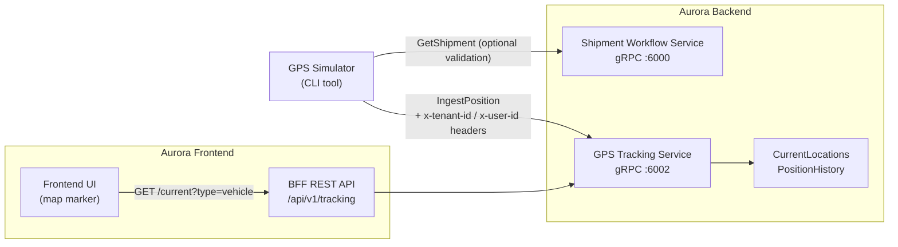

# GPS Simulator Design

## Overview

The GPS Simulator is a single-file command-line tool that drives the Aurora GPS tracking pipeline with realistic telemetry data for demo and development purposes. It sends a sequence of pre-interpolated positions along a hardcoded Central America route (San José CR → Panama City) to the GPS Tracking Service via gRPC. The tool enhances the existing `tools/gps-simulator/Program.cs` by fixing two bugs and adding optional shipment validation — no new architecture, no new dependencies.

## System Context



No Route Planning Service is involved. The route is hardcoded in the tool.

## What the Simulator Does

1. **Parse CLI args**: `--shipment <uuid>`, `--interval <sec>`, `--speed <kmh>`, `--grpc <url>`, `--tenant <id>`
2. **Read env vars**: `GPS_GRPC_URL`, `SHIPMENT_GRPC_URL`, `TENANT_ID`, `USER_ID` (CLI args override env vars)
3. **Print startup info**: shipment ID, interval, speed, GPS URL, tenant ID
4. **(Optional) Validate shipment**: call `GetShipment(id)` on Shipment Workflow Service; print customer name + status or exit on error
5. **Build route**: load 10 hardcoded waypoints, interpolate 20 steps between each pair → **181 total points**
6. **Simulation loop**: for each point, build `IngestPositionRequest`, attach gRPC metadata headers, call `IngestPosition`, print progress line, wait interval
7. **Print completion**: "Simulation completed. N points sent."

## File Layout

```
tools/gps-simulator/
├── Program.cs          ← single file, all logic here
└── gps-simulator.csproj
```

No subdirectories needed. All logic stays in `Program.cs`.

## IngestPositionRequest Field Mapping

| Proto field | Value |
|---|---|
| `external_reading_id` | `"sim-" + Guid.NewGuid().ToString("N")` |
| `device_id` | `"sim-dev-" + shipmentId` |
| `vehicle_id` | `shipmentId` (the UUID string from `--shipment`) |
| `latitude` | route point lat |
| `longitude` | route point lng |
| `speed_kph` | `baseSpeed + (random * 6 - 3)` rounded to 1 decimal |
| `heading_degrees` | great-circle bearing to next point (haversine) |
| `accuracy_meters` | `3.5` (fixed) |
| `recorded_at` | `Timestamp.FromDateTimeOffset(DateTimeOffset.UtcNow)` |

**gRPC metadata headers** attached to every call:

| Header key | Source |
|---|---|
| `x-tenant-id` | `TENANT_ID` env var (or `--tenant` arg) |
| `x-user-id` | `USER_ID` env var |

## Environment Variables and Defaults

| Variable | Default | Notes |
|---|---|---|
| `GPS_GRPC_URL` | `http://localhost:6002` | **Bug fix** — existing code defaults to `5004` |
| `SHIPMENT_GRPC_URL` | `http://localhost:6000` | Only needed when using shipment validation |
| `TENANT_ID` | `01920000-0000-7000-8000-000000000001` | Matches Aurora dev identity |
| `USER_ID` | `01910000-0000-7000-8000-000000000001` | Matches Aurora dev identity |

The dev identity fallback in `AuthInterceptor.cs` (`DevelopmentIdentity.Enabled = true`) means headers are technically optional in a local dev environment, but the simulator sends them explicitly for predictability.

## Hardcoded Route: Central America Corridor

| # | Waypoint | Lat | Lng |
|---|---|---|---|
| 1 | San José Hub | 9.9333 | -84.0833 |
| 2 | Cartago | 9.8653 | -83.9189 |
| 3 | San Isidro | 9.3789 | -83.7042 |
| 4 | Palmar Norte | 8.9667 | -83.5167 |
| 5 | Paso Canoas Border | 8.5333 | -82.8333 |
| 6 | David Hub | 8.4333 | -82.4333 |
| 7 | Tolé | 8.2333 | -81.7500 |
| 8 | Santiago | 8.1000 | -80.9667 |
| 9 | Penonomé | 8.4000 | -80.4167 |
| 10 | Panama City Logistics Center | 8.9824 | -79.5199 |

Linear interpolation with 20 steps between each consecutive pair → (9 segments × 20) + 1 = **181 points**.

## Error Handling

| Condition | Behavior |
|---|---|
| `--shipment` missing or not a valid UUID | Print usage message, exit |
| Shipment not found (gRPC `NotFound`) | Print error with shipment ID, exit |
| Shipment service unreachable | Print error with URL, exit |
| `IngestPosition` call fails | Print `[WARN] IngestPosition failed: {message}`, **continue loop** |
| `Ctrl+C` | `CancellationToken` cancels the `Task.Delay`; loop exits cleanly |

The simulation must never abort mid-loop due to a single GPS tracking failure — demo resilience is more important than transmission guarantees.

## Known Demo Constraints

- `--shipment` accepts a **UUID**, not a shipment number like `SHP-2026-00128`. Get the UUID from `GET /api/v1/shipments` or the FE shipment list.
- For the FE map marker to follow the shipment, the shipment must have an **assigned route** so the `VehicleShipmentAssignment` record exists (created automatically when a `RouteAssignedEvent` is published).
- If no assignment record exists, positions are still ingested but the `ShipmentId` column in `GpsPosition` is null. The BFF query `?type=shipment&id={uuid}` returns no location; use `?type=vehicle&id={shipmentUuid}` as a fallback.

## csproj Changes for Shipment Validation

To enable the optional `GetShipment` validation call, add to `gps-simulator.csproj`:

```xml
<Protobuf Include="../../protos/shipment_workflow.proto"
          GrpcServices="Client"
          Link="Protos/shipment_workflow.proto" />
```

No new NuGet packages are needed; `Grpc.Net.Client` and `Grpc.Tools` already cover the additional proto.

## Console Output Format

```
Aurora GPS Simulator
Shipment : a1b2c3d4-0000-0000-0000-000000000001
Interval : 3s  Speed: 50 km/h
GPS URL  : http://localhost:6002
Tenant   : 01920000-0000-7000-8000-000000000001

Shipment found: Acme Corp (InTransit)
Route points: 181

[1/181]   9.9333,-84.0833 | 51 km/h
[2/181]   9.8986,-84.0425 | 48 km/h
...
[181/181] 8.9824,-79.5199 | 50 km/h

Simulation completed. 181 points sent.
```

## Correctness Properties

*A property is a characteristic or behavior that should hold true across all valid executions of a system — essentially, a formal statement about what the system should do. Properties serve as the bridge between human-readable specifications and machine-verifiable correctness guarantees.*

These properties are appropriate for property-based testing because they involve pure functions (argument parsing, route interpolation, heading calculation, request building) where input variation reveals edge cases.

### Property 1: Interval and speed bounds are enforced

*For any* integer passed as `--interval`, the parsed value is `max(1, input)`. *For any* double passed as `--speed`, the parsed value is `max(10.0, input)`.

**Validates: Requirements 1.2, 1.3**

### Property 2: UUID validation correctly classifies inputs

*For any* arbitrary string, the shipment ID validator returns `true` if and only if `Guid.TryParse` succeeds on that string.

**Validates: Requirements 2.4, 5.3**

### Property 3: Route interpolation produces the expected point count

*For any* pair of waypoints and step count N ≥ 1, the interpolation of that pair produces exactly N intermediate points, all of which lie on the straight-line segment between the two endpoints.

**Validates: Requirements 3.2**

### Property 4: Heading is always a valid compass bearing

*For any* two distinct coordinate points, `CalculateHeading` returns a value in `[0.0, 360.0)`.

**Validates: Requirements 3.3**

### Property 5: Speed variation stays within ±3 km/h

*For any* base speed value, the simulated speed applied to a request satisfies `|appliedSpeed - baseSpeed| ≤ 3.0`.

**Validates: Requirements 3.4**

### Property 6: External reading IDs are unique across a simulation run

*For any* N ≥ 1 generated `IngestPositionRequest` objects, all `ExternalReadingId` values are distinct and each matches the pattern `^sim-[0-9a-f]{32}$`.

**Validates: Requirements 3.7, 8.3**

### Property 7: Request field mapping is complete and consistent

*For any* shipment UUID and route point, the built `IngestPositionRequest` satisfies:
- `VehicleId == shipmentId`
- `DeviceId == "sim-dev-" + shipmentId`
- `Latitude` and `Longitude` match the route point
- `AccuracyMeters == 3.5`
- `RecordedAt` is a valid UTC `Timestamp`
- `SpeedKph`, `HeadingDegrees` are populated

**Validates: Requirements 4.3, 4.4, 4.5, 8.1**

### Property 8: Geographic coordinates are within valid ranges

*For any* latitude value outside `[-90, 90]` or longitude value outside `[-180, 180]`, the coordinate validator rejects the value.

**Validates: Requirements 8.6**

## Error Handling

Already covered in the [Error Handling table](#error-handling) above. Key principle: transmission failures are warnings, not fatal errors. Validation failures (missing `--shipment`, invalid UUID, shipment not found) are fatal and exit before any telemetry is sent.

## Testing Strategy

The simulator is a demo tool. Testing focuses on the pure logic functions where correctness matters most.

**Unit tests** (xUnit):
- CLI argument parsing: defaults, bounds enforcement, missing required args
- Shipment ID format validation: valid UUIDs, invalid strings, empty string
- `InterpolateRoute`: point count, coordinate ordering
- `CalculateHeading`: known bearing pairs (e.g. due east = 90°), pole edge cases
- `IngestPositionRequest` builder: field mapping table, format compliance

**Property-based tests** (FsCheck or similar, minimum 100 iterations per property):
- Properties 1–8 listed above
- Each property test references its property number in a comment: `// Feature: gps-simulator, Property N`

**Manual smoke test**:
- Run against local dev stack, observe FE map marker updating after each interval
- Verify `GET /api/v1/tracking/{uuid}/current?type=vehicle` returns a current location

Property-based tests and unit tests live in a sibling test project if one is added. No TestContainers, no integration test suites, no performance benchmarks — out of scope for a demo tool.

## Demo Prerequisites

1. GPS Tracking Service running on `localhost:6002`
2. A valid shipment UUID (query `GET /api/v1/shipments` or use the FE)
3. For the FE map marker to move: the shipment must have an assigned route so the vehicle→shipment assignment record exists
4. Shipment Workflow Service running on `localhost:6000` (only required if running with shipment validation)

## Run Command

```bash
dotnet run --project tools/gps-simulator -- --shipment <uuid> --interval 3 --speed 50
```

Override GPS URL if needed:

```bash
GPS_GRPC_URL=http://localhost:6002 dotnet run --project tools/gps-simulator -- --shipment <uuid>
```
