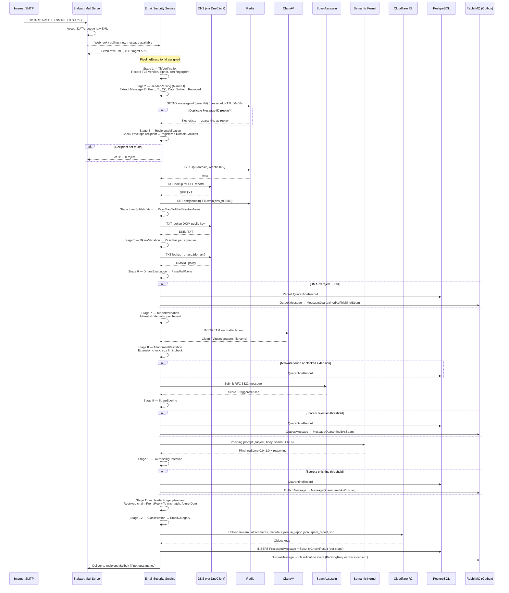
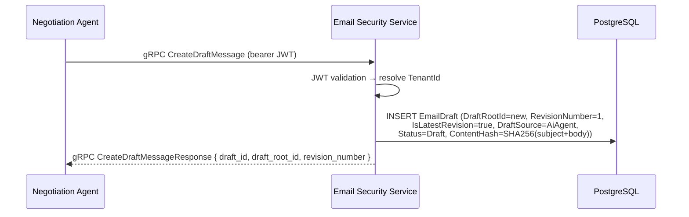
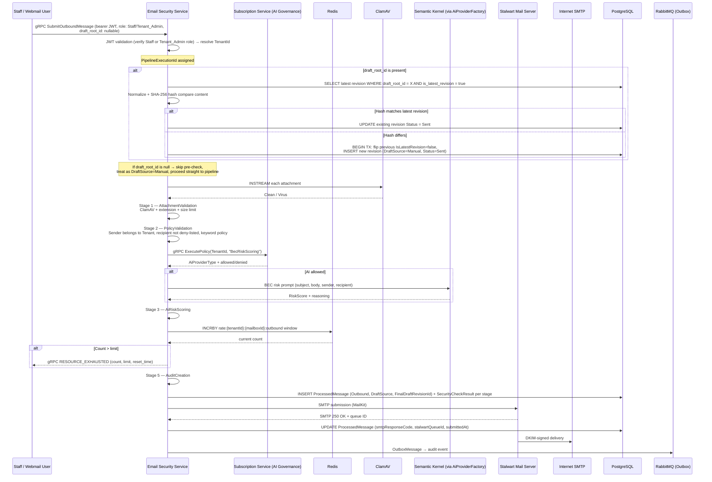
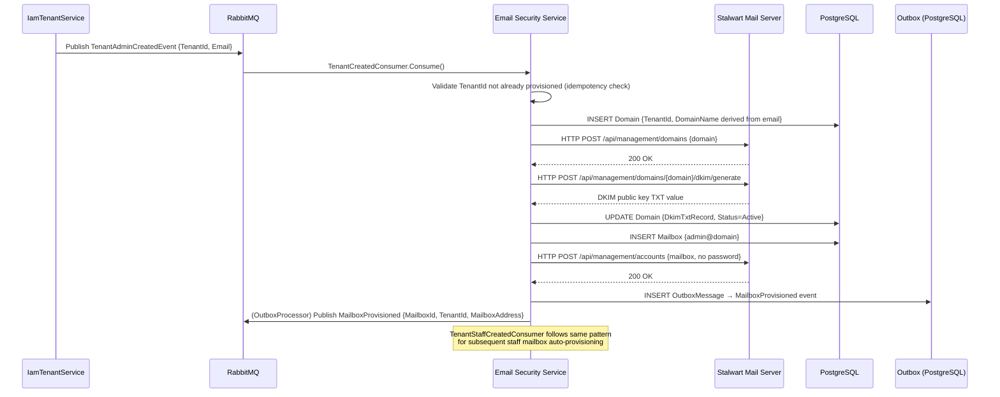
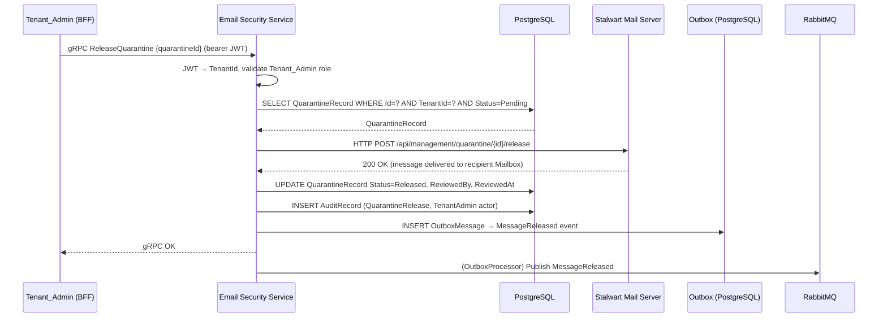

# Design Document: Mail Platform

## Overview

The Mail Platform is a production-grade, multi-tenant enterprise email system composed of two independent
services: **Stalwart Mail Server** (SMTP/IMAP/JMAP protocol engine, deployed as Docker infrastructure) and
**Email Security Service** (a .NET 10 microservice implementing the full inbound and outbound security
pipeline). Stalwart handles all mail protocol concerns — TLS negotiation, SMTP relay, IMAP4rev2, JMAP, DKIM
signing, and mail queue management. The Email Security Service handles all business and security concerns —
SPF/DKIM/DMARC evaluation, malware scanning, spam scoring, AI phishing detection, email classification,
tenant provisioning, quarantine management, audit recording, and integration event publication.

Integration with the Logistics Platform occurs exclusively through RabbitMQ integration events. The Email
Security Service consumes provisioning events from IamTenantService and publishes classified email events to
the Logistics Platform exchange. There is no shared database, no direct service-to-service HTTP call across
platform boundaries, and no gRPC calls from the Mail Platform to the Logistics Platform.

---

## 1. High-Level Architecture

### Platform Boundary

```
┌─────────────────────────────────────────────────────────────────────────────┐
│                           MAIL PLATFORM                                     │
│                                                                             │
│  ┌─────────────────────┐        ┌──────────────────────────────────────┐   │
│  │  Stalwart Mail      │ HTTP   │   Email Security Service (.NET 10)   │   │
│  │  Server             │ Mgmt   │                                      │   │
│  │                     │◄──────►│  Domain / Application /              │   │
│  │  SMTP :25/:587      │        │  Infrastructure / GrpcServices       │   │
│  │  IMAPS :993         │ SMTP   │                                      │   │
│  │  JMAP  :443         │◄──────►│  gRPC :5003                          │   │
│  └─────────────────────┘        └──────────────────────────────────────┘   │
│            │                          │            │           │            │
│       Internet                   PostgreSQL      Redis      RabbitMQ        │
│       Mail Flow                   (Neon)                   (vhost:mail)     │
└─────────────────────────────────────────────────────────────────────────────┘
         │                                                    │
   Internet SMTP                                    ┌─────────────────────┐
   (inbound/outbound)                               │  Logistics Platform │
                                                    │  (RabbitMQ events)  │
                                                    └─────────────────────┘
```

### Justification for Separation

| Concern | Owner | Reason |
|---|---|---|
| SMTP/IMAP/JMAP protocol compliance | Stalwart | Battle-tested open-source engine; RFC compliance is not re-implemented |
| TLS termination for mail ports | Stalwart | Protocol-layer concern; cert-manager supplies TLS certs via Kubernetes Secret |
| DKIM key storage and signing | Stalwart | Signing occurs at SMTP submission time, inside the mail engine |
| Business security pipeline | Email Security Service | Tenant-aware, auditable, AI-enhanced logic that owns domain data |
| Multi-tenant provisioning | Email Security Service | Owns Domain/Mailbox entities and enforces quotas, isolation, and audit |
| Integration event publication | Email Security Service | Transactional outbox guarantees; Stalwart has no RabbitMQ awareness |

### External Infrastructure Relationships

- **Cloudflare DNS**: MX, SPF, DKIM TXT records are configured externally; Email Security Service performs
  read-only DNS lookups via DnsClient.NET.
- **Cloudflare R2**: Private bucket for raw EML, attachments, AI/spam reports, audit JSON. Accessed via
  HTTPS-only pre-signed URLs — no Cloudflare Tunnel required because R2 exposes a standard S3-compatible API.
- **Cognito (OIDC)**: JWT bearer tokens validated at the gRPC interceptor layer. TenantId resolved exclusively
  from JWT claims. No password stored in Stalwart for v1. One Cognito User Pool is shared across both the webmail subdomain (`mail.{tenant-domain}`) and the admin portal subdomain (`admin-mail.{tenant-domain}`). Staff and Tenant_Admin use a single identity; subdomain access is gated by the `Roles` claim in the JWT.
- **IamTenantService**: Publishes `TenantStaffCreatedEvent` / `TenantAdminCreatedEvent` consumed by Email
  Security Service for automatic mailbox provisioning.
- **ClamAV / SpamAssassin**: Run as separate Docker containers on the same internal network; accessed via
  daemon socket/protocol from Infrastructure layer.
- **Subscription Service (AI Governance)**: MailService calls `ExecutePolicy` gRPC on Subscription Service to
  determine the tenant's AI provider configuration (`AiProviderType`). AI config data (`TenantAiConfig`) is
  owned exclusively by Subscription Service — MailService never stores or caches this data. On
  `ExecutePolicy` response, MailService uses `AiProviderFactory` to instantiate the appropriate AI client
  (Gemini / Azure OpenAI). Failure/timeout → circuit breaker fallback (skip AI stage, fail-safe).


---

## 2. Component Diagram

```
Email Security Service (.NET 10 — single project: MailService.csproj)
│
├── GrpcServices/
│   ├── MailManagementService       (ProvisionDomain, CreateMailbox, CreateAlias,
│   │                                ResetPassword, GetAuditRecords, RequeueDeadLetter)
│   └── MailSecurityService         (CreateDraftMessage, ListDrafts, GetDraft,
│                                    SubmitOutboundMessage, GetProcessedMessage,
│                                    ListProcessedMessages, GetQuarantineRecord,
│                                    ListQuarantineRecords, ReleaseQuarantine,
│                                    DeleteQuarantine)
│
├── Application/
│   ├── Commands/
│   │   ├── Provisioning/           (ProvisionDomainCommand, CreateMailboxCommand,
│   │   │                            CreateAliasCommand, AutoProvisionMailboxCommand)
│   │   ├── Outbound/               (CreateDraftMessageCommand, SubmitOutboundMessageCommand)
│   │   └── Quarantine/             (ReleaseQuarantineCommand, DeleteQuarantineCommand,
│   │                                RequeueDeadLetterCommand)
│   ├── Queries/
│   │   ├── Messages/               (GetProcessedMessageQuery, ListProcessedMessagesQuery)
│   │   ├── Quarantine/             (GetQuarantineRecordQuery, ListQuarantineRecordsQuery)
│   │   ├── Drafts/                 (ListDraftsQuery, GetDraftQuery)
│   │   └── Audit/                  (GetAuditRecordsQuery)

│   ├── DTOs/
│   ├── Behaviors/                  (ValidationBehavior, LoggingBehavior, TelemetryBehavior)
│   └── Interfaces/
│       ├── IStalwartManagementClient
│       ├── IClamAvClient
│       ├── ISpamAssassinClient
│       ├── IR2StorageClient
│       ├── IDnsLookupService
│       ├── IPhishingDetectionService
│       ├── IAiGovernanceClient            (wraps gRPC ExecutePolicy call to Subscription Service)
│       ├── IEmailDraftRepository          (owns revision-write invariant for EmailDraft)
│       ├── IEmailClassifier
│       └── IRateLimitService
│
├── Domain/
│   ├── Entities/
│   │   ├── Domain                  (email domain owned by a Tenant)
│   │   ├── Mailbox
│   │   ├── Alias
│   │   ├── EmailDraft              (revision-based draft model; immutable per revision)
│   │   ├── ProcessedMessage
│   │   ├── SecurityCheckResult
│   │   ├── QuarantineRecord
│   │   ├── AuditRecord
│   │   └── OutboxMessage
│   ├── ValueObjects/
│   │   ├── EmailAddress
│   │   ├── TenantId
│   │   ├── DomainName
│   │   ├── SpamScore
│   │   ├── PhishingScore
│   │   └── PipelineExecutionId
│   ├── Enums/
│   │   ├── EmailDirection          (Inbound, Outbound)
│   │   ├── PipelineStatus          (Pending, Running, Delivered, Quarantined, Failed, DeadLettered)
│   │   ├── QuarantineStatus        (Pending, Released, Deleted)
│   │   ├── EmailCategory           (BookingRequest, ShipmentUpdate, Quotation,
│   │   │                            Complaint, Spam, Unknown)
│   │   ├── SecurityCheckStage      (TlsVerification, HeaderParsing, RecipientValidation,
│   │   │                            SpfValidation, DkimValidation, DmarcEvaluation,
│   │   │                            TenantValidation, AttachmentValidation, SpamScoring,
│   │   │                            AiPhishingDetection, HeaderForgeryAnalysis, Classification)
│   │   ├── DraftSource             (Manual, AiAgent)
│   │   ├── DraftStatus             (Draft, Sent, Discarded)
│   │   └── ActorType               (System, TenantAdmin, Staff, Service)
│   └── Events/
│       ├── DomainProvisioned
│       ├── MailboxProvisioned
│       ├── DraftCreated
│       ├── MessageQuarantined
│       └── MessageReleased
│
└── Infrastructure/
    ├── Persistence/
    │   ├── MailServiceDbContext
    │   ├── Configurations/         (EF Core IEntityTypeConfiguration per entity)
    │   └── Migrations/
    ├── Stalwart/
    │   └── StalwartManagementClient (HTTP management API: domain/mailbox provisioning,
    │                                  DKIM key management, quarantine delivery)
    ├── Security/
    │   ├── ClamAvClient            (daemon socket INSTREAM protocol)
    │   ├── SpamAssassinClient      (spamc protocol)
    │   ├── DnsLookupService        (DnsClient.NET: MX, TXT, SPF, DKIM, DMARC)
    │   ├── SpfEvaluator
    │   ├── DkimVerifier
    │   └── DmarcEvaluator
    ├── Storage/
    │   └── R2StorageClient         (AWSSDK.S3 targeting Cloudflare R2 endpoint)
    ├── Messaging/
    │   ├── Consumers/
    │   │   ├── TenantCreatedConsumer
    │   │   ├── TenantStaffCreatedConsumer
    │   │   └── TenantAdminCreatedConsumer
    │   ├── Publishers/             (event type → OutboxMessage serialization helpers)
    │   └── OutboxProcessorBackgroundService
    ├── Cache/
    │   └── RedisCacheService       (DNS TTL cache, replay-detection SETNX, rate limit sliding window)
    └── AI/
        ├── AiGovernanceGrpcClient       (IAiGovernanceClient implementation — calls Subscription Service)
        ├── AiProviderFactory            (maps AiProviderType from common.proto → GeminiClient/AzureOpenAiClient)
        ├── SemanticKernelPhishingService (Semantic Kernel + Gemini / Azure OpenAI)
        └── SemanticKernelRiskScoringService
```


---

## 3. Sequence Diagrams

### 3a. Inbound Mail Flow



### 3b. Outbound Mail Flow

#### 3b-draft. Agent Draft Creation Flow



#### 3b-send. Message Sending Flow (Staff / Webmail)




### 3c. Tenant Provisioning Flow



### 3d. Quarantine Release Flow




---

## 4. Domain Model

### Entities

All tenant-owned entities extend `TenantAuditableEntity` (inherits `BaseEntity` → `Guid Id`, `TenantId`,
`CreatedAt`, `UpdatedAt`, `CreatedBy`, `UpdatedBy`).

#### Domain (email domain owned by a Tenant)

```csharp
public class Domain : TenantAuditableEntity
{
    public string DomainName { get; private set; }          // e.g. "company.com"
    public DomainStatus Status { get; private set; }         // Active, Suspended
    public int MaxMailboxCount { get; private set; }         // quota
    public int RetentionDays { get; private set; }           // R2 lifecycle policy
    public string? DkimSelector { get; private set; }        // e.g. "aurora-2025"
    public string? DkimTxtRecord { get; private set; }       // public key TXT value
    public string? PreviousDkimSelector { get; private set; }
    public DateTimeOffset? DkimOverlapUntil { get; private set; }

    // Security & Rate Limit Thresholds
    public decimal SpamTagThreshold { get; private set; } = 5.0m;
    public decimal SpamRejectThreshold { get; private set; } = 10.0m;
    public decimal PhishingQuarantineThreshold { get; private set; } = 0.7m;
    public decimal HeaderForgeryThreshold { get; private set; } = 25.0m;
    public int InboundRateLimitPerMinute { get; private set; } = 100;
    public int OutboundRateLimitPerHour { get; private set; } = 200;

    public ICollection<Mailbox> Mailboxes { get; private set; }
    public ICollection<Alias> Aliases { get; private set; }
}
```

#### Mailbox

```csharp
public class Mailbox : TenantAuditableEntity
{
    public Guid DomainId { get; private set; }
    public string LocalPart { get; private set; }            // before @
    public string FullAddress { get; private set; }          // local@domain
    public MailboxStatus Status { get; private set; }        // Active, Suspended, Deleted
    public Guid? UserId { get; private set; }                // IamTenantService user reference
    public string? SourceEventId { get; private set; }       // idempotency on auto-provision
}
```

#### Alias

```csharp
public class Alias : TenantAuditableEntity
{
    public Guid DomainId { get; private set; }
    public string AliasAddress { get; private set; }
    public ICollection<AliasTarget> Targets { get; private set; } // target FullAddress values
}
```

#### EmailDraft

```csharp
public class EmailDraft : TenantAuditableEntity
{
    public Guid DraftRootId { get; private set; }
    public Guid? ParentRevisionId { get; private set; }
    public int RevisionNumber { get; private set; }
    public bool IsLatestRevision { get; private set; }
    public DraftSource Source { get; private set; }          // Manual, AiAgent
    public DraftStatus Status { get; private set; }          // Draft, Sent, Discarded
    public Guid MailboxId { get; private set; }
    public Guid? AssignedStaffId { get; private set; }
    public string Subject { get; private set; }
    public string Body { get; private set; }
    public string ContentHash { get; private set; }          // SHA-256 of normalized Subject+Body
}
```

> **Invariant (enforced by `IEmailDraftRepository`):**
> When a new revision is inserted for a given `DraftRootId`, `IEmailDraftRepository` MUST set
> `IsLatestRevision = false` on the immediately preceding latest revision within the SAME database
> transaction as the insert. At any point in time, exactly one row per `DraftRootId` has
> `IsLatestRevision = true`. This is enforced at the repository layer, not left to callers.

#### ProcessedMessage

```csharp
public class ProcessedMessage : TenantAuditableEntity
{
    public string MessageId { get; private set; }            // RFC 5322 Message-ID
    public PipelineExecutionId PipelineExecutionId { get; private set; }
    public EmailDirection Direction { get; private set; }
    public string SenderAddress { get; private set; }
    public string[] RecipientAddresses { get; private set; }
    public string Subject { get; private set; }
    public DateTimeOffset ReceivedAt { get; private set; }
    public DateTimeOffset ProcessedAt { get; private set; }
    public EmailCategory EmailCategory { get; private set; }
    public PipelineStatus PipelineStatus { get; private set; }
    public decimal SpamScore { get; private set; }
    public decimal PhishingScore { get; private set; }
    public bool IsQuarantined { get; private set; }
    public string? R2RawEmlPath { get; private set; }
    public Guid? AuditId { get; private set; }
    public int RetryCount { get; private set; }
    public string? LastError { get; private set; }
    public DateTimeOffset? FinalFailureAt { get; private set; }
    public string? StalwartQueueId { get; private set; }     // outbound only
    public DraftSource DraftSource { get; private set; }     // Manual, AiAgent
    public Guid? FinalDraftRevisionId { get; private set; }  // FK to EmailDraft.Id (latest revision at send time); null if manually composed

    public ICollection<SecurityCheckResult> SecurityCheckResults { get; private set; }
}
```

### Enums

```csharp
public enum DraftSource
{
    Manual = 0,
    AiAgent = 1
}

public enum DraftStatus
{
    Draft = 0,
    Sent = 1,
    Discarded = 2
}
```

> **Note**: `AiProviderType` is NOT defined in MailService. It is imported from `common.proto`
> (shared protobuf package) and used only as a runtime value received from Subscription Service
> via `IAiGovernanceClient.ExecutePolicy()`. Current values: `Gemini`, `AzureOpenAI`.

#### SecurityCheckResult

```csharp
public class SecurityCheckResult : TenantAuditableEntity
{
    public Guid ProcessedMessageId { get; private set; }
    public SecurityCheckStage Stage { get; private set; }
    public string Result { get; private set; }               // Pass/Fail/Skip/Error
    public string? DetailJson { get; private set; }          // structured stage output
    public int DurationMs { get; private set; }
}
```

#### QuarantineRecord

```csharp
public class QuarantineRecord : TenantAuditableEntity
{
    public Guid ProcessedMessageId { get; private set; }
    public string MessageId { get; private set; }
    public string QuarantineReason { get; private set; }
    public DateTimeOffset QuarantinedAt { get; private set; }
    public QuarantineStatus Status { get; private set; }
    public Guid? ReviewedBy { get; private set; }
    public DateTimeOffset? ReviewedAt { get; private set; }
    public DateTimeOffset? AutoDeleteAfter { get; private set; }
}
```

#### AuditRecord

```csharp
public class AuditRecord : TenantAuditableEntity
{
    public Guid ActorId { get; private set; }
    public ActorType ActorType { get; private set; }
    public string Action { get; private set; }
    public string ResourceType { get; private set; }
    public Guid ResourceId { get; private set; }
    public DateTimeOffset Timestamp { get; private set; }
    public string? ClientIp { get; private set; }
    public string Result { get; private set; }               // Success / Failure
    public string? DetailJson { get; private set; }
    public string? R2AuditPath { get; private set; }
}
```

#### OutboxMessage (matches existing Aurora pattern)

```csharp
public class OutboxMessage : BaseEntity
{
    public string EventType { get; set; }
    public string Payload { get; set; }
    public DateTimeOffset CreatedAt { get; set; }
    public DateTimeOffset? ProcessedAt { get; set; }
    public int RetryCount { get; set; }
    public string? Error { get; set; }
}
```

### Value Objects

```csharp
public record EmailAddress(string Value)
{
    // Validates RFC 5321 format on construction
}

public record DomainName(string Value)
{
    // Validates FQDN format, lowercase normalisation
}

public record SpamScore(decimal Value)
{
    // 0.0 ≤ Value; typically SpamAssassin scale
}

public record PhishingScore(decimal Value)
{
    // 0.0 ≤ Value ≤ 1.0
}

public record PipelineExecutionId(Guid Value)
{
    public static PipelineExecutionId New() => new(Guid.CreateVersion7());
}
```

### Domain Events

```csharp
public record DomainProvisioned(Guid DomainId, Guid TenantId, string DomainName, DateTimeOffset ProvisionedAt);
public record MailboxProvisioned(Guid MailboxId, Guid TenantId, string MailboxAddress,
    DateTimeOffset ProvisionedAt, string? SourceEventId);
public record DraftCreated(Guid DraftId, Guid DraftRootId, int RevisionNumber,
    Guid TenantId, Guid MailboxId, Guid? AssignedStaffId, DateTimeOffset CreatedAt);
public record MessageQuarantined(Guid QuarantineId, Guid TenantId, string MessageId,
    string Reason, DateTimeOffset QuarantinedAt);
public record MessageReleased(Guid QuarantineId, Guid TenantId, string MessageId,
    Guid ReviewedBy, DateTimeOffset ReleasedAt);
```


---

## 5. Inbound Pipeline Design

Each stage is an `IPipelineStage` implementation registered in DI. The pipeline runner executes stages
sequentially, writes a `SecurityCheckResult` row per stage, and may short-circuit to quarantine at any stage.
All stages receive the same `InboundPipelineContext` carrying: raw EML bytes, parsed `MimeMessage`, current
`ProcessedMessage`, accumulated `SecurityCheckResults`, and `CancellationToken`.

### Stage Chain

| # | Stage | Responsibility | Technology | Failure Mode | Output to Next Stage |
|---|---|---|---|---|---|
| 1 | **TlsVerification** | Record TLS version, cipher suite, cert fingerprint from SMTP connection metadata | Stalwart webhook metadata | Skip (metadata unavailable) — record None | TLS metadata in context |
| 2 | **HeaderParsing** | Parse Message-ID, From, To, CC, Date, Subject, Received chain using MimeKit | MimeKit | Malformed EML → quarantine with `ParseError` | Populated `ParsedMessage` |
| 3 | **RecipientValidation** | Verify envelope recipient belongs to registered Domain/Mailbox; check allow/deny list | EF Core DbContext | Unknown recipient → SMTP 550 reject | Resolved `Mailbox` |
| 4 | **SpfValidation** | DNS TXT lookup for envelope sender domain SPF record; evaluate result | DnsClient.NET + Redis cache | DNS timeout → record `None`, continue | `SpfResult` enum |
| 5 | **DkimValidation** | Verify DKIM-Signature header using DNS-retrieved public key | DnsClient.NET + Redis cache | Missing signature → record `None`; Bad sig → `Fail` | Per-sig DKIM results |
| 6 | **DmarcEvaluation** | Fetch `_dmarc.{domain}` TXT; evaluate SPF+DKIM alignment vs policy | DnsClient.NET + Redis cache | DMARC `reject`+`Fail` → quarantine immediately | `DmarcResult` + policy |
| 7 | **TenantValidation** | Cross-tenant isolation check; apply per-Tenant sender allow/deny list | Redis (deny-list) + EF Core | Deny-list match → quarantine | Validated tenant context |
| 8 | **AttachmentValidation** | Extract MIME attachments; ClamAV scan each; extension check; size limit | MimeKit + ClamAV daemon | Virus match / blocked ext → quarantine | Clean attachment list |
| 9 | **SpamScoring** | Submit full RFC 5322 message to SpamAssassin; record score + rules | SpamAssassin daemon (spamc) | SA unreachable → score 0.0, continue | `SpamScore` value |
| 10 | **AiPhishingDetection** | Invoke Semantic Kernel with phishing prompt; record score + reasoning | Semantic Kernel via `IAiGovernanceClient` → `AiProviderFactory` | SK timeout (10s) → score 0.0, continue. `IAiGovernanceClient.ExecutePolicy()` called first; if denied → skip AI stage, `SecurityCheckResult` records "AI stage skipped — denied by AI Governance policy"; if allowed → `AiProviderFactory` creates client, invokes Semantic Kernel | `PhishingScore` value |
| 11 | **HeaderForgeryAnalysis** | Parse Received chain; detect From/Reply-To mismatch, future Date, dup Message-ID | MimeKit | Always runs; adds weighted penalty to aggregate score | Anomaly indicator list |
| 12 | **Classification** | Assign `EmailCategory` from subject/body heuristics + AI classification | Semantic Kernel / rule heuristics | Confidence below threshold → `Unknown` | `EmailCategory` |

### Aggregate Scoring and Quarantine Decision

After stage 11, the pipeline computes an **aggregate security score** as a weighted sum:

```
aggregateScore =
  spamScore * weight_spam
  + phishingScore * 100 * weight_phishing
  + headerAnomalyPenalties  (sum of per-indicator weights)
```

Quarantine decision matrix (evaluated in order, first match wins):

| Condition | Action |
|---|---|
| DMARC policy=`reject` AND DMARC=`Fail` | Quarantine immediately (stage 6) |
| ClamAV virus match OR blocked extension | Quarantine immediately (stage 8) |
| SpamScore ≥ Tenant rejection threshold | Quarantine + publish `MessageQuarantinedAsSpam` |
| PhishingScore ≥ Tenant phishing threshold | Quarantine + publish `MessageQuarantinedAsPhishing` |
| AggregateScore ≥ Tenant header-forgery threshold | Quarantine |
| SpamScore ≥ tagging threshold (< rejection) | Tag `[SPAM]`, deliver to Junk folder |
| All checks pass | Deliver to Inbox, classify, publish classification event |

### SecurityCheckResult Per Stage

Each stage writes one `SecurityCheckResult` row:

```json
{
  "ProcessedMessageId": "...",
  "Stage": "SpamScoring",
  "Result": "Pass",
  "DetailJson": {
    "score": 3.2,
    "threshold_tag": 5.0,
    "threshold_reject": 10.0,
    "rules": ["RCVD_IN_DNSWL_NONE", "HTML_MESSAGE"],
    "duration_ms": 142
  },
  "DurationMs": 142
}
```


---

## 6. Outbound Pipeline Design

The outbound pipeline is triggered via `SubmitOutboundMessageCommand`, dispatched through MediatR. Invocation of `SubmitOutboundMessage` requires a JWT token with role `Staff` or `Tenant_Admin`. Service-account JWTs belonging to AI Agents are rejected at the `PolicyValidation` stage (agents must create drafts via `CreateDraftMessage`). The context carries `DraftSource` (`Manual` or `AiAgent`) for audit tracing.

### Draft Revision Pre-Check (before pipeline stages)

If the client supplies a `draft_root_id` in `SubmitOutboundMessageRequest`, the `SubmitOutboundMessageCommandHandler` performs a revision pre-check before entering the stage pipeline:

1. Fetch the latest revision: `SELECT * FROM email_drafts WHERE draft_root_id = @DraftRootId AND is_latest_revision = true`.
2. Normalize + SHA-256 hash the outgoing `Subject+Body` content.
3. Compare with the latest revision's `ContentHash`:
   - **Match** → no new revision needed; update the existing revision `Status = Sent`.
   - **Mismatch** → in the same DB transaction: set previous revision's `IsLatestRevision = false`, insert a new revision (`DraftSource=Manual`, `Status=Sent`, `IsLatestRevision=true`).
4. Set `FinalDraftRevisionId` on the `ProcessedMessage` being created.

If `draft_root_id` is **null** (Staff composed manually without a draft), skip the pre-check entirely and proceed straight to the pipeline. The `ProcessedMessage.FinalDraftRevisionId` remains null.

> This pre-check enforces the `IsLatestRevision` invariant documented in Section 4 and is referenced
> in the 3b-send sequence diagram (Section 3).

### Stage Chain

| # | Stage | Responsibility | Technology | Failure Mode | Output |
|---|---|---|---|---|---|
| 1 | **AttachmentValidation** | ClamAV scan, blocked extension check, size limit per Tenant config | MimeKit + ClamAV daemon | Virus → reject (gRPC `FAILED_PRECONDITION`); ClamAV unreachable → quarantine pending | Clean attachment list |
| 2 | **PolicyValidation** | Sender address belongs to authenticated Tenant; recipient not on Tenant deny-list; keyword policy match; role is Staff/Tenant_Admin | EF Core DbContext + Redis | Policy violation or non-Staff role → reject (`FAILED_PRECONDITION` / `PERMISSION_DENIED`) with reason | Policy result |
| 3 | **AiRiskScoring** | Invoke Semantic Kernel for BEC risk evaluation; record risk score + reasoning + model ID | Semantic Kernel via `IAiGovernanceClient` → `AiProviderFactory` | Timeout (10s) → score 0.0, log warning, continue. `IAiGovernanceClient.ExecutePolicy()` called first; if denied → skip AI stage, score 0.0 | `BecRiskScore` |
| 4 | **RateLimitCheck** | Sliding-window counter in Redis per-Mailbox per-hour; enforce max messages per hour | Redis INCRBY + EXPIRE | Limit exceeded → reject (`RESOURCE_EXHAUSTED`) with count, limit, reset_time | Approved send |
| 5 | **AuditCreation** | Create `ProcessedMessage` (Outbound) + per-stage `SecurityCheckResult` rows in same DB transaction | EF Core DbContext | DB failure → pipeline fail, retry by caller | AuditId |
| 6 | **StalwartSmtpSubmission** | Submit message to Stalwart SMTP relay via MailKit; record SMTP response, queue ID | MailKit SMTP client | 4xx transient → retry ×3 exponential back-off; all fail → DLQ | SMTP queue ID |

### Retry Behaviour (Stage 6)

```
Attempt 1: immediate
Attempt 2: delay 2s
Attempt 3: delay 4s
Attempt 4 (final): delay 8s
All failed → ProcessedMessage.PipelineStatus = DeadLettered
           → INSERT OutboxMessage → DLQ requeue RabbitMQ exchange
```


---

## 7. Data Model (PostgreSQL)

All tables use `UUID` primary keys (UUIDv7 for insertion order). All timestamps are `TIMESTAMPTZ` (UTC).
`tenant_id` is non-nullable on all tenant-owned tables. EF Core global query filters enforce `TenantId`
equality on every DbSet query automatically — no query may bypass this without explicit `IgnoreQueryFilters()`.

### Table: `domains`

```sql
CREATE TABLE domains (
    id                            UUID        PRIMARY KEY,
    tenant_id                     UUID        NOT NULL,
    domain_name                   VARCHAR(253) NOT NULL,
    status                        VARCHAR(20)  NOT NULL DEFAULT 'Active',
    max_mailbox_count             INT          NOT NULL DEFAULT 100,
    retention_days                INT          NOT NULL DEFAULT 365,
    dkim_selector                 VARCHAR(63),
    dkim_txt_record               TEXT,
    previous_dkim_selector         VARCHAR(63),
    dkim_overlap_until            TIMESTAMPTZ,
    spam_tag_threshold            NUMERIC(7,2) NOT NULL DEFAULT 5.0,
    spam_reject_threshold         NUMERIC(7,2) NOT NULL DEFAULT 10.0,
    phishing_quarantine_threshold NUMERIC(5,4) NOT NULL DEFAULT 0.7,
    header_forgery_threshold      NUMERIC(7,2) NOT NULL DEFAULT 25.0,
    inbound_rate_limit_per_minute INT          NOT NULL DEFAULT 100,
    outbound_rate_limit_per_hour  INT          NOT NULL DEFAULT 200,
    created_at                    TIMESTAMPTZ  NOT NULL,
    updated_at                    TIMESTAMPTZ,
    created_by                    VARCHAR(256),
    updated_by                    VARCHAR(256),
    CONSTRAINT uq_domains_name UNIQUE (domain_name)
);
CREATE INDEX ix_domains_tenant_id ON domains (tenant_id);
```

### Table: `mailboxes`

```sql
CREATE TABLE mailboxes (
    id              UUID        PRIMARY KEY,
    tenant_id       UUID        NOT NULL,
    domain_id       UUID        NOT NULL REFERENCES domains(id),
    local_part      VARCHAR(64)  NOT NULL,
    full_address    VARCHAR(320) NOT NULL,
    status          VARCHAR(20)  NOT NULL DEFAULT 'Active',
    user_id         UUID,
    source_event_id VARCHAR(256),
    created_at      TIMESTAMPTZ  NOT NULL,
    updated_at      TIMESTAMPTZ,
    created_by      VARCHAR(256),
    updated_by      VARCHAR(256),
    CONSTRAINT uq_mailboxes_address UNIQUE (full_address)
);
CREATE INDEX ix_mailboxes_tenant_id  ON mailboxes (tenant_id);
CREATE INDEX ix_mailboxes_domain_id  ON mailboxes (domain_id);
CREATE UNIQUE INDEX uix_mailboxes_source_event ON mailboxes (tenant_id, source_event_id)
    WHERE source_event_id IS NOT NULL;
```

### Table: `aliases`

```sql
CREATE TABLE aliases (
    id            UUID        PRIMARY KEY,
    tenant_id     UUID        NOT NULL,
    domain_id     UUID        NOT NULL REFERENCES domains(id),
    alias_address VARCHAR(320) NOT NULL,
    targets       TEXT[]       NOT NULL,   -- array of full_address values
    created_at    TIMESTAMPTZ  NOT NULL,
    updated_at    TIMESTAMPTZ,
    created_by    VARCHAR(256),
    updated_by    VARCHAR(256),
    CONSTRAINT uq_aliases_address UNIQUE (alias_address)
);
CREATE INDEX ix_aliases_tenant_id ON aliases (tenant_id);
```

### Table: `email_drafts`

```sql
CREATE TABLE email_drafts (
    id                    UUID         PRIMARY KEY,
    tenant_id             UUID         NOT NULL,
    draft_root_id         UUID         NOT NULL,
    parent_revision_id    UUID         NULL REFERENCES email_drafts(id),
    revision_number       INT          NOT NULL,
    is_latest_revision    BOOLEAN      NOT NULL DEFAULT TRUE,
    source                VARCHAR(20)  NOT NULL,   -- 'Manual' | 'AiAgent'
    status                VARCHAR(20)  NOT NULL,   -- 'Draft' | 'Sent' | 'Discarded'
    mailbox_id            UUID         NOT NULL,
    assigned_staff_id     UUID,
    subject               TEXT         NOT NULL,
    body                  TEXT         NOT NULL,
    content_hash          CHAR(64)     NOT NULL,   -- SHA-256 of normalized Subject+Body
    created_by            UUID         NOT NULL,
    created_at            TIMESTAMPTZ  NOT NULL DEFAULT now()
);
CREATE INDEX idx_email_drafts_root_revision ON email_drafts (draft_root_id, revision_number DESC);
CREATE INDEX idx_email_drafts_mailbox_status_latest ON email_drafts (mailbox_id, status, is_latest_revision);
CREATE INDEX idx_email_drafts_staff_status_latest ON email_drafts (assigned_staff_id, status, is_latest_revision);
```

### Table: `processed_messages`

```sql
CREATE TABLE processed_messages (
    id                      UUID        PRIMARY KEY,
    tenant_id               UUID        NOT NULL,
    message_id              VARCHAR(998) NOT NULL,
    pipeline_execution_id   UUID         NOT NULL,
    direction               VARCHAR(10)  NOT NULL,  -- 'Inbound' | 'Outbound'
    sender_address          VARCHAR(320) NOT NULL,
    recipient_addresses     TEXT[]       NOT NULL,
    subject                 TEXT,
    received_at             TIMESTAMPTZ  NOT NULL,
    processed_at            TIMESTAMPTZ  NOT NULL,
    email_category          VARCHAR(30)  NOT NULL DEFAULT 'Unknown',
    pipeline_status         VARCHAR(20)  NOT NULL DEFAULT 'Pending',
    spam_score              NUMERIC(7,2) NOT NULL DEFAULT 0,
    phishing_score          NUMERIC(5,4) NOT NULL DEFAULT 0,
    is_quarantined          BOOLEAN      NOT NULL DEFAULT FALSE,
    r2_raw_eml_path         TEXT,
    audit_id                UUID,
    retry_count             INT          NOT NULL DEFAULT 0,
    last_error              TEXT,
    final_failure_at        TIMESTAMPTZ,
    stalwart_queue_id       VARCHAR(128),
    draft_source            VARCHAR(20)  NOT NULL DEFAULT 'Manual', -- 'Manual' | 'AiAgent'
    final_draft_revision_id UUID         REFERENCES email_drafts(id),
    created_at              TIMESTAMPTZ  NOT NULL,
    updated_at              TIMESTAMPTZ,
    created_by              VARCHAR(256),
    updated_by              VARCHAR(256)
);
CREATE INDEX ix_pm_tenant_received   ON processed_messages (tenant_id, received_at DESC);
CREATE INDEX ix_pm_message_id        ON processed_messages (tenant_id, message_id);
CREATE INDEX ix_pm_pipeline_status   ON processed_messages (tenant_id, pipeline_status)
    WHERE pipeline_status NOT IN ('Delivered', 'Quarantined');
```

### Table: `security_check_results`

```sql
CREATE TABLE security_check_results (
    id                    UUID        PRIMARY KEY,
    tenant_id             UUID        NOT NULL,
    processed_message_id  UUID        NOT NULL REFERENCES processed_messages(id) ON DELETE CASCADE,
    stage                 VARCHAR(40)  NOT NULL,
    result                VARCHAR(20)  NOT NULL,
    detail_json           JSONB,
    duration_ms           INT          NOT NULL DEFAULT 0,
    created_at            TIMESTAMPTZ  NOT NULL,
    updated_at            TIMESTAMPTZ,
    created_by            VARCHAR(256),
    updated_by            VARCHAR(256)
);
CREATE INDEX ix_scr_message ON security_check_results (processed_message_id);
CREATE INDEX ix_scr_tenant  ON security_check_results (tenant_id);
```

### Table: `quarantine_records`

```sql
CREATE TABLE quarantine_records (
    id                    UUID        PRIMARY KEY,
    tenant_id             UUID        NOT NULL,
    processed_message_id  UUID        NOT NULL REFERENCES processed_messages(id),
    message_id            VARCHAR(998) NOT NULL,
    quarantine_reason     TEXT         NOT NULL,
    quarantined_at        TIMESTAMPTZ  NOT NULL,
    status                VARCHAR(20)  NOT NULL DEFAULT 'Pending',
    reviewed_by           UUID,
    reviewed_at           TIMESTAMPTZ,
    auto_delete_after     TIMESTAMPTZ,
    created_at            TIMESTAMPTZ  NOT NULL,
    updated_at            TIMESTAMPTZ,
    created_by            VARCHAR(256),
    updated_by            VARCHAR(256)
);
CREATE INDEX ix_qr_tenant_status ON quarantine_records (tenant_id, status);
CREATE INDEX ix_qr_auto_delete   ON quarantine_records (auto_delete_after)
    WHERE status = 'Pending';
```

### Table: `audit_records`

```sql
CREATE TABLE audit_records (
    id            UUID         PRIMARY KEY,
    tenant_id     UUID         NOT NULL,
    actor_id      UUID         NOT NULL,
    actor_type    VARCHAR(20)  NOT NULL,
    action        VARCHAR(100) NOT NULL,
    resource_type VARCHAR(60)  NOT NULL,
    resource_id   UUID         NOT NULL,
    timestamp     TIMESTAMPTZ  NOT NULL,
    client_ip     VARCHAR(45),
    result        VARCHAR(20)  NOT NULL,
    detail_json   JSONB,
    r2_audit_path TEXT,
    created_at    TIMESTAMPTZ  NOT NULL,
    updated_at    TIMESTAMPTZ,
    created_by    VARCHAR(256),
    updated_by    VARCHAR(256)
);
CREATE INDEX ix_ar_tenant_ts ON audit_records (tenant_id, timestamp DESC);
CREATE INDEX ix_ar_resource  ON audit_records (tenant_id, resource_type, resource_id);
```

### Table: `outbox_messages`

```sql
CREATE TABLE outbox_messages (
    id            UUID         PRIMARY KEY,
    event_type    VARCHAR(200) NOT NULL,
    payload       JSONB        NOT NULL,
    created_at    TIMESTAMPTZ  NOT NULL,
    processed_at  TIMESTAMPTZ,
    retry_count   INT          NOT NULL DEFAULT 0,
    error         TEXT
);
CREATE INDEX ix_outbox_unprocessed ON outbox_messages (created_at)
    WHERE processed_at IS NULL AND retry_count < 5;
```

### Tenant Isolation — EF Core Global Query Filters

```csharp
// MailServiceDbContext.OnModelCreating
modelBuilder.Entity<Domain>().HasQueryFilter(d => d.TenantId == _currentTenantId);
modelBuilder.Entity<Mailbox>().HasQueryFilter(m => m.TenantId == _currentTenantId);
modelBuilder.Entity<Alias>().HasQueryFilter(a => a.TenantId == _currentTenantId);
modelBuilder.Entity<EmailDraft>().HasQueryFilter(d => d.TenantId == _currentTenantId);
modelBuilder.Entity<ProcessedMessage>().HasQueryFilter(p => p.TenantId == _currentTenantId);
modelBuilder.Entity<SecurityCheckResult>().HasQueryFilter(s => s.TenantId == _currentTenantId);
modelBuilder.Entity<QuarantineRecord>().HasQueryFilter(q => q.TenantId == _currentTenantId);
modelBuilder.Entity<AuditRecord>().HasQueryFilter(r => r.TenantId == _currentTenantId);
// _currentTenantId resolved via ICurrentUserService from scoped DI
```


---

## 8. R2 Storage Layout

### Object Key Conventions

All objects reside in a single private R2 bucket (`aurora-mail-{env}`). The `tenants/{tenantId}/` prefix
enables path-based IAM policies for isolation.

| Object | Key Pattern |
|---|---|
| Raw EML | `tenants/{tenantId}/inbound/{yyyy}/{MM}/{dd}/{messageId}/raw.eml` |
| Attachment | `tenants/{tenantId}/inbound/{yyyy}/{MM}/{dd}/{messageId}/attachments/{index}_{filename}` |
| Metadata JSON | `tenants/{tenantId}/inbound/{yyyy}/{MM}/{dd}/{messageId}/metadata.json` |
| AI Phishing Report | `tenants/{tenantId}/inbound/{yyyy}/{MM}/{dd}/{messageId}/ai_report.json` |
| Spam Report | `tenants/{tenantId}/inbound/{yyyy}/{MM}/{dd}/{messageId}/spam_report.json` |
| Audit Record JSON | `tenants/{tenantId}/audit/{yyyy}/{MM}/{auditId}.json` |
| Outbound EML | `tenants/{tenantId}/outbound/{yyyy}/{MM}/{dd}/{messageId}/raw.eml` |
| Outbound Metadata | `tenants/{tenantId}/outbound/{yyyy}/{MM}/{dd}/{messageId}/metadata.json` |
| Outbound AI Report | `tenants/{tenantId}/outbound/{yyyy}/{MM}/{dd}/{messageId}/ai_report.json` |
| Draft Attachment *(v2)* | `tenants/{tenantId}/drafts/{draftRootId}/{revisionNumber}/{filename}` — **out of scope v1** (no attachment support on drafts yet); key convention reserved for v2 |

### Metadata JSON Schema

```json
{
  "messageId": "...",
  "pipelineExecutionId": "...",
  "tenantId": "...",
  "direction": "Inbound",
  "senderAddress": "sender@external.com",
  "recipientAddresses": ["staff@company.com"],
  "subject": "...",
  "receivedAt": "2025-01-15T10:00:00Z",
  "processedAt": "2025-01-15T10:00:05Z",
  "emailCategory": "BookingRequest",
  "pipelineStatus": "Delivered",
  "spamScore": 2.1,
  "phishingScore": 0.05,
  "isQuarantined": false,
  "headers": { "From": "...", "Date": "...", "Received": [...] },
  "securityChecks": [
    { "stage": "SpfValidation", "result": "Pass", "durationMs": 45 }
  ],
  "attachmentKeys": ["tenants/.../attachments/0_invoice.pdf"],
  "r2AiReportPath": "tenants/.../ai_report.json",
  "r2SpamReportPath": null
}
```

### Lifecycle and Retention Policy

- Object metadata `x-amz-expiry-days` is set equal to `Domain.RetentionDays` on every uploaded object.
- Cloudflare R2 Object Lifecycle rules are configured via the R2 API to automatically expire objects whose
  metadata tag `expiry-days` has elapsed — this supplements the metadata-based approach.
- Minimum retention: 30 days. Default: 365 days. Maximum: 2555 days (7 years, regulatory).
- Audit JSON objects in `audit/` use the tenant's retention policy; audit records in PostgreSQL are never
  deleted via the API.

### Pre-Signed URL Generation

```csharp
// R2StorageClient.GeneratePresignedUrlAsync
var request = new GetPreSignedUrlRequest
{
    BucketName = _options.BucketName,
    Key = objectKey,
    Expires = DateTime.UtcNow.AddSeconds(Math.Min(expirySeconds, 3600)),
    Verb = HttpVerb.GET,
    Protocol = Protocol.HTTPS
};
return await _s3Client.GetPreSignedURLAsync(request);
```

Maximum expiry is capped at **3600 seconds**. Public URLs are never generated. The R2 bucket has
`Public Access: Off`. The `.r2.cloudflarestorage.com` API endpoint is accessed over HTTPS directly from
the Email Security Service pod — no Cloudflare Tunnel is needed because R2's S3-compatible API is an
HTTPS endpoint accessible from any AKS pod with valid credentials.


---

## 9. Event Catalog

### Virtual Host

A dedicated RabbitMQ virtual host `mail` is used for all Mail Platform exchanges and queues. This vhost is
separate from the default vhost used by Logistics Platform services.

### Consumed Events

| Event | Exchange | Routing Key | Source Service | Trigger |
|---|---|---|---|---|
| `TenantAdminCreatedEvent` | `iam.events` | `tenant_admin_created_event` | IamTenantService | Auto-provision Domain + admin Mailbox |
| `TenantStaffCreatedEvent` | `iam.events` | `tenant_staff_created_event` | IamTenantService | Auto-provision staff Mailbox |

**TenantAdminCreatedEvent payload** (from `Shared.Events`):
```json
{ "TenantId": "uuid", "TenantName": "string", "UserId": "uuid", "Email": "string" }
```

**TenantStaffCreatedEvent payload**:
```json
{ "TenantId": "uuid", "UserId": "uuid", "Email": "string", "FirstName": "string", "LastName": "string" }
```

### Published Events (via Transactional Outbox)

| Event | Exchange | Routing Key | Consumers | Payload |
|---|---|---|---|---|
| `MailboxProvisioned` | `mail.events` | `mailbox_provisioned` | Logistics Platform, BFF | `{MailboxId, TenantId, MailboxAddress, ProvisionedAt, SourceEventId}` |
| `MailboxProvisioningDeferred` | `mail.events` | `mailbox_provisioning_deferred` | IamTenantService (retry) | `{TenantId, OriginalEventPayload, DeferredAt}` |
| `DraftCreated` | `mail.internal` | `draft_created` | BFF / Webmail | `{DraftId, DraftRootId, RevisionNumber, TenantId, MailboxId, AssignedStaffId, CreatedAt}` |
| `MessageQuarantinedAsSpam` | `mail.events` | `message_quarantined_spam` | Logistics Platform | `{QuarantineId, TenantId, MessageId, SenderAddress, RecipientAddress, SpamScore, QuarantinedAt}` |
| `MessageQuarantinedAsPhishing` | `mail.events` | `message_quarantined_phishing` | Logistics Platform | `{QuarantineId, TenantId, MessageId, SenderAddress, RecipientAddress, PhishingScore, QuarantinedAt}` |
| `BookingRequestReceived` | `mail.classification` | `booking_request_received` | Booking Service | `{MessageId, TenantId, SenderAddress, RecipientAddress, Subject, R2RawEmlPath, R2AttachmentPaths, ProcessedAt, PipelineResultSummary}` |
| `ShipmentUpdateReceived` | `mail.classification` | `shipment_update_received` | Shipment Workflow | same as above |
| `QuotationReceived` | `mail.classification` | `quotation_received` | Quotation Service | same as above |
| `ComplaintReceived` | `mail.classification` | `complaint_received` | CRM Service | same as above |
| `SpamDetected` | `mail.classification` | `spam_detected` | Monitoring / Analytics | same as above |
| `UnknownEmailReceived` | `mail.classification` | `unknown_email_received` | Manual review queue | same as above |

> **v2 Deferral**: `DraftStatusChanged` event is explicitly deferred to v2. In v1, clients use
> polling via `ListDrafts` / `GetDraft` RPCs to track draft status. This avoids over-engineering
> event infrastructure for a workflow that does not require real-time push in v1.

### Classification Event Payload (all 6 classification events share this schema)

```json
{
  "MessageId": "...",
  "TenantId": "uuid",
  "SenderAddress": "external@company.com",
  "RecipientAddress": "staff@tenant.com",
  "Subject": "...",
  "EmailCategory": "BookingRequest",
  "R2RawEmlPath": "tenants/{tenantId}/inbound/.../raw.eml",
  "R2AttachmentPaths": ["tenants/.../attachments/0_invoice.pdf"],
  "ProcessedAt": "2025-01-15T10:00:05Z",
  "PipelineResultSummary": {
    "SpamScore": 1.2,
    "PhishingScore": 0.02,
    "SpfResult": "Pass",
    "DkimResult": "Pass",
    "DmarcResult": "Pass"
  }
}
```

### Transactional Outbox Pattern

The outbox guarantees at-least-once delivery with no dual-write risk:

1. **Within the same EF Core transaction**, the handler inserts the `OutboxMessage` row alongside any
   domain entity changes. Both commit or both roll back atomically.
2. `OutboxProcessorBackgroundService` polls `outbox_messages` every 10 seconds for rows where
   `processed_at IS NULL AND retry_count < 5`.
3. The processor deserialises `Payload` by `EventType`, calls `IPublishEndpoint.Publish()` via MassTransit.
4. On success: sets `ProcessedAt = UtcNow`. On failure: increments `RetryCount`, records `Error`.
5. Messages with `retry_count >= 5` are treated as permanently failed and emit a Prometheus counter
   `mail_outbox_dead_total`.

**Idempotency on re-consume**: All consumers check for an existing `ProcessedMessage` with matching
`(TenantId, MessageId)` before processing. Duplicate events are acknowledged without re-processing.


---

## 10. gRPC Proto Contract

Proto file location: `src/dotnet/MailService/GrpcServices/Protos/mail.proto`

```protobuf
syntax = "proto3";
option csharp_namespace = "MailService.GrpcServices";

package mail;

import "google/protobuf/timestamp.proto";

// ─── Management Service ────────────────────────────────────────────────────

service MailManagement {
  rpc ProvisionDomain      (ProvisionDomainRequest)      returns (ProvisionDomainResponse);
  rpc CreateMailbox        (CreateMailboxRequest)         returns (CreateMailboxResponse);
  rpc CreateAlias          (CreateAliasRequest)           returns (CreateAliasResponse);
  rpc ResetPassword        (ResetPasswordRequest)         returns (ResetPasswordResponse);
  rpc GetAuditRecords      (GetAuditRecordsRequest)       returns (GetAuditRecordsResponse);
  rpc RequeueDeadLetter    (RequeueDeadLetterRequest)     returns (RequeueDeadLetterResponse);
}

// ─── Security / Pipeline Service ──────────────────────────────────────────

service MailSecurity {
  rpc CreateDraftMessage     (CreateDraftMessageRequest)      returns (CreateDraftMessageResponse);
  rpc ListDrafts             (ListDraftsRequest)              returns (ListDraftsResponse);
  rpc GetDraft               (GetDraftRequest)                returns (DraftDto);
  rpc SubmitOutboundMessage  (SubmitOutboundMessageRequest)   returns (SubmitOutboundMessageResponse); // Requires Staff or Tenant_Admin JWT role
  rpc GetProcessedMessage    (GetProcessedMessageRequest)     returns (ProcessedMessageDto);
  rpc ListProcessedMessages  (ListProcessedMessagesRequest)   returns (ListProcessedMessagesResponse);
  rpc GetQuarantineRecord    (GetQuarantineRecordRequest)     returns (QuarantineRecordDto);
  rpc ListQuarantineRecords  (ListQuarantineRecordsRequest)   returns (ListQuarantineRecordsResponse);
  rpc ReleaseQuarantine      (ReleaseQuarantineRequest)       returns (ReleaseQuarantineResponse);
  rpc DeleteQuarantine       (DeleteQuarantineRequest)        returns (DeleteQuarantineResponse);
}

// ─── Management Messages ──────────────────────────────────────────────────

message ProvisionDomainRequest {
  string domain_name       = 1;  // FQDN, required
  int32  max_mailbox_count = 2;  // default 100
  int32  retention_days    = 3;  // default 365
}

message ProvisionDomainResponse {
  string domain_id        = 1;
  string domain_name      = 2;
  string dkim_selector    = 3;
  string dkim_txt_record  = 4;   // value to publish as DNS TXT
  google.protobuf.Timestamp provisioned_at = 5;
}

message CreateMailboxRequest {
  string domain_id  = 1;
  string local_part = 2;  // before @; required
  string user_id    = 3;  // IamTenant user reference; optional
}

message CreateMailboxResponse {
  string mailbox_id    = 1;
  string full_address  = 2;
  google.protobuf.Timestamp created_at = 3;
}

message CreateAliasRequest {
  string domain_id     = 1;
  string alias_address = 2;
  repeated string target_addresses = 3;
}

message CreateAliasResponse {
  string alias_id = 1;
  google.protobuf.Timestamp created_at = 2;
}

message ResetPasswordRequest {
  string mailbox_id = 1;
  // v1: no-op; authentication delegated to Cognito OIDC
}

message ResetPasswordResponse {
  bool acknowledged = 1;
  string message    = 2;  // "Password management delegated to Cognito OIDC in v1"
}

message GetAuditRecordsRequest {
  string resource_type = 1;   // optional filter
  string resource_id   = 2;   // optional filter
  string next_page_token = 3;
  int32  page_size       = 4; // max 100
}

message GetAuditRecordsResponse {
  repeated AuditRecordDto records = 1;
  string next_page_token          = 2;
}

message AuditRecordDto {
  string audit_id        = 1;
  string actor_id        = 2;
  string actor_type      = 3;
  string action          = 4;
  string resource_type   = 5;
  string resource_id     = 6;
  google.protobuf.Timestamp timestamp = 7;
  string result          = 8;
  string detail_json     = 9;
}

message RequeueDeadLetterRequest {
  string processed_message_id = 1;
}

message RequeueDeadLetterResponse {
  bool   success = 1;
  string message = 2;
}

// ─── Security / Pipeline Messages ─────────────────────────────────────────

message CreateDraftMessageRequest {
  string mailbox_id                  = 1;
  string assigned_staff_id           = 2; // optional
  string subject                     = 3;
  string body                        = 4;
  string source                      = 5; // "Manual" | "AiAgent"
}

message CreateDraftMessageResponse {
  string draft_id                          = 1;
  string draft_root_id                     = 2;
  int32  revision_number                   = 3;
  google.protobuf.Timestamp created_at     = 4;
}

message ListDraftsRequest {
  string mailbox_id         = 1; // optional filter
  string status             = 2; // "Draft" | "Sent" | "Discarded" | "" (all)
  string next_page_token    = 3;
  int32  page_size          = 4; // max 100, default 20
}

message ListDraftsResponse {
  repeated DraftDto drafts  = 1;
  string next_page_token    = 2;
}

message GetDraftRequest {
  string draft_id           = 1; // specific revision ID
}

message DraftDto {
  string draft_id             = 1;
  string draft_root_id        = 2;
  int32  revision_number      = 3;
  bool   is_latest_revision   = 4;
  string source               = 5;
  string status               = 6;
  string mailbox_id           = 7;
  string assigned_staff_id    = 8;
  string subject              = 9;
  string body                 = 10;
  string content_hash         = 11;
  google.protobuf.Timestamp created_at = 12;
}

message SubmitOutboundMessageRequest {
  string sender_address            = 1;
  repeated string recipient_addresses = 2;
  string subject                   = 3;
  string body_text                 = 4;
  string body_html                 = 5;
  repeated AttachmentDto attachments = 6;
  string idempotency_key           = 7;  // caller-supplied; use MessageId from header if available
  optional string draft_root_id    = 8;  // nullable — absent means manually composed, no revision pre-check
}

message AttachmentDto {
  string filename     = 1;
  string content_type = 2;
  bytes  content      = 3;
}

message SubmitOutboundMessageResponse {
  string processed_message_id = 1;
  string stalwart_queue_id    = 2;
  google.protobuf.Timestamp submitted_at = 3;
}

message GetProcessedMessageRequest {
  string processed_message_id = 1;
}

message ProcessedMessageDto {
  string processed_message_id = 1;
  string message_id           = 2;
  string direction            = 3;
  string sender_address       = 4;
  repeated string recipient_addresses = 5;
  string subject              = 6;
  google.protobuf.Timestamp received_at   = 7;
  google.protobuf.Timestamp processed_at  = 8;
  string email_category       = 9;
  string pipeline_status      = 10;
  double spam_score           = 11;
  double phishing_score       = 12;
  bool   is_quarantined       = 13;
  string r2_raw_eml_path      = 14;
  repeated SecurityCheckResultDto security_checks = 15;
}

message SecurityCheckResultDto {
  string stage       = 1;
  string result      = 2;
  string detail_json = 3;
  int32  duration_ms = 4;
}

message ListProcessedMessagesRequest {
  string direction        = 1;  // "Inbound" | "Outbound" | "" (all)
  string email_category   = 2;  // optional filter
  string pipeline_status  = 3;  // optional filter
  string next_page_token  = 4;  // cursor: base64(received_at:id)
  int32  page_size        = 5;  // max 100, default 20
}

message ListProcessedMessagesResponse {
  repeated ProcessedMessageDto messages = 1;
  string next_page_token                = 2;
}

message GetQuarantineRecordRequest {
  string quarantine_id = 1;
}

message QuarantineRecordDto {
  string quarantine_id          = 1;
  string processed_message_id   = 2;
  string message_id             = 3;
  string quarantine_reason      = 4;
  google.protobuf.Timestamp quarantined_at  = 5;
  string status                 = 6;
  string reviewed_by            = 7;
  google.protobuf.Timestamp reviewed_at     = 8;
}

message ListQuarantineRecordsRequest {
  string status           = 1;  // "Pending" | "Released" | "Deleted" | ""
  string next_page_token  = 2;
  int32  page_size        = 3;
}

message ListQuarantineRecordsResponse {
  repeated QuarantineRecordDto records = 1;
  string next_page_token               = 2;
}

message ReleaseQuarantineRequest {
  string quarantine_id = 1;
}

message ReleaseQuarantineResponse {
  bool   success = 1;
  google.protobuf.Timestamp released_at = 2;
}

message DeleteQuarantineRequest {
  string quarantine_id = 1;
}

message DeleteQuarantineResponse {
  bool success = 1;
}
```

### Cursor Pagination Design

The `NextPageToken` is a base64url-encoded JSON cursor:

```json
{ "received_at": "2025-01-15T09:55:00Z", "id": "01JXXXXX..." }
```

The query uses `WHERE (received_at, id) < (cursor.received_at, cursor.id) ORDER BY received_at DESC, id DESC`
to avoid offset-based skipping and to guarantee consistent pagination under concurrent inserts.


---

## 11. Security Design

### Threat Model

| Threat | Attack Vector | Mitigation | Implementation Component |
|---|---|---|---|
| **Email Spoofing** | Forged From/envelope sender claiming legitimate domain | SPF validation, DKIM verification, DMARC enforcement; SMTP 550 on unknown recipient | `SpfEvaluator`, `DkimVerifier`, `DmarcEvaluator`, `RecipientValidation` stage |
| **Phishing** | Socially-engineered message evading rule-based filters | AI phishing detection (Semantic Kernel via `IAiGovernanceClient` → `AiProviderFactory`); header forgery scoring; weighted aggregate quarantine threshold | `AiPhishingDetection` stage, `HeaderForgeryAnalysis` stage |
| **Spam** | Bulk unsolicited email | SpamAssassin scoring with per-Tenant reject/tag thresholds; inbound rate limit per sender in Redis | `SpamScoring` stage, `RateLimitService` |
| **Malware / Ransomware** | Malicious file attachments | ClamAV scan per attachment; configurable blocked extension list; size limit enforcement | `AttachmentValidation` stage, `ClamAvClient` |
| **Replay Attack** | Re-sending a previously accepted legitimate message | Message-ID deduplication via Redis `SETNX` with 24h TTL per TenantId | `HeaderParsing` stage, Redis idempotency check |
| **Business Email Compromise (BEC)** | Impersonating executive to instruct fund transfer | AI risk scoring on outbound messages via Semantic Kernel; `DraftSource` field enables audit tracing of AI-drafted vs manual messages; `FinalDraftRevisionId` links sent message to revision audit trail; BEC risk scoring applies regardless of draft source; policy validation against sender ownership | `AiRiskScoring` stage, `PolicyValidation` stage |
| **Header Forgery** | Injecting/modifying Received headers to obscure origin | Received chain IP consistency analysis; From/Reply-To mismatch detection; future-dated Date header check | `HeaderForgeryAnalysis` stage |
| **Credential Theft** | Intercepting credentials during SMTP/IMAP auth | TLS 1.2+ enforced on all connections; v1 has no locally-stored passwords (Cognito OIDC only); Argon2id App Passwords deferred to v2 | Stalwart TLS config, `ResetPassword` no-op in v1 |
| **Cloud AI Disabled Bypass** | Tenant attempts to force cloud AI processing when governance denies it | `IAiGovernanceClient.ExecutePolicy()` queries Subscription Service for policy decision; if denied → skips LLM calls and logs audit record in `SecurityCheckResult` | `AiGovernanceGrpcClient`, `AiPhishingDetectionStage`, `AiRiskScoringStage` |
| **AI Governance Service Failure** | Subscription Service is unreachable or times out during `ExecutePolicy` call | Circuit breaker (Polly) with fallback: default to skip AI stage (fail-safe, not fail-open); log warning and record "AI stage skipped — governance service unavailable" in `SecurityCheckResult` | `AiGovernanceGrpcClient`, Polly circuit breaker |
| **Provider Misconfiguration** | Invalid LLM endpoint or deployment returned by Subscription Service | Graceful fallback to rule-based security scoring; records configuration error in `SecurityCheckResult` without blocking pipeline | `AiProviderFactory` |

### JWT Validation at gRPC Interceptor Layer

The `AuthInterceptor` (from `Shared.Interceptors`) validates every incoming gRPC call:

1. Extracts `Authorization: Bearer {token}` from gRPC metadata.
2. Validates JWT signature against Cognito JWKS endpoint.
3. Validates `exp`, `iss`, `aud` claims.
4. Populates `ICurrentUserService` with `UserId`, `TenantId`, `Roles` from claims.
5. Returns gRPC `UNAUTHENTICATED` if token is absent, invalid, or expired.
6. Returns gRPC `PERMISSION_DENIED` if `TenantId` claim is missing.
7. Returns gRPC `PERMISSION_DENIED` if request is routed to an admin-portal endpoint (`admin-mail.{domain}`) and JWT `Roles` claim does not contain `Tenant_Admin` or `System_Admin`.

`x-role-id` header is never read or trusted. All identity and tenant context come from JWT claims only.
`x-correlation-id` and `x-request-id` are forwarded into Serilog and OpenTelemetry spans as structured
attributes `correlation_id` and `request_id`.

### Tenant Isolation Enforcement

Two independent layers enforce isolation:

1. **EF Core global query filter**: Every DbSet query automatically appends `WHERE tenant_id = @tenantId`.
   Any code that calls `IgnoreQueryFilters()` must be explicitly justified and reviewed.
2. **R2 object key prefix**: All objects are uploaded under `tenants/{tenantId}/`. The R2 bucket policy
   can restrict a service account to a specific `tenants/{tenantId}/` prefix if per-tenant credentials
   are ever issued.

TenantId is never accepted from client-supplied fields. Any handler that receives a `TenantId` in a
request message must ignore it and use `ICurrentUserService.TenantId` instead.

### Rate Limiting Architecture

Redis-based sliding window implementation:

```csharp
// Per-mailbox inbound rate limit (60-second window)
string key = $"rate:inbound:{tenantId}:{senderAddress}";
long count = await redis.IncrByAsync(key, 1);
if (count == 1) await redis.ExpireAsync(key, TimeSpan.FromSeconds(60));
if (count > domain.InboundRateLimitPerMinute) → quarantine

// Per-mailbox outbound rate limit (1-hour window)
string key = $"rate:outbound:{tenantId}:{mailboxId}";
long count = await redis.IncrByAsync(key, 1);
if (count == 1) await redis.ExpireAsync(key, TimeSpan.FromHours(1));
if (count > domain.OutboundRateLimitPerHour) → reject with reset_time

// Per-IP connection rate limit → handled by Stalwart directly (SMTP 421)
```

### Quarantine Decision Logic (Score Thresholds)

Per-Tenant configurable thresholds stored in the Domain entity:

| Parameter | Default | Description |
|---|---|---|
| `SpamTagThreshold` | 5.0 | SpamAssassin score: tag [SPAM] and deliver to Junk |
| `SpamRejectThreshold` | 10.0 | SpamAssassin score: quarantine |
| `PhishingQuarantineThreshold` | 0.7 | Phishing probability: quarantine |
| `HeaderForgeryThreshold` | 25.0 | Aggregate anomaly score: quarantine |
| `InboundRateLimitPerMinute` | 100 | Messages from same sender per 60s window |
| `OutboundRateLimitPerHour` | 200 | Messages per mailbox per hour |

DMARC policy enforcement overrides all score thresholds — `reject` + `Fail` always quarantines
regardless of spam or phishing scores.


---

## 12. Infrastructure and Deployment

### Docker Compose (Development)

The mail-platform adds the following services to `docker-compose.dev.yml`:

```yaml
services:

  # ── Mail Platform ──────────────────────────────────────────────────────────

  mail-postgres:
    image: postgres:16-alpine
    container_name: aurora-mail-postgres
    restart: unless-stopped
    environment:
      POSTGRES_DB: aurora_mail_service
      POSTGRES_USER: postgres
      POSTGRES_PASSWORD: postgres
    ports:
      - "5434:5432"
    volumes:
      - mail_postgres_data:/var/lib/postgresql/data
    healthcheck:
      test: ["CMD-SHELL", "pg_isready -U postgres -d aurora_mail_service"]
      interval: 5s
      timeout: 5s
      retries: 10
    networks:
      - aurora-dev

  stalwart:
    image: stalwartlabs/mail-server:latest
    container_name: aurora-stalwart
    restart: unless-stopped
    ports:
      - "25:25"       # SMTP
      - "587:587"     # SMTP submission
      - "993:993"     # IMAPS
      - "4190:4190"   # Sieve
      - "8080:8080"   # JMAP / HTTP management API
    volumes:
      - stalwart_data:/opt/stalwart
      - ./config/stalwart:/etc/stalwart:ro
    environment:
      - STALWART_CONFIG=/etc/stalwart/config.toml
    healthcheck:
      test: ["CMD", "curl", "-f", "http://localhost:8080/healthz"]
      interval: 10s
      timeout: 5s
      retries: 10
    networks:
      - aurora-dev

  mail-service:
    build:
      context: ./src/dotnet/MailService
      dockerfile: Dockerfile
    container_name: aurora-mail-service
    restart: unless-stopped
    ports:
      - "5003:5003"   # gRPC
      - "9090:9090"   # HTTP metrics/health
    environment:
      - ASPNETCORE_ENVIRONMENT=Development
      - ConnectionStrings__DefaultConnection=Host=mail-postgres;Port=5432;Database=aurora_mail_service;Username=postgres;Password=postgres
      - Redis__ConnectionString=redis:6379
      - RabbitMQ__Host=rabbitmq
      - RabbitMQ__VirtualHost=mail
      - Stalwart__BaseUrl=http://stalwart:8080
      - Stalwart__AdminToken=${STALWART_ADMIN_TOKEN}
      - R2__BucketName=aurora-mail-dev
      - R2__AccountId=${CF_ACCOUNT_ID}
      - R2__AccessKey=${R2_ACCESS_KEY}
      - R2__SecretKey=${R2_SECRET_KEY}
      - ClamAV__Host=clamav
      - ClamAV__Port=3310
      - SpamAssassin__Host=spamassassin
      - SpamAssassin__Port=783
    depends_on:
      mail-postgres:
        condition: service_healthy
      stalwart:
        condition: service_healthy
      redis:
        condition: service_healthy
      rabbitmq:
        condition: service_healthy
      clamav:
        condition: service_healthy
      spamassassin:
        condition: service_healthy
    healthcheck:
      test: ["CMD", "curl", "-f", "http://localhost:9090/health"]
      interval: 10s
      timeout: 5s
      retries: 10
    networks:
      - aurora-dev

  clamav:
    image: clamav/clamav:stable
    container_name: aurora-clamav
    restart: unless-stopped
    ports:
      - "3310:3310"
    volumes:
      - clamav_data:/var/lib/clamav
    healthcheck:
      test: ["CMD", "clamdcheck"]
      interval: 30s
      timeout: 10s
      retries: 5
    networks:
      - aurora-dev

  spamassassin:
    image: instantlinux/spamassassin:latest
    container_name: aurora-spamassassin
    restart: unless-stopped
    ports:
      - "783:783"
    volumes:
      - spamassassin_data:/var/lib/spamassassin
    healthcheck:
      test: ["CMD-SHELL", "echo PING | nc -w2 localhost 783 | grep -q PONG"]
      interval: 30s
      timeout: 10s
      retries: 5
    networks:
      - aurora-dev

  # ── Observability (shared) ─────────────────────────────────────────────────

  prometheus:
    image: prom/prometheus:latest
    container_name: aurora-prometheus
    restart: unless-stopped
    ports:
      - "9090:9090"
    volumes:
      - ./config/prometheus/prometheus.yml:/etc/prometheus/prometheus.yml:ro
    networks:
      - aurora-dev

  loki:
    image: grafana/loki:latest
    container_name: aurora-loki
    restart: unless-stopped
    ports:
      - "3100:3100"
    networks:
      - aurora-dev

  grafana:
    image: grafana/grafana:latest
    container_name: aurora-grafana
    restart: unless-stopped
    ports:
      - "3000:3000"
    volumes:
      - grafana_data:/var/lib/grafana
      - ./config/grafana/provisioning:/etc/grafana/provisioning:ro
    depends_on:
      - prometheus
      - loki
    networks:
      - aurora-dev

volumes:
  mail_postgres_data:
  stalwart_data:
  clamav_data:
  spamassassin_data:
  grafana_data:
```

### AKS Kubernetes Resource List

```
Namespace: aurora-mail

Deployments:
  - email-security-service   (replicas: 2, HPA min:2 max:10 CPU:70%)
  - stalwart                 (replicas: 1, StatefulSet preferred for mail queue persistence)

Services:
  - email-security-service   ClusterIP :5003 (gRPC), :9090 (metrics/health)
  - stalwart-smtp            LoadBalancer :25, :587  (TCP passthrough)
  - stalwart-imaps           LoadBalancer :993       (TCP passthrough)
  - stalwart-jmap            ClusterIP :8443         (HTTPS via Ingress)
  - stalwart-mgmt            ClusterIP :8080         (internal only)

Ingresses:
  - mail-jmap-ingress        IngressClass: nginx, host: jmap.{domain}, TLS: cert-manager
  - mail-grpc-ingress        IngressClass: nginx, host: mail-grpc.{domain}, TLS: cert-manager, grpc annotation
  - mail-admin-ingress       IngressClass: nginx, host: admin-mail.{domain}, TLS: cert-manager, routes to email-security-service

PersistentVolumeClaims:
  - stalwart-data-pvc        10Gi ReadWriteOnce

ConfigMaps:
  - email-security-config    (non-secret app configuration)
  - stalwart-config          (stalwart config.toml)
  - prometheus-config        (scrape config including /metrics endpoints)

Secrets:
  - mail-service-secrets     (DB connection, Redis password, RabbitMQ creds, R2 keys, Stalwart token)
  - stalwart-tls             (cert-manager managed TLS cert for SMTP/IMAPS)
  - mail-grpc-tls            (cert-manager managed TLS cert for gRPC endpoint)
  - mail-admin-tls           (cert-manager managed TLS cert for admin portal endpoint)

HorizontalPodAutoscalers:
  - email-security-service   CPU 70%, min:2 max:10

cert-manager Certificates:
  - stalwart-smtp-cert       spec: commonName: mail.{domain}, dnsNames: [mail.{domain}]
  - mail-grpc-cert           spec: commonName: mail-grpc.{domain}
  - mail-admin-cert          spec: commonName: admin-mail.{domain}
```

### cert-manager and TLS

- **Stalwart SMTP/IMAPS (ports 25, 587, 993)**: Ingress NGINX configured with TCP passthrough
  `IngressClass` resources. TLS is terminated by Stalwart itself using the cert supplied via Kubernetes
  Secret mounted at runtime. cert-manager's `Certificate` resource automatically renews the cert and
  updates the Secret — Stalwart hot-reloads TLS certs via its management API triggered by a cert-rotation
  sidecar or Stalwart's built-in ACME integration.
- **JMAP (HTTPS)**: Standard Ingress NGINX with TLS annotation `cert-manager.io/cluster-issuer: letsencrypt`.
- **gRPC**: Standard Ingress NGINX with gRPC annotations; TLS terminated at ingress, forwarded as plain
  HTTP/2 to the pod.

### Secrets Management

| Environment | Mechanism |
|---|---|
| Docker Compose (dev) | `.env` file with `${VAR}` substitution; `.env` is in `.gitignore` |
| AKS (prod) | Kubernetes `Secret` resources; optionally Azure Key Vault via CSI driver |

No secrets are embedded in source code, `Dockerfile`, `appsettings.json`, or Docker images.


---

## 13. Observability Design

### Serilog Configuration

```csharp
Log.Logger = new LoggerConfiguration()
    .MinimumLevel.Information()
    .MinimumLevel.Override("Microsoft.EntityFrameworkCore", LogEventLevel.Warning)
    .MinimumLevel.Override("MassTransit", LogEventLevel.Warning)
    .Enrich.FromLogContext()
    .Enrich.WithProperty("service", "email-security")
    .Enrich.WithProperty("env", Environment.GetEnvironmentVariable("ASPNETCORE_ENVIRONMENT"))
    // TenantId, MessageId, CorrelationId, RequestId added per-request via LogContext.PushProperty()
    .WriteTo.Console(new RenderedCompactJsonFormatter())
    .WriteTo.GrafanaLoki(
        uri: configuration["Loki:Uri"],
        labels: new[] {
            new LokiLabel { Key = "service", Value = "email-security" },
            new LokiLabel { Key = "env",     Value = environment }
        })
    .CreateLogger();
```

Every log entry for a pipeline execution enriches with:
- `tenant_id`, `message_id`, `pipeline_execution_id`
- `correlation_id` (from `x-correlation-id` gRPC metadata)
- `request_id` (from `x-request-id` gRPC metadata)
- `trace_id`, `span_id` (from OpenTelemetry Activity)

### OpenTelemetry Spans

Each pipeline stage creates a child span under the root `InboundPipeline` or `OutboundPipeline` span:

```csharp
using var activity = ActivitySource.StartActivity($"Pipeline.{stageName}");
activity?.SetTag("mail.stage", stageName);
activity?.SetTag("mail.tenant_id", tenantId);
activity?.SetTag("mail.message_id", messageId);
// on completion:
activity?.SetTag("mail.stage.result", result);
activity?.SetTag("mail.stage.duration_ms", durationMs);
// on error:
activity?.SetStatus(ActivityStatusCode.Error, exception.Message);
activity?.RecordException(exception);
```

OpenTelemetry traces are exported to an OTLP collector (Jaeger or Tempo) configured in `appsettings.json`.

### Prometheus Metrics

Endpoint: `GET /metrics` (Prometheus scrape format)

| Metric | Type | Labels | Description |
|---|---|---|---|
| `mail_inbound_total` | Counter | `tenant_id`, `result` (delivered/quarantined/rejected/dlq) | Total inbound messages processed |
| `mail_outbound_total` | Counter | `tenant_id`, `result` (submitted/rejected/dlq) | Total outbound messages submitted |
| `mail_quarantined_total` | Counter | `tenant_id`, `reason` (spam/phishing/malware/dmarc/header/replay) | Messages quarantined by reason |
| `mail_pipeline_stage_duration_seconds` | Histogram | `stage`, `direction` | Per-stage processing latency |
| `mail_spam_score` | Histogram | `tenant_id` | Distribution of SpamAssassin scores |
| `mail_phishing_score` | Histogram | `tenant_id` | Distribution of AI phishing scores |
| `mail_clamav_scan_duration_seconds` | Histogram | `result` (clean/infected) | ClamAV scan duration |
| `mail_dlq_total` | Counter | `tenant_id`, `direction` | Messages moved to Dead Letter Queue |
| `mail_outbox_dead_total` | Counter | `event_type` | Outbox messages exhausted retries |
| `mail_stalwart_queue_depth` | Gauge | `queue` | Stalwart mail queue depth (scraped from Stalwart) |
| `mail_stalwart_delivery_success_rate` | Gauge | — | Stalwart delivery success ratio |
| `mail_stalwart_bounce_rate` | Gauge | — | Stalwart bounce rate |
| `mail_rate_limit_exceeded_total` | Counter | `tenant_id`, `direction` | Rate limit rejections |
| `mail_draft_revision_created_total` | Counter | `source` (Manual/AiAgent) | Draft revisions created |
| `mail_ai_governance_denied_total` | Counter | `tenant_id`, `stage` | AI stage skipped due to governance policy denial |
| `mail_ai_governance_call_duration_seconds` | Histogram | `result` (allowed/denied/error) | Latency of `ExecutePolicy` gRPC calls to Subscription Service |

### Grafana Dashboard Panels

Dashboard: `Mail Platform Operations`

| Panel | Visualization | Query Basis |
|---|---|---|
| Inbound Message Rate (5m) | Time series | `rate(mail_inbound_total[5m])` by result |
| Outbound Message Rate (5m) | Time series | `rate(mail_outbound_total[5m])` by result |
| Quarantine Rate % | Stat | `sum(rate(mail_quarantined_total[5m])) / sum(rate(mail_inbound_total[5m]))` |
| Spam Score Distribution | Histogram heatmap | `mail_spam_score` histogram |
| Phishing Score Distribution | Histogram heatmap | `mail_phishing_score` histogram |
| Pipeline Stage Latency (P50/P95/P99) | Time series | `histogram_quantile(0.95, mail_pipeline_stage_duration_seconds_bucket)` by stage |
| Dead Letter Queue Depth | Stat | `sum(mail_dlq_total) - sum(mail_requeued_total)` |
| ClamAV Scan Duration (P95) | Stat | `histogram_quantile(0.95, mail_clamav_scan_duration_seconds_bucket)` |
| Stalwart Queue Depth | Time series | `mail_stalwart_queue_depth` |
| Stalwart Delivery Success | Gauge | `mail_stalwart_delivery_success_rate` |
| Quarantine by Reason | Pie chart | `mail_quarantined_total` by `reason` label |
| Rate Limit Hits | Time series | `rate(mail_rate_limit_exceeded_total[5m])` |

### Health Check Configuration

Endpoint: `GET /health` (all) / `GET /health/live` (liveness) / `GET /health/ready` (readiness)

```csharp
builder.Services.AddHealthChecks()
    .AddNpgsql(connectionString, name: "postgresql", tags: ["critical"])
    .AddRedis(redisConnectionString, name: "redis", tags: ["critical"])
    .AddRabbitMQ(rabbitUri, name: "rabbitmq", tags: ["critical"])
    .AddCheck<StalwartHealthCheck>("stalwart", tags: ["critical"])
    .AddCheck<ClamAvHealthCheck>("clamav", tags: ["critical"])
    .AddCheck<SpamAssassinHealthCheck>("spamassassin", tags: ["critical"]);

app.MapHealthChecks("/health", new HealthCheckOptions { ResponseWriter = UIResponseWriter.WriteHealthCheckUIResponse });
app.MapHealthChecks("/health/live",  new HealthCheckOptions { Predicate = _ => false }); // always 200 if process alive
app.MapHealthChecks("/health/ready", new HealthCheckOptions { Predicate = hc => hc.Tags.Contains("critical") });
```

Response when degraded:
```json
{
  "status": "Degraded",
  "entries": {
    "clamav": { "status": "Unhealthy", "description": "Connection refused on port 3310" },
    "postgresql": { "status": "Healthy" }
  }
}
```


---

## 14. Folder Structure

Complete source tree for `src/dotnet/MailService/`:

```
MailService/
├── Program.cs
├── appsettings.json
├── appsettings.Development.json
├── Dockerfile
├── MailService.csproj
│
├── Domain/
│   ├── Entities/
│   │   ├── Domain.cs
│   │   ├── Mailbox.cs
│   │   ├── AliasTarget.cs
│   │   ├── Alias.cs
│   │   ├── EmailDraft.cs
│   │   ├── TenantAiConfig.cs
│   │   ├── ProcessedMessage.cs
│   │   ├── SecurityCheckResult.cs
│   │   ├── QuarantineRecord.cs
│   │   ├── AuditRecord.cs
│   │   └── OutboxMessage.cs
│   ├── ValueObjects/
│   │   ├── EmailAddress.cs
│   │   ├── DomainName.cs
│   │   ├── SpamScore.cs
│   │   ├── PhishingScore.cs
│   │   └── PipelineExecutionId.cs
│   ├── Enums/
│   │   ├── EmailDirection.cs
│   │   ├── PipelineStatus.cs
│   │   ├── QuarantineStatus.cs
│   │   ├── EmailCategory.cs
│   │   ├── SecurityCheckStage.cs
│   │   ├── DraftSource.cs
│   │   ├── DraftStatus.cs
│   │   ├── DomainStatus.cs
│   │   ├── MailboxStatus.cs
│   │   └── ActorType.cs
│   └── Events/
│       ├── DomainProvisioned.cs
│       ├── MailboxProvisioned.cs
│       ├── DraftCreated.cs
│       ├── MessageQuarantined.cs
│       └── MessageReleased.cs
│
├── Application/
│   ├── Commands/
│   │   ├── Provisioning/
│   │   │   ├── ProvisionDomainCommand.cs          (+ Handler)
│   │   │   ├── CreateMailboxCommand.cs             (+ Handler)
│   │   │   ├── CreateAliasCommand.cs               (+ Handler)
│   │   │   └── AutoProvisionMailboxCommand.cs      (+ Handler) ← used by consumers
│   │   ├── Outbound/
│   │   │   ├── CreateDraftMessageCommand.cs       (+ Handler → creates EmailDraft)
│   │   │   └── SubmitOutboundMessageCommand.cs     (+ Handler → runs Outbound Pipeline)
│   │   └── Quarantine/
│   │       ├── ReleaseQuarantineCommand.cs         (+ Handler)
│   │       ├── DeleteQuarantineCommand.cs          (+ Handler)
│   │       └── RequeueDeadLetterCommand.cs         (+ Handler)
│   ├── Queries/
│   │   ├── Messages/
│   │   │   ├── GetProcessedMessageQuery.cs         (+ Handler)
│   │   │   └── ListProcessedMessagesQuery.cs       (+ Handler, cursor pagination)
│   │   ├── Quarantine/
│   │   │   ├── GetQuarantineRecordQuery.cs         (+ Handler)
│   │   │   └── ListQuarantineRecordsQuery.cs       (+ Handler)
│   │   ├── Drafts/
│   │   │   ├── GetDraftQuery.cs                    (+ Handler)
│   │   │   └── ListDraftsQuery.cs                  (+ Handler)
│   │   └── Audit/
│   │       └── GetAuditRecordsQuery.cs             (+ Handler)
│   ├── DTOs/
│   │   ├── ProcessedMessageDto.cs
│   │   ├── SecurityCheckResultDto.cs
│   │   ├── QuarantineRecordDto.cs
│   │   ├── AuditRecordDto.cs
│   │   ├── PagedResult.cs
│   │   └── CursorPage.cs
│   ├── Behaviors/
│   │   ├── ValidationBehavior.cs                  (FluentValidation pipeline behavior)
│   │   ├── LoggingBehavior.cs                     (structured request/response logging)
│   │   └── TelemetryBehavior.cs                   (OpenTelemetry span per MediatR request)
│   ├── Interfaces/
│   │   ├── IStalwartManagementClient.cs
│   │   ├── IClamAvClient.cs
│   │   ├── ISpamAssassinClient.cs
│   │   ├── IR2StorageClient.cs
│   │   ├── IDnsLookupService.cs
│   │   ├── IPhishingDetectionService.cs
│   │   ├── IAiGovernanceClient.cs                 (wraps gRPC ExecutePolicy call to Subscription Service)
│   │   ├── IEmailDraftRepository.cs               (owns revision-write invariant)
│   │   ├── IEmailClassifier.cs
│   │   └── IRateLimitService.cs
│   └── Pipeline/
│       ├── IPipelineStage.cs                      (interface: Task<StageResult> ExecuteAsync(context))
│       ├── InboundPipelineContext.cs
│       ├── OutboundPipelineContext.cs
│       ├── InboundPipelineRunner.cs
│       ├── OutboundPipelineRunner.cs
│       └── Stages/
│           ├── Inbound/
│           │   ├── TlsVerificationStage.cs
│           │   ├── HeaderParsingStage.cs
│           │   ├── RecipientValidationStage.cs
│           │   ├── SpfValidationStage.cs
│           │   ├── DkimValidationStage.cs
│           │   ├── DmarcEvaluationStage.cs
│           │   ├── TenantValidationStage.cs
│           │   ├── AttachmentValidationStage.cs
│           │   ├── SpamScoringStage.cs
│           │   ├── AiPhishingDetectionStage.cs
│           │   ├── HeaderForgeryAnalysisStage.cs
│           │   └── ClassificationStage.cs
│           └── Outbound/
│               ├── OutboundAttachmentValidationStage.cs
│               ├── PolicyValidationStage.cs
│               ├── AiRiskScoringStage.cs
│               ├── RateLimitCheckStage.cs
│               ├── AuditCreationStage.cs
│               └── StalwartSmtpSubmissionStage.cs
│
├── Infrastructure/
│   ├── Persistence/
│   │   ├── MailServiceDbContext.cs
│   │   ├── Repositories/
│   │   │   └── EmailDraftRepository.cs            (IEmailDraftRepository implementation — revision invariant)
│   │   ├── Configurations/
│   │   │   ├── DomainConfiguration.cs
│   │   │   ├── MailboxConfiguration.cs
│   │   │   ├── AliasConfiguration.cs
│   │   │   ├── EmailDraftConfiguration.cs
│   │   │   ├── ProcessedMessageConfiguration.cs
│   │   │   ├── SecurityCheckResultConfiguration.cs
│   │   │   ├── QuarantineRecordConfiguration.cs
│   │   │   ├── AuditRecordConfiguration.cs
│   │   │   └── OutboxMessageConfiguration.cs
│   │   └── Migrations/
│   │       └── (EF Core migration files)
│   ├── Stalwart/
│   │   ├── StalwartManagementClient.cs            (IStalwartManagementClient implementation)
│   │   ├── StalwartOptions.cs
│   │   └── Models/
│   │       ├── StalwartDomainRequest.cs
│   │       ├── StalwartMailboxRequest.cs
│   │       └── StalwartDkimResponse.cs
│   ├── Security/
│   │   ├── ClamAvClient.cs                        (IClamAvClient: INSTREAM protocol)
│   │   ├── SpamAssassinClient.cs                  (ISpamAssassinClient: spamc protocol)
│   │   ├── DnsLookupService.cs                    (IDnsLookupService: DnsClient.NET)
│   │   ├── SpfEvaluator.cs
│   │   ├── DkimVerifier.cs
│   │   └── DmarcEvaluator.cs
│   ├── Storage/
│   │   ├── R2StorageClient.cs                     (IR2StorageClient: AWSSDK.S3)
│   │   └── R2Options.cs
│   ├── Messaging/
│   │   ├── Consumers/
│   │   │   ├── TenantAdminCreatedConsumer.cs
│   │   │   ├── TenantStaffCreatedConsumer.cs
│   │   │   └── DomainProvisionedConsumer.cs        (retry deferred mailbox provisioning)
│   │   ├── Publishers/
│   │   │   └── OutboxEventTypeMap.cs              (EventType → CLR type mapping)
│   │   └── OutboxProcessorBackgroundService.cs
│   ├── Cache/
│   │   ├── RedisCacheService.cs                   (DNS TTL cache, idempotency, rate limit)
│   │   └── RedisOptions.cs
│   └── AI/
│       ├── TenantAiConfigPolicyProvider.cs         (IAiRoutingPolicyProvider implementation)
│       ├── SemanticKernelPhishingService.cs        (IPhishingDetectionService)
│       ├── SemanticKernelRiskScoringService.cs     (outbound BEC risk)
│       └── AiRoutingOptions.cs
│
└── GrpcServices/
    ├── MailManagementService.cs                   (maps gRPC → MediatR commands/queries)
    ├── MailSecurityService.cs
    └── Protos/
        └── mail.proto
```

### Dockerfile (multi-stage)

```dockerfile
FROM mcr.microsoft.com/dotnet/sdk:10.0 AS build
WORKDIR /src
COPY ["MailService.csproj", "./"]
COPY ["../shared/shared.csproj", "../shared/"]
RUN dotnet restore "MailService.csproj"
COPY . .
RUN dotnet publish "MailService.csproj" -c Release -o /app/publish --no-restore

FROM mcr.microsoft.com/dotnet/aspnet:10.0 AS runtime
WORKDIR /app
COPY --from=build /app/publish .
EXPOSE 5003 9090
ENTRYPOINT ["dotnet", "MailService.dll"]
```


---

## 15. Technology Justification Table

| Technology | Purpose | Why Chosen | Key Alternatives | Pros | Cons |
|---|---|---|---|---|---|
| **Stalwart Mail Server** | SMTP, IMAP, JMAP engine | Modern, actively maintained, single binary, built-in DKIM/SPF/DMARC, Rust-based for memory safety, JMAP RFC 8621 compliance | Postfix+Dovecot, Haraka, Mailu | All-in-one; JMAP native; Rust memory safety; HTTP management API; OIDC-compatible auth | Less community documentation than Postfix; fewer third-party plugins |
| **MailKit** | SMTP client for outbound submission from .NET | De-facto .NET email client; full MIME support; maintained by same author as MimeKit | SmtpClient (BCL, deprecated), OpenPop.NET | Best-in-class .NET SMTP/IMAP; full RFC compliance; async-native | Slightly verbose API |
| **MimeKit** | MIME parsing, EML construction | Same ecosystem as MailKit; handles complex MIME boundaries, encodings, malformed messages gracefully | AngleSharp (HTML only), HtmlAgilityPack | Robust malformed-message handling; all standard encodings; round-trip fidelity | None significant |
| **DnsClient.NET** | SPF/DKIM/DMARC DNS lookups | .NET-native async DNS client; no dependency on OS resolver | System.Net.Dns (limited), custom UDP | Async; supports TXT, MX, A, AAAA queries; well maintained | Requires caching layer (Redis) for TTL-aware caching |
| **MassTransit / RabbitMQ** | Async integration events | Already used across Aurora Server; MassTransit provides consumer/retry/DLQ abstractions | Azure Service Bus, Kafka, NServiceBus | Consistent with platform; retry/DLQ built-in; saga support for future use | Requires dedicated vhost management |
| **Redis** | DNS TTL cache, replay detection, rate limiting | Already deployed in Aurora; O(1) SETNX for idempotency; sliding window for rate limits | Memcached, in-process cache | Shared cache across replicas; atomic SETNX; EXPIRE for TTL; fast INCRBY | Network hop; single point of failure without Redis Cluster |
| **PostgreSQL / Neon** | Primary relational store | Already used across Aurora; Neon provides serverless branching for dev/test | MySQL, Azure SQL, CockroachDB | JSONB for detail_json; array columns for recipients; EF Core mature support; Neon serverless | JSONB query performance at scale requires GIN indexes |
| **Cloudflare R2** | Object storage for EML, attachments, reports | S3-compatible API; no egress fees; integrates with Cloudflare CDN for future webmail; R2 Workers for signed URLs | AWS S3, Azure Blob, MinIO (self-hosted) | No egress fees; HTTPS API requires no tunnel; compatible with AWSSDK.S3 | Less feature-rich than S3 (no object versioning natively) |
| **ClamAV** | Attachment malware scanning | Open-source; container-deployable; actively updated signatures; INSTREAM daemon protocol | Sophos (commercial), Windows Defender, VirusTotal API | Free; self-hosted; no data leaves platform; well-supported Docker image | Signature lag vs. commercial AV; false positive rate |
| **SpamAssassin** | Spam scoring and rule matching | Open-source; battle-tested; extensive rule ecosystem; spamc protocol for remote scoring | Rspamd, commercial spam APIs | Mature rules; per-Tenant threshold configuration; detailed triggered-rule output | Slower than Rspamd; Perl-based daemon; requires rule updates |
| **Semantic Kernel** | AI phishing detection + outbound BEC risk | MailService is a consumer; provider selection is decided by Subscription Service (AI Governance) via policy engine; MailService receives `AiProviderType` and invokes via `AiProviderFactory` | LangChain.net, direct API clients | Consistent with platform AI layer; provider-agnostic; function calling; semantic memory | SDK evolves rapidly; additional latency per pipeline execution |
| **Serilog** | Structured logging | Already used across Aurora Server; Loki sink available; enricher ecosystem | Microsoft.Extensions.Logging only, NLog | Structured JSON output; Loki sink; easy enrichers; sink per environment | Minimal cons |
| **OpenTelemetry** | Distributed tracing + metrics | CNCF standard; OTLP exporter works with Jaeger, Tempo, Azure Monitor | Datadog, Dynatrace, custom | Vendor-neutral; spans per pipeline stage; .NET ActivitySource integration | Configuration overhead; sampling decisions needed at scale |
| **cert-manager** | TLS certificate issuance and renewal | Already used in Aurora AKS cluster; Let's Encrypt integration; automatic renewal | Manual cert management, AWS ACM | Automated renewal; Kubernetes-native; supports multiple issuers | Requires ACME challenge DNS/HTTP solver setup for mail domains |
| **Ingress NGINX** | HTTPS ingress + TCP passthrough for mail ports | Already used in Aurora; TCP passthrough ConfigMap for SMTP/IMAPS | Traefik, AWS ALB, HAProxy | TCP passthrough for SMTP ports; gRPC annotation support; battle-tested | SMTP port 25 blocked by many cloud providers at VM level (use 587) |


---

## Design Constraints Summary

The following constraints are binding on all implementation decisions derived from this design:

1. **Stalwart is external infrastructure** — the Email Security Service communicates with it only via
   its HTTP management API (domain/mailbox provisioning, DKIM key management, quarantine delivery) and
   via SMTP/IMAP protocols through MailKit. No direct file system or database access to Stalwart.

2. **No cross-service database access** — the Mail Platform PostgreSQL database is owned exclusively
   by the Email Security Service. No Logistics Platform service may query it directly.

3. **TenantId always from JWT** — every gRPC handler resolves `TenantId` from `ICurrentUserService`
   populated by the `AuthInterceptor`. Client-supplied TenantId fields in request messages are ignored.

4. **v1 scope: JMAP + OIDC only** — no IMAP/SMTP AUTH credentials are stored in Stalwart. The
   `ResetPassword` RPC is a documented no-op in v1. Argon2id App Passwords for Outlook/Thunderbird
   clients are explicitly deferred to v2.

5. **Outbox pattern mandatory** — every integration event publication goes through the `outbox_messages`
   table in the same database transaction. No direct `IPublishEndpoint.Publish()` outside of the
   `OutboxProcessorBackgroundService`.

6. **Single .NET project** — `MailService.csproj` compiles as one assembly. Dependency direction
   (`GrpcServices` → `Application` → `Domain`, `Infrastructure` → `Application` + `Domain`) is
   enforced by code review and optionally Roslyn analyzers, not by project references.

7. **Dedicated RabbitMQ virtual host** — all Mail Platform exchanges and queues reside in the `mail`
   vhost, separate from the default vhost used by the Logistics Platform.
