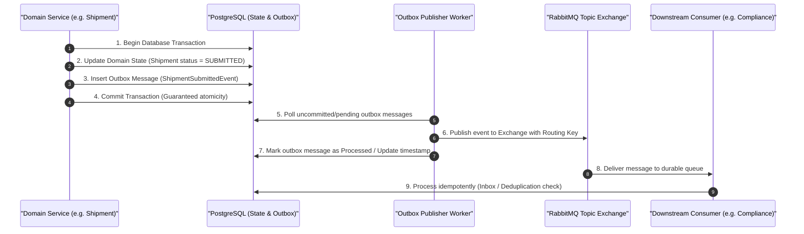

# Aurora

> Multi-tenant, polyglot microservices platform for modern freight logistics, intelligent mail triage, automated route optimization, multimodal document OCR, and trade regulatory compliance.

**English** | [Tiếng Việt](README.vi.md)

---

## 1. Overview

**Aurora** is an enterprise-grade, multi-tenant Software-as-a-Service (SaaS) logistics and supply chain execution platform. It is engineered to orchestrate the end-to-end freight lifecycle—from inbound multi-channel customer communications and automated document ingestion to shipment dispatch, route optimization, real-time telemetry tracking, regulatory customs compliance, and automated carrier settlement.

Traditional logistics workflows suffer from fragmented communication silos, manual data entry errors across shipping manifests, complex international trade compliance barriers, and suboptimal fleet routing. Aurora solves these operational challenges by unifying asynchronous event-driven microservices, high-performance gRPC inter-service communication, deterministic mathematical solvers, and centralized, governed AI capabilities.

Built on a polyglot foundation spanning **.NET 10**, **Java 21 (Spring Boot 3)**, and **NestJS 10 (Node.js 20)**, Aurora provides strict tenant isolation, a granular capability-based access control (CBAC) model, transactional outbox guarantees, and dedicated Backend-For-Frontend (BFF) gateways tailored to distinct operational personas (System Admins, Tenant Admins, Logistics Coordinators, Customs Clearance Officers, and Finance Officers).

```text
Inbound Mail / Documents / Orders
               │
               ▼
   [Aurora Multi-Tenant Gateway]
               │
   ┌───────────┼────────────────────────────────────────┐
   ▼           ▼                                        ▼
[Shipment &  [Document OCR &     [Route Optimization &   [Billing & Escrow
 Lifecycle]   Compliance RAG]     Fleet Telematics]       Settlement]
   │           │                                        │
   └───────────┴────────────────────────────────────────┘
               │
               ▼
Real-time Tracking, Automated Alerts & Live WebSocket Feeds
```

---

## 2. Key Features

### 📦 Shipment & Freight Lifecycle Management
- **Finite State Machine (FSM)**: Manages shipment transitions (`DRAFT` → `SUBMITTED` → `BOOKED` → `IN_TRANSIT` → `DELIVERED` → `COMPLETED` / `CANCELLED`).
- **Cargo & Stop Tracking**: Multi-leg routing, itemized cargo manifests, multi-modal stop sequences, and immutable status audit trails.
- **Batch Import**: High-throughput CSV/Excel shipment ingestion with validation pipelines.

### ✉️ Intelligent Enterprise Mail Platform
- **Shared Mailbox Triage**: Centralized thread queues (`UNASSIGNED`, `MY_WORK`, `ALL`) with atomic Redis claim locks, reassignments, and assignment histories.
- **Automated Mail Security Pipeline**: 12-stage inbound and 6-stage outbound inspection with ClamAV malware scanning, SpamAssassin filtering, and AI-driven phishing/BEC detection.
- **Stalwart Mail Server Integration**: Programmatic domain provisioning, mailbox creation, alias mapping, and MIME storage on Cloudflare R2 / S3.

### 🗺️ Route Planning, VRP Optimization & Risk Governance
- **VRP Optimization Engine**: Integrates with the **VROOM** optimization solver and **OSRM** (Open Source Routing Machine) for capacity-constrained multi-vehicle routing and dynamic waypoint sequencing.
- **4-Tier Risk Policy Governance**: Configurable tenant risk rules (`HeavyWeightRule`, `LargeVolumeRule`, `LongDurationRule`, `MinimumStopsRule`, `MultiHubRule`, `OnDemandTypeRule`, `RouteStopCountRule`).
- **Human-in-the-Loop Route Approval**: High-risk routes trigger automated supervisor approval workflows (`route_planning:approve`).

### 📄 Multimodal Document Processing & OCR
- **Asynchronous Extraction Pipeline**: Extracts structured data from Bills of Lading (B/L), Commercial Invoices, Packing Lists, and Customs Declarations.
- **Algorithmic Validation**: ISO 6346 container number checksum verification and mathematical line-item reconciliation.
- **HitL Review Queue**: Low-confidence extractions (< 0.85) are automatically routed to manual review queues for operational oversight.

### ⚖️ Regulatory Compliance & Legal Knowledge RAG
- **Semantic Vector Search**: Powered by PostgreSQL `pgvector` (HNSW indexing) for international trade laws, customs tariffs, and tenant-specific SOPs.
- **Automated Manifest Evaluation**: Compares shipment manifests against customs regulations to detect declaration discrepancies and embargo violations.
- **Grounded AI Assistant**: Generates audit-ready compliance rulings with exact legal article citations (`citations`).

### 🛰️ Real-Time GPS Tracking & Telematics
- **Telemetry Ingestion**: Ingests high-frequency vehicle GPS coordinates, heading, and speed data.
- **Spatial Geofencing**: Supports circular and polygon geofences with ray-casting point-in-polygon presence detection.
- **Watchdog & Alerts**: Automated triggers for geofence breaches, ETA route deviations, and telemetry signal-loss watchdogs.

### 🔐 Multi-Tenancy & Capability-Based Access Control (CBAC)
- **Tenant Isolation**: Multi-tenant database query filtering and context propagation across all service boundaries.
- **Hybrid Security Model**: Single Base Role (`SYSTEM_ADMIN`, `TENANT_ADMIN`, `MANAGER`, `STAFF`, etc.) combined with direct capability permissions (e.g., `route_planning:approve`, `mail:thread:reassign`, `ocr:review`).
- **Double-Layer Authorization**: Enforced at the BFF edge (`[RequirePermission]`) and validated via downstream gRPC metadata headers.

### 💰 Financial Rating, Invoicing & Escrow Settlement
- **Freight Cost Rating & Customs Duty**: Multimodal volumetric weight calculation and tariff computation by HS Code.
- **Automated Invoicing**: Idempotent invoice generation triggered upon Proof of Delivery (`POD`) upload.
- **Escrow Wallet Management**: Safe funds freezing, milestone releases, and customer credit aging checks.
- **AI-Assisted Negotiation**: Hybrid bargaining engine combining mathematical concession curves with LLM-drafted counter-proposals.

### 🛡️ Autonomous DevOps & SRE Agent
- **Alert Ingestion & Deduplication**: Captures Prometheus / Kubernetes events and deduplicates alert floods.
- **Autonomous Root Cause Analysis (RCA)**: Investigates pod logs, traces, and metrics to isolate infrastructure bottlenecks.
- **Governed Remediation**: Generates actionable diagnostic rules with supervisor approval gates before executing runbooks.

---

## 3. System Architecture

Aurora employs a polyglot microservices architecture. Client applications interact through a **YARP API Gateway** that routes requests to specialized **Backend-For-Frontend (BFF)** services. Inter-service synchronous communication is conducted via **gRPC**, while asynchronous domain events are broadcast across **RabbitMQ** using the **Transactional Outbox Pattern**.

```mermaid
flowchart TB
    subgraph ClientLayer ["Client Layer"]
        WebSPA["Aurora Web App (React / Next.js)"]
        MobileApp["Aurora Mobile App"]
    end

    subgraph GatewayLayer ["API Gateway & Reverse Proxy"]
        YARP["YARP API Gateway (:5000 / :443)"]
    end

    subgraph BFFLayer ["Backend-For-Frontend (BFF) Layer (.NET 10)"]
        StaffBFF["Staff.Bff (:5001)<br/>(Operators / Customs / Finance)"]
        AdminBFF["Admin.Bff (:5002)<br/>(Tenant Admins)"]
        SystemBFF["System.Bff (:5003)<br/>(System Admins)"]
        RealtimeHub["RealtimeHub (:5004)<br/>(Socket.IO WebSocket Gateway)"]
    end

    subgraph SecurityInfra ["Security & Identity"]
        Cognito["AWS Cognito / Identity Provider"]
        RedisCluster[("Redis / Valkey<br/>(Cache, Rate Limit, Locks)")]
    end

    subgraph DotNetServices [".NET 10 Microservices (gRPC)"]
        IamSvc["IamTenant (:5100)"]
        ShipmentSvc["ShipmentWorkflow (:5101)"]
        RouteSvc["RoutePlanningAgent (:5102)"]
        MailSvc["MailService (:5103)"]
        OcrSvc["DocumentOcr (:5104)"]
        ComplianceSvc["RegulatoryCompliance (:5105)"]
        GpsSvc["GpsTracking (:5106)"]
        NotificationSvc["Notification (:5107)"]
    end

    subgraph JavaServices ["Java 21 / Spring Boot Microservices (gRPC)"]
        AiGovSvc["ai-governance (:5200)"]
        DevOpsSvc["devops-agent (:5201)"]
    end

    subgraph NestJsServices ["NestJS Microservices (gRPC / HTTP)"]
        BillingSvc["billing-service (:5300)"]
        FinancialSvc["financial-service (:5301)"]
        NegotiationSvc["negotiation-agent (:5302)"]
        AssistantSvc["customer-assistant (:5303)"]
    end

    subgraph EventBus ["Event Streaming & Transactional Outbox"]
        RabbitMQ{{"RabbitMQ Message Broker"}}
    end

    subgraph StorageEngines ["Databases & External Systems"]
        Postgres[("PostgreSQL 16+<br/>(Database-per-Service)")]
        PgVectorStore[("PostgreSQL + pgvector<br/>(Legal & SOP Vectors)")]
        VROOM["VROOM / OSRM<br/>(VRP Solvers)"]
        StalwartServer["Stalwart Mail Server<br/>(SMTP / IMAP / JMAP)"]
        ObjectStore[("Cloudflare R2 / S3 / MinIO<br/>(Raw EML & PDF Docs)")]
        LLMProviders["Google Gemini / Azure OpenAI"]
    end

    WebSPA -->|HTTPS| YARP
    MobileApp -->|HTTPS| YARP
    WebSPA -->|WSS| RealtimeHub

    YARP -->|/api/v1/*| StaffBFF
    YARP -->|/api/v1/admin/*| AdminBFF
    YARP -->|/api/v1/system/*| SystemBFF

    StaffBFF --> Cognito
    StaffBFF --> RedisCluster
    AdminBFF --> Cognito
    AdminBFF --> RedisCluster
    SystemBFF --> Cognito
    SystemBFF --> RedisCluster
    RealtimeHub --> RedisCluster

    StaffBFF -->|gRPC| IamSvc
    StaffBFF -->|gRPC| ShipmentSvc
    StaffBFF -->|gRPC| RouteSvc
    StaffBFF -->|gRPC| MailSvc
    StaffBFF -->|gRPC| OcrSvc
    StaffBFF -->|gRPC| ComplianceSvc
    StaffBFF -->|gRPC| GpsSvc
    StaffBFF -->|gRPC| NotificationSvc
    StaffBFF -->|gRPC| BillingSvc
    StaffBFF -->|gRPC| FinancialSvc
    StaffBFF -->|gRPC| NegotiationSvc
    StaffBFF -->|HTTP| AssistantSvc

    AdminBFF -->|gRPC| IamSvc
    AdminBFF -->|gRPC| MailSvc
    AdminBFF -->|gRPC| RouteSvc
    AdminBFF -->|gRPC| ComplianceSvc
    AdminBFF -->|gRPC| AiGovSvc

    SystemBFF -->|gRPC| IamSvc
    SystemBFF -->|gRPC| MailSvc
    SystemBFF -->|gRPC| ComplianceSvc
    SystemBFF -->|gRPC| DevOpsSvc

    %% Service to Service gRPC
    RouteSvc -->|gRPC| ComplianceSvc
    BillingSvc -->|gRPC| FinancialSvc
    NegotiationSvc -->|gRPC| FinancialSvc
    AssistantSvc -->|gRPC| ComplianceSvc
    AssistantSvc -->|gRPC| ShipmentSvc
    AssistantSvc -->|gRPC| BillingSvc

    %% AI Governance Clients
    MailSvc -->|gRPC| AiGovSvc
    OcrSvc -->|gRPC| AiGovSvc
    ComplianceSvc -->|gRPC| AiGovSvc
    RouteSvc -->|gRPC| AiGovSvc
    NegotiationSvc -->|gRPC| AiGovSvc
    AssistantSvc -->|gRPC| AiGovSvc
    DevOpsSvc -->|gRPC| AiGovSvc
    AiGovSvc --> LLMProviders

    %% External Engines
    RouteSvc --> VROOM
    MailSvc --> StalwartServer
    MailSvc --> ObjectStore
    ComplianceSvc --> PgVectorStore
    DotNetServices --> Postgres
    JavaServices --> Postgres
    NestJsServices --> Postgres

    %% Async Messaging Outbox
    ShipmentSvc -.->|Outbox CDC| RabbitMQ
    RouteSvc -.->|Outbox CDC| RabbitMQ
    MailSvc -.->|Outbox CDC| RabbitMQ
    OcrSvc -.->|Outbox CDC| RabbitMQ
    ComplianceSvc -.->|Outbox CDC| RabbitMQ
    GpsSvc -.->|Outbox CDC| RabbitMQ
    IamSvc -.->|Outbox CDC| RabbitMQ
    BillingSvc -.->|Publish Event| RabbitMQ
    NegotiationSvc -.->|Publish Event| RabbitMQ
    AiGovSvc -.->|Outbox CDC| RabbitMQ
    DevOpsSvc -.->|Outbox CDC| RabbitMQ

    RabbitMQ -.->|Consume| NotificationSvc
    RabbitMQ -.->|Consume| RealtimeHub
    RabbitMQ -.->|Consume| BillingSvc
    RabbitMQ -.->|Consume| OcrSvc
    RabbitMQ -.->|Consume| ComplianceSvc
    RabbitMQ -.->|Consume| GpsSvc
    RabbitMQ -.->|Consume| MailSvc
```



---

## 4. Core Business Flows

### 🔄 Flow A: Automated Document Ingestion, Compliance & Dispatch
1. **Inbound Email**: Customer emails shipping request with attached Bill of Lading (B/L) and Invoice.
2. **Mail Pipeline**: `MailService` receives email via Stalwart, performs ClamAV scan, and calls `ai-governance` for phishing analysis.
3. **Thread Triage**: Safe emails enter the shared queue; staff claims thread or triggers automatic shipment generation.
4. **Document OCR**: `DocumentOcr` receives `DocumentAttachedEvent`, parses document structure via governed multimodal AI (`ocr.bill_of_lading`), verifies container checksums, and publishes `DocumentOcrCompletedEvent`.
5. **Shipment Lifecycle**: `ShipmentWorkflow` transitions shipment status to `SUBMITTED`.
6. **Regulatory Compliance**: `RegulatoryCompliance` consumes `ShipmentSubmittedEvent`, performs vector retrieval in `pgvector`, validates manifest items against trade restrictions, and publishes `ComplianceEvaluationCompletedEvent`.
7. **Route Optimization**: `RoutePlanningAgent` solves VRP via **VROOM/OSRM**, validates route risk rules, and requests manager approval if high risk.
8. **Live Telemetry & Geofencing**: `GpsTracking` binds vehicle coordinates (`RouteAssignedEvent`), tracks geofence entries/exits, and alerts on delays.
9. **Delivery & Settlement**: Driver uploads Proof of Delivery (`POD`); `ShipmentCompletedEvent` triggers `billing-service` for credit check, customs duty computation via `financial-service`, and e-invoice generation.
10. **Real-time Updates**: `RealtimeHub` pushes live notifications and invoice updates to client WebSocket rooms.

### 👤 Flow B: Manual Operational Flow
```text
Operator / Staff (SPA)
        │
        ▼ (HTTPS REST)
    Staff.Bff
        │
        ▼ (gRPC + Metadata Context: TenantId, UserId, Roles, Permissions)
ShipmentWorkflow / RoutePlanning / DocumentOcr
        │
        ▼ (Transactional Outbox)
   PostgreSQL ──[CDC / Poller]──► RabbitMQ ──► Downstream Consumers
```

---

## 5. AI in Aurora

In Aurora, AI operates strictly as an **Intelligent Advisor and Co-Pilot**, not an unconstrained decision-maker. Critical financial calculations, permission checks, and physical dispatches remain **deterministic**.

```text
┌─────────────────────────────────────────────────────────────────────────────┐
│                          Deterministic Logic & Solvers                      │
│  - RBAC/CBAC Permissions            - VRP Routing (VROOM / OSRM)            │
│  - Financial Tax / Volumetric Rating- ISO Checksum & Math Verification      │
│  - State Machine Lifecycle          - Geofence Polygon Ray-Casting          │
└──────────────────────────────────────┬──────────────────────────────────────┘
                                       │
                                       ▼ Governed Delegation
┌─────────────────────────────────────────────────────────────────────────────┐
│                       Central AI Governance Gateway                         │
│  - Token Budget Counters             - Prompt Injection / PII Filtering     │
│  - BYOK & Shared Key Pools           - Immutable Decision Audit Logging     │
└──────────────────────────────────────┬──────────────────────────────────────┘
                                       │
                                       ▼ Specialized AI Capabilities
┌─────────────────────────────────────────────────────────────────────────────┐
│                          Governed AI Capabilities                           │
│  - Multimodal OCR (`ocr.extract`)    - Conversational Assistant (`assistant`)│
│  - Legal & SOP RAG (`compliance.rag`)- Rate Negotiation NLG (`negotiation`) │
│  - Phishing Detection (`mail.sec`)   - DevOps RCA (`devops.rca`)            │
└─────────────────────────────────────────────────────────────────────────────┘
```

For a comprehensive technical breakdown of models, prompt management, token quotas, and capability contracts, see the [AI System Overview](docs/technical/AI_SYSTEM_OVERVIEW.md).

---

## 6. Event-Driven Architecture

Aurora uses **RabbitMQ** as its distributed asynchronous message broker. Reliability and message delivery guarantees are ensured through the **Transactional Outbox Pattern**:



- **Idempotency**: Consumers check idempotency keys (`consumed_integration_events` / `inbox_messages`) before applying domain changes.
- **Dead Letter Queues (DLQ)**: Failed message processing routes to dead-letter exchanges with exponential backoff retries.

---

## 7. Security & Multi-Tenancy

Aurora implements **Multi-Tenancy** and **Capability-Based Access Control (CBAC)**:

```text
Authenticated User
       │
       ├── Base Role (Persona): SYSTEM_ADMIN | TENANT_ADMIN | MANAGER | STAFF | ...
       │
       └── Direct User Permissions (Capabilities):
             ├── shipments:create
             ├── route_planning:approve
             ├── mail:thread:reassign
             └── ocr:review
```

### Authorization Principles:
1. **Tenant Isolation**: Every database table includes `tenant_id` scoping with EF Core multi-tenant global query filters and Prisma middleware.
2. **Double-Layer Verification**:
   - **Layer 1 (BFF)**: Validates incoming JWT tokens, resolves tenant membership, checks `[RequirePermission("...")]`, and attaches headers.
   - **Layer 2 (gRPC)**: Interceptors extract `x-tenant-id`, `x-user-id`, `x-roles`, and `x-permissions` metadata for defense-in-depth.
3. **No Blind Role Entitlements**: Roles define baseline capability bundles, but user actions are validated against explicit granular permissions. A `MANAGER` cannot approve routes without `route_planning:approve`.

---

## 8. Technology Stack

| Area | Technology | Purpose in Aurora |
| :--- | :--- | :--- |
| **Backend Frameworks** | `.NET 10` (C# 13)<br/>`Java 21` (Spring Boot 3.3)<br/>`NestJS 10` (Node.js 20, TypeScript) | High-performance core domain services, AI gateway, and financial/assistant services |
| **BFF & Ingress Gateway** | `YARP` (Yet Another Reverse Proxy)<br/>`ASP.NET Core` Micro-BFFs | Ingress routing, REST-to-gRPC translation, permission gating, rate limiting |
| **Inter-Service RPC** | `gRPC` / `Protobuf v3` (HTTP/2) | Low-latency, type-safe synchronous communication between microservices |
| **Asynchronous Messaging** | `RabbitMQ 3.12+`<br/>`MassTransit` | Event streaming, Transactional Outbox pattern, reliable asynchronous messaging |
| **Relational Database** | `PostgreSQL 16+`<br/>(EF Core 10, Flyway, Prisma) | Database-per-Service pattern, ACID transactions, relational domain storage |
| **Distributed Cache & Locks**| `Redis 7+` / `Valkey` | Sliding window rate limiting, distributed thread claim locks, session cache |
| **Vector Database** | `PostgreSQL` with `pgvector` | 1536-dimensional HNSW vector index for trade regulations & tenant SOPs |
| **Routing & Solvers** | `VROOM`<br/>`OSRM` (Open Source Routing Machine) | Vehicle Routing Problem (VRP) solver and road network matrix calculation |
| **AI Gateway & Models** | `ai-governance` (Java 21 Gateway)<br/>`Google Gemini 1.5`<br/>`Azure OpenAI` (GPT-4o) | Centralized token quota control, governed LLM completions, multimodal OCR |
| **Mail Server & Security** | `Stalwart Mail Server`<br/>`ClamAV`<br/>`SpamAssassin` | Enterprise SMTP/IMAP server, automated virus scanning, spam classification |
| **Object Storage** | `Cloudflare R2` / `AWS S3` / `MinIO` | Raw MIME email archives, invoice PDFs, and scanned shipment documents |
| **Realtime & WebSockets** | `Socket.IO`<br/>`Redis Adapter` | Real-time browser telemetry streaming and live event broadcasting |
| **Authentication & IdP** | `AWS Cognito User Pools`<br/>`JWT Bearer Tokens` | Multi-tenant user authentication, token issuance, and JWKS verification |

---

## 9. Repository Structure

```text
aurora-server/
├── protos/                     # Centralized Protobuf contracts for all gRPC services
│   ├── auth.proto
│   ├── shipment_workflow.proto
│   ├── route-planning-agent.proto
│   ├── mail_platform.proto
│   ├── document_ocr.proto
│   ├── regulatory_compliance.proto
│   ├── gps_tracking.proto
│   ├── ai_governance.proto
│   ├── billing.proto
│   └── ...
├── src/
│   ├── dotnet/                 # .NET 10 Core Services & BFFs
│   │   ├── BFF/                # YARP Gateway, Staff.Bff, Admin.Bff, System.Bff
│   │   ├── IamTenant/          # Tenant & User Identity Management
│   │   ├── ShipmentWorkflow/   # Core Freight Lifecycle State Machine
│   │   ├── RoutePlanningAgent/ # Route Optimization & Risk Governance
│   │   ├── MailService/        # Enterprise Mail & Triage Platform
│   │   ├── DocumentOcr/        # Multimodal Document OCR Extraction
│   │   ├── RegulatoryCompliance/# Trade Legal RAG (pgvector)
│   │   ├── GpsTracking/        # Real-time Telematics & Geofencing
│   │   ├── Notification/       # Multi-channel Notification Dispatcher
│   │   └── shared/             # Shared Events, Enums & Utilities
│   ├── java/                   # Java 21 / Spring Boot Microservices
│   │   ├── ai-governance/      # Central AI Gateway & Quota Manager
│   │   ├── devops-agent/       # Autonomous Incident RCA & Diagnostics
│   │   └── shared/             # Shared Java DTOs & Interceptors
│   └── nestjs/                 # NestJS TypeScript Microservices
│       ├── billing-service/    # Invoicing, Escrow & Credit Aging
│       ├── financial-service/  # Freight Rating & Tariff Calculation
│       ├── negotiation-agent-service/ # Bargaining Engine & Concession Curves
│       ├── customer-assistant-service/# Conversational AI & Tool Calling
│       └── realtime-hub-service/      # WebSocket Server (Socket.IO)
└── docs/
    └── technical/              # Authoritative technical specifications & audit reports
```

---

## 10. Services Catalog

| Service | Bounded Context / Responsibility | Runtime / Framework | Primary Data Store |
| :--- | :--- | :--- | :--- |
| **IamTenant** | Tenant provisioning, identity, role & capability permissions, Cognito auth | `.NET 10` (C#) | PostgreSQL (`iam_tenant`) |
| **ShipmentWorkflow** | Freight state machine, cargo hierarchy, milestones, document attachments | `.NET 10` (C#) | PostgreSQL (`shipment_workflow`) |
| **RoutePlanningAgent** | VRP vehicle optimization (VROOM), 4-tier risk policies, route approval | `.NET 10` (C#) | PostgreSQL (`route_planning`) |
| **MailService** | Multi-tenant mailbox triage, ClamAV/SpamAssassin/AI security pipeline | `.NET 10` (C#) | PostgreSQL (`mail_service`) + R2 |
| **DocumentOcr** | Asynchronous multimodal document OCR, ISO container validation, HitL review | `.NET 10` (C#) | PostgreSQL (`document_ocr`) |
| **RegulatoryCompliance**| Cross-border customs validation, legal citations, vector search | `.NET 10` (C#) | PostgreSQL + `pgvector` |
| **GpsTracking** | Vehicle telemetry ingestion, circular/polygon geofencing, watchdog alerts | `.NET 10` (C#) | PostgreSQL (`gps_tracking`) |
| **Notification** | Event-driven multi-channel notifications (In-app, SMTP), retry backoff | `.NET 10` (C#) | PostgreSQL (`notification`) |
| **AiGovernance** | Centralized AI gateway, token quota tracking, rate limiting, audit ledger | `Java 21` (Spring Boot 3) | PostgreSQL (`ai_governance`) + Redis |
| **DevOpsAgent** | Kubernetes alert ingestion, autonomous RCA, runbook execution | `Java 21` (Spring Boot 3) | PostgreSQL (`devops_agent`) |
| **BillingSettlement** | Automated invoice generation from PODs, escrow wallets, credit checks | `NestJS 10` (Node.js 20) | PostgreSQL (`billing_service`) |
| **FinancialTax** | Multimodal freight rating, customs tariff duty calculation, currency sync | `NestJS 10` (Node.js 20) | PostgreSQL (`financial_service`) + Redis |
| **NegotiationAgent** | Freight negotiation session state machine, concession curve, counter-drafts | `NestJS 10` (Node.js 20) | PostgreSQL (`negotiation_service`) |
| **RealtimeHub** | WebSocket event broadcasting, Redis adapter, offline message buffering | `NestJS 10` (Socket.IO) | Stateless / Redis buffer |
| **BFF & Gateway** | REST API aggregation, YARP reverse proxy, CBAC permission gating | `.NET 10` (C#) | Stateless / Redis cache |

---

## 11. Getting Started

### Prerequisites
- **.NET SDK**: `10.0+`
- **Java JDK**: `21+` with **Maven 3.9+**
- **Node.js**: `20.x+` with **npm 10+**
- **PostgreSQL**: `16+` with `pgvector` extension enabled
- **Redis / Valkey**: `7.0+`
- **RabbitMQ**: `3.12+` (with management plugin enabled)
- **External Solvers** *(Optional for local dev)*: VROOM & OSRM instances

### Configuration
Copy the environment template and populate your local credentials:

```bash
cp .env.example .env
```

Key environment configuration variables:

```env
# Infrastructure Shared
POSTGRES_HOST=localhost
POSTGRES_PORT=5432
POSTGRES_USERNAME=postgres
POSTGRES_PASSWORD=your_postgres_password

REDIS_HOST=localhost:6379
REDIS_PASSWORD=

RABBITMQ_HOST=localhost
RABBITMQ_USERNAME=guest
RABBITMQ_PASSWORD=guest

# AWS & Cognito
AWS_REGION=ap-southeast-1
COGNITO_USER_POOL_ID=ap-southeast-1_XXXXXXXXX
COGNITO_APP_CLIENT_ID=XXXXXXXXXXXXXXXXXXXXXXXXXX

# AI Gateway & External Services
Optimization__OsrmUrl=http://localhost:5010
Optimization__VroomUrl=http://localhost:3000
```

### Running Services Locally

#### 1. Start .NET Core Services & BFF Gateway
```bash
# Start IamTenant service
dotnet run --project src/dotnet/IamTenant/IamTenant.csproj

# Start ShipmentWorkflow service
dotnet run --project src/dotnet/ShipmentWorkflow/ShipmentWorkflow.csproj

# Start Staff BFF Gateway
dotnet run --project src/dotnet/BFF/Staff.Bff/Staff.Bff.csproj

# Start YARP API Gateway
dotnet run --project src/dotnet/BFF/API.Gateway/API.Gateway.csproj
```

#### 2. Start Java Microservices
```bash
# Start AI Governance Gateway
cd src/java/ai-governance
mvn spring-boot:run

# Start DevOps Agent
cd ../devops-agent
mvn spring-boot:run
```

#### 3. Start NestJS Microservices
```bash
# Billing Service
cd src/nestjs/billing-service
npm install
npx prisma migrate dev
npm run start:dev

# Realtime Hub (WebSocket Gateway)
cd ../realtime-hub-service
npm install
npm run start:dev
```

---

## 12. Development & Engineering Practices

- **Protobuf Contracts**: All gRPC service definitions reside centrally under `protos/`. When modifying RPC signatures, compile contracts across respective runtimes (`dotnet build`, `mvn compile`, `npm run build:proto`).
- **Database Migrations**:
  - `.NET`: Managed via EF Core Migrations (`dotnet ef migrations add <Name> --project ...`).
  - `Java`: Managed via **Flyway** migration scripts (`src/main/resources/db/migration`).
  - `NestJS`: Managed via **Prisma ORM** (`npx prisma migrate dev`).
- **Transactional Outbox**: All state mutations publishing integration events must persist an outbox record inside the same database transaction.
- **Testing**: Run test suites across languages:
  ```bash
  # .NET Test Suite
  dotnet test src/dotnet/ShipmentWorkflow/Tests/ShipmentWorkflow.Tests.csproj
  dotnet test src/dotnet/MailService/MailService.Tests/MailService.Tests.csproj
  dotnet test src/dotnet/RoutePlanningAgent/RoutePlanningAgent.Tests/RoutePlanningAgent.Tests.csproj

  # Java Test Suite
  cd src/java/ai-governance && mvn test
  cd src/java/devops-agent && mvn test

  # NestJS Spec Suite
  cd src/nestjs/customer-assistant-service && npm test
  ```

---

## 13. Documentation Index

Detailed architectural deep-dives, sequence diagrams, and API catalogs are maintained under `docs/`:

- [Technical Overview](docs/technical/OVERVIEW.md) — Comprehensive service-by-service inventory and domain overview.
- [System Architecture](docs/technical/ARCHITECTURE.md) — Global architecture blueprints, network topologies, and sequence flows.
- [AI System Overview](docs/technical/AI_SYSTEM_OVERVIEW.md) — Detailed AI governance, RAG architecture, and capability catalog.
- [Service Integration Matrix](docs/technical/SERVICE_INTEGRATION_MATRIX.md) — Complete cross-service gRPC and RabbitMQ dependency matrix.
- [Implementation Status & Audit](docs/technical/IMPLEMENTATION_STATUS.md) — Detailed service maturity scorecard and test coverage metrics.
- [Frontend API Catalog](docs/technical/frontend/API_CATALOG.md) — Unified REST API catalog across all micro-BFFs.
- [Documentation Index](docs/technical/DOCUMENTATION_INDEX.md) — Master index of all 40+ technical specification documents.
- [Career & Technical Portfolio](docs/technical/CV_HIGHLIGHTS.md) — Architecture talking points and engineering highlights.

---

## 14. Project Status & Roadmap

| Subsystem / Feature Area | Implementation Status | Notes / Next Steps |
| :--- | :---: | :--- |
| **Core .NET Services (IAM, Shipment, Route, Mail, OCR, Compliance, GPS, Notification)** | `COMPLETE` | Production-ready with comprehensive test coverage. |
| **Central AI Governance & DevOps Agent (Java 21)** | `COMPLETE` | Rate limiting, token reservation, and incident RCA verified. |
| **Customer Assistant & Realtime Hub (NestJS)** | `COMPLETE` | Tool calling, Redis memory, and Socket.IO verified. |
| **Billing, Financial & Negotiation Services (NestJS)** | `PRODUCTION-MVP READY` | Core use cases and Prisma schemas complete; expanding unit test suites. |
| **BFF Layer & YARP API Gateway** | `COMPLETE` | Double-layer permission gating and error translation verified. |
| **VNPT / Viettel Fiscal E-Invoice Integration** | `IN PROGRESS` | Mock adapter active; live tax authority API integration planned for v1.1. |
| **Hardware Telematics Gateway (Teltonika / Concox)** | `PLANNED` | Direct edge MQTT translation gateway on roadmap. |

---

<div align="center">

**English** | [Tiếng Việt](README.vi.md)

</div>
