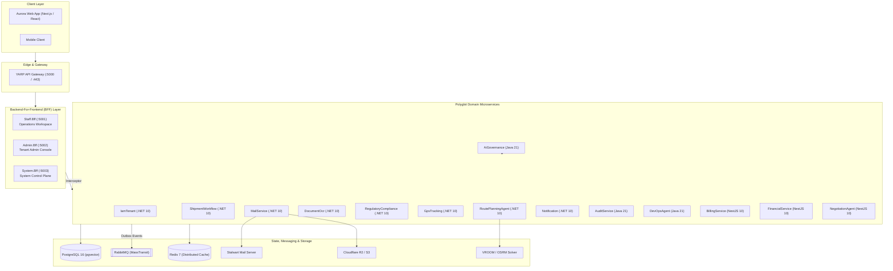
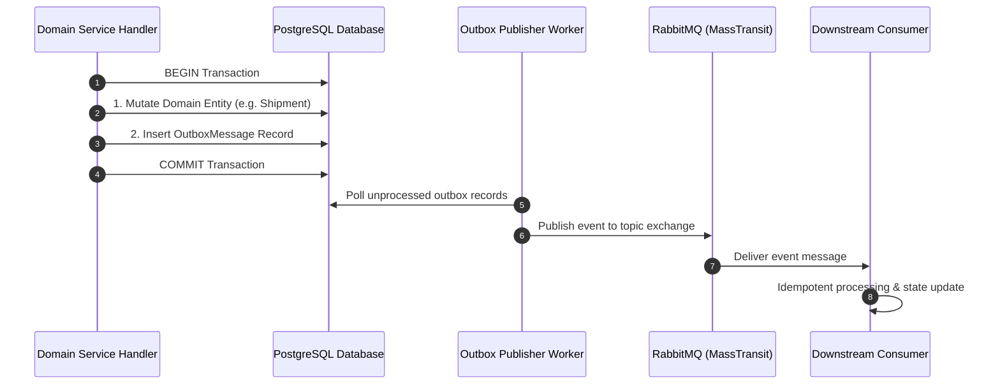

# Aurora Logistics Platform

> Enterprise multi-tenant logistics and supply-chain execution platform powered by polyglot event-driven microservices, mathematical optimization solvers, and governed AI assistants.

**English** | [Tiếng Việt](README.vi.md)

---

## 1. Overview

**Aurora** is an enterprise Software-as-a-Service (SaaS) platform engineered to orchestrate the end-to-end freight execution lifecycle. It unifies inbound multi-channel customer communications, automated shipping document extraction, customs trade compliance, capacity-constrained vehicle route planning, real-time fleet telematics, and automated carrier settlement.

Built on a polyglot foundation spanning **.NET 10**, **Java 21 (Spring Boot 3)**, and **NestJS 10 (Node.js 20)**, Aurora enforces strict tenant isolation, a direct capability-based access control (CBAC) model, transactional outbox consistency, and dedicated Backend-For-Frontend (BFF) gateways tailored to distinct operational persona shells.

```text
Customer Inquiries / Manifests / Orders
                   │
                   ▼
     [Aurora Multi-Tenant Gateway]
                   │
    ┌──────────────┼────────────────────────────────────────┐
    ▼              ▼                                        ▼
[Shipment &      [Document OCR &     [Route Optimization &   [Billing & Escrow
 Lifecycle]       Compliance RAG]     Fleet Telematics]       Settlement]
    │              │                                        │
    └──────────────┴────────────────────────────────────────┘
                   │
                   ▼
Real-time Tracking, Push Notifications & Governed Operations
```

---

## 2. Product Persona Shells & Application Experience

Aurora provides a unified application experience partitioned into dedicated persona shells:

- **Public Website / Landing**: Customer self-service, tracking lookups, and authentication entry point.
- **Aurora Admin Console (`TENANT_ADMIN`)**: Organization control plane managing People & Access (Users, Roles, Direct Capabilities), Operations Configuration (Route Risk Rules, AI Automation Policy, SOPs), Mail Administration, and Security Audit Logs.
- **Aurora Operations Workspace (`STAFF` & `MANAGER`)**: Unified daily execution workspace encompassing Shipments, Route Planning, OCR Documents, Trade Compliance, Collaborative Mail Triage, Live GPS Tracking, and Invoicing.
- **Stalwart Admin UI (`SYSTEM_ADMIN`)**: Direct management of underlying mail server infrastructure (listeners, TLS, routing, storage).

---

## 3. Core Authorization Architecture: Role != Authority

Aurora implements a **Four-Layer Authorization Model** where roles define layout shells and direct permissions grant actual business authority:

```text
┌─────────────────────────────────────────────────────────────────────────────┐
│ 1. Base Role Gate (SYSTEM_ADMIN | TENANT_ADMIN | MANAGER | STAFF)            │
│    -> Determines initial dashboard layout and persona shell.                │
├─────────────────────────────────────────────────────────────────────────────┤
│ 2. Capability Permission Gate ([RequirePermission("permission:code")])       │
│    -> Enforces granular runtime authority. Zero legacy StaffType enums.     │
├─────────────────────────────────────────────────────────────────────────────┤
│ 3. Resource Scope Gate (TenantId, MailboxId, PrimaryAssigneeUserId)         │
│    -> Enforces strict multi-tenant isolation and record ownership.          │
├─────────────────────────────────────────────────────────────────────────────┤
│ 4. Governance & Safety Gate (Domain Invariants & Concurrency Locks)         │
│    -> High-risk approvals, optimistic version checks, mail security pipes.  │
└─────────────────────────────────────────────────────────────────────────────┘
```

> **Canonical Example:** A user with role `STAFF` who holds `route_planning:approve` **can** approve high-risk routes. A user with role `MANAGER` whose permissions lack `route_planning:approve` **cannot** approve routes merely by virtue of their base role.

---

## 4. End-to-End Business Lifecycle Flow

```text
1. Customer Inquiry   ──► Received at Shared Mailbox (e.g. ops@acmelogistics.com)
2. Thread Triage      ──► Staff claims thread in UNASSIGNED queue -> moves to MY_WORK
3. Shipment Creation  ──► Draft shipment initialized with cargo manifest and stops
4. Document OCR       ──► B/L or Commercial Invoice extracted via asynchronous OCR pipeline
5. Trade Compliance   ──► RAG engine evaluates cargo against customs rules & trade statutes
6. Route Optimization ──► VROOM & OSRM solve multi-stop vehicle routing; risk scored [0..100]
7. Governance Gate    ──► High-risk routes (>50) pause for supervisor approval (`route_planning:approve`)
8. Live Telematics    ──► GPS telemetry ingested, monitored against geofences & ETA corridors
9. Delivery / POD     ──► Proof of Delivery uploaded; shipment transitioned to DELIVERED
10. Settlement & Push ──► Invoice generated; FCM push notification delivered to subscribers
```

---

## 5. System Architecture



---

## 6. Governed AI & Deterministic Solvers

Aurora strictly separates deterministic business solvers from governed AI capabilities:

| Architecture Layer | Engine / Model | Core Responsibilities |
|---|---|---|
| **Deterministic Systems** | VROOM / OSRM, EF Core FSM, PostGIS | Vehicle routing optimization, shipment state transitions, tariff calculations, geofence ray-casting, container checksums. |
| **Governed Document OCR** | Multimodal Vision / OCR | Asynchronous structured data extraction from shipping documents with human review queues for confidence scores below 0.85. |
| **Compliance RAG** | PostgreSQL `pgvector` (HNSW) | Semantic search across national trade laws and tenant SOPs; grounded answers with mandatory legal article citations. |
| **Negotiation & Assistant** | LLM Negotiation Agents | Drafts commercial counter-offers within mathematical concession limits; frontline customer chat. |
| **Mail Security Pipeline** | ClamAV, SpamAssassin, AI Risk | Inbound threat screening (malware, phishing, BEC) and outbound DLP verification. |
| **DevOps Agent** | SRE Diagnostic LLM | Root-cause analysis over Prometheus metrics and Kubernetes logs with supervisor approval on runbook executions. |

---

## 7. Event-Driven Architecture & Transactional Outbox

All state changes and domain events are persisted within the same database transaction before publication, ensuring at-least-once, duplicate-safe delivery across microservices:



---

## 8. Enterprise Mail Architecture

Aurora replaces siloed personal email inboxes (`john@company.com`) with a collaborative **Shared Company Mailbox & Thread Triage Model**:

- **Mailbox as Company Identity**: External communications use shared department addresses (e.g. `operations@acmelogistics.com`, `customs@acmelogistics.com`).
- **Default Operational Mailbox *(Target Model)***: Each tenant designates one primary operational shared mailbox for initial customer intake.
- **1:1 Forwarding Aliases *(Target Model)***: Inbound aliases (`sales@`, `contact@`) route strictly to one canonical shared mailbox to avoid duplicate processing.
- **EmailThread as Work Unit**: Inbound emails are grouped into threads, triaged via `UNASSIGNED`, `MY_WORK`, and `ALL` (permission-gated) queues, and locked using optimistic concurrency (`thread.Version`).
- **Traceable Human Attribution**: Outbound emails render the shared mailbox as the sender (`From: operations@`) while immutably logging the authenticated author (`SentByUserId`).

---

## 9. Polyglot Microservices Catalog

| Service | Runtime | Responsibility | Primary Data Store | Status |
|---|---|---|---|:---:|
| **`API.Gateway`** | .NET 10 | YARP reverse proxy, SSL termination, rate limiting | Memory | `READY` |
| **`Staff.Bff`** | .NET 10 | Operations Workspace gateway (Staff & Manager) | Redis | `READY` |
| **`Admin.Bff`** | .NET 10 | Tenant Admin Console gateway | Redis | `READY` |
| **`System.Bff`** | .NET 10 | System Control Plane gateway | Redis | `READY` |
| **`IamTenant`** | .NET 10 | Multi-tenant IAM, base roles, direct capabilities, Cognito sync | PostgreSQL | `READY` |
| **`ShipmentWorkflow`** | .NET 10 | Freight lifecycle FSM, cargo tracking, milestones | PostgreSQL | `READY` |
| **`RoutePlanningAgent`**| .NET 10 | VRP solver integration, risk scoring, route dispatch | PostgreSQL | `READY` |
| **`DocumentOcr`** | .NET 10 | Multimodal OCR ingestion, structured extraction, HitL review | PostgreSQL | `READY` |
| **`RegulatoryCompliance`**| .NET 10 | Trade law vector search (pgvector), customs manifest evaluation | PostgreSQL (`pgvector`) | `READY` |
| **`GpsTracking`** | .NET 10 | High-frequency telemetry ingestion, geofences, breach watchdogs | PostgreSQL / Redis | `READY` |
| **`MailService`** | .NET 10 | Thread triage, email security pipeline, Stalwart relay | PostgreSQL / R2 Storage | `MVP READY` |
| **`Notification`** | .NET 10 | FCM web push delivery, shipment subscriptions, in-app history | PostgreSQL | `READY` |
| **`AiGovernance`** | Java 21 | AI token quotas, tenant provider policies, audit oversight | PostgreSQL | `READY` |
| **`AuditService`** | Java 21 | Centralized security and compliance activity logging | PostgreSQL | `READY` |
| **`DevOpsAgent`** | Java 21 | Autonomous SRE root-cause analysis, log/metric diagnostic | PostgreSQL | `READY` |
| **`BillingService`** | NestJS 10 | Invoicing, payment settlement, escrow wallet management | PostgreSQL | `READY` |
| **`FinancialService`** | NestJS 10 | Multimodal freight cost estimation, HS Code tariff ratings | PostgreSQL | `READY` |
| **`NegotiationAgent`** | NestJS 10 | Rate bargaining engine, mathematical concession curve, AI draft | PostgreSQL | `READY` |

---

## 10. Technology Stack

| Category | Technologies |
|---|---|
| **Gateways & BFF** | ASP.NET Core (.NET 10), YARP Reverse Proxy, Polly Resilience Pipelines, MediatR |
| **Backend Runtimes** | .NET 10 (C#), Java 21 (Spring Boot 3), NestJS 10 (Node.js 20 / TypeScript) |
| **Inter-Service RPC** | gRPC over HTTP/2, Protobuf v3 (`protos/*.proto`) |
| **Asynchronous Messaging** | RabbitMQ 3.13, MassTransit 8, Transactional Outbox Pattern |
| **Databases & Search** | PostgreSQL 16 (`pgvector` HNSW index), EF Core 10, Spring Data JPA, TypeORM |
| **Caching & Auth** | Redis 7, AWS Cognito OIDC / JWT, Secure HttpOnly Session Cookies |
| **Mail & Storage** | Stalwart Mail Server, Cloudflare R2 / AWS S3 (MIME EML Storage) |
| **Mathematical Solvers** | VROOM Optimization Engine, Open Source Routing Machine (OSRM) |
| **Push Notifications** | Firebase Cloud Messaging (FCM Web Push SDK) |

---

## 11. Repository Structure

```text
aurora-server/
├── deploy/                 # Kubernetes manifests, Helm charts, Dockerfiles
├── docker-compose.dev.yml  # Local development infrastructure stack
├── docs/                   # Authoritative architecture and API documentation
│   ├── bff-api/            # BFF REST API specifications by persona
│   ├── figma/              # Target Figma / UI component specifications
│   ├── superpowers/plans/  # Implementation plans & tracking records
│   └── technical/          # Detailed technical documentation & frontend contracts
├── infra/                  # Terraform scripts and cloud provisioning modules
├── protos/                 # Canonical Protobuf gRPC service contracts
└── src/
    ├── dotnet/             # .NET 10 Services, BFF Gateways & Shared Libraries
    ├── java/               # Java 21 Spring Boot Microservices (AI Governance, SRE)
    └── nestjs/             # NestJS 10 Services (Billing, Financial, Negotiation)
```

---

## 12. Quick Start & Development

### Prerequisites
- [.NET 10 SDK](https://dotnet.microsoft.com/download/dotnet/10.0)
- [Java 21 JDK](https://adoptium.net/) & [Maven 3.9+](https://maven.apache.org/)
- [Node.js 20 LTS](https://nodejs.org/) & [pnpm](https://pnpm.io/)
- [Docker & Docker Compose](https://www.docker.com/)

### 1. Start Local Infrastructure
```bash
docker compose -f docker-compose.dev.yml up -d
```
*Starts PostgreSQL (`:5432`), Redis (`:6379`), RabbitMQ (`:5672`, UI `:15672`), and Mail/Storage services.*

### 2. Build Services & Run Tests
```bash
# Build .NET Services & BFF Gateways
dotnet build src/dotnet/BFF/Staff.Bff/Staff.Bff.csproj

# Run .NET Unit & Contract Tests
dotnet test tests/dotnet/Notification.Tests/Notification.Tests.csproj

# Build Java Services
mvn -f src/java/pom.xml clean compile

# Build NestJS Services
pnpm --prefix src/nestjs/billing-service build
```

---

## 13. Documentation Index

- **System Architecture & Design**: [docs/technical/ARCHITECTURE.md](file:///d:/IT/CD/aurora-server/docs/technical/ARCHITECTURE.md)
- **Technical Overview**: [docs/technical/OVERVIEW.md](file:///d:/IT/CD/aurora-server/docs/technical/OVERVIEW.md)
- **Frontend API Catalog**: [docs/technical/frontend/API_CATALOG.md](file:///d:/IT/CD/aurora-server/docs/technical/frontend/API_CATALOG.md)
- **Frontend Contract Precedence**: [docs/technical/frontend/README.md](file:///d:/IT/CD/aurora-server/docs/technical/frontend/README.md)
- **BFF API Architecture & Specs**: [docs/bff-api/README.md](file:///d:/IT/CD/aurora-server/docs/bff-api/README.md)
- **Implementation Status Matrix**: [docs/technical/frontend/IMPLEMENTATION_STATUS.md](file:///d:/IT/CD/aurora-server/docs/technical/frontend/IMPLEMENTATION_STATUS.md)
- **Documentation Sync Report**: [docs/technical/DOCUMENTATION_SYNC_REPORT.md](file:///d:/IT/CD/aurora-server/docs/technical/DOCUMENTATION_SYNC_REPORT.md)
