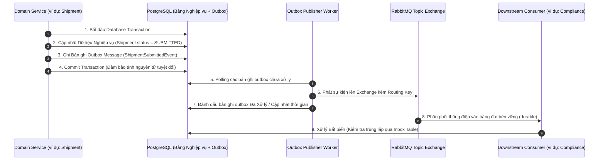

# Aurora

> Nền tảng microservices đa ngôn ngữ, hỗ trợ multi-tenant phục vụ quản trị logistics vận tải hàng hóa, phân luồng email thông minh, tối ưu hóa tuyến đường tự động, OCR chứng từ đa phương thức và kiểm soát tuân thủ quy định thương mại quốc tế.

[English](README.md) | **Tiếng Việt**

---

## 1. Overview (Tổng quan)

**Aurora** là nền tảng Software-as-a-Service (SaaS) cấp doanh nghiệp (enterprise-grade), hỗ trợ đa khách thuê (multi-tenant) phục vụ quản trị và điều phối vận tải logistics, chuỗi cung ứng. Hệ thống được thiết kế để tự động hóa toàn diện vòng đời lô hàng—từ tiếp nhận yêu cầu đa kênh qua email, trích xuất dữ liệu chứng từ tự động, điều phối lô hàng, tối ưu hóa lộ trình giao hàng, giám sát hành trình GPS thời gian thực, kiểm tra tuân thủ pháp lý hải quan, cho đến quyết toán và thanh toán cước vận tải.

Các quy trình logistics truyền thống thường gặp phải tình trạng phân mảnh thông tin, sai sót khi nhập liệu thủ công các loại chứng từ vận tải, rào cản phức tạp về thủ tục hải quan xuất nhập khẩu và lộ trình xe giao hàng kém tối ưu. Aurora giải quyết triệt để các bài toán này bằng cách kết hợp kiến trúc microservices hướng sự kiện (Event-Driven Architecture), giao tiếp nội bộ hiệu năng cao qua gRPC, các bộ giải thuật toán học tối ưu hóa xác định và cổng quản trị AI tập trung có kiểm soát.

Được xây dựng trên nền tảng công nghệ đa ngôn ngữ (polyglot) gồm **.NET 10**, **Java 21 (Spring Boot 3)** và **NestJS 10 (Node.js 20)**, Aurora đảm bảo tính cô lập dữ liệu người thuê nghiêm ngặt, mô hình phân quyền theo năng lực chi tiết (Capability-Based Access Control), cơ chế đảm bảo gửi nhận thông điệp qua Transactional Outbox Pattern và các cổng Backend-For-Frontend (BFF) chuyên biệt cho từng vai trò người dùng (System Admin, Tenant Admin, Điều phối viên vận hành, Cán bộ hải quan, Chuyên viên tài chính).

```text
Email đến / Chứng từ PDF / Đơn hàng
                  │
                  ▼
      [Cổng Multi-Tenant Aurora]
                  │
   ┌──────────────┼────────────────────────────────────────┐
   ▼              ▼                                        ▼
[Quản lý Vòng  [OCR Chứng từ &    [Tối ưu Tuyến đường     [Thanh toán, Ký quỹ
 đời Lô hàng]   Pháp lý RAG]       & Giám sát GPS]          & Quyết toán]
   │              │                                        │
   └──────────────┴────────────────────────────────────────┘
                  │
                  ▼
Giám sát Thời gian thực, Cảnh báo Tự động & Luồng WebSocket Trực tiếp
```

---

## 2. Key Features (Tính năng cốt lõi)

### 📦 Quản lý Vòng đời Vận tải & Lô hàng (Shipment Management)
- **Máy trạng thái hữu hạn (FSM)**: Kiểm soát chặt chẽ quá trình chuyển đổi trạng thái lô hàng (`DRAFT` → `SUBMITTED` → `BOOKED` → `IN_TRANSIT` → `DELIVERED` → `COMPLETED` / `CANCELLED`).
- **Quản lý Hàng hóa & Điểm dừng**: Quản lý nhiều chặng vận chuyển, danh mục hàng hóa chi tiết, chuỗi điểm dừng đa phương thức và nhật ký kiểm toán trạng thái bất biến.
- **Nhập dữ liệu hàng loạt**: Tiếp nhận và xác thực dữ liệu lô hàng qua tệp CSV/Excel với hiệu năng xử lý cao.

### ✉️ Nền tảng Email Doanh nghiệp Thông minh (Mail Automation & Security)
- **Hàng đợi Phân luồng Hộp thư Chung**: Quản lý hàng đợi tập trung (`UNASSIGNED`, `MY_WORK`, `ALL`) với cơ chế khóa nhận việc nguyên tử (atomic claim lock) qua Redis, hỗ trợ điều phối lại và lưu trữ lịch sử phân công.
- **Quy trình Bảo mật Email Tự động**: Hệ thống kiểm tra 12 bước đầu vào và 6 bước đầu ra với quét mã độc ClamAV, lọc thư rác SpamAssassin và phân tích phòng chống lừa đảo/giả mạo doanh nghiệp (BEC) bằng AI.
- **Tích hợp Máy chủ Mail Stalwart**: Khởi tạo cấu hình tên miền tự động, tạo hòm thư nhân viên, quản lý bí danh (alias) và lưu trữ nội dung email thô MIME trên Cloudflare R2 / S3.

### 🗺️ Quy hoạch Tuyến đường, Tối ưu VRP & Quản trị Rủi ro (Routing & VRP Optimization)
- **Bộ giải Tối ưu hóa Tuyến xe (VRP Solver)**: Tích hợp trực tiếp công cụ tối ưu hóa **VROOM** và hệ thống bản đồ **OSRM** (Open Source Routing Machine) để giải bài toán định tuyến nhiều xe có ràng buộc tải trọng và sắp xếp thứ tự điểm dừng tối ưu.
- **Quản trị Chính sách Rủi ro 4 Cấp độ**: Động cơ quy tắc rủi ro của từng tenant (`HeavyWeightRule`, `LargeVolumeRule`, `LongDurationRule`, `MinimumStopsRule`, `MultiHubRule`, `OnDemandTypeRule`, `RouteStopCountRule`).
- **Phê duyệt Tuyến đường Có con người tham gia (HitL)**: Các tuyến đường phát hiện rủi ro cao sẽ tự động kích hoạt quy trình chờ quản lý phê duyệt (`route_planning:approve`).

### 📄 Xử lý & OCR Chứng từ Đa phương thức (Document Processing & OCR)
- **Quy trình Trích xuất Bất đồng bộ**: Tự động nhận diện và trích xuất dữ liệu có cấu trúc từ Vận đơn (Bill of Lading), Hóa đơn thương mại (Invoice), Phiếu đóng gói (Packing List) và Tờ khai hải quan.
- **Xác thực Thuật toán**: Kiểm tra số hiệu container theo thuật toán checksum ISO 6346 và đối soát khớp số liệu dòng hàng.
- **Hàng đợi Xem xét Thủ công (HitL)**: Tự động chuyển các bản quét có độ tin cậy thấp (< 0.85) vào hàng đợi để nhân viên vận hành rà soát.

### ⚖️ Kiểm soát Tuân thủ Pháp lý & RAG Tri thức (Regulatory Compliance RAG)
- **Tìm kiếm Vector Ngữ nghĩa**: Sử dụng PostgreSQL `pgvector` (chỉ mục HNSW) để tra cứu quy định ngoại thương, biểu thuế quan HS Code và tài liệu quy trình vận hành chuẩn (SOP) nội bộ.
- **Tự động Đánh giá Manifest Lô hàng**: Đối chiếu tờ khai hàng hóa với quy định hải quan để phát hiện khai báo sai lệch, hàng cấm hoặc vi phạm hạn ngạch.
- **Trợ lý Pháp lý có Dẫn nguồn**: Trả lời câu hỏi nghiệp vụ và quy định kèm trích dẫn chính xác điều khoản luật (`citations`).

### 🛰️ Giám sát Hành trình GPS & Địa phận ảo (Real-Time GPS Tracking & Geofencing)
- **Tiếp nhận Dữ liệu Viễn thông**: Xử lý tọa độ GPS, hướng di chuyển và tốc độ phương tiện với tần suất cao.
- **Thiết lập Địa phận ảo (Geofencing)**: Hỗ trợ tạo vùng địa phận hình tròn và đa giác với thuật toán kiểm tra điểm nằm trong đa giác (Ray-casting Point-in-Polygon).
- **Hệ thống Giám sát & Cảnh báo**: Tự động phát hiện vi phạm ra/vào vùng địa phận, trễ tiến độ ETA và tiến trình theo dõi mất tín hiệu (Signal Loss Watchdog).

### 🔐 Đa Khách thuê & Phân quyền Năng lực Trực tiếp (IAM & Multi-Tenancy)
- **Cô lập Dữ liệu Multi-Tenant**: Lọc dữ liệu theo `tenant_id` tại tầng cơ sở dữ liệu và lan truyền ngữ cảnh bảo mật qua metadata gRPC.
- **Mô hình Bảo mật Lai (Hybrid Model)**: Kết hợp vai trò cơ sở (Base Role: `SYSTEM_ADMIN`, `TENANT_ADMIN`, `MANAGER`, `STAFF`...) với quyền hạn năng lực trực tiếp (User Permissions: `route_planning:approve`, `mail:thread:reassign`, `ocr:review`...).
- **Xác thực Phân quyền Hai lớp**: Kiểm tra quyền tại lớp cổng BFF (`[RequirePermission]`) và xác thực ngữ cảnh gRPC metadata tại các microservice nội bộ.

### 💰 Định giá Cước, Lập Hóa đơn & Thanh toán Ký quỹ (Billing & Escrow Settlement)
- **Tính cước Vận chuyển & Thuế hải quan**: Tính trọng lượng quy đổi thể tích theo từng phương thức vận chuyển và tra cứu thuế quan theo mã HS.
- **Tự động Lập Hóa đơn**: Kích hoạt xuất hóa đơn tự động và đảm bảo tính bất biến (idempotent) ngay khi nhận biên bản giao hàng thành công (`POD`).
- **Quản lý Ví Ký quỹ (Escrow)**: Khóa tiền tạm giữ an toàn, giải ngân theo tiến độ giao hàng và kiểm tra hạn mức tín dụng khách hàng.
- **Thương lượng Giá có AI Hỗ trợ**: Kết hợp đường cong nhượng bộ toán học xác định với mô hình AI soạn thảo văn bản phản hồi đàm phán giá.

### 🛡️ Tự động hóa Vận hành & SRE Agent (DevOps Agent)
- **Tiếp nhận & Khử trùng lặp Cảnh báo**: Thu thập sự kiện từ Prometheus/Kubernetes và tự động lọc bỏ các đợt bùng nổ cảnh báo trùng lặp.
- **Phân tích Nguyên nhân Gốc rễ (RCA)**: Khảo sát log, trace và metric của container để chẩn đoán nguyên nhân sự cố hạ tầng.
- **Đề xuất & Khắc phục có Kiểm soát**: Đề xuất quy tắc chẩn đoán và chờ quản trị viên phê duyệt trước khi thực thi runbook khắc phục.

---

## 3. System Architecture (Kiến trúc Hệ thống)

Aurora áp dụng kiến trúc microservices đa ngôn ngữ. Các ứng dụng máy khách kết nối thông qua **YARP API Gateway** để định tuyến yêu cầu tới các cổng **Backend-For-Frontend (BFF)** chuyên biệt. Giao tiếp đồng bộ giữa các microservice được thực hiện qua **gRPC**, trong khi các sự kiện nghiệp vụ bất đồng bộ được phát qua **RabbitMQ** theo mô hình **Transactional Outbox Pattern**.

```mermaid
flowchart TB
    subgraph ClientLayer ["Tầng Ứng dụng Khách"]
        WebSPA["Giao diện Web Aurora (React / Next.js)"]
        MobileApp["Ứng dụng Di động Aurora"]
    end

    subgraph GatewayLayer ["Tầng API Gateway & Reverse Proxy"]
        YARP["YARP API Gateway (:5000 / :443)"]
    end

    subgraph BFFLayer ["Tầng Backend-For-Frontend (BFF) (.NET 10)"]
        StaffBFF["Staff.Bff (:5001)<br/>(Điều phối viên / Hải quan / Tài chính)"]
        AdminBFF["Admin.Bff (:5002)<br/>(Quản trị viên Doanh nghiệp)"]
        SystemBFF["System.Bff (:5003)<br/>(Quản trị viên Hệ thống)"]
        RealtimeHub["RealtimeHub (:5004)<br/>(Socket.IO WebSocket Gateway)"]
    end

    subgraph SecurityInfra ["Hạ tầng Bảo mật & Định danh"]
        Cognito["AWS Cognito / Identity Provider"]
        RedisCluster[("Redis / Valkey<br/>(Cache, Rate Limit, Khóa phân tán)")]
    end

    subgraph DotNetServices ["Microservices .NET 10 (gRPC)"]
        IamSvc["IamTenant (:5100)"]
        ShipmentSvc["ShipmentWorkflow (:5101)"]
        RouteSvc["RoutePlanningAgent (:5102)"]
        MailSvc["MailService (:5103)"]
        OcrSvc["DocumentOcr (:5104)"]
        ComplianceSvc["RegulatoryCompliance (:5105)"]
        GpsSvc["GpsTracking (:5106)"]
        NotificationSvc["Notification (:5107)"]
    end

    subgraph JavaServices ["Microservices Java 21 / Spring Boot (gRPC)"]
        AiGovSvc["ai-governance (:5200)"]
        DevOpsSvc["devops-agent (:5201)"]
    end

    subgraph NestJsServices ["Microservices NestJS (gRPC / HTTP)"]
        BillingSvc["billing-service (:5300)"]
        FinancialSvc["financial-service (:5301)"]
        NegotiationSvc["negotiation-agent (:5302)"]
        AssistantSvc["customer-assistant (:5303)"]
    end

    subgraph EventBus ["Hàng đợi Thông điệp & Transactional Outbox"]
        RabbitMQ{{"RabbitMQ Message Broker"}}
    end

    subgraph StorageEngines ["Cơ sở Dữ liệu & Hệ thống Bên ngoài"]
        Postgres[("PostgreSQL 16+<br/>(Database-per-Service)")]
        PgVectorStore[("PostgreSQL + pgvector<br/>(Vector Quy định & SOP)")]
        VROOM["VROOM / OSRM<br/>(Bộ giải VRP)"]
        StalwartServer["Stalwart Mail Server<br/>(SMTP / IMAP / JMAP)"]
        ObjectStore[("Cloudflare R2 / S3 / MinIO<br/>(Lưu trữ EML & PDF)")]
        LLMProviders["Google Gemini / Azure OpenAI"]
    end

    WebSPA -->|HTTPS| YARP
    MobileApp -->|HTTPS| YARP
    WebSPA -->|WSS| RealtimeHub

    YARP -->|/api/v1/*| StaffBFF
    YARP -->|/api/v1/admin/*| AdminBFF
    YARP -->|/api/v1/system/*| SystemBFF

    StaffBFF --> Cognito & RedisCluster
    AdminBFF --> Cognito & RedisCluster
    SystemBFF --> Cognito & RedisCluster
    RealtimeHub --> RedisCluster

    StaffBFF -->|gRPC| IamSvc & ShipmentSvc & RouteSvc & MailSvc & OcrSvc & ComplianceSvc & GpsSvc & NotificationSvc & BillingSvc & FinancialSvc & NegotiationSvc
    StaffBFF -->|HTTP| AssistantSvc
    AdminBFF -->|gRPC| IamSvc & MailSvc & RouteSvc & ComplianceSvc & AiGovSvc
    SystemBFF -->|gRPC| IamSvc & MailSvc & ComplianceSvc & DevOpsSvc

    %% Service to Service
    RouteSvc -->|gRPC| ComplianceSvc
    BillingSvc -->|gRPC| FinancialSvc
    NegotiationSvc -->|gRPC| FinancialSvc
    AssistantSvc -->|gRPC| ComplianceSvc & ShipmentSvc & BillingSvc

    %% AI Governance
    MailSvc & OcrSvc & ComplianceSvc & RouteSvc & NegotiationSvc & AssistantSvc & DevOpsSvc -->|gRPC| AiGovSvc
    AiGovSvc --> LLMProviders

    %% External Engines
    RouteSvc --> VROOM
    MailSvc --> StalwartServer & ObjectStore
    ComplianceSvc --> PgVectorStore
    DotNetServices & JavaServices & NestJsServices --> Postgres

    %% Async Messaging
    ShipmentSvc & RouteSvc & MailSvc & OcrSvc & ComplianceSvc & GpsSvc & IamSvc & BillingSvc & NegotiationSvc & AiGovSvc & DevOpsSvc -.->|Phát sự kiện (Outbox CDC)| RabbitMQ
    RabbitMQ -.->|Tiêu thụ sự kiện| NotificationSvc & RealtimeHub & BillingSvc & OcrSvc & ComplianceSvc & GpsSvc & MailSvc
```

---

## 4. Core Business Flows (Quy trình Nghiệp vụ Cốt lõi)

### 🔄 Quy trình Tự động A: Tiếp nhận Chứng từ, Tuân thủ Pháp lý & Điều phối
1. **Email Yêu cầu**: Khách hàng gửi email đính kèm Vận đơn (B/L) và Hóa đơn thương mại.
2. **Xử lý Thư đến**: `MailService` nhận email qua Stalwart, thực hiện quét ClamAV và gọi `ai-governance` để đánh giá rủi ro lừa đảo.
3. **Phân luồng Công việc**: Email an toàn được chuyển vào hàng đợi chung; nhân viên tiếp nhận hoặc hệ thống tự động khởi tạo lô hàng.
4. **OCR Chứng từ**: `DocumentOcr` nhận sự kiện `DocumentAttachedEvent`, phân tích cấu trúc chứng từ qua AI đa phương thức (`ocr.bill_of_lading`), xác thực checksum số container và phát sự kiện `DocumentOcrCompletedEvent`.
5. **Vòng đời Lô hàng**: `ShipmentWorkflow` chuyển trạng thái lô hàng sang `SUBMITTED`.
6. **Kiểm soát Tuân thủ Pháp lý**: `RegulatoryCompliance` tiêu thụ `ShipmentSubmittedEvent`, tra cứu vector trên `pgvector`, đối chiếu mặt hàng với danh mục cấm/hạn chế và phát `ComplianceEvaluationCompletedEvent`.
7. **Tối ưu Tuyến đường**: `RoutePlanningAgent` giải bài toán định tuyến VRP qua **VROOM/OSRM**, kiểm tra quy tắc rủi ro và gửi yêu cầu phê duyệt nếu có cảnh báo rủi ro cao.
8. **Giám sát GPS & Địa phận**: `GpsTracking` gán phương tiện (`RouteAssignedEvent`), theo dõi sự kiện ra/vào địa phận ảo và gửi cảnh báo trễ tiến độ.
9. **Giao hàng & Quyết toán**: Lái xe tải lên biên bản giao nhận hàng (`POD`); `ShipmentCompletedEvent` kích hoạt `billing-service` kiểm tra hạn mức tín dụng, tính thuế hải quan qua `financial-service` và xuất hóa đơn điện tử.
10. **Cập nhật Trực tiếp**: `RealtimeHub` phát thông báo và trạng thái hóa đơn tới phòng giao dịch khách hàng qua WebSocket.

### 👤 Quy trình Thủ công B: Thao tác Vận hành Trực tiếp
```text
Nhân viên Vận hành / Điều phối (Giao diện SPA)
        │
        ▼ (HTTPS REST)
    Staff.Bff
        │
        ▼ (gRPC + Metadata Ngữ cảnh: TenantId, UserId, Roles, Permissions)
ShipmentWorkflow / RoutePlanning / DocumentOcr
        │
        ▼ (Transactional Outbox)
   PostgreSQL ──[CDC / Poller]──► RabbitMQ ──► Các Service Tiêu thụ
```

---

## 5. AI in Aurora (Vai trò của AI trong Hệ thống)

Trong Aurora, AI đóng vai trò là **Hệ thống Cố vấn Thông minh và Trợ lý Hỗ trợ (Co-Pilot)**, tuyệt đối không tự ý ra quyết định thay thế con người. Các phép tính toán tài chính, kiểm tra quyền hạn bảo mật và điều phối phương tiện thực tế hoàn toàn tuân theo **logic lập trình xác định (Deterministic Logic)**.

```text
┌─────────────────────────────────────────────────────────────────────────────┐
│                    Logic Xác định & Các Bộ giải Thuật toán                  │
│  - Phân quyền RBAC/CBAC             - Bộ giải VRP Định tuyến (VROOM / OSRM) │
│  - Biểu thuế & Trọng lượng Thể tích - Checksum ISO & Khớp số liệu toán học  │
│  - Máy trạng thái Vòng đời Lô hàng  - Kiểm tra Điểm trong Đa giác Geofence  │
└──────────────────────────────────────┬──────────────────────────────────────┘
                                       │
                                       ▼ Ủy quyền có Kiểm soát
┌─────────────────────────────────────────────────────────────────────────────┐
│                        Cổng Quản trị AI Tập trung                           │
│  - Đếm Hạn ngạch Token               - Lọc Prompt Injection & Dữ liệu PII   │
│  - Quản lý Khóa BYOK & Shared Pool   - Ghi Nhật ký Kiểm toán Quyết định AI  │
└──────────────────────────────────────┬──────────────────────────────────────┘
                                       │
                                       ▼ Năng lực AI Chuyên biệt
┌─────────────────────────────────────────────────────────────────────────────┐
│                           Các Năng lực AI Đã Quản trị                       │
│  - OCR Đa phương thức (`ocr.extract`) - Trợ lý Hội thoại (`assistant`)       │
│  - RAG Pháp lý & SOP (`compliance.rag`)- Soạn thảo Đàm phán Giá (`negotiation`)│
│  - Phát hiện Phishing (`mail.sec`)    - Chẩn đoán Sự cố RCA (`devops.rca`)  │
└─────────────────────────────────────────────────────────────────────────────┘
```

Để xem phân tích kỹ thuật chi tiết về danh mục model, cơ chế quản lý prompt, hạn ngạch token và giao ước capability, vui lòng tham khảo [Tài liệu Tổng quan Hệ thống AI](docs/technical/AI_SYSTEM_OVERVIEW.md).

---

## 6. Event-Driven Architecture (Kiến trúc Hướng Sự kiện)

Aurora sử dụng **RabbitMQ** làm hệ thống truyền thông điệp phân tán bất đồng bộ. Độ tin cậy và khả năng chống mất thông điệp được đảm bảo thông qua mẫu thiết kế **Transactional Outbox Pattern**:



- **Tính Bất biến (Idempotency)**: Consumer kiểm tra khóa duy nhất tại bảng `consumed_integration_events` hoặc `inbox_messages` trước khi thực thi xử lý nghiệp vụ.
- **Hàng đợi Thư chết (Dead Letter Queues - DLQ)**: Các thông điệp lỗi được chuyển về Dead Letter Exchange kèm chính sách thử lại lũy thừa (Exponential Backoff).

---

## 7. Security & Multi-Tenancy (Bảo mật & Đa Khách thuê)

Aurora áp dụng mô hình **Multi-Tenancy** và **Kiểm soát Truy cập Dựa trên Năng lực (CBAC)**:

```text
Người dùng Đã Xác thực
       │
       ├── Vai trò Cơ sở (Base Role): SYSTEM_ADMIN | TENANT_ADMIN | MANAGER | STAFF | ...
       │
       └── Quyền hạn Năng lực Trực tiếp (Direct User Permissions):
             ├── shipments:create
             ├── route_planning:approve
             ├── mail:thread:reassign
             └── ocr:review
```

### Nguyên tắc Phân quyền:
1. **Cô lập Dữ liệu Multi-Tenant**: Mọi bảng dữ liệu đều gắn cột `tenant_id`, tự động áp dụng bộ lọc toàn cục (Global Query Filters) của EF Core và middleware Prisma.
2. **Xác thực Phân quyền Hai lớp**:
   - **Lớp 1 (BFF Gateway)**: Xác thực JWT token, xác định tenant hợp lệ, kiểm tra annotation `[RequirePermission("...")]` và gắn header.
   - **Lớp 2 (gRPC Backend)**: Interceptor trích xuất các header metadata `x-tenant-id`, `x-user-id`, `x-roles`, `x-permissions` để kiểm tra chéo.
3. **Không mặc định trao toàn quyền theo Role**: Role đóng vai trò nhóm các năng lực cơ bản, nhưng hành động nghiệp vụ luôn được kiểm tra theo permission cụ thể. Ví dụ: vai trò `MANAGER` vẫn cần quyền `route_planning:approve` để phê duyệt tuyến đường rủi ro.

---

## 8. Technology Stack (Ngăn xếp Công nghệ)

| Phân vùng | Công nghệ | Mục đích trong Aurora |
| :--- | :--- | :--- |
| **Backend Frameworks** | `.NET 10` (C# 13)<br/>`Java 21` (Spring Boot 3.3)<br/>`NestJS 10` (Node.js 20, TypeScript) | Các service nghiệp vụ cốt lõi, cổng AI gateway và các service tài chính / hỗ trợ |
| **BFF & Ingress Gateway** | `YARP` (Yet Another Reverse Proxy)<br/>`ASP.NET Core` Micro-BFFs | Định tuyến ngược, chuyển đổi REST sang gRPC, kiểm tra quyền hạn, giới hạn tần suất gọi |
| **Giao tiếp Nội bộ (RPC)** | `gRPC` / `Protobuf v3` (HTTP/2) | Giao tiếp đồng bộ hiệu năng cao, độ trễ thấp, kiểu dữ liệu chặt chẽ giữa các service |
| **Hàng đợi Thông điệp** | `RabbitMQ 3.12+`<br/>`MassTransit` | Truyền luồng sự kiện phân tán, Transactional Outbox pattern, xử lý bất đồng bộ tin cậy |
| **Cơ sở Dữ liệu Quan hệ**| `PostgreSQL 16+`<br/>(EF Core 10, Flyway, Prisma) | Mô hình Database-per-Service, giao dịch ACID, lưu trữ dữ liệu nghiệp vụ |
| **Bộ nhớ đệm & Khóa** | `Redis 7+` / `Valkey` | Giới hạn tần suất gọi (Token Bucket), khóa phân tán nhận email, lưu phiên làm việc |
| **Cơ sở Dữ liệu Vector** | `PostgreSQL` kèm `pgvector` | Lưu trữ và tìm kiếm vector 1536 chiều (chỉ mục HNSW) cho văn bản luật & SOP |
| **Bộ giải Tối ưu Định tuyến**| `VROOM`<br/>`OSRM` (Open Source Routing Machine) | Giải thuật toán định tuyến nhiều phương tiện (VRP) và tính ma trận khoảng cách bản đồ |
| **Cổng AI & Mô hình LLM**| `ai-governance` (Java 21 Gateway)<br/>`Google Gemini 1.5`<br/>`Azure OpenAI` (GPT-4o) | Quản lý hạn ngạch token tập trung, sinh văn bản có kiểm soát, OCR đa phương thức |
| **Máy chủ Mail & An toàn**| `Stalwart Mail Server`<br/>`ClamAV`<br/>`SpamAssassin` | Máy chủ SMTP/IMAP doanh nghiệp, quét virus tự động, phân loại thư rác |
| **Lưu trữ Đối tượng** | `Cloudflare R2` / `AWS S3` / `MinIO` | Lưu trữ tệp email MIME gốc, hóa đơn PDF và tệp scan chứng từ |
| **Thời gian thực & Socket**| `Socket.IO`<br/>`Redis Adapter` | Truyền phát tọa độ GPS phương tiện và phát thông báo trực tiếp lên trình duyệt |
| **Xác thực & Identity** | `AWS Cognito User Pools`<br/>`JWT Bearer Tokens` | Xác thực người dùng multi-tenant, cấp phát token và kiểm tra JWKS |

---

## 9. Repository Structure (Cấu trúc Thư mục)

```text
aurora-server/
├── protos/                     # Hợp đồng Protobuf tập trung cho toàn bộ service gRPC
│   ├── auth.proto
│   ├── shipment_workflow.proto
│   ├── route-planning-agent.proto
│   ├── mail_platform.proto
│   ├── document_ocr.proto
│   ├── regulatory_compliance.proto
│   ├── gps_tracking.proto
│   ├── ai_governance.proto
│   ├── billing.proto
│   └── ...
├── src/
│   ├── dotnet/                 # Các Service & BFF Cốt lõi viết bằng .NET 10
│   │   ├── BFF/                # YARP Gateway, Staff.Bff, Admin.Bff, System.Bff
│   │   ├── IamTenant/          # Quản trị Khách thuê & Định danh Người dùng
│   │   ├── ShipmentWorkflow/   # Máy trạng thái Vòng đời Vận tải & Lô hàng
│   │   ├── RoutePlanningAgent/ # Tối ưu Tuyến đường & Quản trị Rủi ro
│   │   ├── MailService/        # Nền tảng Hòm thư Chung & Bảo mật Email
│   │   ├── DocumentOcr/        # Trích xuất OCR Chứng từ Đa phương thức
│   │   ├── RegulatoryCompliance/# RAG Pháp lý Thương mại & Biểu thuế (pgvector)
│   │   ├── GpsTracking/        # Giám sát Hành trình GPS & Địa phận ảo
│   │   ├── Notification/       # Điều phối Thông báo Đa kênh
│   │   └── shared/             # Thư viện dùng chung (Events, Enums, Utilities)
│   ├── java/                   # Microservices viết bằng Java 21 / Spring Boot
│   │   ├── ai-governance/      # Cổng Quản trị AI & Kiểm soát Hạn ngạch
│   │   ├── devops-agent/       # Tự động hóa SRE & Phân tích Sự cố RCA
│   │   └── shared/             # DTOs & Interceptor dùng chung cho Java
│   └── nestjs/                 # Microservices viết bằng NestJS TypeScript
│       ├── billing-service/    # Hóa đơn, Ví Ký quỹ & Hạn mức Tín dụng
│       ├── financial-service/  # Biểu cước Vận tải & Thuế Hải quan
│       ├── negotiation-agent-service/ # Động cơ Đàm phán Giá & Đường cong Nhượng bộ
│       ├── customer-assistant-service/# Trợ lý AI Hội thoại & Function Calling
│       └── realtime-hub-service/      # Máy chủ WebSocket (Socket.IO)
└── docs/
    └── technical/              # Hệ thống tài liệu đặc tả kiến trúc & kết quả kiểm toán
```

---

## 10. Services Catalog (Danh mục Dịch vụ)

| Tên Dịch vụ | Trách nhiệm Bounded Context | Nền tảng / Ngôn ngữ | Cơ sở Dữ liệu Sở hữu |
| :--- | :--- | :--- | :--- |
| **IamTenant** | Quản lý khách thuê, người dùng, phân quyền năng lực, xác thực Cognito | `.NET 10` (C#) | PostgreSQL (`iam_tenant`) |
| **ShipmentWorkflow** | Máy trạng thái lô hàng, cấu trúc hàng hóa, điểm dừng, tệp đính kèm | `.NET 10` (C#) | PostgreSQL (`shipment_workflow`) |
| **RoutePlanningAgent** | Tối ưu hóa tuyến xe VRP (VROOM), chính sách rủi ro 4 cấp, phê duyệt lộ trình | `.NET 10` (C#) | PostgreSQL (`route_planning`) |
| **MailService** | Phân luồng hòm thư chung, chuỗi bảo mật ClamAV/SpamAssassin/AI | `.NET 10` (C#) | PostgreSQL (`mail_service`) + R2 |
| **DocumentOcr** | OCR chứng từ bất đồng bộ, kiểm tra checksum số container, hàng đợi HitL | `.NET 10` (C#) | PostgreSQL (`document_ocr`) |
| **RegulatoryCompliance**| Kiểm tra tuân thủ hải quan, trích dẫn văn bản luật, tìm kiếm vector | `.NET 10` (C#) | PostgreSQL + `pgvector` |
| **GpsTracking** | Tiếp nhận tọa độ viễn thông, địa phận ảo tròn/đa giác, giám sát mất tín hiệu | `.NET 10` (C#) | PostgreSQL (`gps_tracking`) |
| **Notification** | Điều phối thông báo đa kênh (In-app, SMTP), chính sách gửi lại có độ trễ | `.NET 10` (C#) | PostgreSQL (`notification`) |
| **AiGovernance** | Cổng AI tập trung, kiểm soát hạn ngạch token, rate limit, sổ cái kiểm toán | `Java 21` (Spring Boot 3) | PostgreSQL (`ai_governance`) + Redis |
| **DevOpsAgent** | Tiếp nhận cảnh báo Kubernetes, phân tích sự cố RCA, thực thi runbook | `Java 21` (Spring Boot 3) | PostgreSQL (`devops_agent`) |
| **BillingSettlement** | Tự động lập hóa đơn từ POD, ví ký quỹ, kiểm tra hạn mức tín dụng | `NestJS 10` (Node.js 20) | PostgreSQL (`billing_service`) |
| **FinancialTax** | Tính cước vận tải đa phương thức, thuế hải quan, đồng bộ tỷ giá ngoại tệ | `NestJS 10` (Node.js 20) | PostgreSQL (`financial_service`) + Redis |
| **NegotiationAgent** | Máy trạng thái đàm phán giá cước, đường cong nhượng bộ, soạn thảo phản hồi | `NestJS 10` (Node.js 20) | PostgreSQL (`negotiation_service`) |
| **RealtimeHub** | Phát sự kiện thời gian thực qua WebSocket, bộ đệm thông điệp ngoại tuyến | `NestJS 10` (Socket.IO) | Không lưu trữ / Bộ đệm Redis |
| **BFF & Gateway** | Tổng hợp REST API, YARP reverse proxy, kiểm soát phân quyền CBAC | `.NET 10` (C#) | Không lưu trữ / Bộ đệm Redis |

---

## 11. Getting Started (Hướng dẫn Khởi chạy)

### Yêu cầu Môi trường (Prerequisites)
- **.NET SDK**: `10.0+`
- **Java JDK**: `21+` cùng **Maven 3.9+**
- **Node.js**: `20.x+` cùng **npm 10+**
- **PostgreSQL**: `16+` (đã kích hoạt extension `pgvector`)
- **Redis / Valkey**: `7.0+`
- **RabbitMQ**: `3.12+` (đã kích hoạt plugin quản lý management)
- **Bộ giải Tối ưu Bên ngoài** *(Tùy chọn khi dev local)*: VROOM & OSRM

### Cấu hình Môi trường (Configuration)
Tạo bản sao từ tệp mẫu cấu hình và điền các thông tin kết nối cục bộ:

```bash
cp .env.example .env
```

Các biến môi trường cấu hình chính:

```env
# Infrastructure Shared
POSTGRES_HOST=localhost
POSTGRES_PORT=5432
POSTGRES_USERNAME=postgres
POSTGRES_PASSWORD=your_postgres_password

REDIS_HOST=localhost:6379
REDIS_PASSWORD=

RABBITMQ_HOST=localhost
RABBITMQ_USERNAME=guest
RABBITMQ_PASSWORD=guest

# AWS & Cognito
AWS_REGION=ap-southeast-1
COGNITO_USER_POOL_ID=ap-southeast-1_XXXXXXXXX
COGNITO_APP_CLIENT_ID=XXXXXXXXXXXXXXXXXXXXXXXXXX

# AI Gateway & Bộ giải Tối ưu
Optimization__OsrmUrl=http://localhost:5010
Optimization__VroomUrl=http://localhost:3000
```

### Chạy các Service Cục bộ (Running Services)

#### 1. Khởi chạy các Service .NET Core & Cổng BFF Gateway
```bash
# Khởi chạy IamTenant service
dotnet run --project src/dotnet/IamTenant/IamTenant.csproj

# Khởi chạy ShipmentWorkflow service
dotnet run --project src/dotnet/ShipmentWorkflow/ShipmentWorkflow.csproj

# Khởi chạy Staff BFF Gateway
dotnet run --project src/dotnet/BFF/Staff.Bff/Staff.Bff.csproj

# Khởi chạy YARP API Gateway
dotnet run --project src/dotnet/BFF/API.Gateway/API.Gateway.csproj
```

#### 2. Khởi chạy các Microservice Java
```bash
# Khởi chạy AI Governance Gateway
cd src/java/ai-governance
mvn spring-boot:run

# Khởi chạy DevOps Agent
cd ../devops-agent
mvn spring-boot:run
```

#### 3. Khởi chạy các Microservice NestJS
```bash
# Billing Service
cd src/nestjs/billing-service
npm install
npx prisma migrate dev
npm run start:dev

# Realtime Hub (Cổng WebSocket)
cd ../realtime-hub-service
npm install
npm run start:dev
```

---

## 12. Development & Engineering Practices (Quy chuẩn Kỹ thuật)

- **Giao ước Protobuf**: Toàn bộ định nghĩa service gRPC được đặt tập trung tại thư mục `protos/`. Khi cập nhật chữ ký RPC, hãy biên dịch hợp đồng tương ứng (`dotnet build`, `mvn compile`, `npm run build:proto`).
- **Migration Cơ sở Dữ liệu**:
  - `.NET`: Sử dụng EF Core Migrations (`dotnet ef migrations add <Name> --project ...`).
  - `Java`: Sử dụng migration script của **Flyway** (`src/main/resources/db/migration`).
  - `NestJS`: Quản lý qua **Prisma ORM** (`npx prisma migrate dev`).
- **Transactional Outbox**: Mọi thao tác thay đổi dữ liệu có phát sinh sự kiện liên service bắt buộc phải lưu bản ghi outbox trong cùng một transaction cơ sở dữ liệu.
- **Thực thi Kiểm thử (Testing)**:
  ```bash
  # Bộ kiểm thử .NET
  dotnet test src/dotnet/ShipmentWorkflow/Tests/ShipmentWorkflow.Tests.csproj
  dotnet test src/dotnet/MailService/MailService.Tests/MailService.Tests.csproj
  dotnet test src/dotnet/RoutePlanningAgent/RoutePlanningAgent.Tests/RoutePlanningAgent.Tests.csproj

  # Bộ kiểm thử Java
  cd src/java/ai-governance && mvn test
  cd src/java/devops-agent && mvn test

  # Bộ kiểm thử NestJS Spec
  cd src/nestjs/customer-assistant-service && npm test
  ```

---

## 13. Documentation Index (Mục lục Tài liệu Kỹ thuật)

Các tài liệu phân tích kiến trúc chi tiết, sơ đồ tuần tự và danh mục API được lưu trữ đầy đủ tại thư mục `docs/`:

- [Tổng quan Kỹ thuật (Technical Overview)](docs/technical/OVERVIEW.md) — Danh mục toàn diện các service và nghiệp vụ domain.
- [Kiến trúc Hệ thống (Architecture)](docs/technical/ARCHITECTURE.md) — Bản vẽ kiến trúc tổng thể, mô hình mạng và luồng tuần tự.
- [Tổng quan Hệ thống AI (AI System Overview)](docs/technical/AI_SYSTEM_OVERVIEW.md) — Đặc tả chi tiết cơ chế quản trị AI, kiến trúc RAG và danh mục capability.
- [Ma trận Tích hợp Dịch vụ (Integration Matrix)](docs/technical/SERVICE_INTEGRATION_MATRIX.md) — Bảng đối soát toàn bộ kết nối gRPC và RabbitMQ liên service.
- [Trạng thái Hiện thực & Đánh giá (Implementation Status)](docs/technical/IMPLEMENTATION_STATUS.md) — Bảng điểm mức độ hoàn thiện service và độ bao phủ kiểm thử.
- [Danh mục Frontend API (API Catalog)](docs/technical/frontend/API_CATALOG.md) — Danh mục REST API tập trung trên toàn bộ các micro-BFF.
- [Mục lục Tài liệu Master (Documentation Index)](docs/technical/DOCUMENTATION_INDEX.md) — Mục lục tổng hợp hơn 40 tài liệu kỹ thuật của dự án.
- [Hồ sơ Năng lực Kỹ thuật (CV Highlights)](docs/technical/CV_HIGHLIGHTS.md) — Điểm nhấn kỹ thuật phục vụ phỏng vấn kiến trúc và hệ thống phân tán.

---

## 14. Project Status & Roadmap (Trạng thái Dự án & Lộ trình)

| Phân hệ / Nhóm Tính năng | Trạng thái Hiện thực | Ghi chú / Kế hoạch Tiếp theo |
| :--- | :---: | :--- |
| **Các Service Cốt lõi .NET (IAM, Shipment, Route, Mail, OCR, Compliance, GPS, Notification)** | `HOÀN THÀNH (COMPLETE)` | Sẵn sàng vận hành với độ bao phủ kiểm thử tự động toàn diện. |
| **Cổng Quản trị AI & DevOps Agent (Java 21)** | `HOÀN THÀNH (COMPLETE)` | Đã xác thực cơ chế rate limit, đặt trước token và phân tích sự cố RCA. |
| **Trợ lý Hội thoại & Cổng WebSocket (NestJS)** | `HOÀN THÀNH (COMPLETE)` | Đã kiểm thử tool calling, bộ đệm Redis và kết nối Socket.IO. |
| **Các Service Tài chính, Hóa đơn & Đàm phán (NestJS)** | `SẴN SÀNG PRODUCTION-MVP` | Đã hoàn thành logic use case và Prisma schema; đang mở rộng bộ unit test. |
| **Tầng BFF & YARP API Gateway** | `HOÀN THÀNH (COMPLETE)` | Đã kiểm chứng phân quyền hai lớp và bộ chuyển đổi lỗi gRPC sang REST. |
| **Tích hợp Hóa đơn Điện tử VNPT / Viettel** | `ĐANG TRIỂN KHAI (IN PROGRESS)`| Đang chạy mock adapter; tích hợp API thật theo chuẩn Tổng cục Thuế trong bản v1.1. |
| **Cổng Kết nối Thiết bị Giám sát Phần cứng (Teltonika / Concox)** | `KẾ HOẠCH (PLANNED)` | Cổng dịch giao thức biên qua MQTT nằm trong lộ trình kế tiếp. |

---

<div align="center">

[English](README.md) | **Tiếng Việt**

</div>
