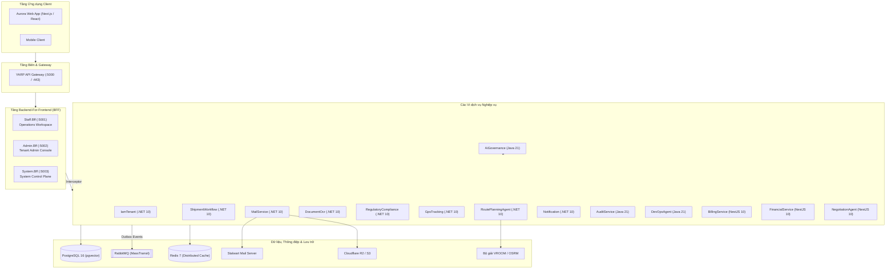
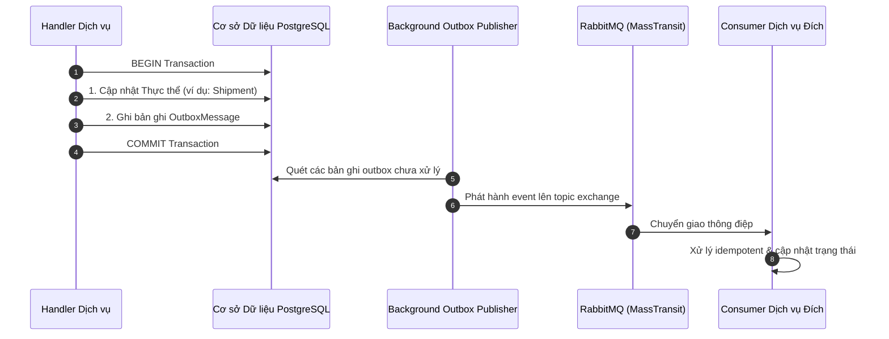

# Nền tảng Logistics Aurora

> Nền tảng thực thi chuỗi cung ứng và logistics đa người thuê (multi-tenant) cấp doanh nghiệp, vận hành bởi các vi dịch vụ hướng sự kiện đa ngôn ngữ, thuật toán tối ưu hóa toán học và các trợ lý AI có kiểm soát.

[English](README.md) | **Tiếng Việt**

---

## 1. Tổng quan

**Aurora** là nền tảng SaaS (Software-as-a-Service) cấp doanh nghiệp được thiết kế để điều phối toàn diện vòng đời thực thi vận tải. Hệ thống hợp nhất tiếp nhận liên lạc đa kênh từ khách hàng, tự động trích xuất chứng từ vận tải, tuân thủ pháp lý hải quan, tối ưu hóa tuyến đường đa điểm có ràng buộc tải trọng, giám sát GPS viễn thông thời gian thực và tự động quyết toán cước phí.

Được xây dựng trên nền tảng công nghệ đa ngôn ngữ gồm **.NET 10**, **Java 21 (Spring Boot 3)** và **NestJS 10 (Node.js 20)**, Aurora đảm bảo cô lập dữ liệu người thuê tuyệt đối, áp dụng mô hình kiểm soát truy cập dựa trên năng lực trực tiếp (Capability-Based Access Control - CBAC), cơ chế nhất quán dữ liệu Transactional Outbox và các cổng Backend-For-Frontend (BFF) chuyên biệt cho từng không gian làm việc.

```text
Yêu cầu khách hàng / Bảng kê / Đơn hàng
                   │
                   ▼
     [Cổng Multi-Tenant Aurora]
                   │
    ┌──────────────┼────────────────────────────────────────┐
    ▼              ▼                                        ▼
[Vận đơn &       [OCR Chứng từ &     [Tối ưu Tuyến đường &    [Hóa đơn & Ví
 Vòng đời]        RAG Tuân thủ]       Giám sát GPS Hạm đội]   Ký quỹ Escrow]
    │              │                                        │
    └──────────────┴────────────────────────────────────────┘
                   │
                   ▼
Giám sát Thời gian thực, Thông báo Đẩy & Vận hành Có kiểm soát
```

---

## 2. Trải nghiệm Persona & Không gian Làm việc

Aurora mang đến trải nghiệm ứng dụng đồng nhất, được phân chia thành các persona shell chuyên biệt:

- **Trang thông tin Công khai (Landing Page)**: Cổng tra cứu hành trình, tự phục vụ và đăng nhập xác thực.
- **Bảng điều khiển Quản trị (`TENANT_ADMIN`) — Aurora Admin Console**: Trung tâm điều hành quản lý Nhân sự & Phân quyền (Người dùng, Vai trò, Quyền hạn trực tiếp), Cấu hình Vận hành (Ngưỡng rủi ro tuyến đường, Chính sách tự động hóa AI, SOP), Quản trị Mail và Nhật ký bảo mật.
- **Không gian Vận hành (`STAFF` & `MANAGER`) — Aurora Operations Workspace**: Không gian làm việc hợp nhất xử lý Vận đơn, Lập kế hoạch Tuyến đường, OCR Chứng từ, Tuân thủ Hải quan, Hộp thư Hợp tác, Giám sát GPS và Quyết toán Hóa đơn.
- **Quản trị Máy chủ Mail (`SYSTEM_ADMIN`) — Stalwart Admin UI**: Quản trị trực tiếp hạ tầng máy chủ thư điện tử (cổng lắng nghe, chứng chỉ TLS, định tuyến, lưu trữ).

---

## 3. Kiến trúc Phân quyền Cốt lõi: Role != Authority

Aurora áp dụng **Mô hình Phân quyền 4 Lớp**, trong đó vai trò quyết định bố cục giao diện và quyền năng lực trực tiếp quyết định thẩm quyền thực tế:

```text
┌─────────────────────────────────────────────────────────────────────────────┐
│ 1. Cổng Vai trò Cơ sở (SYSTEM_ADMIN | TENANT_ADMIN | MANAGER | STAFF)        │
│    -> Xác định bố cục bảng điều khiển và persona shell khởi đầu.            │
├─────────────────────────────────────────────────────────────────────────────┤
│ 2. Cổng Quyền Năng lực Trực tiếp ([RequirePermission("permission:code")])    │
│    -> Thực thi thẩm quyền nghiệp vụ chi tiết. Không sử dụng StaffType cũ.   │
├─────────────────────────────────────────────────────────────────────────────┤
│ 3. Cổng Phạm vi Tài nguyên (TenantId, MailboxId, PrimaryAssigneeUserId)      │
│    -> Đảm bảo cô lập người thuê nghiêm ngặt và quyền sở hữu bản ghi.         │
├─────────────────────────────────────────────────────────────────────────────┤
│ 4. Cổng An toàn & Quy tắc Nghiệp vụ (Kiểm tra Rủi ro & Khóa Đồng thời)      │
│    -> Phê duyệt rủi ro cao, kiểm tra Version đồng thời, bảo mật thư gửi đi. │
└─────────────────────────────────────────────────────────────────────────────┘
```

> **Ví dụ điển hình:** Một nhân sự có vai trò `STAFF` nếu được cấp quyền `route_planning:approve` **hoàn toàn có thể** phê duyệt tuyến đường rủi ro cao. Ngược lại, một `MANAGER` nếu không có quyền này **không thể** phê duyệt tuyến đường chỉ dựa vào tên vai trò của mình.

---

## 4. Quy trình Vận hành Nghiệp vụ Đầu-Cuối

```text
1. Yêu cầu Khách hàng ──► Nhận tại Hộp thư Dùng chung (ví dụ: ops@acmelogistics.com)
2. Phân luồng Thread  ──► Nhân sự nhận xử lý từ hàng đợi UNASSIGNED -> chuyển sang MY_WORK
3. Khởi tạo Vận đơn   ──► Tạo bản nháp vận đơn kèm danh mục hàng hóa và các điểm dừng
4. OCR Chứng từ       ──► Trích xuất tự động B/L hoặc Invoice qua pipeline OCR bất đồng bộ
5. Tuân thủ Hải quan  ──► Công cụ RAG đánh giá hàng hóa theo quy định hải quan và hiệp định
6. Tối ưu Lộ trình    ──► VROOM & OSRM giải bài toán định tuyến xe; đánh giá rủi ro [0..100]
7. Kiểm soát An toàn  ──► Tuyến rủi ro cao (>50) tạm dừng chờ phê duyệt (`route_planning:approve`)
8. Giám sát GPS       ──► Tiếp nhận dữ liệu GPS thời gian thực, cảnh báo lệch lộ trình/geofence
9. Giao hàng / POD    ──► Tải lên chứng từ giao hàng (POD); chuyển trạng thái DELIVERED
10. Quyết toán & Đẩy  ──► Tạo hóa đơn cước; gửi thông báo đẩy FCM tức thì tới các bên liên quan
```

---

## 5. Kiến trúc Hệ thống



---

## 6. Trí tuệ Nhân tạo Có kiểm soát & Bộ giải Tất định

Aurora phân định rành mạch giữa các thuật toán tối ưu tất định và năng lực AI có kiểm soát:

| Phân tầng Kiến trúc | Động cơ / Mô hình | Trách nhiệm Cốt lõi |
|---|---|---|
| **Hệ thống Tất định** | VROOM / OSRM, EF Core FSM, PostGIS | Tối ưu hóa lộ trình xe tải, chuyển trạng thái vận đơn, tính thuế cước, kiểm tra vi phạm geofence, checksum container. |
| **OCR Chứng từ Có kiểm soát**| Multimodal Vision / OCR | Trích xuất dữ liệu có cấu trúc từ chứng từ vận tải với hàng đợi kiểm tra thủ công cho các kết quả có độ tin cậy < 0.85. |
| **RAG Pháp lý Hải quan** | PostgreSQL `pgvector` (HNSW) | Tìm kiếm ngữ nghĩa luật thương mại và SOP nội bộ; đưa ra kết luận kèm trích dẫn chính xác điều khoản pháp lý. |
| **Đàm phán & Trợ lý** | LLM Negotiation Agents | Soạn thảo phản hồi thương lượng trong giới hạn nhượng bộ toán học; hỗ trợ trao đổi khách hàng tuyến đầu. |
| **Pipeline An toàn Mail** | ClamAV, SpamAssassin, AI Risk | Quét mã độc, lọc spam, phát hiện phishing/BEC thư đến và kiểm soát DLP thư đi. |
| **DevOps SRE Agent** | SRE Diagnostic LLM | Phân tích nguyên nhân gốc (RCA) từ số liệu Prometheus và log Kubernetes, yêu cầu phê duyệt trước khi chạy runbook. |

---

## 7. Kiến trúc Hướng Sự kiện & Transactional Outbox

Mọi thay đổi trạng thái nghiệp vụ và sự kiện miền đều được ghi nhận trong cùng một database transaction trước khi phát hành, đảm bảo cơ chế phân phối an toàn, chống trùng lặp dữ liệu:



---

## 8. Kiến trúc Hệ thống Mail Doanh nghiệp

Aurora thay thế mô hình hộp thư cá nhân (`john@company.com`) bằng **Mô hình Hộp thư Dùng chung & Phân luồng Thread**:

- **Mailbox là Danh tính Doanh nghiệp**: Giao tiếp đối ngoại sử dụng địa chỉ phòng ban (ví dụ: `operations@acmelogistics.com`, `customs@acmelogistics.com`).
- **Hộp thư Vận hành Mặc định *(Mục tiêu Kiến trúc)***: Mỗi tenant thiết lập đúng một hộp thư mặc định để tiếp nhận luồng thư ban đầu của khách hàng.
- **Bí danh Chuyển tiếp 1:1 *(Mục tiêu Kiến trúc)***: Các bí danh (`sales@`, `contact@`) trỏ trực tiếp về một hộp thư chuẩn duy nhất để tránh trùng lặp phân bổ.
- **EmailThread là Đơn vị Công việc**: Email đến được gom thành thread, phân luồng qua các hàng đợi `UNASSIGNED`, `MY_WORK` và `ALL` (có kiểm soát quyền), bảo vệ bởi khóa phiên bản (`thread.Version`).
- **Quy trách nhiệm Minh bạch**: Email gửi đi hiển thị địa chỉ hộp thư chung, đồng thời lưu trữ bất biến mã định danh nhân viên gửi (`SentByUserId`).

---

## 9. Danh mục Vi dịch vụ Đa ngôn ngữ

| Vi dịch vụ | Runtime | Trách nhiệm | Nguồn Dữ liệu Chính | Trạng thái |
|---|---|---|---|:---:|
| **`API.Gateway`** | .NET 10 | Reverse proxy YARP, SSL termination, rate limiting | Memory | `READY` |
| **`Staff.Bff`** | .NET 10 | Cổng Operations Workspace (Staff & Manager) | Redis | `READY` |
| **`Admin.Bff`** | .NET 10 | Cổng Tenant Admin Console | Redis | `READY` |
| **`System.Bff`** | .NET 10 | Cổng System Control Plane | Redis | `READY` |
| **`IamTenant`** | .NET 10 | Quản lý IAM, vai trò, quyền hạn trực tiếp, đồng bộ Cognito | PostgreSQL | `READY` |
| **`ShipmentWorkflow`** | .NET 10 | FSM vòng đời vận đơn, theo dõi hàng hóa, mốc hành trình | PostgreSQL | `READY` |
| **`RoutePlanningAgent`**| .NET 10 | Tích hợp solver VRP, tính điểm rủi ro, điều phối lộ trình | PostgreSQL | `READY` |
| **`DocumentOcr`** | .NET 10 | Tiếp nhận OCR chứng từ, trích xuất cấu trúc, duyệt HitL | PostgreSQL | `READY` |
| **`RegulatoryCompliance`**| .NET 10 | Tìm kiếm vector luật (pgvector), đánh giá tờ khai hải quan | PostgreSQL (`pgvector`) | `READY` |
| **`GpsTracking`** | .NET 10 | Thu thập viễn thông GPS tần suất cao, cảnh báo geofence | PostgreSQL / Redis | `READY` |
| **`MailService`** | .NET 10 | Phân luồng thread, pipeline an toàn email, chuyển tiếp Stalwart | PostgreSQL / R2 Storage | `MVP READY` |
| **`Notification`** | .NET 10 | Đẩy web push FCM, đăng ký theo dõi đơn, lịch sử thông báo | PostgreSQL | `READY` |
| **`AiGovernance`** | Java 21 | Quản lý hạn ngạch token AI, chính sách provider, kiểm toán AI | PostgreSQL | `READY` |
| **`AuditService`** | Java 21 | Ghi nhật ký truy vết bảo mật và tuân thủ tập trung | PostgreSQL | `READY` |
| **`DevOpsAgent`** | Java 21 | Tự động phân tích nguyên nhân gốc SRE, chẩn đoán log/metric | PostgreSQL | `READY` |
| **`BillingService`** | NestJS 10 | Lập hóa đơn, thanh toán quyết toán, quản lý ví ký quỹ escrow | PostgreSQL | `READY` |
| **`FinancialService`** | NestJS 10 | Ước tính chi phí cước đa phương thức, tính thuế theo mã HS | PostgreSQL | `READY` |
| **`NegotiationAgent`** | NestJS 10 | Động cơ đàm phán cước, đường cong nhượng bộ, soạn thảo AI | PostgreSQL | `READY` |

---

## 10. Ngăn xếp Công nghệ

| Phân loại | Công nghệ |
|---|---|
| **Cổng & BFF** | ASP.NET Core (.NET 10), YARP Reverse Proxy, Polly Resilience Pipelines, MediatR |
| **Nền tảng Vi dịch vụ** | .NET 10 (C#), Java 21 (Spring Boot 3), NestJS 10 (Node.js 20 / TypeScript) |
| **Giao tiếp Dịch vụ** | gRPC qua HTTP/2, Protobuf v3 (`protos/*.proto`) |
| **Thông điệp Bất đồng bộ** | RabbitMQ 3.13, MassTransit 8, Transactional Outbox Pattern |
| **Cơ sở Dữ liệu & Tìm kiếm**| PostgreSQL 16 (chỉ mục HNSW `pgvector`), EF Core 10, Spring Data JPA, TypeORM |
| **Bộ nhớ đệm & Xác thực** | Redis 7, AWS Cognito OIDC / JWT, Secure HttpOnly Session Cookies |
| **Mail & Lưu trữ File** | Máy chủ Stalwart Mail Server, Cloudflare R2 / AWS S3 (Lưu trữ MIME EML) |
| **Bộ giải Tối ưu Toán học** | Động cơ tối ưu VROOM, Open Source Routing Machine (OSRM) |
| **Thông báo Đẩy** | Firebase Cloud Messaging (FCM Web Push SDK) |

---

## 11. Cấu trúc Thư mục

```text
aurora-server/
├── deploy/                 # File cấu hình Kubernetes, Helm chart, Dockerfile
├── docker-compose.dev.yml  # Stack hạ tầng phát triển môi trường local
├── docs/                   # Toàn bộ tài liệu kiến trúc và đặc tả API chính thức
│   ├── bff-api/            # Đặc tả REST API BFF theo từng persona
│   ├── figma/              # Đặc tả thiết kế UI / thành phần Figma
│   ├── superpowers/plans/  # Kế hoạch triển khai tính năng và theo dõi tiến độ
│   └── technical/          # Tài liệu kỹ thuật chi tiết và hợp đồng frontend
├── infra/                  # Kịch bản Terraform và khởi tạo hạ tầng đám mây
├── protos/                 # Hợp đồng gRPC Protobuf chuẩn của toàn hệ thống
└── src/
    ├── dotnet/             # Dịch vụ .NET 10, Cổng BFF và Thư viện dùng chung
    ├── java/               # Dịch vụ Java 21 Spring Boot (AI Governance, SRE)
    └── nestjs/             # Dịch vụ NestJS 10 (Billing, Financial, Negotiation)
```

---

## 12. Bắt đầu & Phát triển Môi trường Local

### Yêu cầu Môi trường
- [.NET 10 SDK](https://dotnet.microsoft.com/download/dotnet/10.0)
- [Java 21 JDK](https://adoptium.net/) & [Maven 3.9+](https://maven.apache.org/)
- [Node.js 20 LTS](https://nodejs.org/) & [pnpm](https://pnpm.io/)
- [Docker & Docker Compose](https://www.docker.com/)

### 1. Khởi động Hạ tầng Local
```bash
docker compose -f docker-compose.dev.yml up -d
```
*Khởi chạy PostgreSQL (`:5432`), Redis (`:6379`), RabbitMQ (`:5672`, UI `:15672`) và các dịch vụ lưu trữ phụ trợ.*

### 2. Build Dịch vụ & Chạy Kiểm thử
```bash
# Build dịch vụ .NET & Cổng BFF
dotnet build src/dotnet/BFF/Staff.Bff/Staff.Bff.csproj

# Chạy kiểm thử Unit & Contract test .NET
dotnet test tests/dotnet/Notification.Tests/Notification.Tests.csproj

# Build các dịch vụ Java
mvn -f src/java/pom.xml clean compile

# Build các dịch vụ NestJS
pnpm --prefix src/nestjs/billing-service build
```

---

## 13. Mục lục Tài liệu Kỹ thuật

- **Kiến trúc & Thiết kế Hệ thống**: [docs/technical/ARCHITECTURE.md](file:///d:/IT/CD/aurora-server/docs/technical/ARCHITECTURE.md)
- **Tổng quan Kỹ thuật**: [docs/technical/OVERVIEW.md](file:///d:/IT/CD/aurora-server/docs/technical/OVERVIEW.md)
- **Danh mục API Frontend**: [docs/technical/frontend/API_CATALOG.md](file:///d:/IT/CD/aurora-server/docs/technical/frontend/API_CATALOG.md)
- **Quy tắc Nguồn Chân lý Frontend**: [docs/technical/frontend/README.md](file:///d:/IT/CD/aurora-server/docs/technical/frontend/README.md)
- **Kiến trúc & Đặc tả BFF API**: [docs/bff-api/README.md](file:///d:/IT/CD/aurora-server/docs/bff-api/README.md)
- **Ma trận Trạng thái Triển khai**: [docs/technical/frontend/IMPLEMENTATION_STATUS.md](file:///d:/IT/CD/aurora-server/docs/technical/frontend/IMPLEMENTATION_STATUS.md)
- **Báo cáo Đồng bộ Tài liệu**: [docs/technical/DOCUMENTATION_SYNC_REPORT.md](file:///d:/IT/CD/aurora-server/docs/technical/DOCUMENTATION_SYNC_REPORT.md)
