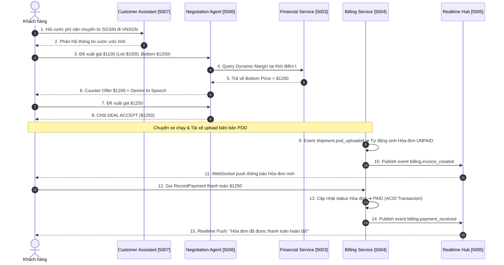

# KẾ HOẠCH KIỂM THỬ TỔNG THỂ (MASTER INTEGRATION & E2E TEST PLAN)

> **Dự án:** Aurora SaaS Logistics Platform  
> **Tác giả:** Đào Huỳnh & Senior QA / Test Engineer  
> **Phạm vi:** Kiểm thử 5 Microservices (Financial, Billing, Realtime Hub, Negotiation Agent AI, Customer Assistant AI)

---

## I. MỤC TIÊU KIỂM THỬ

1. **Xác minh Chức năng Nghiệp vụ (Business Functionality):** Đảm bảo 100% các API gRPC và REST phản hồi chính xác theo công thức toán học và logic đã định nghĩa.
2. **Xác minh An toàn Giao dịch (ACID & Idempotency):** Đảm bảo không trùng lặp hóa đơn, không tạo 2 thanh toán cho 1 request retry, và dữ liệu luôn đúng nhất trong ACID transactions.
3. **Xác minh An toàn AI (AI Safety Guardrails):** Đảm bảo Gemini AI tuyệt đối không tự ý sửa đổi giá tiền đàm phán hay vi phạm quy định handoff cho con người.
4. **Xác minh Độ tin cậy & Chịu lỗi (Resilience & Fault Tolerance):** Đảm bảo Circuit Breaker, ACK Timeout, Offline Message Buffering, và Health Check Probes hoạt động mượt mà khi môi trường có sự cố.

---

## II. DANH SÁCH TEST CASES CHI TIẾT THEO MICROSERVICE

---

### 1. FINANCIAL SERVICE (`port 5003`)

| Test ID | Tên Test Case | Đầu vào (Input Payload) | Kết quả kỳ vọng (Expected Result) | Loại Test |
|:---:|---|---|---|:---:|
| **FIN-01** | Dynamic Margin Decay (Thời gian ban đầu) | `costPrice: 1000`, `baseMarginPercent: 20`, `remainingSeconds: 3600`, `totalSeconds: 3600`, `gamma: 2` | `decayFactor: 1.0`, `currentMarginPercent: 20%`, `minAcceptablePrice: $1200` | Unit/gRPC |
| **FIN-02** | Dynamic Margin Decay (Gần deadline cut-off) | `costPrice: 1000`, `baseMarginPercent: 20`, `remainingSeconds: 0`, `totalSeconds: 3600`, `gamma: 2` | `decayFactor: 0.0`, `currentMarginPercent: 0%`, `minAcceptablePrice: $1000` (giá tiệm cận cost) | Unit/gRPC |
| **FIN-03** | Exchange Rate Lookup | `fromCurrency: "USD"`, `toCurrency: "VND"` | Trả về `rate: 25450`, `validDate`, `source: "MOCK"` hoặc `"VIETCOMBANK"` | gRPC |
| **FIN-04** | Sub-2ms Redis Rate Cache | Gọi `EstimateCost` 2 lần liên tiếp cùng tham số `SGSIN ➔ VNSGN` | Lần 1: DB Query (`DYNAMIC_RATE`). Lần 2: Cache Hit (`REDIS_CACHE_<route>`), thời gian phản hồi `< 2ms` | Benchmark |
| **FIN-05** | Fuel Surcharge & Cargo Insurance | `baseFreight: 1000`, `fscRatePercent: 10`, `ebsRatePercent: 2`, `cargoValue: 5000`, `insuranceRatePercent: 0.3` | `fuelSurchargeFee: $120`, `cargoInsuranceFee: $15`, `totalEstimatedCost` tính đúng tổng | Integration |

---

### 2. BILLING SERVICE (`port 5004`)

| Test ID | Tên Test Case | Đầu vào (Input Payload) | Kết quả kỳ vọng (Expected Result) | Loại Test |
|:---:|---|---|---|:---:|
| **BIL-01** | POD-Triggered Invoicing (Không có POD) | `shipmentId: "shp-1"`, `podDocumentS3Key: null` | Bị từ chối tạo hóa đơn, log cảnh báo thiếu POD document | Logic |
| **BIL-02** | POD-Triggered Invoicing (Có POD) | `shipmentId: "shp-2"`, `podDocumentS3Key: "tenants/.../pod.png"` | Tạo thành công hóa đơn `status: UNPAID`, lưu `pod_s3_key` vào DB | Integration |
| **BIL-03** | Debit Note (Thu thêm phí DEM) | `invoiceId: "inv-1"`, `reasonCode: "DEMURRAGE"`, `amount: 500` | Tạo `adjustment_note` type DEBIT, `totalAmount` hóa đơn tăng $500 | ACID Transaction |
| **BIL-04** | Credit Note (Hoàn tiền chiết khấu) | `invoiceId: "inv-1"`, `reasonCode: "OVERCHARGE"`, `amount: 200` | Tạo `adjustment_note` type CREDIT, `totalAmount` hóa đơn giảm $200 | ACID Transaction |
| **BIL-05** | Idempotency Interceptor (Header Retry) | Gửi `RecordPayment` 2 lần trùng `x-idempotency-key: "uuid-123"` | Lần 1: Tạo payment record. Lần 2: Trả về Cached Response từ Redis, không duplicate payment | Redis Integration |
| **BIL-06** | Cockatiel Circuit Breaker | Tắt ngắt kết nối `FinancialService` | Breaker mở circuit sau 3 lỗi, trả về fallback rate với flag `is_estimated_fallback: true` | Fault Tolerance |
| **BIL-07** | e-Invoice Gateway Signing | Sau khi tạo hóa đơn thành công | Gọi `VNPTEInvoiceAdapter`, nhận `taxAuthorityCode: "TAX-VNPT-..."` | Integration |

---

### 3. REALTIME HUB SERVICE (`port 5005`)

| Test ID | Tên Test Case | Đầu vào (Input Payload) | Kết quả kỳ vọng (Expected Result) | Loại Test |
|:---:|---|---|---|:---:|
| **HUB-01** | Ping/Pong Heartbeat | Client gửi Socket event `ping` | Server phản hồi `{ event: "pong", timestamp: <unix_ms> }` | WebSocket |
| **HUB-02** | Multi-Tenant Room Join | Client Handshake JWT token `tenantId: T1`, `userId: U1` | Server tự động cho Client join 2 room `tenant:T1` và `user:T1:U1` | Integration |
| **HUB-03** | Client ACK Timeout & Offline Buffer | Server gửi tin tới User U1 kèm `msgId`. U1 không ACK trong 5 giây | Server ghi nhận timeout, lưu tin nhắn vào Redis Stream `stream:offline_msg:T1:U1` | Reliability |
| **HUB-04** | Offline Reconnect Message Flush | Client U1 mở kết nối lại sau khi bị ngắt mạng | Server tự động xả (flush) toàn bộ tin nhắn tồn đọng từ Redis Stream về Client | Reliability |

---

### 4. NEGOTIATION AGENT AI SERVICE (`port 5006`)

| Test ID | Tên Test Case | Đầu vào (Input Payload) | Kết quả kỳ vọng (Expected Result) | Loại Test |
|:---:|---|---|---|:---:|
| **NEG-01** | Price Accept (Giá hợp lệ) | `listPrice: 1500`, `bottomPrice: 1200`, `offerPrice: 1300` | `decision: "ACCEPT"`, Gemini sinh câu thoại xác nhận chốt đơn | AI Safety |
| **NEG-02** | Counter Offer Step | `listPrice: 1500`, `bottomPrice: 1200`, `offerPrice: 1000` | `decision: "COUNTER_OFFER"`, `counterOfferPrice: $1200`, Gemini sinh câu counter | AI Safety |
| **NEG-03** | Auto Human Handoff (Vượt Max Rounds) | `currentRound: 5`, `maxRounds: 5`, `offerPrice: 900` | `decision: "HUMAN_HANDOFF"`, phát event `negotiation.human_handoff_requested` | Workflow |
| **NEG-04** | Auto Human Handoff (VIP Customer) | `customerTier: "VIP"`, `offerPrice: 1400` | `decision: "HUMAN_HANDOFF"`, chuyển thẳng cho chuyên viên chăm sóc | Workflow |

---

### 5. CUSTOMER ASSISTANT AI SERVICE (`port 5007`)

| Test ID | Tên Test Case | Đầu vào (Input Payload) | Kết quả kỳ vọng (Expected Result) | Loại Test |
|:---:|---|---|---|:---:|
| **AST-01** | Track Shipment Query | `message: "Đơn hàng shp_33019284 của tôi đang ở đâu?"` | `intent: "TRACK_SHIPMENT"`, đọc vị trí từ `ReadModelStore`, không query DB giao dịch | CQRS Read |
| **AST-02** | Check Balance Query | `message: "Công nợ tháng này của tôi là bao nhiêu?"` | `intent: "CHECK_BALANCE"`, tính tổng dư nợ và liệt kê hóa đơn chưa trả | CQRS Read |
| **AST-03** | General Help Query | `message: "Quy trình khai báo hải quan như thế nào?"` | `intent: "GENERAL_HELP"`, trả lời hướng dẫn thủ tục chung | NLP |

---

## III. KỊCH BẢN KIỂM THỬ TÍCH HỢP TOÀN DIỆN (END-TO-END SAGA FLOW)

### Kịch bản E2E-01: Luồng hoàn chỉnh từ Đặt hàng ➔ Đàm phán AI ➔ Giao hàng POD ➔ Hóa đơn ➔ Thanh toán ➔ Realtime Update



---

## IV. LỆNH CHẠY AUTOMATED TESTS

Để đội ngũ kỹ thuật chạy kiểm thử tự động trên máy local hoặc CI/CD pipeline:

```powershell
# 1. Chạy Unit Tests cho Financial Service
cd src/nestjs/financial-service
npm run test

# 2. Chạy Unit Tests cho Billing Service
cd ../billing-service
npm run test

# 3. Chạy E2E Tests
npm run test:e2e
```
