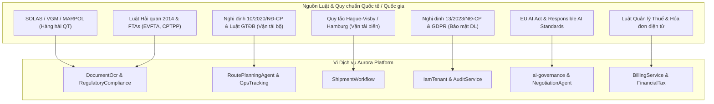

# HỆ THỐNG VĂN BẢN PHÁP LÝ & QUY ĐỊNH CHUYÊN NGÀNH THEO TỪNG SERVICE (AURORA LOGISTICS)

> **Mã tài liệu:** `DOC-AURORA-LEGAL-03`  
> **Phiên bản:** 1.0.0  
> **Mục tiêu:** Cung cấp cơ sở pháp lý, quy chuẩn kỹ thuật quốc gia và quốc tế được nhúng trực tiếp vào các quy tắc kiểm tra (Rules Engine), Vector Database RAG và logic thực thi của từng Microservice trong hệ thống Aurora.

---

## 1. Bản đồ Ánh xạ Quy định Pháp lý theo từng Microservice

---

## 2. Chi tiết Quy định & Logic áp dụng theo từng Service

### 2.1. Service `RegulatoryCompliance` & `DocumentOcr` (.NET 10)
#### A. Cơ sở pháp lý & Công ước áp dụng:
1. **Bộ luật Hàng hải Việt Nam 2015 (Luật số 95/2015/QH13):**
   - Điều 148 - 163: Quy định về Vận đơn đường biển, chức năng chuyển nhượng, nghĩa vụ của người vận chuyển và người gửi hàng.
   - Trách nhiệm bồi thường tổn thất hàng hóa và giới hạn miễn trách nhiệm của hãng tàu.
2. **Công ước SOLAS 1974 (Sửa đổi Bổ sung Quy định VI/2 về VGM):**
   - Bắt buộc khai báo khối lượng toàn bộ của container (VGM) trước khi xếp hàng lên tàu.
   - **Quy tắc kiểm soát:** Cấm bốc container lên tàu nếu thiếu VGM hoặc trọng lượng sai lệch > 5% so với phiếu cân tiêu chuẩn.
3. **Quy tắc Hague-Visby (Hague-Visby Rules) & Hamburg Rules:**
   - Quy định về thời hạn khiếu nại tổn thất (1 năm đối với Hague-Visby, 2 năm đối với Hamburg Rules).
   - Mức giới hạn trách nhiệm tài chính: 666.67 SDR/kiện hoặc 2 SDR/kg trọng lượng cả bì.
4. **Luật Hải quan Việt Nam 2014 (Luật số 54/2014/QH13) & Thông tư 38/2015/TT-BTC (sửa đổi bởi TT 39/2018/TT-BTC):**
   - Quy định thủ tục hải quan điện tử trên hệ thống VNACCS/VCIS.
   - Nguyên tắc phân luồng hải quan (Xanh - Vàng - Đỏ) dựa trên mức độ tuân thủ doanh nghiệp và chỉ số rủi ro mặt hàng.
5. **Các Hiệp định Thương mại Tự do (EVFTA, CPTPP, RCEP, VKFTA, ACFTA):**
   - Quy tắc xuất xứ hàng hóa (Rules of Origin - PSR, RVC, CTC) để xác định tính hợp lệ của Giấy chứng nhận xuất xứ (C/O Form EUR.1, Form CPTPP, Form E...).

#### B. Logic thực thi trong Code / RAG AI:
- RAG Pipeline nạp toàn bộ văn bản pháp luật, biểu thuế XNK và danh mục hàng cấm/hạn chế xuất nhập khẩu vào Vector DB.
- Khi OCR trích xuất tên hàng và mã HS, service tự động đối soát:
  - Tính chính xác của mã HS Code theo Danh mục hàng hóa XNK Việt Nam.
  - Kiểm tra xem mặt hàng có thuộc diện kiểm tra chuyên ngành (Vệ sinh an toàn thực phẩm, kiểm dịch thực vật, kiểm tra chất lượng) hay không.

---

### 2.2. Service `RoutePlanningAgent` & `GpsTracking` (.NET 10)
#### A. Cơ sở pháp lý:
1. **Luật Giao thông Đường bộ Việt Nam 2008 & Nghị định 10/2020/NĐ-CP:**
   - **Quy định về thời gian lái xe:** Người lái xe ô tô không được lái xe liên tục quá 4 giờ và không được làm việc quá 10 giờ trong một ngày.
   - **Quy định về thiết bị giám sát hành trình (GPS):** Phải truyền dữ liệu tọa độ, tốc độ, thời gian lái xe liên tục về máy chủ Tổng cục Đường bộ Việt Nam theo chu kỳ 10 giây/lần.
   - **Quy định tải trọng & Kích thước giới hạn:** Thông tư 46/2015/TT-BGTVT về tải trọng trục xe, tổng trọng lượng cho phép của đoàn xe container trên các cấp đường bộ.
2. **Quy chuẩn Kỹ thuật Quốc gia QCVN 31:2014/BGTVT:**
   - Tiêu chuẩn phần cứng và giao thức truyền dữ liệu hộp đen GPS.

#### B. Logic thực thi trong Thuật toán & Hệ thống:
- **VROOM Optimization Constraints:** Tích hợp ràng buộc cửa sổ thời gian (Time Windows), thời gian nghỉ bắt buộc của tài xế (Break interval: 15 phút sau mỗi 4 tiếng lái) và tải trọng tối đa của xe (Gross Vehicle Weight Limit).
- **GpsTracking Alerts:**
  - Cảnh báo vi phạm tốc độ (Over-speeding).
  - Cảnh báo vượt quá 4 giờ lái xe liên tục (Fatigue Alert).
  - Cảnh báo lệch tuyến (Route Deviation Alert) khi tọa độ xe nằm ngoài bán kính 500m so với lộ trình đã duyệt.
  - Cảnh báo vi phạm Geofence khi xe dừng đỗ ngoài các điểm Depot/Cảng đã đăng ký.

---

### 2.3. Service `ShipmentWorkflow` (.NET 10)
#### A. Cơ sở pháp lý:
1. **Incoterms 2020 (ICC - International Chamber of Commerce):**
   - 11 điều kiện thương mại quốc tế (EXW, FCA, CPT, CIP, DAP, DPU, DDP, FAS, FOB, CFR, CIF).
   - Xác định thời điểm chuyển giao rủi ro và chi phí giữa bên bán và bên mua.
2. **Công ước CMR (Convention on the Contract for the International Carriage of Goods by Road):**
   - Quy định vận chuyển hàng hóa quốc tế bằng đường bộ và trách nhiệm của đơn vị chuyên chở.

#### B. Logic thực thi:
- Quản lý máy trạng thái hữu hạn (State Machine) của vận đơn: `DRAFT` -> `OCR_VERIFIED` -> `COMPLIANCE_APPROVED` -> `DISPATCHED` -> `IN_TRANSIT` -> `OUT_FOR_DELIVERY` -> `DELIVERED` (POD Signed) -> `SETTLED`.
- Tự động kiểm tra điều kiện chuyển bước (State Transition Guard): Không cho phép dispatch xe nếu chưa hoàn tất phê duyệt an toàn hoặc thông quan đối với hàng xuất khẩu.

---

### 2.4. Service `IamTenant` (.NET 10) & `AuditService` (Java 21)
#### A. Cơ sở pháp lý:
1. **Nghị định 13/2023/NĐ-CP về Bảo vệ Dữ liệu Cá nhân (PDPD Vietnam):**
   - Yêu cầu bảo vệ thông tin nhận dạng cá nhân (PII) của tài xế, nhân viên, khách hàng (Họ tên, SĐT, CCCD, địa chỉ, định vị GPS).
   - Quyền rút lại sự đồng ý, quyền yêu cầu xóa dữ liệu và nghĩa vụ đánh giá tác động xử lý dữ liệu cá nhân (DPIA).
2. **Quy định Bảo vệ Dữ liệu Chung Châu Âu (GDPR - General Data Protection Regulation):**
   - Áp dụng đối với các lô hàng và đối tác thuộc Liên minh Châu Âu.
3. **Tiêu chuẩn An toàn Thông tin ISO/IEC 27001 & SOC 2 Type II:**
   - Lưu trữ bất biến (Immutable) nhật ký truy vết bảo mật, kiểm soát phân quyền đặc quyền.

#### B. Logic thực thi:
- Mô hình phân quyền 4 lớp CBAC (`Role != Authority`).
- Mã hóa dữ liệu định danh người thuê và nhật ký kiểm toán không thể xóa/sửa (Append-only write model trong `AuditService`).

---

### 2.5. Service `ai-governance` (Java 21), `NegotiationAgent` & `CustomerAssistant` (NestJS)
#### A. Cơ sở pháp lý & Tiêu chuẩn Quốc tế:
1. **Đạo luật Trí tuệ Nhân tạo Liên minh Châu Âu (EU AI Act - Regulation 2024/1689):**
   - Phân loại các hệ thống AI phục vụ điều phối chuỗi cung ứng và định giá tự động vào nhóm có rủi ro cần giám sát minh bạch (Transparency & Human Oversight).
   - Yêu cầu lưu vết toàn bộ suy luận (Chain of Thought), phiên bản mô hình và cấm đưa ra các quyết định đơn phương gây thiệt hại tài chính vượt hạn mức mà không có sự kiểm soát của con người.
2. **Nguyên tắc Đạo đức AI của OECD & UNESCO:**
   - Minh bạch, giải trình được (Explainability), không thiên vị và bảo vệ quyền riêng tư.

#### B. Logic thực thi:
- `ai-governance` chặn đứng mọi prompt injection, lọc bỏ PII trước khi gửi đến LLM bên thứ 3.
- Bắt buộc cơ chế **HITL (Human-in-the-Loop)** khi `NegotiationAgent` đàm phán mức giá thấp hơn sàn biên lợi nhuận cho phép (> 10% chiết khấu) hoặc khi phát hiện rủi ro pháp lý trong hợp đồng.

---

### 2.6. Service `BillingService` & `FinancialTax` (NestJS)
#### A. Cơ sở pháp lý:
1. **Nghị định 123/2020/NĐ-CP & Thông tư 78/2021/TT-BTC về Hóa đơn Điện tử:**
   - Quy định định dạng chuẩn XML của hóa đơn điện tử có mã của cơ quan thuế.
   - Thời điểm lập hóa đơn cung cấp dịch vụ logistics và vận tải.
2. **Luật Thuế Giá trị Gia tăng (VAT):**
   - Áp dụng thuế suất 0% đối với dịch vụ vận tải quốc tế và dịch vụ cung cấp trong khu phi thuế quan (nếu đáp ứng đủ chứng từ).
   - Áp dụng thuế suất 8% hoặc 10% đối với dịch vụ logistics và vận chuyển nội địa.

#### B. Logic thực thi:
- Tự động phân tách biểu thuế (Thuế cước quốc tế 0%, Phụ phí nâng hạ/kho bãi nội địa 8%/10%).
- Tạo mã hash và chữ ký số xác thực tính toàn vẹn của hóa đơn trước khi phát hành đến khách hàng.

---
*Tài liệu pháp lý tham chiếu chuẩn cho việc phát triển phần mềm và thẩm định nghiệp vụ.*
