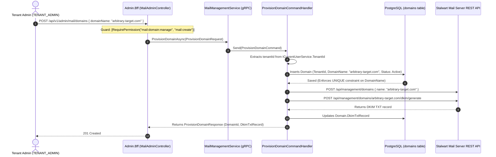

# Aurora Mail Platform — Mail Domain Provisioning & Ownership Audit

> **Document Type**: Code-First Security & Architecture Audit  
> **Target Scope**: `MailService`, `IamTenant`, `Admin.Bff`, `System.Bff`, `PermissionConstants`, `protos/mail_platform.proto`.  
> **Source-of-Truth**: Validated directly against C# .NET 10 source code, Protobuf contracts, DbContext entity configurations, and Micro-BFF controllers.

---

## 1. Executive Summary & Verdict

| Audit Dimension | Current Code Reality | Target Architectural Requirement | Verdict |
|---|---|---|:---:|
| **Domain Provisioning Actor** | `TENANT_ADMIN` calls `POST /api/v1/admin/mail/domains` with any arbitrary domain name. | `SYSTEM_ADMIN` provisions/assigns mail domains (via Stalwart Admin UI / System API). | 🛑 **TARGET CHANGE REQUIRED** |
| **Domain Ownership Model** | `Domain` entity contains `TenantId` with global unique index on `DomainName`. | `Domain` entity owned by single tenant with explicit system assignment. | ✅ **COMPATIBLE / SAFE** |
| **DNS Ownership Verification** | None. Any FQDN can be registered in Stalwart if not already taken. | Pre-configured/assigned by System Admin; DNS records verified. | 🛑 **UNSAFE (In Current Admin API)** |
| **Mailbox / Alias Scoping** | `CreateMailbox` and `CreateAlias` enforce EF Core global query filter `d.TenantId == _tenantId`. | Must strictly use assigned tenant domain. | ✅ **SAFE** |
| **System Admin BFF APIs** | `System.Bff` only has `dead-letter/requeue` and `audit`. No domain APIs exist. | `System.Bff` owns domain assignment & unassignment. | 🛑 **MISSING IN SYSTEM BFF** |
| **Overall Security Rating** | **PARTIAL** (Tenant cross-access is blocked by EF Core filters, but arbitrary domain squatting is possible by Tenant Admin). |

---

## 2. Trace of Current Flow (`POST /api/v1/admin/mail/domains`)



### Detailed Trace Answers (10 Specific Checks):

1. **Can `TENANT_ADMIN` currently create any arbitrary FQDN?**  
   **YES.** Any user with the `TENANT_ADMIN` base role and `mail:domain:manage` permission can submit any FQDN (e.g. `competitor.com`, `apple.com`) via `POST /api/v1/admin/mail/domains`.
2. **Is `TenantId` derived from trusted auth context or supplied by request?**  
   **Trusted Auth Context.** In `ProvisionDomainCommandHandler.cs` (line 30), `Guid tenantId = _currentUserService.TenantId ?? Guid.Empty;`. The caller cannot forge another tenant's ID in the payload.
3. **Is domain ownership stored anywhere?**  
   **YES.** In PostgreSQL table `domains`, with fields `Id`, `TenantId`, `DomainName`, `Status`, `MaxMailboxCount`, `RetentionDays`, `DkimSelector`, `DkimTxtRecord`, `CreatedAt`, `CreatedBy`.
4. **Does `Domain` entity contain `TenantId`?**  
   **YES.** `Domain.cs` inherits from `TenantAuditableEntity`, which contains `public Guid TenantId { get; set; }`.
5. **Can the same domain be associated with two tenants?**  
   **NO.** In `MailServiceDbContext.cs` (line 42), `b.HasIndex(d => d.DomainName).IsUnique();`. If Tenant B attempts to provision a domain already held by Tenant A, PostgreSQL raises a unique constraint violation.
6. **Is there a unique constraint for `DomainName`?**  
   **YES.** Enforced via `b.HasIndex(d => d.DomainName).IsUnique();` in EF Core model mapping.
7. **Is DNS ownership verified?**  
   **NO.** There is no DNS TXT/CNAME verification or challenge token verification prior to registering the domain in Stalwart.
8. **Does `Mailbox` creation verify that its domain belongs to current tenant?**  
   **YES.** `CreateMailboxCommandHandler.cs` (line 36) queries `_dbContext.Domains.FindAsync([request.DomainId])`. Because `_dbContext.Domains` has global query filter `d => _tenantId.HasValue && d.TenantId == _tenantId`, requesting a `DomainId` owned by another tenant returns `null` and throws `InvalidOperationException("Domain with ID ... not found")`.
9. **Does `Alias` creation verify domain/mailbox tenant ownership?**  
   **YES for Domain.** `CreateAliasCommandHandler.cs` (line 36) verifies that `request.DomainId` is owned by the current tenant via `_dbContext.Domains.FindAsync`. (Target addresses are treated as external/local forwarding list).
10. **Does `System.Bff` currently have domain provisioning APIs?**  
    **NO.** `System.Bff/Controllers/MailSystemController.cs` only has `dead-letter/requeue` and `audit`. It contains zero domain provisioning or tenant assignment endpoints.

---

## 3. Verification of Target Model

### Proposed Target vs. Existing Entity Architecture

```
[Target Architecture Option A: Dedicated Junction Table]
Tenant ─── 1:N ─── TenantDomain ─── 1:1 ─── Stalwart External Domain

[Target Architecture Option B: Direct Ownership on Domain Entity (RECOMMENDED)]
Domain Entity (.NET 10 MailService):
- Id (Guid)
- TenantId (Guid)                 <-- Directly binds to Tenant
- DomainName (string, UNIQUE)      <-- Registered in Stalwart
- Status (DomainStatus)           <-- Active / Suspended
- DkimSelector (string)
- DkimTxtRecord (string)
- MaxMailboxCount (int)
- RetentionDays (int)
- CreatedAt, CreatedBy (Audit)
```

### Architectural Finding & Recommendation:
* **Do NOT create an unnecessary `TenantDomain` junction table.**  
* The existing `Domain` entity with `TenantId` and a unique index on `DomainName` **already provides the exact, simplest, and fail-closed data model required**.
* In logistics SaaS email architecture, a mail domain (e.g. `acme-logistics.com`) is strictly owned by exactly one tenant. A 1:N junction table would introduce redundant joins without architectural benefit.

---

## 4. Permission Review & Recommendation

### Review of `mail:domain:manage`

| Permission Code | Old Semantic | Target Semantic | Recommendation |
|---|---|---|:---:|
| `mail:domain:manage` | Tenant Admin provisions arbitrary domain in Stalwart. | Tenant Admin views assigned domains and manages tenant-level mail settings (thresholds). | **CHANGE_SEMANTIC** |
| `mail:domain:read` | Implicit in manage. | Tenant Admin lists and inspects assigned domain DNS/DKIM instructions. | **SPLIT / ADD** |
| `mail:system:domain:assign` | Non-existent. | System Admin assigns a pre-provisioned Stalwart domain to a specific Tenant. | **ADD TO SYSTEM** |

---

## 5. API Target Specification

### 5.1 System BFF (`System.Bff` — `SYSTEM_ADMIN` Only)

```
POST   /api/v1/system/mail/domains/assign     --> Assign pre-configured domain to Tenant
GET    /api/v1/system/mail/domains            --> List all domains across all tenants
GET    /api/v1/system/mail/domains/{id}       --> Get domain details & tenant binding
DELETE /api/v1/system/mail/domains/{id}       --> Unassign / suspend domain
```

* **`POST /api/v1/system/mail/domains/assign` Request Body**:
  ```json
  {
    "tenantId": "e5b8ba84-0000-0000-0000-000000000001",
    "domainName": "acmelogistics.com",
    "maxMailboxCount": 100,
    "retentionDays": 365
  }
  ```

### 5.2 Tenant Admin BFF (`Admin.Bff` — `TENANT_ADMIN`)

```
GET    /api/v1/admin/mail/domains             --> List domains assigned to current tenant
GET    /api/v1/admin/mail/domains/{id}        --> Get DKIM records & quotas for assigned domain
POST   /api/v1/admin/mail/mailboxes           --> Create mailbox under assigned domain (Validates DomainId)
POST   /api/v1/admin/mail/aliases             --> Create alias under assigned domain (Validates DomainId)

❌ REMOVE: POST /api/v1/admin/mail/domains    --> (Arbitrary domain provisioning disallowed)
```

---

## 6. Conceptual Security Test Suite

1. **`Test_TenantAdmin_CannotProvision_ArbitraryDomain`**:
   * Attempting `POST /api/v1/admin/mail/domains` as `TENANT_ADMIN` returns `404 Not Found` (endpoint removed) or `403 Forbidden`.
2. **`Test_SystemAdmin_CanAssignDomain_ToTenant`**:
   * `SYSTEM_ADMIN` calls `POST /api/v1/system/mail/domains/assign` with Tenant A's `tenantId` and `domainName = "acmelogistics.com"`. Domain is saved in DB and registered in Stalwart.
3. **`Test_TenantAdmin_CanList_OnlyAssignedDomains`**:
   * Tenant A lists domains $\rightarrow$ sees `acmelogistics.com`.
   * Tenant B lists domains $\rightarrow$ sees empty list.
4. **`Test_TenantAdmin_CannotCreateMailbox_UnderOtherTenantDomain`**:
   * Tenant B attempts `POST /api/v1/admin/mail/mailboxes` with Tenant A's `DomainId`.
   * Request fails with `InvalidOperationException: Domain with ID ... not found`.
5. **`Test_SystemAdmin_CannotAssign_DuplicateDomain`**:
   * System Admin attempts to assign `acmelogistics.com` to Tenant B while Tenant A holds it.
   * Fails with unique constraint violation.

---

## 7. Migration & Code Changes Required

* **Database Migration**: **NO (Schema is already 100% compatible)**.
  - `domains` table already has `TenantId`, `DomainName` (UNIQUE), `Status`, `DkimSelector`, `DkimTxtRecord`.
* **Proto Changes**:
  - Add `rpc AssignDomain (AssignDomainRequest) returns (AssignDomainResponse)` to `MailManagement` service in `protos/mail_platform.proto`.
  - Add `rpc ListDomains (ListDomainsRequest) returns (ListDomainsResponse)` to `MailManagement` service.
  - Add `rpc GetDomain (GetDomainRequest) returns (DomainDto)` to `MailManagement` service.
* **BFF Controller Changes**:
  - Move domain assignment logic to `System.Bff/Controllers/MailSystemController.cs`.
  - Remove `[HttpPost("domains")]` from `Admin.Bff/Controllers/MailAdminController.cs`.
  - Add `[HttpGet("domains")]` and `[HttpGet("domains/{id}")]` in `Admin.Bff/Controllers/MailAdminController.cs`.
