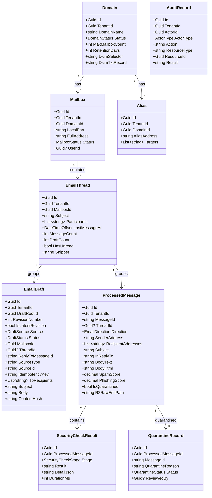
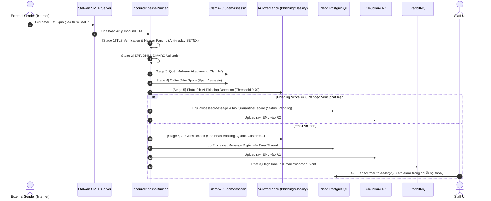
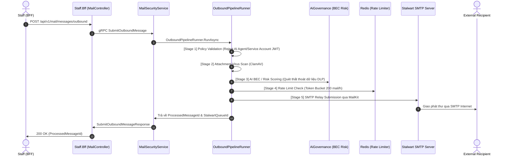

# MailService Reverse Engineering Report & Aurora Mail UI Architecture Specification

> **Document ID:** `AURORA-REV-MAILSERVICE-2026-08-26`  
> **Repository:** `SynchroCustoms / aurora-server`  
> **Target Scope:** Reverse Engineering of `MailService`, BFF Gateways (`Staff.Bff`, `Admin.Bff`, `System.Bff`, `BuildingBlocks.BFF`), Messaging, Stalwart Mail Server Integration, and Target Mail UI Architecture (`ADMIN` & `STAFF`).  
> **Status:** Code Complete Audit & Target API Contract Design  

---

## 1. Executive Summary

Trải qua quá trình reverse engineering toàn diện mã nguồn repository `aurora-server`, tài liệu này phân tích chi tiết hiện trạng thực tế, mức độ hoàn thiện, các điểm nghẽn kiến trúc (gaps), cơ chế tích hợp với máy chủ thư điện tử **Stalwart Mail Server**, và thiết lập bản đặc tả hợp đồng REST API mục tiêu cho 2 giao diện người dùng chính: **Aurora Admin Mail UI** (Tenant Admin) và **Aurora Staff Mail UI** (Frontline Staff/Operators).

### Phát hiện cốt lõi:
1. **Mail Security & Pipeline**: Đã hoàn thiện mã nguồn (`CODE COMPLETE`) với pipeline 2 chiều Inbound (8 stages: TLS, Header anti-replay, SPF, DKIM, DMARC, ClamAV, SpamAssassin, AI Phishing & Classification) và Outbound (6 stages: Role Policy Guard, ClamAV, AI BEC/Risk Scoring, Redis Token Bucket Rate Limiting, DKIM Signing, Stalwart SMTP Relay).
2. **Stalwart Integration**: Tích hợp thông qua `StalwartManagementClient` (HTTP REST Management API) cho Provisioning (Domain, Account, Alias, DKIM Generation, Quarantine Release) và `MailKitSmtpDeliveryService` (SMTP Relay). **Chưa có JMAP/IMAP Client** để đồng bộ live mailbox folders (Inbox, Sent, Trash) trực tiếp từ Stalwart storage — hiện tại dữ liệu đọc hoàn toàn dựa vào snapshot trong cơ sở dữ liệu Neon PostgreSQL.
3. **Mailbox Access Control (Gap nghiêm trọng)**: Thực thể `Mailbox` hiện chỉ có trường `UserId` dạng 1:1, **hoàn toàn chưa có model `MailboxMember` / `MailboxAccess`**. Do đó, hệ thống chưa hỗ trợ Shared Mailbox (phòng ban Sales, Ops, CS dùng chung), ủy quyền truy cập hộp thư, hay phân quyền Granular Mailbox Scope.
4. **Định hướng UI & Role Boundaries**:
   - **SYSTEM**: Không xây dựng Aurora Mail UI riêng; quản trị viên hạ tầng sử dụng trực tiếp **Stalwart Admin UI**. Aurora chỉ giữ lại các API nền tảng: Dead-letter requeue và System Audit.
   - **ADMIN**: Sử dụng **Aurora Admin Mail UI** quản trị tài nguyên trong phạm vi `currentUser.TenantId` (Domains, Mailboxes, Aliases, Mailbox Memberships, Quarantine Review, Audit Trail).
   - **STAFF**: Sử dụng **Aurora Staff Mail UI** cho nghiệp vụ gửi/nhận email, quản lý Draft, xử lý Thread, AI Suggested Reply (Human-in-the-Loop).
   - **MANAGER**: Không tạo UI riêng. Quyền hạn của Manager trong Mail là biến thể mở rộng (`Permission Variant`) của Staff Mail UI, cho phép xem toàn bộ hòm thư và giám sát luồng mail trong tenant.

---

## 2. MailService Current Responsibility

[MailService](file:///d:/IT/CD/aurora-server/src/dotnet/MailService) là microservice độc lập chịu trách nhiệm:
1. **Quản lý Định danh & Cấu hình Hộp thư Tenant**: Lưu trữ và quản lý Domain, Mailbox, Alias trong cơ sở dữ liệu Neon DB; đồng bộ provisioning sang Stalwart Mail Server.
2. **Thực thi Pipeline Bảo mật Email Đa tầng (Inbound & Outbound)**: Kiểm tra chữ ký mật mã (SPF/DKIM/DMARC), quét virus mã độc (ClamAV), chấm điểm thư rác (SpamAssassin), phát hiện tấn công lừa đảo/BEC thông qua `AiGovernance`.
3. **Quản lý Vòng đời Bản thảo & Luồng Hội thoại (Draft & Threading)**: Cung cấp kho lưu trữ Draft có versioning, hash nội dung (SHA-256), chống trùng lặp (Idempotency Key), và xâu chuỗi hội thoại dạng Gmail (`thread_id`, `reply_to_message_id`).
4. **Cách ly & Kiểm duyệt Mối đe dọa (Quarantine Management)**: Lưu giữ các email nghi vấn, cho phép Admin/Manager kiểm tra chi tiết lỗi và phát hành (`Release`) hoặc xóa vĩnh viễn (`Delete`).
5. **Ghi vết Kiểm toán & Phục hồi Sự cố (Audit & Outbox/Dead-Letter)**: Ghi log mọi hành vi bảo mật/tác vụ người dùng, xử lý sự kiện qua Transactional Outbox, hỗ trợ Requeue tin nhắn lỗi vào RabbitMQ.

---

## 3. Source Inventory

### A. Contracts & Protos
- [protos/mail_platform.proto](file:///d:/IT/CD/aurora-server/protos/mail_platform.proto): Hợp đồng gRPC chuẩn hóa cho `MailManagement` và `MailSecurity`.
- [protos/negotiation.proto](file:///d:/IT/CD/aurora-server/protos/negotiation.proto): Hợp đồng gRPC đàm phán giá và trích xuất suggested draft.

### B. Core .NET MailService
- [Program.cs](file:///d:/IT/CD/aurora-server/src/dotnet/MailService/Program.cs): Khởi tạo DI, Serilog, gRPC Interceptors, Polly Resilience, RabbitMQ Consumers.
- [DomainEntities.cs](file:///d:/IT/CD/aurora-server/src/dotnet/MailService/Domain/Entities/DomainEntities.cs): Định nghĩa các thực thể `Domain`, `Mailbox`, `Alias`, `EmailThread`, `EmailDraft`, `ProcessedMessage`, `SecurityCheckResult`, `QuarantineRecord`, `AuditRecord`, `OutboxMessage`.
- [DomainEnums.cs](file:///d:/IT/CD/aurora-server/src/dotnet/MailService/Domain/Enums/DomainEnums.cs): Các Enum trạng thái, stage bảo mật, hướng gửi nhận.
- [MailServiceDbContext.cs](file:///d:/IT/CD/aurora-server/src/dotnet/MailService/Infrastructure/Persistence/MailServiceDbContext.cs): EF Core DbContext với Multi-tenant Global Query Filter (`d.TenantId == _tenantId`) và unique index lọc theo Idempotency Key.
- [MailManagementService.cs](file:///d:/IT/CD/aurora-server/src/dotnet/MailService/GrpcServices/MailManagementService.cs): gRPC service thực thi `MailManagement`.
- [MailSecurityService.cs](file:///d:/IT/CD/aurora-server/src/dotnet/MailService/GrpcServices/MailSecurityService.cs): gRPC service thực thi `MailSecurity`.
- [PipelineRunners.cs](file:///d:/IT/CD/aurora-server/src/dotnet/MailService/Application/Pipeline/PipelineRunners.cs): Điều phối chuỗi xử lý Inbound/Outbound.
- [InboundStages.cs](file:///d:/IT/CD/aurora-server/src/dotnet/MailService/Application/Pipeline/Stages/InboundStages.cs): 8 stages bảo mật Inbound.
- [OutboundStages.cs](file:///d:/IT/CD/aurora-server/src/dotnet/MailService/Application/Pipeline/Stages/OutboundStages.cs): 6 stages bảo mật Outbound.
- [StalwartManagementClient.cs](file:///d:/IT/CD/aurora-server/src/dotnet/MailService/Infrastructure/Stalwart/StalwartManagementClient.cs): HTTP Client giao tiếp REST API quản trị của Stalwart.
- [MailKitSmtpDeliveryService.cs](file:///d:/IT/CD/aurora-server/src/dotnet/MailService/Infrastructure/Stalwart/MailKitSmtpDeliveryService.cs): SMTP Client giao tiếp máy chủ gửi thư Stalwart qua MailKit.

### C. BFF Gateway Layer
- [Staff.Bff/Controllers/MailController.cs](file:///d:/IT/CD/aurora-server/src/dotnet/BFF/Staff.Bff/Controllers/MailController.cs): REST API cho Staff (Draft, Send, Processed Message, Quarantine, Thread).
- [Staff.Bff/Controllers/NegotiationsController.cs](file:///d:/IT/CD/aurora-server/src/dotnet/BFF/Staff.Bff/Controllers/NegotiationsController.cs): REST API kích hoạt tạo draft từ gợi ý AI đàm phán.
- [Admin.Bff/Controllers/MailAdminController.cs](file:///d:/IT/CD/aurora-server/src/dotnet/BFF/Admin.Bff/Controllers/MailAdminController.cs): REST API cho Tenant Admin (Domains, Mailboxes, Aliases, Delete Quarantine, Audit).
- [System.Bff/Controllers/MailSystemController.cs](file:///d:/IT/CD/aurora-server/src/dotnet/BFF/System.Bff/Controllers/MailSystemController.cs): REST API cho System Admin (Requeue Dead-letter, System Audit).
- [BuildingBlocks.BFF/Mail/Clients/GrpcMailServiceClient.cs](file:///d:/IT/CD/aurora-server/src/dotnet/BFF/BuildingBlocks.BFF/Mail/Clients/GrpcMailServiceClient.cs): Wrapper chuyển đổi DTO sang gRPC Protobuf requests.

---

## 4. Proto / RPC Matrix

| Service | RPC | Purpose | Request Message | Response Message | Implementation Status | Evidence |
| :--- | :--- | :--- | :--- | :--- | :--- | :--- |
| `MailManagement` | `ProvisionDomain` | Khởi tạo domain & tạo khóa DKIM | `ProvisionDomainRequest` | `ProvisionDomainResponse` | `IMPLEMENTED` | `mail_platform.proto:23`, `MailManagementService.cs:23-43` |
| `MailManagement` | `CreateMailbox` | Tạo hộp thư người dùng | `CreateMailboxRequest` | `CreateMailboxResponse` | `IMPLEMENTED` | `mail_platform.proto:24`, `MailManagementService.cs:45-67` |
| `MailManagement` | `CreateAlias` | Tạo bí danh chuyển tiếp email | `CreateAliasRequest` | `CreateAliasResponse` | `IMPLEMENTED` | `mail_platform.proto:25`, `MailManagementService.cs:69-88` |
| `MailManagement` | `ResetPassword` | Yêu cầu reset mật khẩu hòm thư | `ResetPasswordRequest` | `ResetPasswordResponse` | `STUB` (Ủy quyền Cognito OIDC) | `mail_platform.proto:26`, `MailManagementService.cs:90-97` |
| `MailManagement` | `GetAuditRecords` | Truy vấn nhật ký bảo mật | `GetAuditRecordsRequest` | `GetAuditRecordsResponse` | `IMPLEMENTED` | `mail_platform.proto:27`, `MailManagementService.cs:99-124` |
| `MailManagement` | `RequeueDeadLetter` | Đẩy lại tin nhắn lỗi vào hàng đợi | `RequeueDeadLetterRequest` | `RequeueDeadLetterResponse` | `IMPLEMENTED` | `mail_platform.proto:28`, `MailManagementService.cs:126-140` |
| `MailSecurity` | `CreateDraftMessage` | Tạo bản thảo (hỗ trợ threading & AI) | `CreateDraftMessageRequest` | `CreateDraftMessageResponse` | `IMPLEMENTED` | `mail_platform.proto:34`, `MailSecurityService.cs:26-70` |
| `MailSecurity` | `ListDrafts` | Danh sách bản thảo theo hòm thư | `ListDraftsRequest` | `ListDraftsResponse` | `IMPLEMENTED` | `mail_platform.proto:35`, `MailSecurityService.cs:113-121` |
| `MailSecurity` | `GetDraft` | Chi tiết bản thảo theo revision | `GetDraftRequest` | `DraftDto` | `IMPLEMENTED` | `mail_platform.proto:36`, `MailSecurityService.cs:102-111` |
| `MailSecurity` | `SubmitOutboundMessage` | Gửi email đi qua pipeline bảo mật | `SubmitOutboundMessageRequest`| `SubmitOutboundMessageResponse`| `IMPLEMENTED` | `mail_platform.proto:37`, `MailSecurityService.cs:72-100` |
| `MailSecurity` | `GetProcessedMessage` | Lấy chi tiết email đã xử lý | `GetProcessedMessageRequest` | `ProcessedMessageDto` | `IMPLEMENTED` | `mail_platform.proto:38`, `MailSecurityService.cs:189-198` |
| `MailSecurity` | `ListProcessedMessages` | Lấy danh sách email đã xử lý | `ListProcessedMessagesRequest`| `ListProcessedMessagesResponse`| `IMPLEMENTED` | `mail_platform.proto:39`, `MailSecurityService.cs:200-207` |
| `MailSecurity` | `GetQuarantineRecord` | Chi tiết email bị cách ly | `GetQuarantineRecordRequest` | `QuarantineRecordDto` | `IMPLEMENTED` | `mail_platform.proto:40`, `MailSecurityService.cs:209-218` |
| `MailSecurity` | `ListQuarantineRecords`| Danh sách email bị cách ly | `ListQuarantineRecordsRequest`| `ListQuarantineRecordsResponse`| `IMPLEMENTED` | `mail_platform.proto:41`, `MailSecurityService.cs:220-227` |
| `MailSecurity` | `ReleaseQuarantine` | Phát hành email an toàn từ khu cách ly | `ReleaseQuarantineRequest` | `ReleaseQuarantineResponse` | `IMPLEMENTED` | `mail_platform.proto:42`, `MailSecurityService.cs:229-238` |
| `MailSecurity` | `DeleteQuarantine` | Xóa vĩnh viễn bản ghi cách ly | `DeleteQuarantineRequest` | `DeleteQuarantineResponse` | `IMPLEMENTED` | `mail_platform.proto:43`, `MailSecurityService.cs:240-245` |
| `MailSecurity` | `GetThread` | Lấy chi tiết chuỗi hội thoại | `GetThreadRequest` | `ThreadDto` | `IMPLEMENTED` | `mail_platform.proto:44`, `MailSecurityService.cs:123-169` |
| `MailSecurity` | `ListThreads` | Danh sách chuỗi hội thoại | `ListThreadsRequest` | `ListThreadsResponse` | `IMPLEMENTED` | `mail_platform.proto:45`, `MailSecurityService.cs:171-187` |

---

## 5. gRPC Implementation Matrix

```text
gRPC Request (RPC Method)
   ↓
GrpcService (MailManagementService / MailSecurityService)
   ↓
MediatR (ISender.Send)
   ↓
Command / Query Handler
   ↓
MailServiceDbContext (PostgreSQL) + External Clients (Stalwart / ClamAV / SpamAssassin / AiGovernance)
```

---

## 6. Command / Query / Handler Map

| Type | Name | Handler | Persistence / Ext Client | Business Action |
| :--- | :--- | :--- | :--- | :--- |
| **Command** | `ProvisionDomainCommand` | `ProvisionDomainCommandHandler` | `MailServiceDbContext`, `IStalwartManagementClient` | Tạo domain, sinh DKIM TXT record, ghi audit |
| **Command** | `CreateMailboxCommand` | `CreateMailboxCommandHandler` | `MailServiceDbContext`, `IStalwartManagementClient` | Tạo tài khoản hòm thư, validate domain tenant |
| **Command** | `CreateAliasCommand` | `CreateAliasCommandHandler` | `MailServiceDbContext`, `IStalwartManagementClient` | Tạo email alias chuyển tiếp thư |
| **Command** | `CreateDraftMessageCommand` | `CreateDraftMessageCommandHandler` | `MailServiceDbContext` | Tạo/gắn thread, kiểm tra Idempotency, ghi audit |
| **Command** | `SubmitOutboundMessageCommand` | `SubmitOutboundMessageCommandHandler` | `OutboundPipelineRunner`, `MailServiceDbContext` | Chạy 6 stages bảo mật, gửi qua Stalwart SMTP |
| **Command** | `ReleaseQuarantineCommand` | `ReleaseQuarantineCommandHandler` | `MailServiceDbContext`, `IStalwartManagementClient` | Chuyển trạng thái `Released`, gọi Stalwart release |
| **Command** | `DeleteQuarantineCommand` | `DeleteQuarantineCommandHandler` | `MailServiceDbContext` | Chuyển trạng thái `Deleted`, ghi audit |
| **Command** | `RequeueDeadLetterCommand` | `RequeueDeadLetterCommandHandler` | `MailServiceDbContext`, `OutboxMessage` | Reset retry count, đưa vào Transactional Outbox |
| **Query** | `GetDraftQuery` | `GetDraftQueryHandler` | `MailServiceDbContext` | Đọc bản ghi EmailDraft theo ID |
| **Query** | `ListDraftsQuery` | `ListDraftsQueryHandler` | `MailServiceDbContext` | Đọc danh sách draft theo MailboxId/Status |
| **Query** | `GetThreadQuery` | `GetThreadQueryHandler` | `MailServiceDbContext` | Đọc EmailThread + Messages + Drafts theo thứ tự |
| **Query** | `ListThreadsQuery` | `ListThreadsQueryHandler` | `MailServiceDbContext` | Đọc danh sách EmailThread sắp xếp theo `LastMessageAt` |
| **Query** | `GetProcessedMessageQuery` | `GetProcessedMessageQueryHandler` | `MailServiceDbContext` | Đọc ProcessedMessage + SecurityCheckResults |
| **Query** | `ListProcessedMessagesQuery` | `ListProcessedMessagesQueryHandler` | `MailServiceDbContext` | Đọc danh sách tin nhắn theo Direction/Category |
| **Query** | `GetQuarantineRecordQuery` | `GetQuarantineRecordQueryHandler` | `MailServiceDbContext` | Đọc chi tiết QuarantineRecord |
| **Query** | `ListQuarantineRecordsQuery`| `ListQuarantineRecordsQueryHandler` | `MailServiceDbContext` | Đọc danh sách thư cách ly theo Status |
| **Query** | `GetAuditRecordsQuery` | `GetAuditRecordsQueryHandler` | `MailServiceDbContext` | Đọc lịch sử kiểm toán bảo mật |

---

## 7. Domain Model

Thực tế mã nguồn tại [DomainEntities.cs](file:///d:/IT/CD/aurora-server/src/dotnet/MailService/Domain/Entities/DomainEntities.cs):



### Các Entity KHÔNG TỒN TẠI trong mã nguồn (NOT FOUND):
- `MailboxMember` / `MailboxMembership` / `MailboxAccess`: **NOT FOUND**.
- `MailFolder` / `MailLabel` (Inbox, Sent, Trash, Custom Labels): **NOT FOUND**.
- `MailMessageFlag` (Star, Important, Read/Unread state per user): **NOT FOUND** (chỉ có cờ thô `HasUnread` trên Thread level).
- `SenderAllowBlockList`: **NOT FOUND**.

---

## 8. Persistence Model

Toàn bộ dữ liệu của MailService được lưu trữ tại:
1. **Neon PostgreSQL Database** (`MailServiceDbContext`):
   - `domains`: Bảng tên miền email tenant.
   - `mailboxes`: Bảng tài khoản hộp thư.
   - `aliases`: Bảng bí danh email.
   - `email_threads`: Bảng chuỗi hội thoại email.
   - `email_drafts`: Bảng bản thảo email với versioning và unique index `(TenantId, IdempotencyKey)`.
   - `processed_messages`: Bảng tin nhắn đã qua pipeline xử lý.
   - `security_check_results`: Kết quả audit từng stage bảo mật.
   - `quarantine_records`: Danh sách thư nghi vấn cần phê duyệt.
   - `audit_records`: Nhật ký kiểm toán.
   - `outbox_messages`: Hàng đợi Transactional Outbox.
2. **Cloudflare R2 Object Storage**:
   - Lưu trữ file EML thô gốc (`R2RawEmlPath`) phục vụ trích xuất chứng cứ điều tra và tải attachment.
3. **Redis**:
   - Bộ đếm Token Bucket cho Rate Limiting Inbound/Outbound.
   - Lưu trữ SETNX Message-ID chống tấn công Replay Attack.
4. **RabbitMQ**:
   - `aurora.mail.inbound.processed`: Phát sự kiện sau khi hoàn tất pipeline Inbound.
   - `aurora.mail.deadletter`: Lưu trữ tin nhắn lỗi vượt số lần retry.

---

## 9. Stalwart Integration

| Operation | Aurora Component | Stalwart Interface | Direction | Credential | Tenant Context | Status |
| :--- | :--- | :--- | :--- | :--- | :--- | :--- |
| **Provision Domain** | `StalwartManagementClient` | `POST /api/management/domains` | Aurora → Stalwart | HTTP Basic / Bearer Admin Token | Truyền domain FQDN | `IMPLEMENTED` |
| **Generate DKIM** | `StalwartManagementClient` | `POST /api/management/domains/{d}/dkim/generate` | Aurora → Stalwart | HTTP Admin Token | Truyền domain FQDN | `IMPLEMENTED` |
| **Provision Account** | `StalwartManagementClient` | `POST /api/management/accounts` | Aurora → Stalwart | HTTP Admin Token | Email đầy đủ | `IMPLEMENTED` |
| **Create Alias** | `StalwartManagementClient` | `POST /api/management/aliases` | Aurora → Stalwart | HTTP Admin Token | Alias + Target list | `IMPLEMENTED` |
| **Quarantine Release**| `StalwartManagementClient` | `POST /api/management/quarantine/{id}/release` | Aurora → Stalwart | HTTP Admin Token | MessageId + Recipient | `IMPLEMENTED` |
| **SMTP Delivery** | `MailKitSmtpDeliveryService` | SMTP Protocol (Port 25/587) | Aurora → Stalwart | SMTP User / Password | Header MIME From/To | `IMPLEMENTED` |
| **JMAP Mailbox Sync**| *None* | JMAP Protocol (RFC 8620/8621) | *Chưa có* | *Chưa có* | *Chưa có* | **NOT IMPLEMENTED** |
| **IMAP/POP3 Access** | *None* | IMAP Protocol | *Chưa có* | *Chưa có* | *Chưa có* | **NOT IMPLEMENTED** |

---

## 10. Inbound Mail Flow



---

## 11. Outbound Mail Flow



---

## 12. Mail Security Flow

| Mục tiêu bảo mật | Cơ chế thực thi | Ngưỡng vi phạm | Hành động xử lý |
| :--- | :--- | :--- | :--- |
| **Replay Attack** | Redis SETNX `Message-ID` theo Tenant | Trùng lặp MessageId | Từ chối xử lý, Short-circuit Inbound |
| **Malware / Virus** | ClamAV Daemon stream scanning | `!scanResult.IsClean` | Cách ly tức thì vào `quarantine_records` |
| **Spam Mail** | SpamAssassin Scoring | `Score >= 5.0` (Tag), `Score >= 10.0` (Reject) | Cách ly hoặc đánh cờ Spam |
| **Phishing / Lừa đảo** | AI Phishing Detection qua `AiGovernance` | `PhishingScore >= 0.70` | Cách ly vào `quarantine_records` |
| **BEC / Rò rỉ thông tin** | AI Risk Scoring Outbound | `BecRiskScore >= 0.80` | Ghi log cảnh báo kiểm toán |
| **Direct AI Auto-Send**| Policy Validation Stage | Role chứa `AiAgent`/`ServiceAccount` | Bị từ chối trực tiếp (`PERMISSION_DENIED`) |
| **Spam Outbound** | Redis Rate Limiter | $> 200$ emails / giờ / tenant | Khóa gửi tạm thời (`RESOURCE_EXHAUSTED`) |

---

## 13. Current REST/BFF API

### A. Staff BFF (`Staff.Bff/Controllers/MailController.cs` & `NegotiationsController.cs`)
- `POST /api/v1/mail/drafts`: Tạo bản thảo mới.
- `GET /api/v1/mail/drafts`: Danh sách bản thảo.
- `GET /api/v1/mail/drafts/{id}`: Chi tiết bản thảo.
- `GET /api/v1/mail/threads`: Danh sách chuỗi hội thoại (Gmail-like).
- `GET /api/v1/mail/threads/{id}`: Chi tiết chuỗi hội thoại kèm tin nhắn & bản thảo.
- `POST /api/v1/mail/messages/outbound`: Gửi email đi (Outbound).
- `GET /api/v1/mail/messages`: Danh sách tin nhắn đã xử lý.
- `GET /api/v1/mail/messages/{id}`: Chi tiết tin nhắn & kết quả kiểm tra an ninh.
- `GET /api/v1/mail/quarantine`: Danh sách thư cách ly.
- `GET /api/v1/mail/quarantine/{id}`: Chi tiết thư cách ly.
- `POST /api/v1/mail/quarantine/{id}/release`: Phát hành thư cách ly.
- `POST /api/v1/negotiations/{negotiationId}/mail-draft`: Tạo draft có liên kết thread từ gợi ý đàm phán AI.

### B. Admin BFF (`Admin.Bff/Controllers/MailAdminController.cs`)
- `POST /api/v1/admin/mail/domains`: Khởi tạo domain email.
- `POST /api/v1/admin/mail/mailboxes`: Tạo hòm thư cho người dùng.
- `POST /api/v1/admin/mail/aliases`: Tạo email alias.
- `POST /api/v1/admin/mail/mailboxes/{id}/reset-password`: Reset mật khẩu hòm thư.
- `DELETE /api/v1/admin/mail/quarantine/{id}`: Xóa vĩnh viễn thư cách ly.
- `GET /api/v1/admin/mail/audit`: Xem nhật ký kiểm toán bảo mật email.

### C. System BFF (`System.Bff/Controllers/MailSystemController.cs`)
- `POST /api/v1/system/mail/dead-letter/{id}/requeue`: Đẩy lại email lỗi vào queue.
- `GET /api/v1/system/mail/audit`: Xem nhật ký kiểm toán toàn hệ thống.

---

## 14. Current Authorization Model

Bảng phân quyền thực tế đang áp dụng trên mã nguồn BFF:

| Action / Endpoint | STAFF | MANAGER | TENANT_ADMIN | SYSTEM_ADMIN | Tenant Scope | Mailbox Scope |
| :--- | :---: | :---: | :---: | :---: | :---: | :---: |
| `POST /api/v1/mail/drafts` | **ALLOW** | **ALLOW** | **ALLOW** | DENY | Strict `TenantId` | MailboxId validate tenant |
| `GET /api/v1/mail/threads` | **ALLOW** | **ALLOW** | **ALLOW** | DENY | Strict `TenantId` | Không lọc user (thấy cả tenant) |
| `POST /api/v1/mail/messages/outbound` | **ALLOW** | **ALLOW** | **ALLOW** | DENY | Strict `TenantId` | Chưa validate ownership From Address |
| `GET /api/v1/mail/quarantine` | **ALLOW** | **ALLOW** | **ALLOW** | DENY | Strict `TenantId` | Xem toàn bộ thư cách ly trong tenant |
| `POST /api/v1/mail/quarantine/{id}/release` | **ALLOW** | **ALLOW** | **ALLOW** | DENY | Strict `TenantId` | Thao tác toàn tenant |
| `POST /api/v1/admin/mail/domains` | DENY | DENY | **ALLOW** | DENY | Strict `TenantId` | Tenant level |
| `POST /api/v1/admin/mail/mailboxes` | DENY | DENY | **ALLOW** | DENY | Strict `TenantId` | Tenant level |
| `POST /api/v1/admin/mail/aliases` | DENY | DENY | **ALLOW** | DENY | Strict `TenantId` | Tenant level |
| `DELETE /api/v1/admin/mail/quarantine/{id}` | DENY | DENY | **ALLOW** | DENY | Strict `TenantId` | Tenant level |
| `GET /api/v1/admin/mail/audit` | DENY | DENY | **ALLOW** | DENY | Strict `TenantId` | Tenant level |
| `POST /api/v1/system/mail/dead-letter/{id}/requeue` | DENY | DENY | DENY | **ALLOW** | Cross-tenant | Platform level |
| `GET /api/v1/system/mail/audit` | DENY | DENY | DENY | **ALLOW** | Cross-tenant | Platform level |

---

## 15. Tenant Isolation Analysis

1. **EF Core Global Query Filter**: Mọi entity kế thừa `TenantAuditableEntity` (`Domain`, `Mailbox`, `Alias`, `EmailThread`, `EmailDraft`, `ProcessedMessage`, `SecurityCheckResult`, `QuarantineRecord`, `AuditRecord`) đều được gắn query filter tự động:
   ```csharp
   b.HasQueryFilter(x => _tenantId.HasValue && x.TenantId == _tenantId);
   ```
2. **Fail-Closed Strategy**: Nếu context thiếu `TenantId`, query filter trả về tập rỗng hoặc handler ném lỗi `UnauthorizedAccessException`.
3. **Đánh giá**: **TENANT ISOLATION = SAFE**. Không có rò rỉ dữ liệu giữa các tenant khác nhau.

---

## 16. Mailbox Access Model (Critical Gap)

1. **Hiện trạng**: Thực thể `Mailbox` chỉ chứa `UserId` (kiểu `Guid?`).
2. **Hạn chế**:
   - Khi một Staff gọi `GET /api/v1/mail/threads`, hệ thống chỉ lọc theo `TenantId`, dẫn đến **Staff có thể thấy toàn bộ email của các nhân viên khác trong cùng Tenant**.
   - Chưa có khái niệm **Shared Mailbox** (hộp thư dùng chung như `sales@company.com`, `ops@company.com`).
   - Chưa có bảng phân quyền thành viên hòm thư (`MailboxMember`).
3. **Đánh giá**: **MAILBOX AUTHORIZATION = MISSING / GAP CẦN BỔ SUNG**.

---

## 17. STAFF Mail UI Capability Matrix

| Chức năng cần thiết cho Staff Mail UI | Trạng thái Backend hiện tại | Nguyên nhân / Giải pháp |
| :--- | :---: | :--- |
| **List Mailboxes (Personal & Shared)** | `MISSING` | Chưa có API `GET /api/v1/mail/mailboxes` cho Staff |
| **Switch Active Mailbox** | `MISSING` | Chưa có cơ chế quản lý membership hòm thư |
| **Inbox / Sent / Drafts / Trash Folders** | `PARTIAL` | Lọc qua `Thread` và `ProcessedMessage` query, chưa có Folder entity |
| **Get Thread & Message History** | `READY` | `GET /api/v1/mail/threads/{id}` hoạt động chuẩn xác |
| **Search / Filter Threads** | `PARTIAL` | Hỗ trợ phân trang theo `mailboxId`, chưa có full-text search |
| **Compose & Save Draft** | `READY` | `POST /api/v1/mail/drafts` hỗ trợ lưu draft versioned |
| **Send Email / Reply / Reply All** | `READY` | `POST /api/v1/mail/messages/outbound` gửi kèm In-Reply-To |
| **Attachment Upload / Download** | `PARTIAL` | Outbound nhận Base64 attachment; Inbound chưa có API tải attachment rời |
| **Mark Read / Unread / Star** | `MISSING` | Chưa có API cập nhật cờ tin nhắn |
| **Move to Trash / Delete / Restore** | `MISSING` | Chưa có Soft-delete tin nhắn / thread |
| **AI Suggested Reply Integration** | `READY` | `POST /api/v1/negotiations/{id}/mail-draft` hoàn thiện |

---

## 18. ADMIN Mail UI Capability Matrix

| Chức năng cần thiết cho Admin Mail UI | Trạng thái Backend hiện tại | Nguyên nhân / Giải pháp |
| :--- | :---: | :--- |
| **List / Get Mail Domains** | `MISSING` | Chưa có `GET /api/v1/admin/mail/domains` (mới chỉ có POST) |
| **Provision Mail Domain** | `READY` | `POST /api/v1/admin/mail/domains` tạo domain & DKIM |
| **List / Get Mailboxes** | `MISSING` | Chưa có `GET /api/v1/admin/mail/mailboxes` (mới chỉ có POST) |
| **Create Mailbox** | `READY` | `POST /api/v1/admin/mail/mailboxes` tạo hộp thư |
| **Update / Suspend / Delete Mailbox** | `MISSING` | Chưa có PUT/DELETE mailbox |
| **List / Create / Delete Aliases** | `PARTIAL` | Có POST tạo Alias; thiếu GET danh sách và DELETE alias |
| **Mailbox Members Management** | `MISSING` | Thiếu toàn bộ model & API `MailboxMember` |
| **Quarantine List / Detail / Release / Delete** | `READY` | Đầy đủ GET, POST release, DELETE purge |
| **Audit Logs View** | `READY` | `GET /api/v1/admin/mail/audit` phân trang đầy đủ |
| **Domain Security Policy / Allow-Block List** | `MISSING` | Chưa có API cấu hình Whitelist/Blacklist |

---

## 19. Current API Problems & Documentation Drift

### Documentation Drift Table
| Documentation | Documented Route | Actual Source Route | Match? | Action |
| :--- | :--- | :--- | :---: | :--- |
| `shared-api.md:89` | `POST /api/v1/mail/send` | `POST /api/v1/mail/messages/outbound` | ❌ **MISMATCH** | Cập nhật tài liệu theo đúng route controller |
| `shared-api.md:92` | `[MANAGER, ADMIN]` for Quarantine | `[RequirePermission(mail:read)]` in `Staff.Bff` | ❌ **MISMATCH** | Quy chuẩn hóa: Quarantine review thuộc Admin & Manager |
| `admin-api.md:28-32` | Admin Domain / Mailbox routes | Đã khớp với `MailAdminController.cs` | ✅ **MATCH** | Giữ nguyên |

### Vấn đề thiết kế hiện tại:
1. **Thiếu các API truy vấn GET cho Admin**: Admin chỉ có thể POST tạo Domain, Mailbox, Alias nhưng không có endpoint GET để hiển thị danh sách trên bảng điều khiển.
2. **Thiếu API Mailbox Membership**: Staff không thể lấy danh sách hộp thư mình được phân quyền truy cập.
3. **Phân tán Quarantine API**: Cả `Staff.Bff` và `Admin.Bff` đều có endpoint liên quan đến Quarantine dẫn đến trùng lặp ngữ nghĩa.

---

## 20. Missing Backend Capabilities (Gaps)

1. **Entity `MailboxMember`**:
   - Cần bổ sung bảng `mailbox_members` (`MailboxId`, `UserId`, `Role` [Owner, Member, Delegate], `CanSend`, `CanRead`).
2. **Queries bổ sung trong MailService**:
   - `ListDomainsQuery` & `GetDomainQuery`.
   - `ListMailboxesQuery` & `GetMailboxQuery`.
   - `ListAliasesQuery` & `DeleteAliasCommand`.
   - `GetUserMailboxesQuery` (dành cho Staff lấy danh sách hòm thư được gán).
3. **JMAP/IMAP Sync Service**:
   - Hỗ trợ tải attachment dung lượng lớn trực tiếp từ R2 hoặc đồng bộ thư mục trực tiếp với Stalwart.

---

## 21. Missing REST APIs (Tóm tắt)

1. `GET /api/v1/admin/mail/domains` (List domains)
2. `GET /api/v1/admin/mail/domains/{id}` (Get domain detail)
3. `GET /api/v1/admin/mail/mailboxes` (List mailboxes)
4. `GET /api/v1/admin/mail/mailboxes/{id}` (Get mailbox detail)
5. `PATCH /api/v1/admin/mail/mailboxes/{id}/status` (Suspend/Activate mailbox)
6. `GET /api/v1/admin/mail/aliases` (List aliases)
7. `DELETE /api/v1/admin/mail/aliases/{id}` (Delete alias)
8. `GET /api/v1/admin/mail/mailboxes/{id}/members` (List mailbox members)
9. `POST /api/v1/admin/mail/mailboxes/{id}/members` (Assign member to mailbox)
10. `DELETE /api/v1/admin/mail/mailboxes/{id}/members/{userId}` (Remove member)
11. `GET /api/v1/mail/mailboxes` (Staff: List accessible mailboxes)
12. `PATCH /api/v1/mail/threads/{id}/read` (Staff: Mark thread read/unread)
13. `DELETE /api/v1/mail/drafts/{id}` (Staff: Discard draft)

---

## 22. APIs To Keep

- `POST /api/v1/mail/drafts`
- `GET /api/v1/mail/drafts`
- `GET /api/v1/mail/drafts/{id}`
- `POST /api/v1/mail/messages/outbound`
- `GET /api/v1/mail/threads`
- `GET /api/v1/mail/threads/{id}`
- `POST /api/v1/negotiations/{id}/mail-draft`
- `POST /api/v1/admin/mail/domains`
- `POST /api/v1/admin/mail/mailboxes`
- `POST /api/v1/admin/mail/aliases`
- `POST /api/v1/admin/mail/mailboxes/{id}/reset-password`
- `DELETE /api/v1/admin/mail/quarantine/{id}`
- `GET /api/v1/admin/mail/audit`
- `POST /api/v1/system/mail/dead-letter/{id}/requeue`
- `GET /api/v1/system/mail/audit`

---

## 23. APIs To Change

- `GET /api/v1/mail/messages` & `GET /api/v1/mail/messages/{id}`: Chuyển vai trò chính sang xem log kỹ thuật; Staff UI chuyển hẳn sang sử dụng `GET /api/v1/mail/threads` và `GET /api/v1/mail/threads/{id}`.
- `GET /api/v1/mail/quarantine` & `POST /api/v1/mail/quarantine/{id}/release`: Đưa về đúng phạm vi quản trị/giám sát (`Admin.Bff` hoặc Shared với `Manager`/`Admin`).

---

## 24. APIs To Remove / Replace With Stalwart UI

- **Không xây dựng Aurora UI cho cấu hình SMTP/IMAP Listener, Server Clustering, Stalwart Superadmin settings**. Toàn bộ tác vụ hạ tầng máy chủ này được thay thế hoàn toàn bằng việc truy cập trực tiếp vào **Stalwart Admin Web UI**.

---

## 25. Proposed STAFF API Catalog (`Staff.Bff`)

| Method | Endpoint | Function | Role | Tenant Scope | Mailbox Scope | Backend RPC | Status |
| :--- | :--- | :--- | :--- | :--- | :--- | :--- | :--- |
| `GET` | `/api/v1/mail/mailboxes` | Lấy danh sách hộp thư cá nhân & dùng chung được gán | `STAFF`, `MANAGER` | `TenantId` | User Memberships | `MailManagement.GetUserMailboxes` | `NEW_RPC_REQUIRED` |
| `GET` | `/api/v1/mail/threads` | Danh sách chuỗi hội thoại email (hỗ trợ lọc hòm thư, unread) | `STAFF`, `MANAGER` | `TenantId` | Assigned Mailboxes | `MailSecurity.ListThreads` | `EXISTING_READY` |
| `GET` | `/api/v1/mail/threads/{id}` | Chi tiết chuỗi hội thoại kèm toàn bộ tin nhắn & bản thảo | `STAFF`, `MANAGER` | `TenantId` | Assigned Mailboxes | `MailSecurity.GetThread` | `EXISTING_READY` |
| `POST` | `/api/v1/mail/drafts` | Tạo bản thảo mới gắn với thread / hội thoại | `STAFF`, `MANAGER` | `TenantId` | Assigned Mailboxes | `MailSecurity.CreateDraftMessage` | `EXISTING_READY` |
| `GET` | `/api/v1/mail/drafts` | Danh sách bản thảo của hộp thư | `STAFF`, `MANAGER` | `TenantId` | Assigned Mailboxes | `MailSecurity.ListDrafts` | `EXISTING_READY` |
| `GET` | `/api/v1/mail/drafts/{id}` | Chi tiết một bản thảo | `STAFF`, `MANAGER` | `TenantId` | Assigned Mailboxes | `MailSecurity.GetDraft` | `EXISTING_READY` |
| `DELETE`| `/api/v1/mail/drafts/{id}`| Hủy/Xóa bản thảo (Discard draft) | `STAFF`, `MANAGER` | `TenantId` | Assigned Mailboxes | `MailSecurity.DiscardDraft` | `NEW_RPC_REQUIRED` |
| `POST` | `/api/v1/mail/messages/outbound` | Gửi email chính thức (Outbound) | `STAFF`, `MANAGER` | `TenantId` | Assigned Mailboxes | `MailSecurity.SubmitOutboundMessage` | `EXISTING_READY` |
| `POST` | `/api/v1/negotiations/{id}/mail-draft` | Tạo draft từ gợi ý AI đàm phán giá (Human-in-the-Loop) | `STAFF`, `MANAGER` | `TenantId` | Assigned Mailboxes | `Negotiation.GetDraftSuggestion` + `MailSecurity.CreateDraftMessage` | `EXISTING_READY` |
| `PATCH`| `/api/v1/mail/threads/{id}/read` | Đánh dấu đã đọc / chưa đọc chuỗi email | `STAFF`, `MANAGER` | `TenantId` | Assigned Mailboxes | `MailSecurity.MarkThreadRead` | `NEW_RPC_REQUIRED` |

---

## 26. Proposed ADMIN API Catalog (`Admin.Bff`)

| Method | Endpoint | Function | Role | Tenant Scope | Mailbox Scope | Backend RPC | Status |
| :--- | :--- | :--- | :--- | :--- | :--- | :--- | :--- |
| `GET` | `/api/v1/admin/mail/domains` | Danh sách tên miền email của Tenant | `TENANT_ADMIN` | `TenantId` | Tenant All | `MailManagement.ListDomains` | `NEW_RPC_REQUIRED` |
| `POST` | `/api/v1/admin/mail/domains` | Đăng ký & sinh DKIM cho tên miền email | `TENANT_ADMIN` | `TenantId` | Tenant All | `MailManagement.ProvisionDomain` | `EXISTING_READY` |
| `GET` | `/api/v1/admin/mail/mailboxes` | Danh sách hộp thư người dùng & shared mailboxes | `TENANT_ADMIN` | `TenantId` | Tenant All | `MailManagement.ListMailboxes` | `NEW_RPC_REQUIRED` |
| `POST` | `/api/v1/admin/mail/mailboxes` | Khởi tạo hộp thư mới | `TENANT_ADMIN` | `TenantId` | Tenant All | `MailManagement.CreateMailbox` | `EXISTING_READY` |
| `PATCH`| `/api/v1/admin/mail/mailboxes/{id}/status`| Khóa / Kích hoạt lại hộp thư | `TENANT_ADMIN` | `TenantId` | Tenant All | `MailManagement.UpdateMailboxStatus`| `NEW_RPC_REQUIRED` |
| `GET` | `/api/v1/admin/mail/mailboxes/{id}/members` | Danh sách nhân viên được gán vào hòm thư | `TENANT_ADMIN` | `TenantId` | Tenant All | `MailManagement.ListMailboxMembers` | `NEW_RPC_REQUIRED` |
| `POST` | `/api/v1/admin/mail/mailboxes/{id}/members` | Phân quyền nhân viên vào hòm thư (Owner/Member/Delegate) | `TENANT_ADMIN` | `TenantId` | Tenant All | `MailManagement.AssignMailboxMember`| `NEW_RPC_REQUIRED` |
| `DELETE`| `/api/v1/admin/mail/mailboxes/{id}/members/{userId}`| Hủy quyền truy cập hòm thư của nhân viên | `TENANT_ADMIN` | `TenantId` | Tenant All | `MailManagement.RemoveMailboxMember`| `NEW_RPC_REQUIRED` |
| `GET` | `/api/v1/admin/mail/aliases` | Danh sách bí danh email (Aliases) | `TENANT_ADMIN` | `TenantId` | Tenant All | `MailManagement.ListAliases` | `NEW_RPC_REQUIRED` |
| `POST` | `/api/v1/admin/mail/aliases` | Tạo bí danh email mới | `TENANT_ADMIN` | `TenantId` | Tenant All | `MailManagement.CreateAlias` | `EXISTING_READY` |
| `DELETE`| `/api/v1/admin/mail/aliases/{id}` | Xóa bí danh email | `TENANT_ADMIN` | `TenantId` | Tenant All | `MailManagement.DeleteAlias` | `NEW_RPC_REQUIRED` |
| `GET` | `/api/v1/admin/mail/quarantine` | Danh sách email bị cách ly bảo mật | `TENANT_ADMIN`, `MANAGER` | `TenantId` | Tenant All | `MailSecurity.ListQuarantineRecords` | `EXISTING_READY` |
| `GET` | `/api/v1/admin/mail/quarantine/{id}` | Chi tiết nguyên nhân cách ly (Spam/Phishing/Virus) | `TENANT_ADMIN`, `MANAGER` | `TenantId` | Tenant All | `MailSecurity.GetQuarantineRecord` | `EXISTING_READY` |
| `POST` | `/api/v1/admin/mail/quarantine/{id}/release` | Phát hành email an toàn đến người nhận | `TENANT_ADMIN`, `MANAGER` | `TenantId` | Tenant All | `MailSecurity.ReleaseQuarantine` | `EXISTING_READY` |
| `DELETE`| `/api/v1/admin/mail/quarantine/{id}` | Xóa vĩnh viễn email độc hại | `TENANT_ADMIN` | `TenantId` | Tenant All | `MailSecurity.DeleteQuarantine` | `EXISTING_READY` |
| `GET` | `/api/v1/admin/mail/audit` | Nhật ký kiểm toán an ninh email tenant | `TENANT_ADMIN` | `TenantId` | Tenant All | `MailManagement.GetAuditRecords` | `EXISTING_READY` |

---

## 27. Proposed Shared Mail API Catalog

Các endpoint dùng chung giữa `STAFF`, `MANAGER`, và `ADMIN` nhưng được phân định phạm vi dữ liệu (`Scope`) thông qua Authorization Interceptor:

| Method | Endpoint | Function | Roles | Scoping Rule | Backend RPC |
| :--- | :--- | :--- | :--- | :--- | :--- |
| `GET` | `/api/v1/mail/threads/{id}` | Xem chi tiết email | `[STAFF, MANAGER, ADMIN]` | Staff: Assigned only; Manager/Admin: Tenant wide | `MailSecurity.GetThread` |
| `GET` | `/api/v1/mail/quarantine/{id}` | Xem chi tiết thư cách ly | `[MANAGER, ADMIN]` | Tenant wide | `MailSecurity.GetQuarantineRecord` |
| `POST` | `/api/v1/mail/quarantine/{id}/release` | Phát hành thư cách ly | `[MANAGER, ADMIN]` | Tenant wide | `MailSecurity.ReleaseQuarantine` |

---

## 28. SYSTEM Mail Responsibilities After Stalwart UI Decision

Sau khi quyết định **SYSTEM Admin sử dụng trực tiếp Stalwart Admin Web UI**, phạm vi của `MailSystemController` trong Aurora BFF được tinh gọn:

| Chức năng | Xử lý ở đâu? | Lý do |
| :--- | :--- | :--- |
| **Server & Cluster Config** | Stalwart Admin UI | Thuộc hạ tầng mail server (Stalwart native) |
| **SMTP / IMAP / JMAP Listeners** | Stalwart Admin UI | Thuộc cấu hình mạng và port server |
| **Queue Management & Diagnostics** | Stalwart Admin UI | Stalwart quản lý hàng đợi gửi nhận cấp hệ thống |
| **Global TLS & Storage Backend** | Stalwart Admin UI | Thuộc cấu hình RocksDB / S3 storage |
| **Dead-Letter Requeue** | `POST /api/v1/system/mail/dead-letter/{id}/requeue` (Aurora) | Phục hồi pipeline logic và transaction outbox của Aurora |
| **System-wide Audit** | `GET /api/v1/system/mail/audit` (Aurora) | Truy vết kiểm toán đa tenant phục vụ tuân thủ SOC2/ISO |

---

## 29. Role / Permission Matrix

```text
[SYSTEM_ADMIN]
   └── Toàn quyền hạ tầng trên Stalwart Admin UI
   └── Aurora: Requeue Dead-Letter, System Audit

[TENANT_ADMIN]
   └── Quản trị Aurora Admin Mail UI
   └── Quản lý Domains, Mailboxes, Aliases, Memberships, Quarantine Purge, Audit

[MANAGER]
   └── Biến thể quyền giám sát (Permission Variant) trên Mail UI
   └── Xem toàn bộ hộp thư trong Tenant, giám sát mail đang xử lý, phát hành thư cách ly (Release Quarantine)

[STAFF]
   └── Thao tác nghiệp vụ thường nhật trên Aurora Staff Mail UI
   └── Xem hộp thư cá nhân & hộp thư nhóm được phân quyền (Assigned Mailboxes)
   └── Đọc thread, soạn thảo draft, gửi outbound email, nhận gợi ý AI đàm phán
```

---

## 30. Recommended Target Architecture

```text
┌─────────────────────────────────────────────────────────────────────────────┐
│                              CLIENT INTERFACES                              │
│                                                                             │
│   ┌──────────────────────────┐                  ┌───────────────────────┐   │
│   │   Stalwart Admin Web UI  │                  │  Aurora Admin Mail UI │   │
│   │   (System Infrastructure)│                  │    (Tenant Admin)     │   │
│   └────────────┬─────────────┘                  └───────────┬───────────┘   │
│                │                                            │               │
│                │                                ┌───────────┴───────────┐   │
│                │                                │  Aurora Staff Mail UI │   │
│                │                                │   (Staff & Manager)   │   │
│                │                                └───────────┬───────────┘   │
└────────────────┼────────────────────────────────────────────┼───────────────┘
                 │                                            │ HTTP REST
                 │                                            ▼
┌────────────────┼────────────────────────────────────────────────────────────┐
│                │                        AURORA BFF                          │
│                │                                                            │
│                │   ┌────────────────────────────────────────────────────┐   │
│                │   │ Admin.Bff / Staff.Bff / System.Bff                 │   │
│                │   │ [RequirePermission] + Tenant & Mailbox Scoping     │   │
│                │   └────────────────────────┬───────────────────────────┘   │
└────────────────┼────────────────────────────┼───────────────────────────────┘
                 │                            │ Internal gRPC
                 │                            ▼
┌────────────────┼────────────────────────────────────────────────────────────┐
│                │                      MAILSERVICE (.NET)                    │
│                │                                                            │
│                │   ┌──────────────────────┐    ┌────────────────────────┐   │
│                │   │ MailManagementService│    │  MailSecurityService   │   │
│                │   └──────────┬───────────┘    └───────────┬────────────┘   │
│                │              │                            │                │
│                │              ▼                            ▼                │
│                │   ┌────────────────────────────────────────────────────┐   │
│                │   │ Pipeline Runners (Inbound 8-stage / Outbound 6-stg)│   │
│                │   └──────────┬────────────────────────────┬────────────┘   │
│                │              │                            │                │
│                │              ▼                            ▼                │
│                │   ┌──────────────────────┐    ┌────────────────────────┐   │
│                │   │ StalwartMgmtClient   │    │ SmtpDeliveryService    │   │
│                │   └──────────┬───────────┘    └───────────┬────────────┘   │
└────────────────┼──────────────┼────────────────────────────┼────────────────┘
                 │              │ REST API                   │ SMTP (Port 25)
                 ▼              ▼                            ▼
┌─────────────────────────────────────────────────────────────────────────────┐
│                         STALWART MAIL SERVER (Linux VM)                     │
│                                                                             │
│   - Domain & Account Storage (JMAP/IMAP Store)                              │
│   - Inbound / Outbound SMTP MTA                                             │
│   - Built-in System Admin Console                                           │
└─────────────────────────────────────────────────────────────────────────────┘
```

---

## 31. Migration / Refactor Order

### **Phase P0 — Bổ sung Mailbox Access Model & Queries còn thiếu (Blocker cho UI)**
1. Tạo migration bổ sung bảng `mailbox_members` (`MailboxId`, `UserId`, `Role`, `CanSend`, `CanRead`).
2. Bổ sung các RPC và Handlers: `ListDomains`, `ListMailboxes`, `ListAliases`, `AssignMailboxMember`, `RemoveMailboxMember`, `GetUserMailboxes`.
3. Cập nhật `ListThreadsQuery` và `GetThreadQuery` để kiểm tra quyền truy cập theo membership người dùng.

### **Phase P1 — Hoàn thiện Admin Mail UI APIs & BFF Wiring**
1. Implement các endpoint GET trên `Admin.Bff/Controllers/MailAdminController.cs` (`domains`, `mailboxes`, `aliases`, `members`).
2. Viết unit tests kiểm thử phân quyền Tenant Admin trên các endpoint mới.

### **Phase P2 — Hoàn thiện Staff Mail UI APIs & Thread Actions**
1. Bổ sung endpoint `GET /api/v1/mail/mailboxes` trên `Staff.Bff` để hỗ trợ dropdown chọn hộp thư cá nhân / shared mailbox.
2. Bổ sung endpoint `PATCH /api/v1/mail/threads/{id}/read` và `DELETE /api/v1/mail/drafts/{id}`.

---

## 32. Blocking Questions & Answers

### Q1: Aurora hiện tại có đủ backend để làm Staff Mail UI chưa?
> **Trả lời:** **PARTIAL**.  
> - **Đã có:** Xem thread chi tiết (`GetThread`), tạo và quản lý draft có versioning (`CreateDraft`), gửi email outbound qua pipeline an ninh (`SubmitOutboundMessage`), nhận gợi ý đàm phán từ AI (`NegotiationsController`).  
> - **Còn thiếu:** API lấy danh sách hộp thư được gán cho Staff (`GetUserMailboxes`), đánh dấu đã đọc/chưa đọc, xóa draft, và lọc thread nghiêm ngặt theo membership hòm thư.

### Q2: Aurora hiện tại có đủ backend để làm Admin Mail UI chưa?
> **Trả lời:** **PARTIAL**.  
> - **Đã có:** Tạo Domain, tạo Mailbox, tạo Alias, xóa thư cách ly, xem Audit logs.  
> - **Còn thiếu:** Toàn bộ API truy vấn danh sách `GET` (List Domains, List Mailboxes, List Aliases) và quản lý phân quyền thành viên hòm thư (`Mailbox Members`).

### Q3: API nào còn thiếu?
> **Trả lời:**
> 1. `GET /api/v1/mail/mailboxes` (Staff list assigned mailboxes)
> 2. `GET /api/v1/admin/mail/domains` (Admin list domains)
> 3. `GET /api/v1/admin/mail/mailboxes` (Admin list mailboxes)
> 4. `GET /api/v1/admin/mail/aliases` (Admin list aliases)
> 5. `DELETE /api/v1/admin/mail/aliases/{id}` (Admin delete alias)
> 6. `GET /api/v1/admin/mail/mailboxes/{id}/members` (Admin list members)
> 7. `POST /api/v1/admin/mail/mailboxes/{id}/members` (Admin assign member)
> 8. `DELETE /api/v1/admin/mail/mailboxes/{id}/members/{userId}` (Admin remove member)
> 9. `PATCH /api/v1/mail/threads/{id}/read` (Staff toggle read/unread)
> 10. `DELETE /api/v1/mail/drafts/{id}` (Staff discard draft)

### Q4: RPC nào còn thiếu?
> **Trả lời:**
> 1. `MailManagement.ListDomains`
> 2. `MailManagement.ListMailboxes`
> 3. `MailManagement.ListAliases`
> 4. `MailManagement.DeleteAlias`
> 5. `MailManagement.ListMailboxMembers`
> 6. `MailManagement.AssignMailboxMember`
> 7. `MailManagement.RemoveMailboxMember`
> 8. `MailManagement.GetUserMailboxes`
> 9. `MailSecurity.MarkThreadRead`
> 10. `MailSecurity.DiscardDraft`

### Q5: Entity/model nào còn thiếu?
> **Trả lời:**
> 1. `MailboxMember` (Lưu quan hệ N:N giữa `Mailbox` và `UserId` trong `IamTenant`, đi kèm vai trò `Owner`, `Member`, `Delegate` và cờ quyền `CanSend`, `CanRead`).

### Q6: Authorization hiện tại có đảm bảo tenant isolation, mailbox isolation, shared mailbox authorization hay chưa?
> **Trả lời:**
> - **Tenant Isolation:** **SAFE (ĐÃ ĐẢM BẢO 100%)** qua EF Core Global Query Filter fail-closed.
> - **Mailbox Isolation:** **CHƯA ĐẢM BẢO**. Hiện tại Staff cùng tenant có thể thấy thread của hòm thư khác nếu không truyền filter.
> - **Shared Mailbox Authorization:** **CHƯA CÓ**. Thiếu bảng `MailboxMember`.

### Q7: MANAGER hiện tại nên xử lý như thế nào?
> **Trả lời:** **MERGE_INTO_STAFF_MAIL_UI_WITH_MANAGER_SCOPE (KEEP_AS_PERMISSION_VARIANT)**.  
> Trong Mail, trải nghiệm giao diện của Manager hoàn toàn tương tự Staff (Inbox, Draft, Sent, Compose, Thread). Khác biệt duy nhất là Manager được cấp quyền quan sát rộng hơn (xem toàn bộ hòm thư trong tenant) và quyền giám sát an ninh (xem và Release Quarantine records). Không tạo UI riêng biệt cho Manager.

### Q8: SYSTEM Mail API nào nên bỏ vì Stalwart UI đã xử lý?
> **Trả lời:** Không xây dựng Aurora UI cho cấu hình SMTP/IMAP listener, TLS certificate, clustering, server-level storage và server diagnostic queues. Toàn bộ phần này do **Stalwart Admin Web UI** phụ trách.

### Q9: SYSTEM Mail API nào vẫn phải giữ trong Aurora?
> **Trả lời:**
> 1. `POST /api/v1/system/mail/dead-letter/{id}/requeue`: Đẩy lại tin nhắn lỗi vào Outbox/RabbitMQ của Aurora.
> 2. `GET /api/v1/system/mail/audit`: Nhật ký kiểm toán toàn hệ thống đa tenant.

### Q10: Để bắt đầu implement Mail UI, thứ tự refactor/backend/API nên là gì?
> **Trả lời:** Thứ tự triển khai: **P0 (Thêm Entity MailboxMember & các RPC/Queries đọc danh sách) → P1 (Hoàn thiện Admin Mail BFF APIs) → P2 (Hoàn thiện Staff Mail BFF APIs & Thread Actions) → P3 (Phát triển Frontend Admin & Staff Mail UI)**.

---

## 33. Final Summary Status

```text
CURRENT STATE
-------------

Mail Backend:
PARTIAL (Pipeline & Security hoàn chỉnh; thiếu Read-Queries & Membership)

Staff Mail UI:
PARTIAL (Đủ cho Compose, Thread View, Send, Draft; thiếu Mailbox Switching & Membership)

Admin Mail UI:
PARTIAL (Đủ cho Provisioning POST; thiếu List GET APIs & Member Assignment)

Tenant Isolation:
SAFE (Đảm bảo 100% qua EF Global Query Filter)

Mailbox Authorization:
MISSING (Cần bổ sung MailboxMember model)

Stalwart Integration:
PARTIAL (Hoàn thành REST Management & SMTP Relay; chưa có JMAP client)


TARGET
------

SYSTEM
-> Stalwart Admin Web UI (Hạ tầng máy chủ)
-> Aurora API chỉ giữ Dead-Letter Requeue & Platform Audit

ADMIN
-> Aurora Admin Mail UI (Quản lý Domains, Mailboxes, Aliases, Memberships, Quarantine, Audit)

STAFF
-> Aurora Staff Mail UI (Hộp thư cá nhân & Shared Mailbox, Compose, Threads, Drafts, AI Copilot)


NEXT IMPLEMENTATION ORDER
-------------------------

P0: Bổ sung Entity MailboxMember, migration EF Core & các RPC List/Get trong MailService.
P1: Hoàn thiện Admin.Bff Controller (GET domains, GET mailboxes, GET aliases, member assignments).
P2: Hoàn thiện Staff.Bff Controller (GET user mailboxes, mark read, discard draft).
P3: Phát triển Aurora Admin Mail UI & Staff Mail UI kết nối vào BFF.
```
