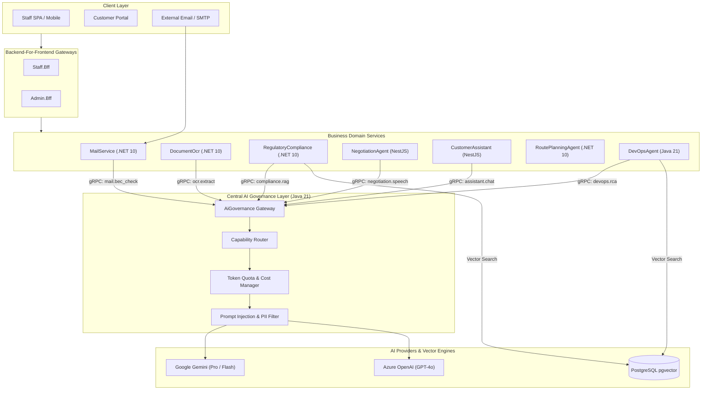
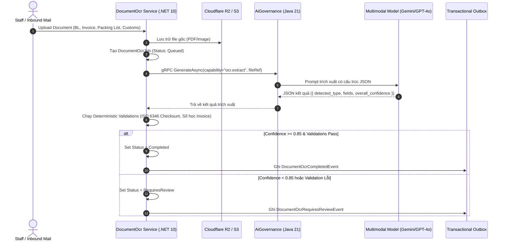
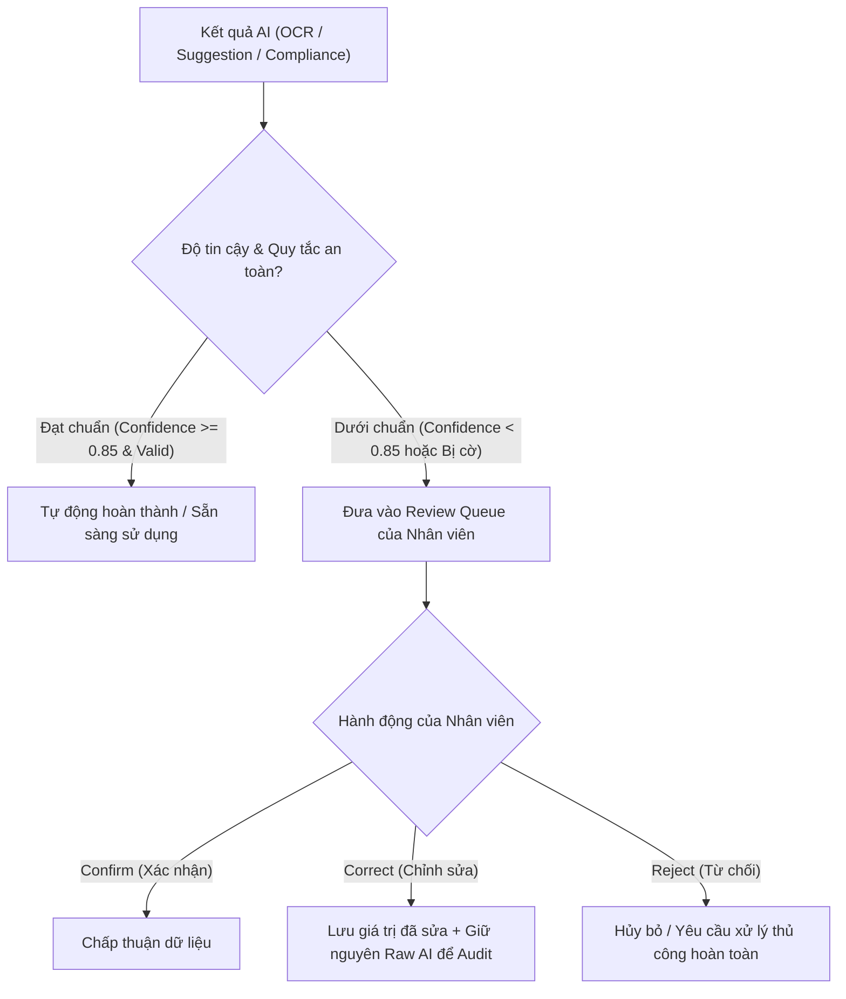
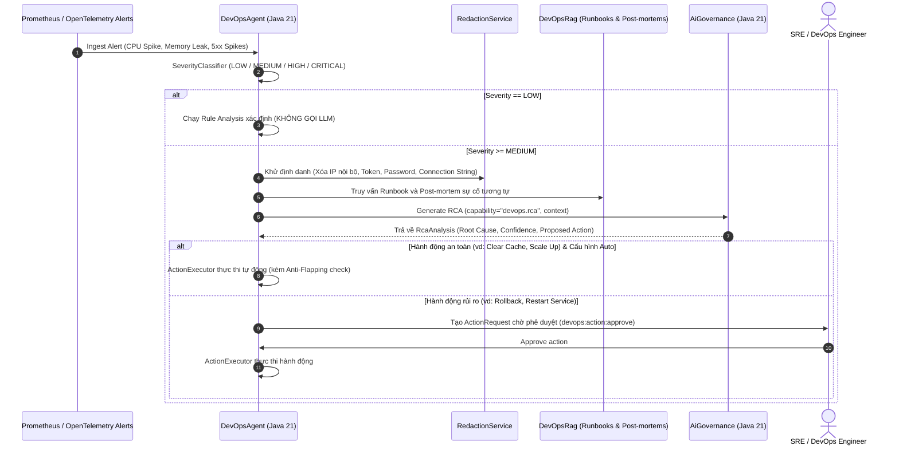
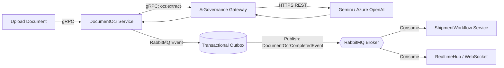
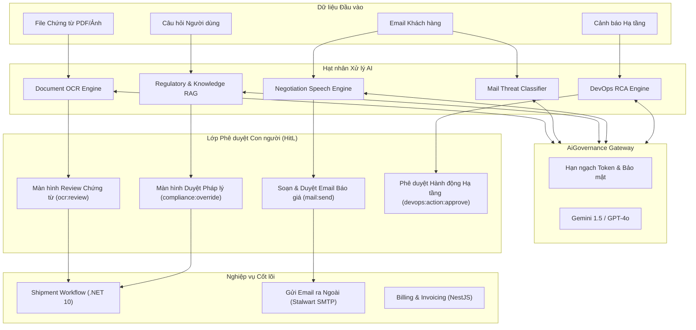

# Aurora AI System Overview

> **Tài liệu Kỹ thuật & Nghiệp vụ Kiến trúc Trí tuệ Nhân tạo (AI Architecture & Business Operations)**  
> **Source-of-Truth**: Phân tích và trích xuất trực tiếp từ mã nguồn thực tế (.NET 10, Java 21 Spring Boot, NestJS TypeScript, pgvector, Protobuf contracts).

---

## 1. Executive Summary

Trong nền tảng SaaS Logistics **Aurora**, AI không phải là một module nguyên khối độc lập và **không phải bất kỳ logic tự động hóa nào cũng được gọi là AI**. AI được tích hợp có chọn lọc theo mô hình **Hybrid (Deterministic Rules + Specialized AI Capabilities + Central Governance + Human-in-the-Loop)** nhằm giải quyết các bài toán xử lý phi cấu trúc, ngôn ngữ tự nhiên và tri thức phức tạp mà logic lập trình truyền thống không thể xử lý hiệu quả:

1. **Document OCR & Multimodal Extraction**: Trích xuất dữ liệu có cấu trúc từ các chứng từ vận tải, hải quan (Bill of Lading, Invoice, Packing List, Tờ khai hải quan) kết hợp kiểm tra checksum thuật toán ISO.
2. **Regulatory & Knowledge RAG (Retrieval-Augmented Generation)**: Tra cứu luật thương mại quốc tế, biểu thuế quan HS Code, quy định xuất nhập khẩu và SOP nội bộ của từng Tenant với cơ chế dẫn nguồn chính xác (Citations).
3. **Conversational Customer Assistant & Tool Calling**: Trợ lý hội thoại hỗ trợ khách hàng và nhân viên vận hành, tương tác với hệ thống qua cơ chế Function Calling (Shipment Tracking, Billing, Quy định).
4. **Negotiation Natural Language Generation**: Tạo đề xuất phản hồi thương lượng giá cước dựa trên khung giá và biên lợi nhuận được tính toán bằng công thức toán học xác định.
5. **DevOps Root Cause Analysis (RCA)**: Phân tích nguyên nhân gốc rễ sự cố hạ tầng và đề xuất phương án khắc phục dựa trên log, metric, trace và runbook.
6. **Email Security & Threat Scoring**: Phân tích nội dung email phòng chống lừa đảo doanh nghiệp (BEC - Business Email Compromise) và giả mạo danh tính.
7. **Centralized AI Governance Gateway**: Quản lý tập trung toàn bộ kết nối LLM (Gemini, Azure OpenAI), định tuyến capability, kiểm soát hạn ngạch token, lọc prompt injection và bảo vệ dữ liệu nhạy cảm.

---

## 2. Role of AI in Aurora

AI trong Aurora đóng vai trò là **Hệ thống Cố vấn (Advisor) & Nhân viên Trợ lý (Co-Pilot)**, tuyệt đối **KHÔNG PHẢI là Người Ra Quyết Định Độc Lập (Autonomous Decision Maker)** đối với các nghiệp vụ tài chính, pháp lý và cam kết vận tải:

* **Xử lý dữ liệu phi cấu trúc**: Chuyển đổi PDF, ảnh chụp chứng từ, email khách hàng, văn bản luật thành JSON có cấu trúc.
* **Gợi ý và Soạn thảo (Drafting)**: Tạo bản thảo phản hồi thương lượng giá, phân tích rủi ro tuyến đường, tổng hợp quy định hải quan.
* **Cảnh báo và Đánh giá (Scoring & Anomaly Detection)**: Tính điểm rủi ro email lừa đảo, phát hiện xung đột giữa SOP nội bộ và luật nhà nước.
* **Không tự ý thực hiện hành động rủi ro**: AI không được tự ý gửi email ra ngoài Internet, không được tự ý chỉnh sửa giá cước dưới giá sàn, không được tự động override vi phạm pháp lý và không được tự ý sửa đổi cơ sở dữ liệu nếu thiếu sự phê duyệt của con người khi độ tin cậy thấp.

---

## 3. AI Architecture

Hệ thống AI của Aurora được thiết kế theo kiến trúc phân tầng, phân tách hoàn toàn giữa **Domain Business Services** và **AI Infrastructure / Model Providers**:



---

## 4. AI Service Catalog

| Service | AI Capability Code | Kỹ thuật AI | Model / Provider | Input chính | Output chính | Service tiêu thụ | Trạng thái |
|---|---|---|---|---|---|---|---|
| **DocumentOcr** | `ocr.extract` | Multimodal OCR + Structured Extraction | Gemini 1.5 Flash / Azure OpenAI GPT-4o | File PDF / Ảnh chứng từ, hint loại tài liệu | JSON key-value có confidence score từng trường | `ShipmentWorkflow`, `Staff.Bff` | **IMPLEMENTED** |
| **RegulatoryCompliance** | `compliance.rag`, `compliance.assistant` | Embedding + Vector Search + Legal RAG | `text-embedding-3-small`, Gemini / GPT-4o, pgvector | Văn bản luật, câu hỏi nghiệp vụ, HS Code | Phân tích tuân thủ + Danh sách trích dẫn điều luật (Citations) | `ShipmentWorkflow`, `Staff.Bff` | **IMPLEMENTED** |
| **RegulatoryCompliance** | `knowledge.rag` | Tenant-Isolated Vector RAG | `text-embedding-3-small`, pgvector, LLM | SOP công ty, hợp đồng vận tải, TenantId | Câu trả lời nghiệp vụ nội bộ + Reference chunk | `CustomerAssistant`, `Staff.Bff` | **IMPLEMENTED** |
| **CustomerAssistant** | `assistant.chat` | Multi-turn Conversational AI + Tool Calling | Gemini / GPT-4o qua AiGovernance | Tin nhắn người dùng, lịch sử chat, Tool schema | Phản hồi tự nhiên + Lệnh gọi tool (`ShipmentLookup`, v.v.) | `Staff.Bff`, Portal | **IMPLEMENTED** |
| **NegotiationAgent** | `negotiation.speech` | LLM Natural Language Generation | Gemini / GPT-4o qua AiGovernance | Kết quả tính giá xác định, vòng đàm phán | Lời văn đàm phán tự nhiên (`SuggestedReplyDto`) | `Staff.Bff`, `MailService` | **IMPLEMENTED** |
| **DevOpsAgent** | `devops.rca` | DevOps Incident RAG + Root Cause Analysis | Gemini / GPT-4o qua AiGovernance | Alert metrics, redacted logs, traces, runbooks | Báo cáo nguyên nhân gốc rễ (RCA) + Hành động đề xuất | `Admin.Bff`, DevOps SRE | **IMPLEMENTED** |
| **MailService** | `mail.bec_check`, `mail.phishing` | Classification & Anomaly Detection | Gemini / Custom Classifier qua AiGovernance | Email headers, body text, thông tin người gửi | Điểm rủi ro Phishing/BEC, cờ cảnh báo lừa đảo | `MailService` Pipeline | **IMPLEMENTED** |
| **RoutePlanningAgent** | `route.plan` | Traffic Risk Scoring | LLM Prompt qua AiGovernance | Danh sách điểm dừng, dữ liệu thời tiết/sự cố | Điểm rủi ro thời tiết/ách tắc tuyến đường | `RoutePlanningAgent` | **IMPLEMENTED** |

---

## 5. Document OCR

### 5.1 Luồng xử lý dữ liệu (Data Pipeline Trace)



### 5.2 Các loại chứng từ được hỗ trợ thực tế trong code
1. **Bill of Lading (Vận đơn đường biển/hàng không)**: Số BL, số Container, số Seal, Cảng xếp hàng (POL), Cảng dỡ hàng (POD), Trọng lượng tổng (Gross Weight), Tên tàu/Số chuyến.
2. **Commercial Invoice (Hóa đơn thương mại)**: Số hóa đơn, Ngày hóa đơn, Người bán (Seller), Người mua (Buyer), Tiền tệ, Tổng giá trị, Đơn giá từng mục hàng.
3. **Packing List (Bảng kê chi tiết hàng hóa)**: Số kiện, Kích thước (CBM), Trọng lượng tịnh (Net Weight), Trọng lượng tổng (Gross Weight), Quy cách đóng gói.
4. **Customs Declaration (Tờ khai hải quan)**: Số tờ khai, Mã loại hình, Mã phân loại HS Code, Trị giá tính thuế, Luồng tờ khai (Xanh/Vàng/Đỏ).
5. **Certificate of Origin (Chứng nhận xuất xứ - C/O)**: Số form (Form E, Form D, EUR.1), Nước xuất xứ, Tiêu chí xuất xứ.

### 5.3 Thuật toán tính Confidence & Quy tắc `NEEDS_REVIEW`
* **Field-level Confidence**: Model trả về điểm tin cậy $[0.0, 1.0]$ cho từng trường dữ liệu.
* **ISO 6346 Container Checksum Validator** (`src/dotnet/DocumentOcr/Application/Jobs/DocumentOcrJobService.cs`):
  - Áp dụng thuật toán modulo-11 trên mã 4 ký tự + 6 số serial của container.
  - Nếu số kiểm tra (check digit) không khớp với ký tự thứ 11 $\rightarrow$ Đánh dấu `Severity: Error`, cưỡng chế trạng thái sang `RequiresReview`.
* **Invoice Arithmetic Validator**:
  - Kiểm tra $\sum (\text{Quantity} \times \text{Unit Price}) + \text{Tax} + \text{Freight} = \text{Total Amount}$.
  - Nếu sai lệch $\rightarrow$ Bật cờ `RequiresReview`.

---

## 6. Human-in-the-Loop (HitL)

Aurora triển khai kiến trúc Human-in-the-Loop nghiêm ngặt nhằm đảm bảo an toàn tuyệt đối cho dữ liệu doanh nghiệp:



### Bảng phân quyền và bảo vệ cơ chế Review

| Luồng nghiệp vụ | Quyền yêu cầu (Permission) | Dữ liệu AI gốc (Raw) có được lưu? | Dữ liệu sau sửa đổi (Corrected) lưu ở đâu? | Có Audit Trail không? |
|---|---|:---:|---|:---:|
| **Review OCR Document** | `ocr:review` | Có (`ExtractedDataJson`) | Có (`DocumentOcrValidation.CorrectedValue`) | Có (`ReviewedByUserId`, `ReviewedAt`) |
| **Duyệt Đề xuất Đàm phán Giá** | `mail:draft:create` + `mail:send` | Có (`SuggestedReplyDto` trong Session) | Tạo `EmailDraft` mới trong `MailService` | Có (`ActorId`, `SentByUserId`) |
| **Override Cảnh báo Pháp lý** | `compliance:override` | Có (`ComplianceFinding`) | Ghi `ComplianceEvaluation.OverriddenByUserId` + Lý do bắt buộc | Có (`ComplianceEvaluationStatus.Overridden`) |
| **Phê duyệt Tuyến đường Rủi ro Cao** | `route_planning:approve` | Có (`RiskAssessment.Score`) | Ghi `ApprovalRequest` + `RouteDecisionAuditLog` | Có (`ApprovedByUserId`, `ApprovedAt`) |
| **Phê duyệt Hành động DevOps SRE** | `devops:action:approve` | Có (`RcaAnalysis.Recommendations`) | Ghi `ActionRequest.ApprovedBy` | Có (`AuditEventOutbox`) |

---

## 7. Regulatory Compliance RAG

### 7.1 Pipeline Ingestion (Nạp văn bản luật)
```
Văn bản pháp lý (Luật Hải quan, Thông tư, Nghị định, Biểu thuế HS Code)
  │
  ▼
DeterministicRegulatoryChunker (.NET 10)
  ├── Tách đoạn theo cấu trúc: Điều, Khoản, Mục, Chương
  ├── Bảo toàn Metadata: Số văn bản, Cơ quan ban hành, Ngày hiệu lực, Mã quốc gia
  │
  ▼
Embedding Generator (IEmbeddingProvider qua AiGovernance)
  ├── Model: text-embedding-3-small (Vector 1536 chiều)
  │
  ▼
PostgreSQL pgvector (Bảng: regulatory_chunks)
  └── Index HNSW (Hierarchical Navigable Small World, Cosine Distance)
```

### 7.2 Pipeline Truy vấn & Đánh giá Tuân thủ (Runtime Query & Evaluation)
```
Yêu cầu kiểm tra lô hàng (Origin, Destination, HS Code, Commodity)
  │
  ▼
RegulationRetrievalService
  ├── Bước 1: Exact Match theo Mã HS Code & Danh mục cấm vận
  ├── Bước 2: Vector Similarity Search trên pgvector (Top-K = 20, Cosine Score >= 0.78)
  ├── Bước 3: Reciprocal Rank Fusion (RRF) kết hợp kết quả
  │
  ▼
GroundedAnswerPromptBuilder
  ├── Đóng gói văn bản luật vào thẻ <evidence id="R1" authority="..." section="...">
  ├── Thiết lập nguyên tắc: CHỈ được trả lời từ Evidence, CẤM bịa đặt điều luật
  │
  ▼
AiGovernance.GenerateAsync(capability="compliance.rag")
  │
  ▼
DeterministicCitationValidator
  ├── Kiểm tra mọi trích dẫn trong câu trả lời có trỏ đúng ID chunk hợp lệ không
  └── Nếu không có Citation hợp lệ $\rightarrow$ Hủy kết quả, đánh dấu `RequiresReview`
```

---

## 8. Tenant Knowledge RAG

### 8.1 Sự khác biệt cốt lõi giữa Regulatory RAG và Knowledge RAG

| Tiêu chí | Regulatory Compliance RAG | Tenant Knowledge RAG |
|---|---|---|
| **Phạm vi tri thức** | **Toàn cầu / Toàn hệ thống (Global)**: Luật nhà nước, Nghị định, Công ước quốc tế. | **Riêng biệt từng Tenant (Private)**: Quy trình SOP công ty, Hợp đồng đại lý, Bảng giá nội bộ. |
| **Cơ chế cách ly dữ liệu** | Dữ liệu public dùng chung cho mọi Tenant theo `JurisdictionCode` (VN, US, EU). | **Bắt buộc lọc `tenant_id`**: Tenant A tuyệt đối không thể đọc SOP của Tenant B. |
| **Bảng lưu trữ** | `regulatory_documents`, `regulatory_chunks` | `knowledge_documents`, `knowledge_chunks` |
| **Thứ bậc ưu tiên** | **Tối cao về mặt pháp lý (Legal Precedence)**. | Thứ cấp. Nếu SOP nội bộ mâu thuẫn với Luật $\rightarrow$ Hệ thống cảnh báo xung đột (`conflicts` array). |

### 8.2 Cơ chế lọc Tenant trong mã nguồn
Trong `KnowledgeIngestionService.cs` và `RegulationRetrievalService.cs`, mọi truy vấn đều áp dụng global tenant filter:
```csharp
var tenantId = currentUser.TenantId ?? throw new UnauthorizedAccessException();
var chunks = await dbContext.KnowledgeChunks
    .Where(c => c.TenantId == tenantId && c.DocumentVersion.Status == VersionStatus.Active)
    .ToListAsync();
```

---

## 9. DevOps AI & Root Cause Analysis (RCA)

### 9.1 Luồng xử lý sự cố hạ tầng



---

## 10. AI Governance

Dịch vụ **`AiGovernance`** (Java 21 / Spring Boot) đóng vai trò cổng kiểm soát trung tâm toàn bộ hoạt động AI của Aurora:

```
Domain Microservices (.NET, NestJS, Java)
                  │
                  ▼ (gRPC Port 50051)
┌─────────────────────────────────────────────────────────────┐
│                 Central AiGovernance Service                │
│  ├── 1. Tenant Authentication & Quota Verification          │
│  ├── 2. Capability Resolution & Prompt Formatting           │
│  ├── 3. Dynamic Model Provider Routing & Fallback           │
│  ├── 4. Inbound / Outbound Prompt Injection Defense         │
│  └── 5. Token Billing, Cost Calculation & Immutable Audit   │
└──────────────┬───────────────────────────────┬──────────────┘
               │                               │
               ▼                               ▼
       [ Google Gemini API ]         [ Azure OpenAI API ]
```

### Ma trận trạng thái chức năng AI Governance

| Chức năng | Trạng thái triển khai | Bằng chứng mã nguồn |
|---|:---:|---|
| **Capability-Based Routing** | **IMPLEMENTED** | `ProviderRoutingServiceImpl.java`, `AiExecutionService.java` |
| **Multi-Provider Adapters (Gemini, Azure OpenAI)** | **IMPLEMENTED** | `GeminiProviderAdapter.java`, `AzureOpenAiProviderAdapter.java` |
| **Token Quota & Monthly Spend Limit** | **IMPLEMENTED** | `GovernancePolicyService.java`, `QuotaSyncService.java` |
| **Redis Realtime Token Bucket Rate Limiting** | **IMPLEMENTED** | `TenantCacheService.java`, `PeriodKeyCalculator.java` |
| **Prompt Injection & PII Sanitization** | **IMPLEMENTED** | `SecurityFilter.java`, `RedactionService.java` |
| **Immutable Invocation Audit Trail** | **IMPLEMENTED** | `AiInvocationAuditJpaRepository.java` |
| **Dynamic Model Fallback (Primary $\rightarrow$ Secondary)** | **IMPLEMENTED** | `ProviderRoutingServiceImpl.java` |

---

## 11. AI trong Shipment Automation

Bảng phân định ranh giới rõ ràng giữa AI, Thuật toán Tối ưu hóa (Optimization) và Logic nghiệp vụ xác định (Deterministic Logic):

| Bước trong Workflow | Công nghệ sử dụng | Thực sự dùng AI? | Bản chất kỹ thuật |
|---|---|:---:|---|
| **1. Nhận email & Tách luồng** | Stalwart Mail Server + .NET Pipeline | **Không** | Deterministic Protocol (RFC 5322, SMTP, IMAP) |
| **2. Quét mã độc & Chống Spam** | ClamAV Daemon + Apache SpamAssassin | **Không** | Deterministic Antivirus Signatures & Heuristics |
| **3. Kiểm tra Email Lừa đảo (BEC)** | AiGovernance (`mail.bec_check`) | **Có** | LLM Semantic Intent Classification |
| **4. Trích xuất dữ liệu chứng từ** | DocumentOcr + AiGovernance (`ocr.extract`) | **Có** | Multimodal OCR + Structured JSON Extraction |
| **5. Kiểm tra mã Container** | ISO 6346 Checksum Validator | **Không** | Thuật toán toán học Modulo-11 |
| **6. Đánh giá rủi ro đàm phán giá** | `NegotiationStrategyDomainService` | **Không** | Thuật toán tài chính xác định (Concession Curve) |
| **7. Soạn thảo phản hồi báo giá** | AiGovernance (`negotiation.speech`) | **Có** | LLM Natural Language Generation |
| **8. Tạo đơn hàng (Shipment)** | `ShipmentWorkflow` (.NET 10) | **Không** | Deterministic CQRS + PostgreSQL Transaction |
| **9. Tối ưu hóa tuyến đường đa điểm** | **VROOM + OSRM** | **Không (Optimization)** | **Metaheuristics / Operations Research (CVRPTW)** |
| **10. Đánh giá rủi ro tuyến đường** | Composite Risk Engine + AiGovernance (`route.plan`) | **Hybrid** | Điểm cơ bản là công thức toán; điểm thời tiết do AI dự đoán |
| **11. Tra cứu địa lý Geofence GPS** | Haversine Formula + Ray-Casting Algorithm | **Không** | Thuật toán hình học không gian (Spatial Math) |
| **12. Kiểm tra hạn mức tín dụng** | `BillingService` (NestJS) | **Không** | Phép tính số học số dư nợ (Decimal.js) |
| **13. Gửi thông báo đa kênh** | `Notification` (.NET 10) + MassTransit | **Không** | Event-Driven Message Broker (RabbitMQ) |

---

## 12. AI Event & Communication Flow

Tất cả các dịch vụ nghiệp vụ giao tiếp với AI thông qua giao thức đồng bộ **gRPC** hiệu năng cao và phát sinh sự kiện bất đồng bộ qua **RabbitMQ**:



### Bảng các sự kiện tích hợp AI (Integration Events)

| Tên Event (Event Type) | Service phát ra (Producer) | Service tiêu thụ (Consumer) | Ý nghĩa nghiệp vụ |
|---|---|---|---|
| `DocumentOcrCompletedEvent` | `DocumentOcr` | `ShipmentWorkflow`, `RealtimeHub` | Báo tin chứng từ đã được trích xuất thành công và sẵn sàng gắn vào đơn hàng. |
| `DocumentOcrRequiresReviewEvent` | `DocumentOcr` | `RealtimeHub` | Báo cho nhân viên có chứng từ độ tin cậy thấp cần vào màn hình review. |
| `ComplianceEvaluationCompletedEvent` | `RegulatoryCompliance` | `ShipmentWorkflow` | Báo kết quả kiểm tra tuân thủ pháp luật hải quan của lô hàng. |
| `EmailQuarantinedEvent` | `MailService` | `RealtimeHub`, `Admin.Bff` | Cảnh báo email chứa mã độc hoặc điểm phishing BEC vượt ngưỡng an toàn. |
| `IncidentRcaCompletedEvent` | `DevOpsAgent` | `Admin.Bff`, `Notification` | Báo cáo phân tích nguyên nhân gốc rễ sự cố kỹ thuật hoàn tất. |

---

## 13. AI Decision Authority

| Năng lực AI | Đầu ra của AI | Tự động thực hiện? | Cần con người duyệt? | Permission yêu cầu | Tác động nghiệp vụ thực tế |
|---|---|:---:|:---:|---|---|
| **Document OCR** | Dữ liệu JSON các trường | Chỉ khi Confidence $\ge 0.85$ | Có (nếu $< 0.85$) | `ocr:review` | Điền thông tin vào Bill of Lading, Packing List, Invoice |
| **Negotiation Speech** | Soạn thảo email báo giá | **Không** | **Bắt buộc 100%** | `mail:draft:create`, `mail:send` | Gửi email đề xuất giá cước tới khách hàng |
| **Regulatory RAG** | Đánh giá tuân thủ & Citation | Chỉ đưa khuyến nghị | Có (khi muốn override) | `compliance:override` | Phát hiện hàng cấm, sai thuế suất HS Code |
| **DevOps RCA** | Báo cáo nguyên nhân & Action | Chỉ các action an toàn | Có (với action rủi ro) | `devops:action:approve` | Khắc phục sự cố hạ tầng hệ thống |
| **Email BEC Check** | Điểm rủi ro lừa đảo | Tự động cách ly email | Có (để mở khóa email) | `mail:quarantine:release` | Ngăn chặn nhân viên chuyển tiền vào tài khoản lừa đảo |
| **Route Risk AI** | Điểm rủi ro thời tiết/tuyến | Chỉ cảnh báo | Có (nếu rủi ro Cao) | `route_planning:approve` | Quyết định điều phối xe đi đường vòng hay đường chính |

---

## 14. AI Failure & Fallback Behavior

Mọi luồng AI trong Aurora đều được thiết kế theo nguyên tắc **Graceful Degradation** (Suy giảm hiệu năng có kiểm soát, không sập hệ thống):

```
                       ┌────────────────────────────┐
                       │   Yêu cầu gọi dịch vụ AI   │
                       └─────────────┬──────────────┘
                                     │
                                     ▼
                      ┌──────────────────────────────┐
                      │  AiGovernance / Circuit Brk  │
                      └──────────────┬───────────────┘
                                     │
                   ┌─────────────────┴─────────────────┐
                   ▼                                   ▼
             [Thành công]                        [Mất kết nối / Timeout]
                   │                                   │
                   ▼                                   ▼
          Xử lý kết quả AI                     ┌──────────────────────────────┐
                                               │   Kích hoạt Luồng Fallback   │
                                               └──────────────┬───────────────┘
                                                              │
                    ┌─────────────────────────────────────────┼─────────────────────────────────────────┐
                    ▼                                         ▼                                         ▼
         [Document OCR Fallback]                  [Negotiation Fallback]                   [Compliance RAG Fallback]
         Chuyển sang trạng thái                   Sử dụng Template văn bản                 Chuyển sang tìm kiếm từ khóa
         RequiresReview để nhập tay               định sẵn theo công thức                  chính xác (SQL Keyword Match)
```

1. **Document OCR Failure**: Nếu OCR provider sập hoặc file hỏng $\rightarrow$ Hệ thống chuyển job sang `RequiresReview` hoặc `Failed`, cho phép nhân viên mở file PDF gốc và nhập liệu thủ công trên giao diện web. Đơn hàng không bị kẹt.
2. **Negotiation AI Failure**: Nếu AI sinh lời văn sập $\rightarrow$ Hệ thống lấy trực tiếp con số counter-offer từ `NegotiationStrategyDomainService` và ghép vào mẫu email định sẵn (`"Dear Customer, we counter-offer $X..."`).
3. **Regulatory RAG Failure**: Nếu vector embedding sập $\rightarrow$ Hệ thống tự động fallback về câu lệnh SQL tìm kiếm từ khóa chính xác (`WHERE hs_code LIKE ...`) để không làm gián đoạn việc tra cứu biểu thuế cơ bản.
4. **DevOps AI Failure**: Nếu LLM sập $\rightarrow$ DevOps Agent sử dụng bộ Rule Engine tĩnh để cảnh báo dựa trên ngưỡng metric.

---

## 15. AI vs Non-AI Components

Để tránh hiểu nhầm mọi tính năng tự động hóa là AI, dưới đây là danh sách phân định rõ ràng:

### Các tính năng thực sự sử dụng AI (AI Capabilities):
* **Multimodal OCR**: Trích xuất ngữ nghĩa và cấu trúc bảng từ ảnh/PDF chứng từ.
* **Vector Semantic Search & RAG**: Tìm kiếm theo ngữ nghĩa và trích dẫn điều luật hải quan.
* **Conversational AI & Intent Classification**: Hiểu ngôn ngữ tự nhiên và chuyển thành lời gọi công cụ (Tool Calling).
* **LLM Content Generation**: Soạn thảo email thương lượng giá cước và giải thích quy định.
* **Threat & Phishing NLP Scoring**: Phát hiện mẫu câu giả mạo danh tính lãnh đạo hoặc thay đổi tài khoản ngân hàng.

### Các thành phần KHÔNG PHẢI LÀ AI (Deterministic Automation & Optimization):
* **VROOM & OSRM**: Thuật toán nghiên cứu vận trù học (Operations Research), lý thuyết đồ thị và metaheuristics giải bài toán tối ưu đường đi CVRPTW.
* **MassTransit & RabbitMQ**: Hệ thống phân phối sự kiện (Message Broker) và hàng đợi tin nhắn.
* **ISO 6346 Validator**: Thuật toán kiểm tra số kiểm tra container theo công thức toán học xác định.
* **Redis Rate Limiter**: Thuật toán Sliding-Window Counter đếm số lượng request.
* **Spatial Geofencing**: Công thức lượng giác Haversine và thuật toán Ray-Casting hình học không gian.
* **Financial Rating Engine**: Công thức số học tính cước theo trọng lượng thể tích IATA và tỷ giá hối đoái.
* **IAM & RBAC**: Hệ thống phân quyền dựa trên token và so sánh chuỗi permission.

---

## 16. Business Value

1. **Giảm thiểu thời gian nhập liệu chứng từ**: Document OCR tự động điền các thông tin phức tạp từ Bill of Lading, Packing List vào hệ thống, nhân viên chỉ cần kiểm tra lại các trường có cảnh báo.
2. **Loại bỏ rủi ro vi phạm pháp lý hải quan**: Regulatory RAG tự động rà soát hàng hóa đối chiếu với quy định cấm vận và biểu thuế xuất nhập khẩu, kèm trích dẫn chính xác số hiệu điều luật giúp nhân viên hải quan an tâm giải trình.
3. **Bảo vệ an toàn tài chính tuyệt đối trong đàm phán giá**: Kết hợp giữa thuật toán khóa giá sàn (Floor Price) và AI soạn thảo giúp tự động hóa phản hồi báo giá cho khách hàng 24/7 mà không sợ nhân viên hoặc AI báo giá nhầm làm lỗ doanh nghiệp.
4. **Ngăn chặn triệt để tấn công lừa đảo chuyển tiền (BEC)**: Email Security AI phát hiện kịp thời các email mạo danh đối tác yêu cầu đổi số tài khoản thanh toán cước tàu.
5. **Đẩy nhanh tốc độ xử lý sự cố hệ thống**: DevOps RCA Agent tự động thu thập log, metric và runbook để chỉ ra nguyên nhân sự cố trong vài phút thay vì hàng giờ điều tra thủ công.

---

## 17. Current Implementation Status

* **Document OCR Pipeline**: **`IMPLEMENTED`** (`src/dotnet/DocumentOcr/`)
* **Regulatory Compliance Legal RAG & Citations**: **`IMPLEMENTED`** (`src/dotnet/RegulatoryCompliance/`)
* **Tenant Knowledge RAG**: **`IMPLEMENTED`** (`src/dotnet/RegulatoryCompliance/Application/Ingestion/KnowledgeIngestionService.cs`)
* **Customer Assistant & Tool Execution**: **`IMPLEMENTED`** (`src/nestjs/customer-assistant-service/`)
* **Negotiation Strategy & Speech Linkage**: **`IMPLEMENTED`** (`src/nestjs/negotiation-agent-service/`)
* **DevOps RCA Agent & Redaction**: **`IMPLEMENTED`** (`src/java/devops-agent/`)
* **Central AI Governance Gateway & Model Routing**: **`IMPLEMENTED`** (`src/java/ai-governance/`)
* **Email BEC Security Scoring**: **`IMPLEMENTED`** (`src/dotnet/MailService/Application/Pipeline/Stages/InboundStages.cs`)

---

## 18. Gaps & Risks

| Hạng mục | Hiện trạng | Khoảng trống cần hoàn thiện (Gap) | Rủi ro nếu chưa xử lý |
|---|---|---|---|
| **OCR Mobile Pre-processing** | Nhận diện tốt file PDF/ảnh scan phẳng | Chưa có bộ tự động nắn góc ảnh chụp nghiêng từ điện thoại (Perspective Un-skew) | Ảnh chụp thực địa bị méo làm giảm điểm confidence |
| **Regulatory Vector Re-indexing** | Nạp và đánh chỉ mục vector thủ công | Chưa có cronjob tự động re-index vector định kỳ khi có biểu thuế mới | Dữ liệu tra cứu có thể bị chậm cập nhật so với văn bản mới nhất |
| **DevOps Agent Action Safety** | Có Anti-flapping và duyệt tay | Chưa có sandbox dry-run trước khi thực thi lệnh kubectl | Rủi ro lệnh restart không giải quyết được lỗi gốc |

---

## 19. Architecture Diagrams

### Toàn cảnh Luồng dữ liệu AI trong Aurora



---

## 20. Conclusion

1. **AI đóng vai trò gì trong Aurora?**  
   AI đóng vai trò là tầng **Trợ lý thông minh và Phân tích tri thức** hỗ trợ tự động hóa các khâu xử lý tài liệu, tra cứu pháp luật, phát hiện đe dọa email và soạn thảo đề xuất nghiệp vụ.
2. **Những business capability nào bắt buộc phụ thuộc AI?**  
   Khả năng tự động trích xuất chứng từ đa định dạng (Multimodal OCR), tra cứu ngữ nghĩa văn bản luật (Semantic Legal Search) và phân tích rủi ro email lừa đảo (BEC Detection).
3. **Những capability nào được AI hỗ trợ nhưng vẫn hoạt động thủ công được?**  
   Đàm phán giá cước (có thể nhập email thủ công), điều phối tuyến đường (VROOM tự chạy tối ưu toán học), kiểm tra tuân thủ (có thể tra cứu biểu thuế bằng mã chính xác) và xử lý sự cố hạ tầng.
4. **AI có quyền quyết định/thực hiện business action tới mức nào?**  
   AI **không có quyền tối cao**. Mọi hành động tài chính, gửi thư ra bên ngoài, thay đổi trạng thái đơn hàng hoặc override pháp lý đều phải có sự xác nhận của người dùng có thẩm quyền.
5. **Nếu loại bỏ toàn bộ AI khỏi Aurora, điều gì xảy ra?**  
   Hệ thống **vẫn hoạt động bình thường** ở các chức năng cốt lõi (Tạo đơn hàng, Tối ưu tuyến đường VROOM, Bắn tọa độ GPS, Tính cước IATA, Phát hành hóa đơn, Gửi nhận email thông thường). Hệ thống chỉ mất đi khả năng tự động đọc chứng từ, trợ lý chat tự nhiên và cảnh báo an ninh nâng cao.

---

## Appendix A — AI APIs

* `POST /api/v1/ocr/upload` (`Staff.Bff.Controllers.DocumentsController`): Upload chứng từ để xử lý OCR.
* `POST /api/v1/ocr/{id}/review` (`Staff.Bff.Controllers.DocumentsController`): Nhân viên chỉnh sửa và phê duyệt kết quả OCR.
* `POST /api/v1/negotiations/{id}/mail-draft` (`Staff.Bff.Controllers.NegotiationsController`): Chuyển đề xuất AI thành bản thảo Email Draft.
* `POST /api/v1/compliance/evaluations/{id}/override` (`Staff.Bff.Controllers.ComplianceController`): Cán bộ tuân thủ override cờ cảnh báo pháp lý.
* `POST /api/v1/assistant/chat` (`Staff.Bff.Controllers.AssistantController`): Gửi tin nhắn tới trợ lý ảo hỗ trợ công cụ.

---

## Appendix B — AI Events

* `DocumentOcrCompletedEvent` (RabbitMQ): Báo hoàn thành trích xuất tài liệu.
* `DocumentOcrRequiresReviewEvent` (RabbitMQ): Yêu cầu nhân viên review tài liệu độ tin cậy thấp.
* `ComplianceEvaluationCompletedEvent` (RabbitMQ): Báo hoàn tất đánh giá tuân thủ hải quan.
* `EmailQuarantinedEvent` (RabbitMQ): Cảnh báo email bị cô lập do phát hiện lừa đảo/mã độc.
* `IncidentRcaCompletedEvent` (RabbitMQ): Báo cáo kết quả phân tích nguyên nhân gốc rễ sự cố.

---

## Appendix C — Source Code References

* **Document OCR Pipeline**: `src/dotnet/DocumentOcr/Application/Jobs/DocumentOcrJobService.cs` $\rightarrow$ `DocumentOcrJobService.ProcessJobAsync()`
* **Prompt Builder OCR**: `src/dotnet/DocumentOcr/Application/Providers/OcrPromptBuilder.cs` $\rightarrow$ `OcrPromptBuilder.BuildPrompt()`
* **AI Governance OCR Provider**: `src/dotnet/DocumentOcr/Infrastructure/Providers/AiGovernanceOcrProvider.cs` $\rightarrow$ `AiGovernanceOcrProvider.ExtractAsync()`
* **Regulatory Ingestion & Chunker**: `src/dotnet/RegulatoryCompliance/Application/Ingestion/RegulatoryIngestionService.cs` $\rightarrow$ `RegulatoryIngestionService.IngestAsync()`
* **Knowledge Ingestion Service**: `src/dotnet/RegulatoryCompliance/Application/Ingestion/KnowledgeIngestionService.cs` $\rightarrow$ `KnowledgeIngestionService.IngestAsync()`
* **Grounded RAG Answer Builder**: `src/dotnet/RegulatoryCompliance/Application/Assistant/GroundedAnswerPromptBuilder.cs` $\rightarrow$ `GroundedAnswerPromptBuilder.BuildPrompt()`
* **AI Governance Router**: `src/java/ai-governance/src/main/java/com/aurora/aigovernance/gateway/application/routing/ProviderRoutingServiceImpl.java`
* **DevOps RCA Orchestrator**: `src/java/devops-agent/src/main/java/com/aurora/devopsagent/Application/Services/RcaOrchestratorService.java` $\rightarrow$ `RcaOrchestratorService.executeRca()`
* **Negotiation Deterministic Strategy**: `src/nestjs/negotiation-agent-service/src/domain/services/negotiation-strategy.domain-service.ts` $\rightarrow$ `NegotiationStrategyDomainService.determineDecision()`
* **Customer Assistant Tool Registry**: `src/nestjs/customer-assistant-service/src/application/tools/tool-registry.service.ts`
