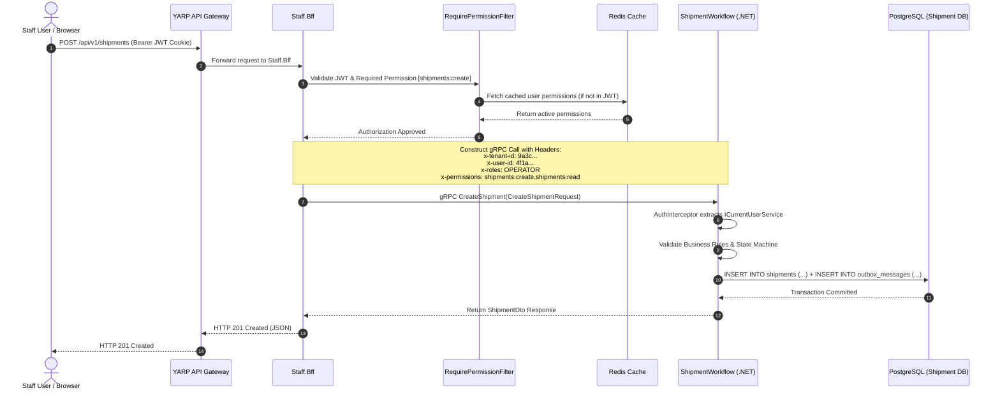
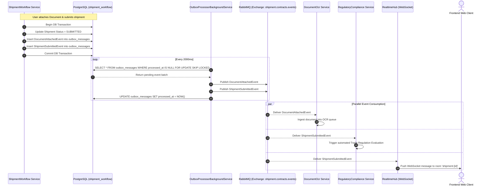
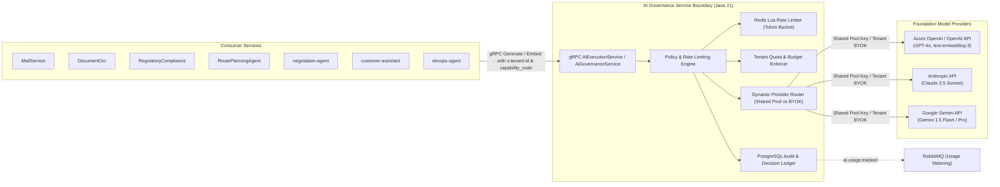
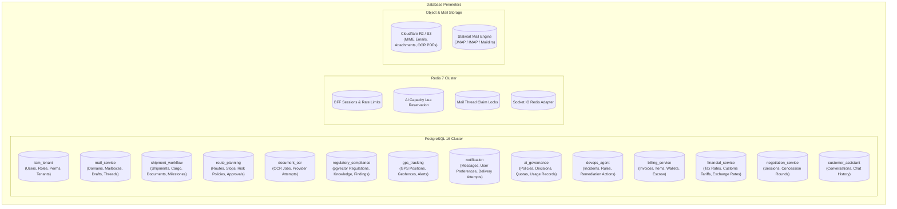
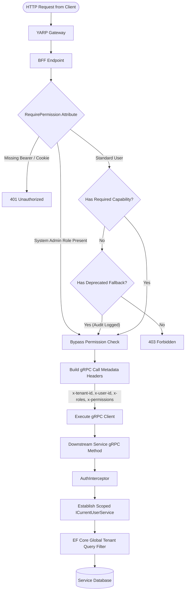

# Aurora Server — System Architecture & Topology Specification

> **Source-of-Truth Architectural Audit**: Detailed technical blueprints, sequence models, component relationships, database boundaries, and security perimeters.

---

## 1. System Topology & Network Perimeters

```mermaid
graph TD
    subgraph ClientLayer ["Client Layer"]
        SPA["Aurora Web App (React / Next.js)"]
        Mobile["Aurora Mobile App"]
    end

    subgraph IngressGateway ["Ingress & Reverse Proxy Layer"]
        YARP["YARP API Gateway (:5000 / :443)"]
    end

    subgraph BFFLayer ["Backend-For-Frontend (BFF) Layer"]
        StaffBFF["Staff.Bff (:5001)<br/>(Operators / Customs / Finance)"]
        AdminBFF["Admin.Bff (:5002)<br/>(Tenant Admins)"]
        SystemBFF["System.Bff (:5003)<br/>(Super Administrators)"]
        RealtimeHub["RealtimeHub (:5004)<br/>(WebSocket Gateway)"]
    end

    subgraph SecurityInfra ["Security & Identity"]
        Cognito["AWS Cognito / Azure AD"]
        RedisCluster["Redis Cluster (Distributed Cache / Rate Limiter)"]
    end

    subgraph CoreServicesDotNet [".NET 10 Microservices (gRPC)"]
        IamSvc["IamTenant (:5100)"]
        ShipmentSvc["ShipmentWorkflow (:5101)"]
        RouteSvc["RoutePlanningAgent (:5102)"]
        MailSvc["MailService (:5103)"]
        OcrSvc["DocumentOcr (:5104)"]
        ComplianceSvc["RegulatoryCompliance (:5105)"]
        GpsSvc["GpsTracking (:5106)"]
        NotificationSvc["Notification (:5107)"]
    end

    subgraph JavaServices ["Java 21 / Spring Boot Microservices"]
        AiGovSvc["ai-governance (:5200)"]
        DevOpsSvc["devops-agent (:5201)"]
    end

    subgraph NestJsServices ["NestJS Microservices"]
        BillingSvc["billing-service (:5300)"]
        FinancialSvc["financial-service (:5301)"]
        NegotiationSvc["negotiation-agent (:5302)"]
        AssistantSvc["customer-assistant (:5303)"]
    end

    subgraph MessageBus ["Event Streaming & Transactional Outbox"]
        RabbitMQ["RabbitMQ Cluster (AMQP)"]
    end

    SPA -->|HTTPS| YARP
    Mobile -->|HTTPS| YARP
    SPA -->|WSS| RealtimeHub

    YARP -->|Route /api/v1/*| StaffBFF
    YARP -->|Route /api/v1/admin/*| AdminBFF
    YARP -->|Route /api/v1/system/*| SystemBFF

    StaffBFF --> Cognito
    AdminBFF --> Cognito
    SystemBFF --> Cognito

    StaffBFF --> RedisCluster
    AdminBFF --> RedisCluster
    SystemBFF --> RedisCluster
    RealtimeHub --> RedisCluster

    StaffBFF -->|gRPC| IamSvc
    StaffBFF -->|gRPC| ShipmentSvc
    StaffBFF -->|gRPC| RouteSvc
    StaffBFF -->|gRPC| MailSvc
    StaffBFF -->|gRPC| OcrSvc
    StaffBFF -->|gRPC| ComplianceSvc
    StaffBFF -->|gRPC| GpsSvc
    StaffBFF -->|gRPC| NotificationSvc
    StaffBFF -->|gRPC| BillingSvc
    StaffBFF -->|gRPC| FinancialSvc
    StaffBFF -->|gRPC| NegotiationSvc
    StaffBFF -->|HTTP| AssistantSvc

    AdminBFF -->|gRPC| IamSvc
    AdminBFF -->|gRPC| MailSvc
    AdminBFF -->|gRPC| RouteSvc
    AdminBFF -->|gRPC| ComplianceSvc
    AdminBFF -->|gRPC| AiGovSvc

    SystemBFF -->|gRPC| IamSvc
    SystemBFF -->|gRPC| MailSvc
    SystemBFF -->|gRPC| ComplianceSvc
    SystemBFF -->|gRPC| DevOpsSvc

    %% Internal Microservice to Microservice gRPC
    RouteSvc -->|gRPC| ComplianceSvc
    BillingSvc -->|gRPC| FinancialSvc
    NegotiationSvc -->|gRPC| FinancialSvc
    AssistantSvc -->|gRPC| ComplianceSvc
    AssistantSvc -->|gRPC| ShipmentSvc
    AssistantSvc -->|gRPC| BillingSvc

    %% AI Governance Clients
    MailSvc -->|gRPC| AiGovSvc
    OcrSvc -->|gRPC| AiGovSvc
    ComplianceSvc -->|gRPC| AiGovSvc
    RouteSvc -->|gRPC| AiGovSvc
    NegotiationSvc -->|gRPC| AiGovSvc
    AssistantSvc -->|gRPC| AiGovSvc
    DevOpsSvc -->|gRPC| AiGovSvc

    %% Event Bus Connections
    ShipmentSvc -.->|Outbox CDC| RabbitMQ
    RouteSvc -.->|Outbox CDC| RabbitMQ
    MailSvc -.->|Outbox CDC| RabbitMQ
    OcrSvc -.->|Outbox CDC| RabbitMQ
    ComplianceSvc -.->|Outbox CDC| RabbitMQ
    GpsSvc -.->|Outbox CDC| RabbitMQ
    IamSvc -.->|Outbox CDC| RabbitMQ
    BillingSvc -.->|Publish Event| RabbitMQ
    NegotiationSvc -.->|Publish Event| RabbitMQ
    AiGovSvc -.->|Outbox CDC| RabbitMQ
    DevOpsSvc -.->|Outbox CDC| RabbitMQ

    RabbitMQ -.->|Consume| NotificationSvc
    RabbitMQ -.->|Consume| RealtimeHub
    RabbitMQ -.->|Consume| BillingSvc
    RabbitMQ -.->|Consume| DocumentOcr
    RabbitMQ -.->|Consume| RegulatoryCompliance
    RabbitMQ -.->|Consume| GpsSvc
    RabbitMQ -.->|Consume| MailSvc
```

---

## 2. End-to-End Synchronous gRPC Sequence

The sequence diagram below illustrates synchronous orchestration with security metadata propagation:

---

## 3. Asynchronous Event-Driven Flow (Transactional Outbox Pattern)

The asynchronous event processing architecture guarantees zero message loss during database updates:

---

## 4. AI Governance Gateway & Model Routing Boundary

---

## 5. Database Ownership & Storage Architecture

Aurora adheres strictly to the **Database-per-Service** architectural pattern. No service shares database instances or tables directly with another service.

---

## 6. Security & Permission Evaluation Pipeline

