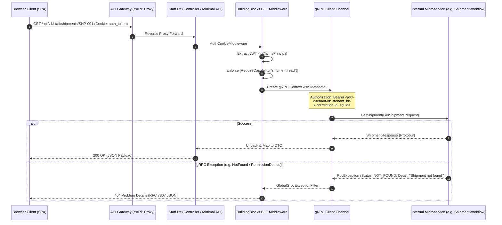

# Backend For Frontend (BFF) & API Gateway — Technical Deep Dive

> **Document Type**: Architecture & Engineering Deep-Dive  
> **Source Code**: `src/dotnet/BFF/BuildingBlocks.BFF`, `src/dotnet/BFF/Staff.Bff`, `src/dotnet/BFF/Admin.Bff`, `src/dotnet/BFF/System.Bff`, `src/dotnet/BFF/API.Gateway`

---

## 1. Request Flow & Protocol Translation Pipeline

---

## 2. Core BuildingBlocks Components

### 2.1 gRPC Error Translation (`GlobalGrpcExceptionFilter` / `GrpcErrorMapper`)
Translates internal gRPC `StatusCode` to standardized HTTP Status Codes:

| gRPC Status Code | HTTP Status Code | RFC 7807 Error Code | Description |
|---|---|---|---|
| `OK` (0) | `200 OK` | - | Success |
| `INVALID_ARGUMENT` (3) | `400 Bad Request` | `VALIDATION_FAILED` | Invalid payload or constraint violation |
| `NOT_FOUND` (5) | `404 Not Found` | `RESOURCE_NOT_FOUND` | Entity does not exist |
| `ALREADY_EXISTS` (6) | `409 Conflict` | `RESOURCE_CONFLICT` | Unique key violation |
| `PERMISSION_DENIED` (7) | `403 Forbidden` | `ACCESS_DENIED` | Missing capability or cross-tenant block |
| `UNAUTHENTICATED` (16) | `401 Unauthorized` | `UNAUTHENTICATED` | Expired or missing token |
| `RESOURCE_EXHAUSTED` (8) | `429 Too Many Requests` | `RATE_LIMITED` | Quota or rate limit exceeded |
| `UNAVAILABLE` (14) | `503 Service Unavailable` | `SERVICE_UNAVAILABLE` | Downstream service down / restarting |
| `DEADLINE_EXCEEDED` (4) | `504 Gateway Timeout` | `TIMEOUT` | Microservice timeout |

### 2.2 Security & Cookie-to-Bearer Bridge
- **Browser Protection**: Access tokens are delivered to the frontend via `HttpOnly`, `SameSite=Lax`, `Secure` cookies to prevent XSS credential theft.
- **Microservice Forwarding**: BFF extracts token claims in ASP.NET Core middleware and injects them as standard `Authorization: Bearer <token>` into gRPC metadata for downstream verification.

### 2.3 gRPC Client Resilience & Connection Pooling
- Configured using `AddGrpcClient<TClient>()` with HTTP/2 persistent connection multiplexing.
- Includes automatic retry policies with exponential backoff on transient errors (`UNAVAILABLE`, `DEADLINE_EXCEEDED`).

---

## 3. Controller Architecture across Micro-BFFs

### 3.1 `Staff.Bff` (Port 5000 / Routed via `/api/v1/staff/*`)
- **`ShipmentsController`**: Aggregates Shipment FSM state, container OCR attachments, and carrier tracking.
- **`MailController`**: Mail triage queue (`UNASSIGNED`, `MY_WORK`), atomic claim, thread reply, AI negotiation draft preview.
- **`DocumentsController`**: Document upload to S3/MinIO, OCR extraction trigger, bounding box correction.
- **`RoutesController`**: Route optimization trigger, risk assessment scoring, multi-stop planning.
- **`AssistantController`**: Conversational chat proxy & live tool invocation status.

### 3.2 `Admin.Bff` (Port 5001 / Routed via `/api/v1/admin/*`)
- **`StaffController` & `UsersController`**: User invitation, base role assignment, and direct capability deltas.
- **`AiConfigController`**: Token budget allocation per tenant, model tier overrides (GPT-4o vs Claude 3.5 Sonnet vs Llama 3).
- **`MailAdminController`**: Shared mailbox lifecycle, DNS verification (SPF/DKIM/DMARC), spam score thresholds.

### 3.3 `System.Bff` (Port 5002 / Routed via `/api/v1/system/*`)
- **`TenantsController`**: Tenant lifecycle provisioning, database isolation modes, billing plan tiering.
- **`PlatformIngestionController`**: Bulk carrier schedule ingestion, regulatory sanctions feeds.
- **`AuditLogsController`**: Global platform audit event streaming and search.
