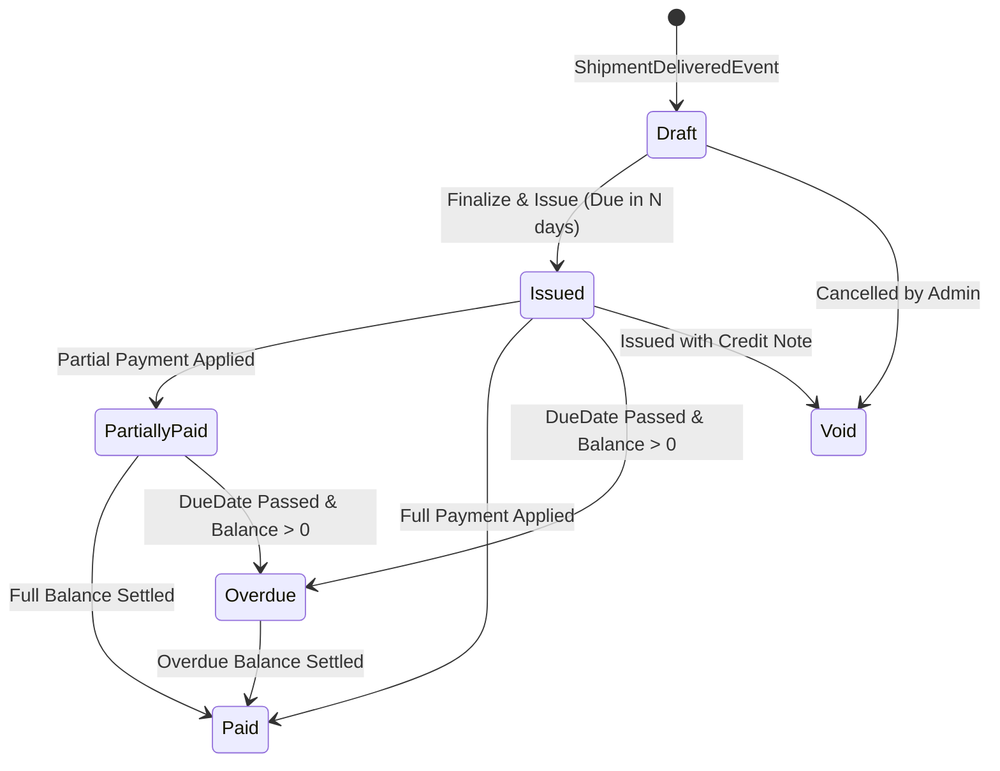

# Invoicing, Credit & Carrier Settlement Service — Deep Technical Details

> **Service Layer**: Invoicing State Machine, Credit Aging & Settlement Reconciliation  
> **Source-of-Truth**: `src/nestjs/billing-service`, `billing.service.ts`, `prisma/schema.prisma`.

---

## 1. Invoice Lifecycle State Machine



---

## 2. Customer Credit Limit & Aging Computation

Before confirming a new booking, `ShipmentWorkflow` checks credit status:
```typescript
async evaluateCreditStatus(tenantId: string, customerId: string): Promise<CreditStatusResult> {
  const account = await this.prisma.customerCreditAccount.findUnique({
    where: { tenantId_customerId: { tenantId, customerId } },
  });

  const unpaidInvoices = await this.prisma.invoice.findMany({
    where: {
      tenantId,
      customerId,
      status: { in: ['ISSUED', 'PARTIALLY_PAID', 'OVERDUE'] },
    },
  });

  const currentOutstanding = unpaidInvoices.reduce((sum, inv) => sum.plus(inv.remainingBalance), new Decimal(0));
  const hasOverdueInvoices = unpaidInvoices.some(inv => inv.dueDate < new Date());
  const isLimitExceeded = currentOutstanding.greaterThan(account.creditLimit);

  const isBlocked = account.isCreditHold || isLimitExceeded || hasOverdueInvoices;

  return {
    isBlocked,
    creditLimit: account.creditLimit.toNumber(),
    currentOutstanding: currentOutstanding.toNumber(),
    availableCredit: Math.max(0, account.creditLimit.minus(currentOutstanding).toNumber()),
    hasOverdueInvoices,
  };
}
```

---

## 3. Carrier Invoice Reconciliation (3-Way Matching)

When an ocean/air carrier submits a final freight invoice:
1. **PO vs Rate Card**: Compares billed freight amount against the shipment's agreed rate card.
2. **Tolerance Band**: If difference is within $\pm 2\%$, auto-approves for settlement batch.
3. **Discrepancy Flagging**: If difference exceeds tolerance (e.g. unapproved demurrage charge), flags `DiscrepancyStatus: REVIEW_REQUIRED` and alerts accounts payable staff.
