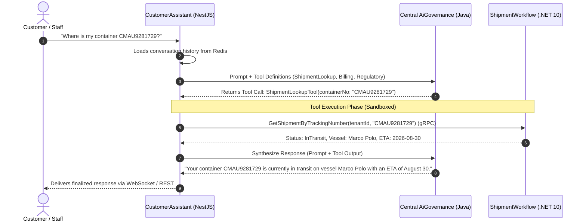

# AI Customer & Operational Assistant — Deep Technical Details

> **Service Layer**: Intent Orchestration, Tool Registry, Sandboxing & Grounding  
> **Source-of-Truth**: `src/nestjs/customer-assistant-service`, `ToolRegistryService`, `ShipmentLookupTool`, `AiGovernanceClient`.

---

## 1. Multi-Turn Orchestration & Intent Flow



---

## 2. Tool Sandboxing & Tenant Security

Every tool implements the `ITool` interface:

```typescript
export interface ITool {
  name: string;
  description: string;
  parametersSchema: JSONSchema;
  execute(args: any, context: ExecutionContext): Promise<ToolResult>;
}
```

### Security Enforcement in `ShipmentLookupTool`:
```typescript
async execute(args: ShipmentLookupArgs, context: ExecutionContext): Promise<ToolResult> {
  // Enforce caller tenantId from authenticated context (never trust LLM args)
  const tenantId = context.tenantId;
  const customerId = context.customerId;

  const shipment = await this.shipmentGrpcClient.getShipmentByTracking({
    tenantId,
    customerId, // Scoped to customer if caller is external customer
    trackingNumber: args.trackingNumber,
  });

  return { success: true, data: shipment };
}
```

---

## 3. Resilience, Timeouts & Error Handling

- **Tool Execution Timeout**: Maximum 4000ms per tool invocation. If a downstream service times out, the assistant receives a typed `TOOL_TIMEOUT` error and gracefully informs the user without hanging the chat session.
- **Max Tool Hop Limit**: Limited to 2 consecutive tool calls per user turn to prevent infinite agentic execution loops.
- **Session Eviction**: Conversation sessions in Redis expire after 2 hours of inactivity.
