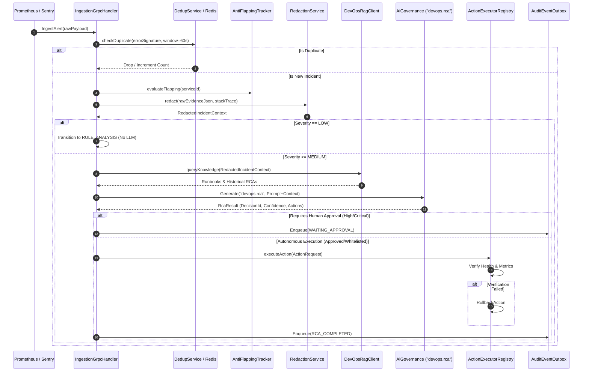

# Autonomous DevOps & Incident Response Agent — Technical Deep Dive

> **Document Type**: Architecture & Engineering Deep-Dive  
> **Source Code**: `src/java/devops-agent/src/main/java/com/aurora/devopsagent/`

---

## 1. End-to-End RCA & Incident Pipeline

The diagram below illustrates the exact execution pipeline from external alert trigger to verified auto-remediation:



---

## 2. Core Subsystems & Implementation Details

### 2.1 Sliding-Window Deduplication & Anti-Flapping
- **Deduplication Key**: `SHA256(serviceName + errorSignature + errorCategory)` stored in Redis with a 60-second TTL.
- **Anti-Flapping Algorithm**: Implemented in `AntiFlappingTracker.java`. Uses exponential decay counters over a 5-minute sliding window. When threshold violations exceed limit $K$, the alert status transitions to `FLAPPING_SUPPRESSED` and automatically aggregates subsequent traces into a single parent incident.

### 2.2 Context Redaction Engine (`RedactionService`)
Before any incident evidence or stack trace is indexed into RAG or dispatched to `AiGovernance`, the `RedactionService` scrubs sensitive data using high-performance regex & AST tokenizers:
- **JWT / Bearer Tokens**: `Bearer [A-Za-z0-9\-_]+\.[A-Za-z0-9\-_]+\.[A-Za-z0-9\-_]+` $\to$ `[REDACTED_JWT]`
- **Connection Strings & Passwords**: `(?i)(password|secret|apikey|token)=[^&\s]+` $\to$ `[REDACTED_SECRET]`
- **PII (Email, IP Addresses, Credit Cards)**: Standard RFC regex patterns replaced with deterministic surrogate tokens.

### 2.3 RAG-Augmented AI RCA (`RcaOrchestratorService`)
When `executeRca(Incident incident, String rawEvidenceJson)` runs:
1. `RedactedIncidentContext` queries the local `DevOpsRagClient` to fetch historical RCA post-mortems and Kubernetes runbooks.
2. The prompt includes: System Prompt + Service Boundary Spec + Redacted Stack Trace + Retrieved Runbooks.
3. Invokes `AiGovernanceClient.generate(command)` with capability `devops.rca`.
4. Captures governance audit tokens: `decisionId`, `inputTokens`, `outputTokens`, and `automationLevel`.

### 2.4 Safety-Guarded Action Framework (`ActionExecutorRegistry`)
All remediation actions implement the `ActionExecutor` interface:
```java
public interface ActionExecutor {
    boolean supports(ActionType actionType);
    ExecutionResult execute(ActionRequest request);
    VerificationResult verify(ActionRequest request);
    RollbackResult rollback(ActionRequest request);
}
```

- **`RestartPodActionExecutor`**: Invokes Kubernetes API to gracefully trigger rolling restart of pods in the target deployment, followed by liveness/readiness probe polling.
- **`ClearCacheActionExecutor`**: Executes bounded cache invalidation in Redis using specific key patterns rather than `FLUSHALL`.
- **`RollbackActionExecutor`**: Reverts Helm/K8s deployment revision to previous known-good state if error rate stays $> 5\%$ during the post-action verification window.

---

## 3. Transactional Audit Outbox Pattern

All critical state transitions and remediation events write to `devops_audit_outbox` in the same PostgreSQL transaction as the `Incident` entity update. A background worker picks up unprocessed rows and publishes events to RabbitMQ exchange `aurora.devops.events` to guarantee at-least-once delivery to enterprise SIEM and telemetry dashboards.
