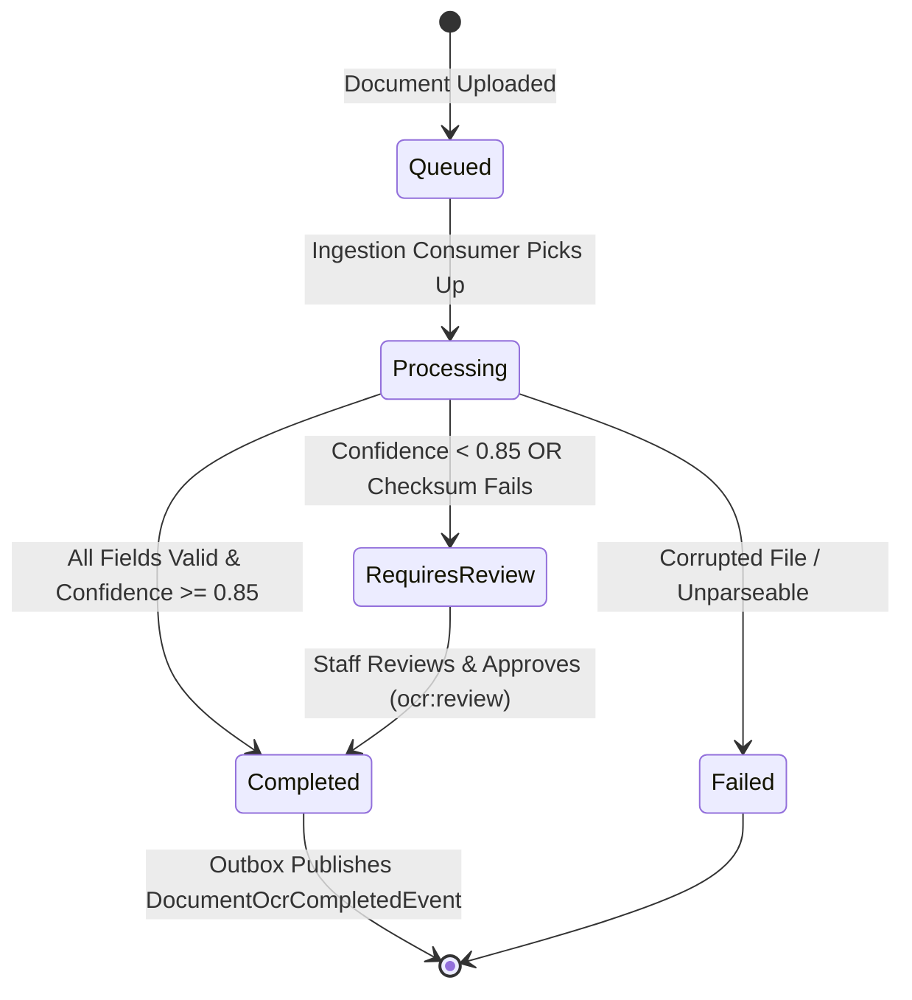

# Intelligent Document OCR & Data Extraction — Deep Technical Details

> **Service Layer**: OCR Pipeline, Checksum Algorithms, State Machine & Human Review  
> **Source-of-Truth**: `src/dotnet/DocumentOcr`, `DocumentOcrJob.cs`, `DocumentOcrGrpcService.cs`, `DocumentOcrDbContext.cs`.

---

## 1. Domain State Machine & Execution Lifecycle



---

## 2. Deterministic Field Validation & ISO 6346 Checksum

Before an OCR job is marked `Completed`, the extraction payload passes through validation rules:

### 2.1 ISO 6346 Container Number Validation
Container codes (e.g. `MSKU9012345`) follow a 4-letter owner code, 6-digit serial, and 1 check digit:
1. Letters are mapped to numbers ($A=10, B=12 \dots Z=38$, omitting multiples of 11).
2. Weighted sum: $S = \sum_{i=0}^9 d_i \cdot 2^i$.
3. Check digit: $C = (S \pmod{11}) \pmod{10}$.
4. If calculated $C \ne d_{10}$, validation marks `DocumentOcrValidation.Severity = Error`, forcing the document into `RequiresReview`.

### 2.2 Commercial Invoice Arithmetic Check
- Sum of item sub-totals + freight charges + tax must match `TotalInvoiceAmount`.
- Currency code must match ISO 4217 standard (`USD`, `EUR`, `VND`).

---

## 3. Human-in-the-Loop Field Correction API

When an authorized staff member opens the review screen:
```http
POST /api/v1/ocr/{jobId}/review
```
```json
{
  "correctedFields": {
    "containerNumber": "MSKU9012347",
    "grossWeightKg": 24500.00
  },
  "reviewNotes": "Corrected last digit from blurry scan."
}
```
- Handler updates `Job.ExtractedDataJson` with corrections.
- Logs `ReviewedByUserId` and `ReviewedAt`.
- Transitions status `RequiresReview` $\rightarrow$ `Completed`.
- Emits `DocumentOcrCompletedEvent` to Outbox for downstream `ShipmentWorkflow` consumption.

---

## 4. Multi-Tenancy & Storage Security

- Files stored in Cloudflare R2 under path: `tenants/{tenantId}/documents/{year}/{month}/{jobId}.pdf`.
- Frontend downloads use pre-signed GET URLs expiring in 15 minutes.
- Multi-tenant query isolation enforced by EF Core global query filters.
