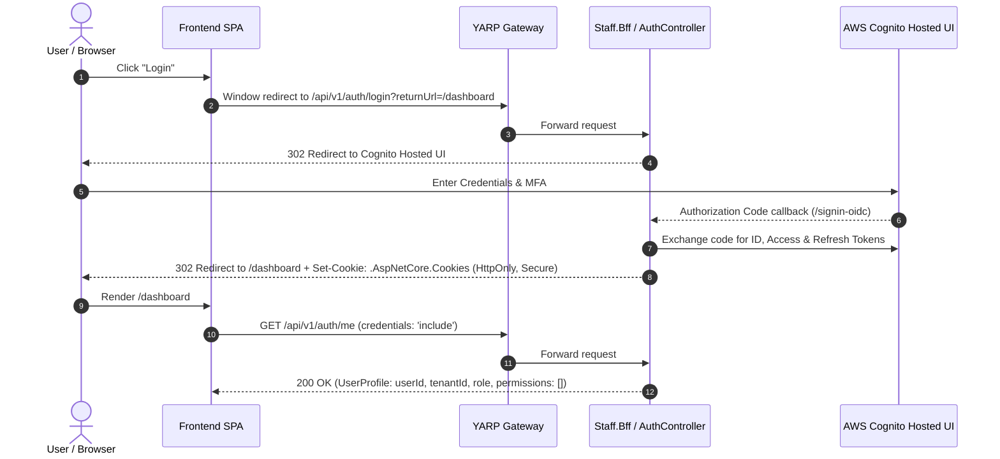

# Aurora Server — Frontend Integration Guide

> **Architecture Reference**: Practical guide for frontend engineers (React / Next.js / Vue / Mobile) integrating with Aurora Server via YARP API Gateway, Micro-BFFs, and the RealtimeHub WebSocket gateway.

---

## 1. Network Topologies & Base URLs

Aurora utilizes a **Backend-For-Frontend (BFF)** pattern fronted by a **YARP Reverse Proxy API Gateway**. All frontend HTTP requests should target the API Gateway URL:

| Environment | API Gateway Base URL | WebSocket RealtimeHub URL |
|---|---|---|
| **Local Development** | `http://localhost:5000` | `ws://localhost:5004` (or `http://localhost:5004/socket.io`) |
| **Staging** | `https://api-staging.aurora-logistics.com` | `wss://realtime-staging.aurora-logistics.com` |
| **Production** | `https://api.aurora-logistics.com` | `wss://realtime.aurora-logistics.com` |

### Route Prefix Conventions
- **General Operations (Staff / Managers)**: `/api/v1/[controller]` -> Routed by Gateway to `Staff.Bff` (:5001)
- **Tenant Administration (Tenant Admins)**: `/api/v1/admin/[controller]` -> Routed by Gateway to `Admin.Bff` (:5002)
- **Platform Operations (System Admins)**: `/api/v1/system/[controller]` -> Routed by Gateway to `System.Bff` (:5003)
- **Auth Brokering**: `/api/v1/auth/[action]` -> Managed by `BuildingBlocks.BFF`

---

## 2. Authentication & Authorization State

Aurora employs a **BFF-Managed Cookie Session Pattern** (BFF-as-Confidential-Client) with AWS Cognito. Frontend applications do not handle raw access/refresh tokens in localStorage; rather, HTTP-only, secure, SameSite cookies are stored automatically in the browser.



### 2.1 Fetch / Axios Client Setup
Always ensure cross-origin cookie credentials are included:

```typescript
import axios from 'axios';

export const apiClient = axios.create({
  baseURL: process.env.NEXT_PUBLIC_API_URL || 'http://localhost:5000',
  withCredentials: true, // CRITICAL: Sends .AspNetCore.Cookies
  headers: {
    'Content-Type': 'application/json',
    'Accept': 'application/json',
  },
});

// Response interceptor for session expiry handling
apiClient.interceptors.response.use(
  (response) => response,
  (error) => {
    if (error.response?.status === 401) {
      // Session expired -> Redirect to login
      window.location.href = `/api/v1/auth/login?returnUrl=${encodeURIComponent(window.location.pathname)}`;
    }
    return Promise.reject(error);
  }
);
```

### 2.2 Bootstrapping User Profile & Permissions (`GET /api/v1/auth/me`)
On application mount, fetch the current user claims and direct capability permissions:

```typescript
export interface UserProfile {
  userId: string;
  tenantId: string;
  email: string;
  emailDomain: string;
  cognitoSub: string;
  name: string;
  role: 'SYSTEM_ADMIN' | 'TENANT_ADMIN' | 'MANAGER' | 'STAFF';
  permissions: string[]; // List of direct capability tokens, e.g. ["mail:read", "route_planning:approve"]
  isAuthenticated: boolean;
}

export async function fetchCurrentUser(): Promise<UserProfile | null> {
  try {
    const { data } = await apiClient.get<UserProfile>('/api/v1/auth/me');
    return data;
  } catch (err) {
    return null;
  }
}
```

### 2.3 Frontend Authorization Hooks (`hasPermission`)

> [!IMPORTANT]
> **Golden Rule**: **`ROLE`** determines the persona / navigation shell / dashboard type. **`PERMISSIONS`** determine button visibility and action authority. Never write `if (role === 'MANAGER') showApproveButton()`.

```typescript
import React, { createContext, useContext, useMemo } from 'react';

interface AuthContextValue {
  user: UserProfile | null;
  hasPermission: (permission: string) => boolean;
  hasAnyPermission: (permissions: string[]) => boolean;
  hasAllPermissions: (permissions: string[]) => boolean;
  isRole: (role: UserProfile['role']) => boolean;
}

const AuthContext = createContext<AuthContextValue | undefined>(undefined);

export function AuthProvider({ user, children }: { user: UserProfile | null; children: React.ReactNode }) {
  const permSet = useMemo(() => new Set(user?.permissions ?? []), [user?.permissions]);

  const value = useMemo<AuthContextValue>(() => ({
    user,
    hasPermission: (p: string) => permSet.has(p),
    hasAnyPermission: (ps: string[]) => ps.some(p => permSet.has(p)),
    hasAllPermissions: (ps: string[]) => ps.every(p => permSet.has(p)),
    isRole: (r: UserProfile['role']) => user?.role === r,
  }), [user, permSet]);

  return <AuthContext.Provider value={value}>{children}</AuthContext.Provider>;
}

export function useAuthorization() {
  const ctx = useContext(AuthContext);
  if (!ctx) throw new Error('useAuthorization must be used within AuthProvider');
  return ctx;
}
```

---

## 3. RealtimeHub WebSocket Integration (`Socket.IO`)

Real-time notifications (email triage claims, shipment status updates, invoice generation, live GPS positions) are pushed over WebSockets.

### 3.1 Connection Handshake
Frontend connects to `RealtimeHub` with client connection options:

```typescript
import { io, Socket } from 'socket.io-client';

let socket: Socket | null = null;

export function initializeRealtimeConnection(tenantId: string, userId: string): Socket {
  if (socket) return socket;

  socket = io(process.env.NEXT_PUBLIC_REALTIME_URL || 'http://localhost:5004', {
    transports: ['websocket'],
    withCredentials: true,
    autoConnect: true,
    reconnection: true,
    reconnectionAttempts: 10,
    reconnectionDelay: 1000,
  });

  socket.on('connect', () => {
    console.log('[RealtimeHub] Connected with socket ID:', socket?.id);
    
    // Join tenant and personal user rooms
    socket?.emit('join:tenant', { tenantId });
    socket?.emit('join:user', { tenantId, userId });
  });

  socket.on('disconnect', (reason) => {
    console.warn('[RealtimeHub] Disconnected:', reason);
  });

  return socket;
}
```

### 3.2 Real-time Event Subscription Catalog

| Event Name | Room Scope | Payload Schema | Description |
|---|---|---|---|
| `THREAD_CLAIMED` | `tenant:{tenantId}` | `{ threadId, assignedUserId, assignedStaffName }` | Emitted when a staff member claims an email thread. Live-locks the thread for others. |
| `THREAD_REASSIGNED` | `tenant:{tenantId}` | `{ threadId, previousAssigneeId, newAssigneeId, newStaffName }` | Emitted when a manager/lead reassigns a thread. |
| `SHIPMENT_STATUS_CHANGED` | `shipment:{shipmentId}` / `tenant:{tenantId}` | `{ shipmentId, oldStatus, newStatus, updatedAt }` | Updates shipment tracking view and progress stepper. |
| `GPS_POSITION_UPDATED` | `shipment:{shipmentId}` | `{ shipmentId, vehicleId, latitude, longitude, speedKph, recordedAt }` | Live updates marker on telematics map. |
| `GEOFENCE_ALERT` | `tenant:{tenantId}` | `{ alertId, alertType, shipmentId, vehicleId, message }` | Displays urgent toast notification on breach/delay. |
| `DOCUMENT_OCR_COMPLETED`| `shipment:{shipmentId}` / `tenant:{tenantId}` | `{ jobId, documentId, confidence, needsReview }` | Notifies user that background OCR extraction has finished. |
| `INVOICE_GENERATED` | `user:{customerId}` / `tenant:{tenantId}` | `{ invoiceId, invoiceNumber, totalAmount, currency, dueDate }` | Updates billing dashboard upon automated POD invoicing. |

---

## 4. FCM foreground/background popup

After authenticated bootstrap and permission `notifications:access`, initialize
Firebase Web Messaging with the public Firebase Web config (never the Admin SDK
JSON). Request browser notification permission, obtain the registration token,
and call `POST /api/v1/notifications/devices` through the BFF. Call the same
endpoint on token refresh; deactivate the device on logout where supported.

Handle foreground `onMessage` with an in-app toast/popup. Register a
`firebase-messaging-sw.js` service worker for background notifications and click
handling. Before navigation, allow only internal paths such as `/shipments/{id}`
and `/notifications`; reject external URLs. History and unread state come from
the BFF notification routes documented in `API_CATALOG.md`.

FCM data contract:

```json
{
  "notificationId": "uuid",
  "type": "SHIPMENT_DELIVERED",
  "shipmentId": "uuid",
  "actionUrl": "/shipments/uuid"
}
```

## 5. Standard Error Handling & ProblemDetails

All BFFs return RFC 7807 **ProblemDetails** JSON payloads for HTTP error codes (4xx / 5xx):

```json
{
  "type": "https://tools.ietf.org/html/rfc7231#section-6.5.3",
  "title": "Forbidden",
  "status": 403,
  "detail": "Missing required permission: mail:thread:reassign",
  "instance": "/api/v1/mail/threads/3fa85f64-5717-4562-b3fc-2c963f66afa6/reassign"
}
```

### Handling Specific Error Statuses
- **`400 Bad Request`**: Validation errors on request body or parameters. Inspect `detail` for field-level error messages.
- **`401 Unauthorized`**: Cookie session is missing, invalid, or expired. Trigger redirect to `/api/v1/auth/login`.
- **`403 Forbidden`**: Authenticated user lacks required capability permission (e.g. attempting to reassign thread without `mail:thread:reassign` or approve route without `route_planning:approve`).
- **`404 Not Found`**: Entity does not exist or belongs to a different tenant.
- **`409 Conflict`**: State conflict (e.g. attempting to claim a thread that was just claimed by another user, or generating an invoice that was already created).
- **`422 Unprocessable Entity`**: Domain rule violation (e.g. trying to transition a shipment directly from `DRAFT` to `DELIVERED` without passing through intermediate states).
- **`500 / 503 Service Unavailable`**: Downstream gRPC deadline timeout or service crash. BFF returns user-friendly error envelope.

---

## 6. Pagination & Query Standards

All collection endpoints follow a consistent query and response envelope standard:

### Request Query Parameters
- `page` (integer, 1-indexed, default: `1`)
- `pageSize` / `limit` (integer, default: `20`, maximum: `100`)
- `searchTerm` / `search` (string, optional)
- `status` / `folder` (enum string, optional)

### Response Payload Structure
```json
{
  "items": [ /* array of entities */ ],
  "page": 1,
  "pageSize": 20,
  "totalItems": 142,
  "totalPages": 8
}
```

---

## 7. Idempotency & Upload Guidelines

For file uploads and critical financial/regulatory commands, provide an `IdempotencyKey` UUID:
- Pass in header: `X-Idempotency-Key: <UUIDv4>` or in the request payload `idempotencyKey: "<UUIDv4>"`.
- Documents should first be uploaded directly to Cloudflare R2 / S3 storage via pre-signed URL or multipart stream, then the `storageReference` URI (e.g. `r2://shipment-docs/...`) is submitted to `POST /api/v1/documents/ocr/jobs` or `POST /api/v1/shipments/{id}/documents`.
