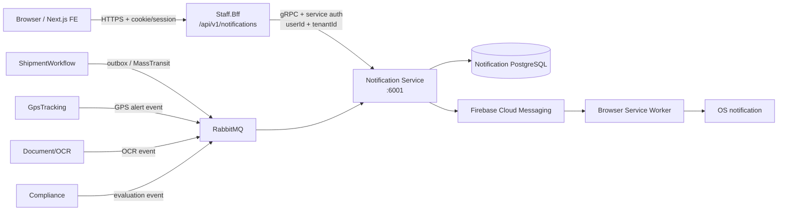
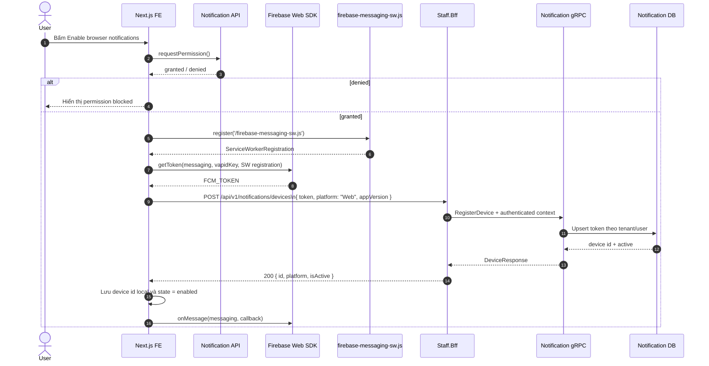
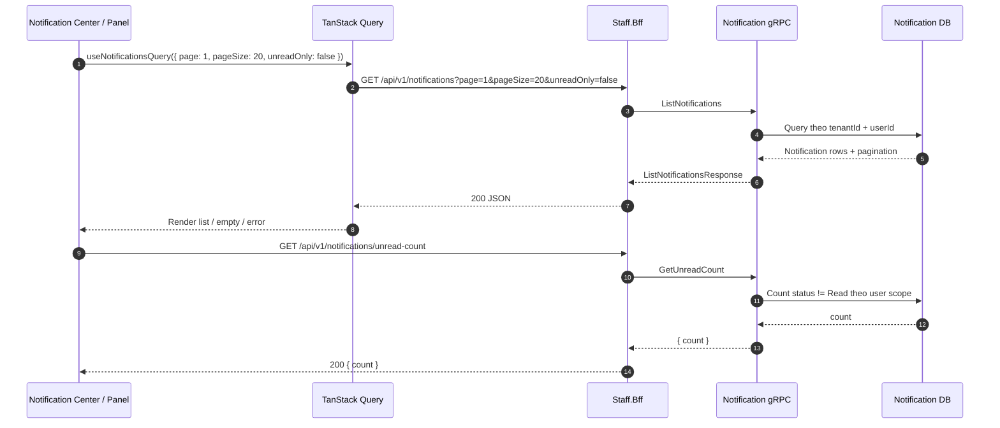
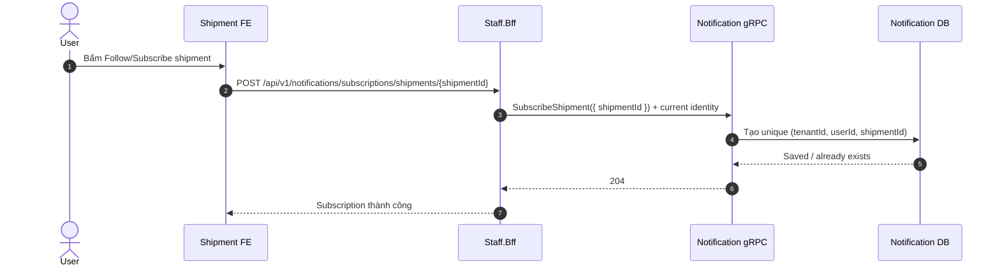
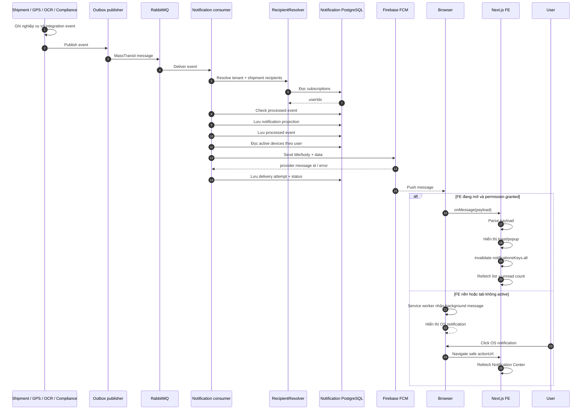
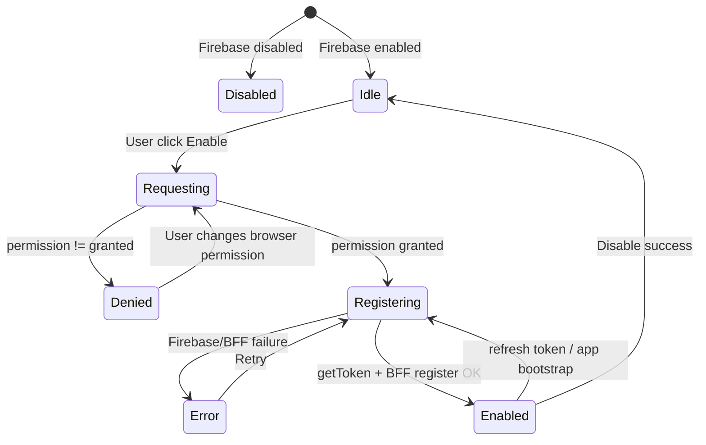

# Tích hợp Notification vào Frontend

Tài liệu này mô tả luồng tích hợp Notification hiện tại của Aurora từ trình
duyệt đến Staff BFF, Notification Service, RabbitMQ và Firebase Cloud
Messaging (FCM). Nội dung bám theo source hiện tại của:

- Frontend: `/home/kaito/project/aurora-client`
- BFF: `src/dotnet/BFF/Staff.Bff`
- Notification: `src/dotnet/Notification`
- Proto: `protos/notification.proto`

Mục tiêu của tích hợp có hai phần độc lập nhưng liên quan:

1. Notification Center: đọc lịch sử notification, số lượng chưa đọc và đánh
   dấu đã đọc.
2. Browser push: xin quyền trình duyệt, lấy FCM registration token, đăng ký
   device và hiển thị popup khi backend phát sinh event.

> **Quan trọng:** Notification Service lưu lịch sử và delivery attempt trong
> PostgreSQL riêng. FCM chỉ là nhà cung cấp gửi push. FCM không tự ghi các
> notification này vào Firestore, Realtime Database hay Firebase Analytics.

---

## 1. Kiến trúc hiện tại

Frontend không gọi gRPC trực tiếp. Mọi request HTTP đi qua BFF; BFF gọi
Notification bằng gRPC và truyền tiếp user/tenant context cùng service
credential.



Có hai nhánh dữ liệu:

- **Synchronous/read path:** FE gọi BFF để đọc danh sách, unread count, đăng
  ký device, subscribe shipment và mark read.
- **Asynchronous/push path:** service nghiệp vụ phát event vào RabbitMQ;
  Notification consume event, resolve người nhận, lưu notification, gửi FCM;
  trình duyệt nhận message và hiển thị popup.

---

## 2. Cấu trúc code Frontend

Các file Notification hiện tại nằm trong feature và được dùng chung cho staff
layout và customer layout.

```text
/home/kaito/project/aurora-client/src/
├── api/
│   ├── query-keys/
│   │   ├── root.keys.ts
│   │   └── notifications.keys.ts
│   └── services/
│       └── notifications.service.ts
├── configs/
│   └── env.config.ts
├── dto/
│   └── notifications/
│       └── notification.dto.ts
├── hooks/
│   ├── queries/notifications/
│   │   ├── use-notifications-query.ts
│   │   └── use-unread-notification-count-query.ts
│   └── mutations/notifications/
│       └── use-notification-mutations.ts
├── app/
│   ├── (staff)/layout.tsx
│   ├── (staff)/notifications/page.tsx
│   ├── (customer)/layout.tsx
│   └── firebase-messaging-sw.js/route.ts
└── features/notifications/
    ├── components/
    │   ├── fcm-permission-control.tsx
    │   ├── notification-access-state.tsx
    │   ├── notification-empty-state.tsx
    │   └── notification-list.tsx
    ├── hooks/
    │   └── use-fcm-notification.ts
    ├── lib/
    │   ├── device-storage.ts
    │   ├── fcm-browser.ts
    │   ├── fcm-registration.ts
    │   ├── firebase-client.ts
    │   └── firebase-service-worker.ts
    ├── notification-center/
    │   └── index.tsx
    ├── notification-panel/
    │   └── index.tsx
    ├── popup/
    │   ├── components/notification-fcm-bootstrap.tsx
    │   ├── lib/notification-toast.ts
    │   └── index.tsx
    ├── types/fcm.types.ts
    └── utils/fcm-payload.ts
```

### Vai trò từng lớp

| Lớp | Trách nhiệm |
| --- | --- |
| `dto/notifications/notification.dto.ts` | Type và Zod parser cho response từ BFF; chuẩn hóa timestamp protobuf/ISO và nullable string. |
| `api/services/notifications.service.ts` | Một nơi duy nhất gọi Notification BFF; không gọi Axios trực tiếp trong component. |
| `api/query-keys/notifications.keys.ts` | Query key có `all`, `lists`, `list(params)`, `unreadCount()` để invalidate đúng phạm vi. |
| `hooks/queries/...` | Đọc notification list và unread count bằng TanStack Query. |
| `hooks/mutations/...` | Register/remove device, subscribe shipment, mark một hoặc tất cả read. |
| `firebase-client.ts` | Khởi tạo Firebase Web SDK và kiểm tra browser có hỗ trợ FCM không. |
| `fcm-registration.ts` | Register service worker, gọi `getToken`, sau đó gửi token lên BFF. |
| `use-fcm-notification.ts` | State machine cho permission, token, device id, enable/disable và lỗi. |
| `notification-fcm-bootstrap.tsx` | Lắng nghe FCM foreground, hiển thị toast và invalidate query. |
| `firebase-messaging-sw.ts` | Tạo source cho service worker background và xử lý click notification. |
| `notification-center` | Trang `/notifications`, đọc lịch sử và thao tác mark read. |
| `notification-panel` | Panel mở từ notification bell. |

`NotificationPopup` được mount ở cả:

- `/home/kaito/project/aurora-client/src/app/(staff)/layout.tsx`
- `/home/kaito/project/aurora-client/src/app/(customer)/layout.tsx`

Component này không render HTML cố định; nó bootstrap listener FCM ở client.
Notification Center và panel mới là nơi gọi API đọc lịch sử.

---

## 3. Firebase Web environment

Đặt trong file local của Frontend:

```dotenv
NEXT_PUBLIC_FIREBASE_ENABLED=true
NEXT_PUBLIC_FIREBASE_API_KEY=<Firebase Web app apiKey>
NEXT_PUBLIC_FIREBASE_AUTH_DOMAIN=<project-id>.firebaseapp.com
NEXT_PUBLIC_FIREBASE_PROJECT_ID=<project-id>
NEXT_PUBLIC_FIREBASE_STORAGE_BUCKET=<project-id>.firebasestorage.app
NEXT_PUBLIC_FIREBASE_MESSAGING_SENDER_ID=<sender-id>
NEXT_PUBLIC_FIREBASE_APP_ID=<web-app-id>
NEXT_PUBLIC_FIREBASE_VAPID_KEY=<Web Push certificate key pair - public key>
```

Trong local project hiện tại, file tham chiếu là:

```text
/home/kaito/project/aurora-client/.env
/home/kaito/project/aurora-client/.env.example
```

### Phân biệt các key

| Key | Dùng cho | Có phải FCM token không? |
| --- | --- | --- |
| `NEXT_PUBLIC_FIREBASE_API_KEY` | Khởi tạo Firebase Web app | Không |
| `NEXT_PUBLIC_FIREBASE_PROJECT_ID` | Chọn Firebase project | Không |
| `NEXT_PUBLIC_FIREBASE_MESSAGING_SENDER_ID` | Firebase Messaging config | Không |
| `NEXT_PUBLIC_FIREBASE_APP_ID` | Định danh Web app | Không |
| `NEXT_PUBLIC_FIREBASE_VAPID_KEY` | Web Push `getToken()` | Không; đây là public key cố định của app. |
| `FCM_TOKEN` | Token do browser trả về lúc runtime | **Có; đây là token gửi cho `RegisterDevice`.** |

FCM token chỉ xuất hiện sau khi:

1. Firebase Web config hợp lệ.
2. Browser hỗ trợ service worker và FCM.
3. User cấp quyền `Notification`.
4. `getToken(messaging, { vapidKey, serviceWorkerRegistration })` thành công.

Không đặt Firebase Admin service-account JSON ở Frontend. File Admin JSON chỉ
dùng cho Notification backend qua `Firebase__CredentialsPath` hoặc inline
server credentials. Public Web config có thể xuất hiện trong client bundle;
service-account private key tuyệt đối không được xuất hiện ở đó.

### Điều kiện trình duyệt

- Dùng HTTPS local hoặc origin `localhost`.
- Cho phép notification cho đúng origin.
- Service worker phải load được tại `/firebase-messaging-sw.js`.
- Không bật DevTools `Offline` khi gọi `getToken`.
- Nếu browser báo `push service error`, kiểm tra VAPID key, service worker
  cũ và quyền site trước khi kiểm tra backend.

---

## 4. Luồng khởi tạo FCM và đăng ký device

Đây là luồng chạy khi người dùng bấm **Enable browser notifications**. Việc
xin permission phải xuất phát từ thao tác người dùng; không tự bật permission
ngay khi load trang.



### Request/response đăng ký device

```http
POST /api/v1/notifications/devices
Content-Type: application/json
Cookie: <authenticated session>

{
  "token": "<FCM_TOKEN>",
  "platform": "Web",
  "appVersion": "local"
}
```

```json
{
  "id": "01a056e9-0760-7523-aaa9-e4cad895620d",
  "platform": "Web",
  "isActive": true
}
```

FE lưu **device id**, không cần lưu FCM token vào localStorage. Token được giữ
trong Firebase/browser; backend lưu token trong `notification_devices` để gửi
push. Trong development, nếu BFF registration thất bại sau khi Firebase đã
tạo token, UI có thể hiển thị token để test gRPC; không hiển thị token theo
cách này ở production.

### State cần hiểu trên FE

| State | Ý nghĩa | Hành động |
| --- | --- | --- |
| `disabled` | `NEXT_PUBLIC_FIREBASE_ENABLED` không bật | Không gọi Firebase. |
| `unsupported` | Browser/FCM/service worker không hỗ trợ | Dùng browser hỗ trợ hoặc HTTPS. |
| `idle` | Chưa xin permission hoặc chưa enable | Hiển thị nút Enable. |
| `requesting` | Đang xin quyền browser | Disable nút tạm thời. |
| `registering` | Đang lấy token và gọi BFF | Chờ kết quả, không click lặp. |
| `enabled` | Device đã đăng ký thành công | Có thể nhận push; hiển thị Disable. |
| `denied` | User từ chối permission | Bật lại trong site settings. |
| `error` | Firebase hoặc BFF thất bại | Đọc `errorMessage`, kiểm tra console/network. |

---

## 5. Luồng đọc Notification Center và panel

Notification Center không lấy dữ liệu từ Firebase Console. Nó đọc projection
đã lưu trong Notification PostgreSQL thông qua BFF.



### Các endpoint FE đang dùng

| HTTP | Body/query | Mục đích | Kết quả |
| --- | --- | --- | --- |
| `GET /api/v1/notifications` | `page`, `pageSize`, `unreadOnly` | Lịch sử notification | Danh sách + pagination |
| `GET /api/v1/notifications/unread-count` | Không có | Badge notification bell | `{ count }` |
| `POST /api/v1/notifications/devices` | `token`, `platform`, `appVersion` | Register/refresh browser token | Device response |
| `DELETE /api/v1/notifications/devices/{id}` | Không có | Deactivate device hiện tại | `204 No Content` |
| `POST /api/v1/notifications/subscriptions/shipments/{shipmentId}` | Không có | Theo dõi shipment | `204 No Content` |
| `PATCH /api/v1/notifications/{id}/read` | Không có | Mark một notification read | `204 No Content` |
| `PATCH /api/v1/notifications/read-all` | Không có | Mark tất cả read | `{ count }` số item đã đổi |

`pageSize` được Notification giới hạn từ 1 đến 100; mặc định FE dùng 20.
Response timestamp có thể là ISO string hoặc object protobuf `{ seconds,
nanos }`; parser trong DTO đã chuẩn hóa thành ISO string.

### Khi click một notification

1. FE lấy `actionUrl` từ record.
2. `safeNotificationPath()` chỉ cho phép `/notifications` hoặc
   `/shipments/{guid}`.
3. Nếu hợp lệ, FE `router.push(path)`.
4. FE có thể gọi mark-read trước hoặc sau khi mở item tùy UX.

Không dùng `window.location` với URL tùy ý từ server. Việc allowlist path
được áp dụng cả ở FE và service worker để tránh open redirect.

---

## 6. Subscribe shipment và recipient resolution

Notification hiện không broadcast mọi event cho toàn tenant. Người dùng phải
subscribe shipment trước; `SubscriptionRecipientResolver` lấy các `UserId`
đã subscribe trong cùng tenant.



Khi event có `shipmentId`:

```text
recipients = distinct subscriptions
  where tenantId == event.tenantId
    and shipmentId == event.shipmentId
```

Nếu không có subscriber, Notification vẫn ghi processed event với outcome
`NoRecipient` nhưng không tạo notification cho user và không gửi FCM. Vì vậy
đã update shipment thành công nhưng không thấy popup có thể là do chưa
subscribe đúng `shipmentId`, khác tenant hoặc event không tới RabbitMQ.

---

## 7. Luồng hoàn chỉnh: Shipment/GPS/OCR → Notification → FCM → popup



### Các event Notification đang consume

Notification đăng ký consumer cho các nhóm sau:

- `ShipmentStatusChanged`
- `ShipmentCancelled`
- `ShipmentDelivered`
- `ShipmentCreated`
- `ShipmentSubmitted`
- `ShipmentPickedUp`
- `ShipmentCompleted`
- `DocumentAttached`
- `GpsMonitoringAlert`
- `DocumentOcrCompleted`
- `DocumentOcrFailed`
- `ComplianceEvaluationCompleted`
- `ComplianceEvaluationFailed`

Tên `type`, title, body phụ thuộc consumer. Ví dụ event status:

```json
{
  "type": "SHIPMENT_STATUS_CHANGED",
  "title": "Shipment Submitted",
  "body": "Shipment status changed from Created to Submitted."
}
```

---

## 8. FCM payload contract

Notification backend gửi notification payload cho title/body và data payload
cho metadata điều hướng.

```json
{
  "notification": {
    "title": "Shipment Submitted",
    "body": "Shipment status changed from Created to Submitted."
  },
  "data": {
    "notificationId": "01a056ff-5d02-734c-aadb-045b5314c5ae",
    "type": "SHIPMENT_STATUS_CHANGED",
    "shipmentId": "01a056eb-955d-72b5-b3bb-fd190965f335",
    "actionUrl": "/shipments/01a056eb-955d-72b5-b3bb-fd190965f335"
  }
}
```

| Field | Bắt buộc | Ý nghĩa |
| --- | --- | --- |
| `notification.title` | Có | Tiêu đề popup/OS notification. |
| `notification.body` | Có | Nội dung popup/OS notification. |
| `data.notificationId` | Có | Định danh để đối chiếu Notification DB. |
| `data.type` | Có | Event type, ví dụ `SHIPMENT_STATUS_CHANGED`. |
| `data.shipmentId` | Có với shipment event | Shipment liên quan; event không có shipment có thể là chuỗi rỗng. |
| `data.actionUrl` | Có | Internal path để mở khi click. |

FE `readFcmPayload()` bỏ qua message nếu thiếu `notificationId` hoặc `type`.
Đây là chủ ý để không hiện popup cho message không thuộc contract Aurora.

### Foreground

`NotificationFcmBootstrap` đăng ký `onMessage()` sau khi Firebase được
khởi tạo. Khi nhận message:

1. Parse bằng `readFcmPayload()`.
2. Gọi `showNotificationToast()`.
3. Click toast sẽ `router.push(safePath)`.
4. Invalidate `notificationsKeys.all` để bell/list cập nhật.

### Background

Route `/firebase-messaging-sw.js` tạo service worker. Với message có
`notification`, FCM/browser có thể tự hiển thị OS notification; service worker
không gọi `showNotification` lần nữa để tránh duplicate. Với data-only
message, service worker tự gọi `showNotification`.

Khi click, service worker chỉ cho phép:

- `/notifications`
- `/shipments/{guid}`

URL ngoài origin hoặc path không hợp lệ sẽ quay về `/notifications`.

---

## 9. Token lifecycle



Quy tắc hiện tại:

- Enable: lấy token và POST register device.
- App bootstrap: nếu browser đã granted và local có device id, thử refresh và
  đăng ký lại token.
- Token mới: gọi lại cùng endpoint; backend upsert/touch device.
- Disable: DELETE device id; backend deactivate, không xóa row lịch sử.
- FCM trả `Unregistered`/invalid token: backend deactivate device.
- Lỗi transient: backend tạo delivery attempt retry tối đa 5 lần.
- Logout: nên gọi disable trước khi session bị xóa nếu UX cho phép; nếu không,
  device cũ có thể còn active cho đến khi bị invalid hoặc được deactivate.

Không coi FCM token là user id. Một user có thể có nhiều browser/device; một
token không được dùng chung giữa user khác nhau.

---

## 10. Auth và quyền

Các BFF endpoint Notification hiện có:

```csharp
[Authorize]
[RequirePermission(PermissionConstants.Notification.Access)]
```

Do đó FE cần authenticated session và permission trực tiếp:

```text
notifications:access
```

Request qua `src/lib/api.ts` dùng `withCredentials: true` và tự xử lý auth
session theo cấu hình app. Không truyền `tenantId` hoặc `userId` từ body để
giả mạo scope; BFF/Notification lấy chúng từ authenticated context.

### Phân biệt test không auth và test thật

| Cách test | Có kiểm tra FCM không? | Có dùng như FE production không? |
| --- | --- | --- |
| `grpcurl` trực tiếp với development metadata | Có thể kiểm tra Notification/FCM | Không; đây là bypass BFF để debug local. |
| FE gọi BFF bằng browser session | Có | Có; đây là luồng thật. |
| Gọi Firebase Console Analytics | Không kiểm tra được Notification delivery | Không phải nơi xem FCM send log. |

Nếu chưa có auth, FE có thể tạo token nhưng không register được qua BFF và
không đọc được notification list. Có thể dùng direct gRPC để chứng minh
backend, nhưng popup trên FE chỉ xuất hiện khi token của đúng browser đã được
register vào Notification DB và backend gửi tới token đó.

---

## 11. Local test runbook

### 11.1 Kiểm tra Frontend environment

Tại `/home/kaito/project/aurora-client`:

```bash
pnpm dev
```

Mở `/notifications`, kiểm tra:

1. Firebase env đã được load.
2. Browser permission là `granted`.
3. `Application → Service Workers` có `/firebase-messaging-sw.js` và đang
   active.
4. Click Enable browser notifications.
5. Network có request:

```text
POST /api/v1/notifications/devices
```

6. Response có `id` và `isActive: true`.

Nếu UI báo `Notification API could not be reached`, kiểm tra
`NEXT_PUBLIC_API_BASE_URL`, BFF port và local HTTPS certificate. Nếu UI báo
`Firebase could not create a browser token`, kiểm tra VAPID key, permission,
service worker và browser push service.

### 11.2 Kiểm tra backend delivery

Sau khi token đã register, tạo event từ ShipmentWorkflow hoặc dùng flow gRPC
đã có trong tài liệu test local. Trình tự bắt buộc:

```text
1. RegisterDevice bằng token của đúng browser.
2. CreateShipment.
3. SubscribeShipment bằng shipmentId vừa tạo.
4. UpdateShipmentStatus để phát ShipmentStatusChanged.
5. Đợi Notification consume event.
6. Kiểm tra popup foreground hoặc OS notification background.
7. ListNotifications/GetUnreadCount để kiểm tra projection.
```

Kiểm tra log Notification có dạng:

```text
Notification delivery attempt ... status Sent
Processed notification event ...
```

Kiểm tra PostgreSQL:

```bash
docker exec aurora-notification-postgres psql \
  -U postgres \
  -d aurora_notification \
  -c 'SELECT "NotificationId","DeviceId","Status","ProviderMessageId","ErrorCode","AttemptCount","AttemptedAt" FROM notification_delivery_attempts ORDER BY "AttemptedAt" DESC LIMIT 10;'
```

`Status = Sent` và `ProviderMessageId` dạng:

```text
projects/<firebase-project-id>/messages/<message-id>
```

là bằng chứng Notification backend đã gửi thành công tới FCM. Nó không đồng
nghĩa Firebase Analytics sẽ có một event mới.

### 11.3 Kiểm tra FE sau khi gửi

- **Tab đang mở:** console có callback `onMessage`, xuất hiện toast/popup,
  badge unread/list được refresh.
- **Tab nền hoặc đóng UI:** Browser permission vẫn granted, service worker
  active, OS notification xuất hiện.
- Click notification: mở `/shipments/{id}` hoặc `/notifications`.
- Mở Notification Center: item tồn tại, title/body/action URL đúng.
- Mark read: unread count giảm; response gRPC scalar `0` có thể serialize
  thành `{}` là bình thường với proto3.

---

## 12. Chẩn đoán lỗi theo lớp

| Triệu chứng | Lớp nghi ngờ đầu tiên | Kiểm tra |
| --- | --- | --- |
| Không thấy `POST /devices` | FE permission/bootstrap | Permission granted, Firebase enabled, click đúng nút, `NotificationFcmBootstrap` mount. |
| `push service error` | Firebase Web Push | VAPID public key, origin, service worker cũ, browser push setting. |
| Có token nhưng POST lỗi `401` | Auth | Đã login và cookie/session đi cùng request chưa. |
| POST lỗi `403` | Authorization | User có `notifications:access` chưa. |
| POST lỗi cert/connection refused | BFF/network | `NEXT_PUBLIC_API_BASE_URL`, port, HTTPS cert. |
| Register thành công nhưng không có notification | Recipient/event | Đã subscribe đúng shipment, đúng tenant, RabbitMQ consumer có nhận event chưa. |
| Notification DB có nhưng không popup | FCM/browser | Delivery attempt, `ProviderMessageId`, permission, service worker, foreground listener. |
| Attempt `InvalidToken`/`Unregistered` | Token lifecycle | Token cũ; backend đã deactivate, cần enable/register lại. |
| Log `Sent` nhưng Firebase Analytics = 0 | Hiểu sai sản phẩm | Analytics không phải FCM delivery log; kiểm tra DB/log/browser. |
| Có hai popup | FE/SW duplicate handling | Không gọi `showNotification` thêm cho payload đã có `notification`; chỉ data-only mới tự show ở SW. |
| Click mở URL ngoài | Contract/security | `safeNotificationPath()` và service worker allowlist phải từ chối URL ngoài. |

---

## 13. Firebase Console dùng để kiểm tra gì?

Firebase Console có thể dùng để:

- kiểm tra đúng Firebase project/Web app config;
- kiểm tra Web Push certificate/VAPID public key;
- kiểm tra Cloud Messaging configuration và quota;
- xem thông tin project/service account ở phía backend.

Firebase Console **không phải** màn hình Notification Center của Aurora. Các
notification business như shipment submitted được lưu ở PostgreSQL của
Notification Service. FCM send API trả về message id để backend ghi vào
`notification_delivery_attempts`; message id này không tạo document trong
Firestore và không tạo Analytics event.

Muốn có dữ liệu Analytics phải tích hợp Firebase Analytics SDK và phát event
Analytics riêng. Việc gửi push thành công không tự động tạo event Analytics.

---

## 14. Acceptance checklist

Một môi trường được xem là tích hợp hoàn chỉnh khi tất cả điều kiện sau đúng:

- [ ] FE có đủ 7 Firebase Web env và `NEXT_PUBLIC_FIREBASE_ENABLED=true`.
- [ ] `/firebase-messaging-sw.js` trả `200` và service worker active.
- [ ] Browser permission là `granted`.
- [ ] FE lấy được runtime FCM token.
- [ ] `POST /api/v1/notifications/devices` trả device active.
- [ ] User có auth session và `notifications:access`.
- [ ] User subscribe đúng shipment/tenant.
- [ ] Shipment/GPS/OCR event tới RabbitMQ và Notification consumer nhận được.
- [ ] Notification row được lưu trong Notification PostgreSQL.
- [ ] Delivery attempt có `Status = Sent` và provider message id.
- [ ] Foreground hiển thị toast/popup và refresh unread/list.
- [ ] Background hiển thị OS notification và click về internal route.
- [ ] Mark read/mark all read cập nhật unread count.
- [ ] Token invalid được deactivate; transient delivery được retry.
- [ ] Không có service-account JSON hoặc private key trong Frontend, git hoặc
  browser bundle.

