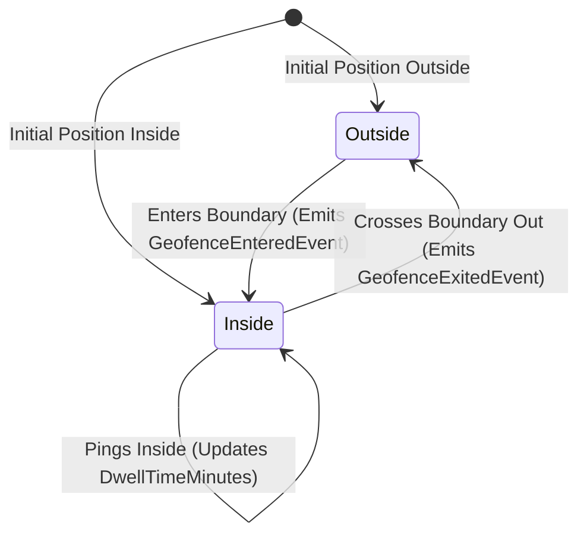

# Real-Time GPS Tracking & Geofencing Service — Deep Technical Details

> **Service Layer**: Spatial Algorithms, High-Throughput Ingestion & Geofencing  
> **Source-of-Truth**: `src/dotnet/GpsTracking`, `GpsPosition.cs`, `Geofence.cs`, `CurrentLocation.cs`, `GpsTrackingDbContext.cs`.

---

## 1. Spatial Algorithms & Geofence Evaluation

### 1.1 Circular Geofence: Haversine Distance Formula
For a vehicle at $(lat_v, lon_v)$ and circular geofence at $(lat_g, lon_g)$ with radius $R_g$:
$$d = 2 \cdot r_{earth} \cdot \arcsin\left(\sqrt{\sin^2\left(\frac{\Delta lat}{2}\right) + \cos(lat_g)\cos(lat_v)\sin^2\left(\frac{\Delta lon}{2}\right)}\right)$$
$$\text{IsInside} = (d \le R_g)$$

### 1.2 Polygon Geofence: Ray-Casting Algorithm
For arbitrary polygon geofences defined by vertices $V = \{(x_0, y_0), \dots, (x_n, y_n)\}$:
1. Casts a ray horizontally from point $P(lon_v, lat_v)$ to $+\infty$.
2. Counts intersections with all polygon edge segments.
3. If intersection count is odd, point is **Inside**; if even, point is **Outside**.

---

## 2. Geofence Transition State Machine

- When a vehicle enters a customer hub, `GeofenceEnteredEvent` automatically marks the corresponding `ShipmentMilestone` as `Completed` in `ShipmentWorkflow`.

---

## 3. High-Throughput Hot Path Architecture

To handle thousands of concurrent GPS pings per second:
1. **Redis Hot Key**: `SET vehicle:{id}:pos "lat,lng,speed,heading,timestamp"` (O(1) memory write).
2. **PostgreSQL Bulk Insert**: Background batch writer flushes accumulated historical pings to PostgreSQL `gps_positions` table in batches of 500 records.
3. **Realtime Broadcast**: Dispatches lightweight WebSocket message to `RealtimeHub` for live map marker movement.
