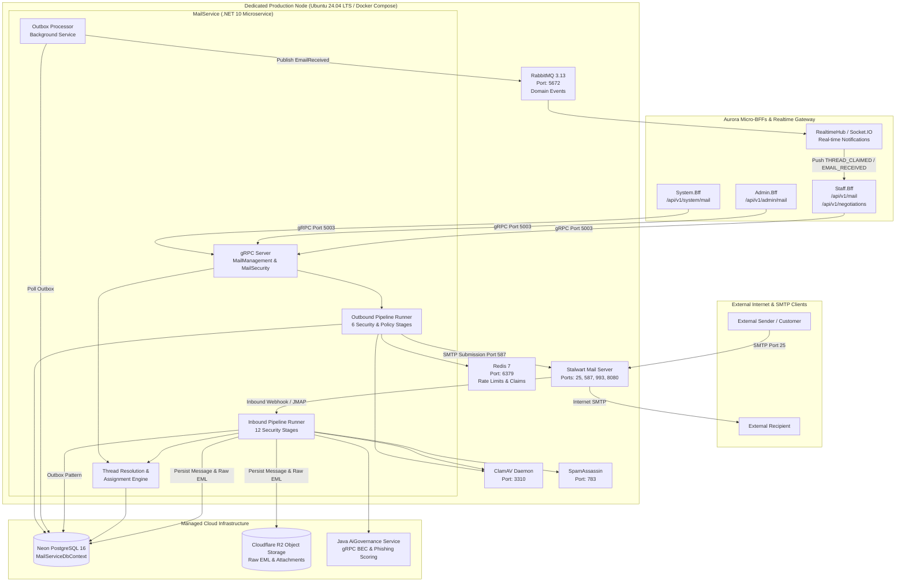
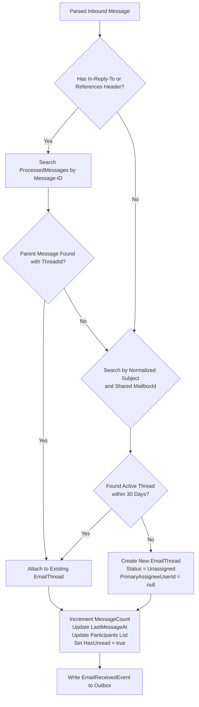
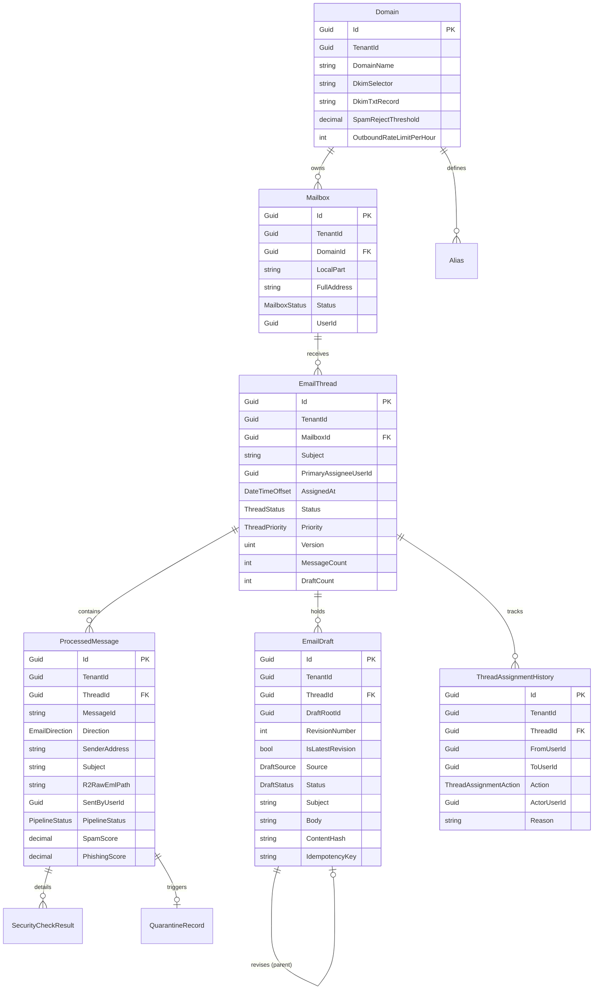

# Aurora Mail Platform — System Architecture & Data Flow

> **Status**: AUTHORITATIVE / PRODUCTION ARCHITECTURE (CODE-FIRST)  
> **Source-of-Truth**: Audited against `MailService.Domain`, `MailServiceDbContext`, `PipelineRunners.cs`, `InboundStages.cs`, `OutboundStages.cs`, `MailSecurityService.cs`, and `OutboxProcessorBackgroundService.cs`.

---

## 1. System Architecture Diagram



---

## 2. Inbound Pipeline & Thread Resolution Deep-Dive

When an inbound email arrives via SMTP, `Stalwart` triggers the inbound ingestion mechanism in `MailService`. The `InboundPipelineRunner` executes 12 ordered, deterministic stages:

### 2.1 The 12 Inbound Pipeline Stages

```
 0. TLS Verification          ──> Enforces TLS 1.2+ encryption on inbound connection.
 1. Header Parsing             ──> Extracts RFC 5322 headers (From, To, Cc, Subject, Message-ID, In-Reply-To, References).
 2. Recipient Validation       ──> Validates format and checks local parts against tenant alias/mailbox rules.
 3. SPF Validation             ──> Evaluates sender IP against domain SPF TXT records (Pass / SoftFail / Fail).
 4. DKIM Validation            ──> Cryptographically validates cryptographic signature headers against DNS public keys.
 5. DMARC Evaluation           ──> Validates alignment between SPF/DKIM and From header policy.
 6. Tenant & Domain Validation ──> Resolves TenantId by matching recipient domain against active registered domains.
 7. Attachment & Virus Scan    ──> Extracts MIME attachments and streams to ClamAV Daemon (Port 3310).
 8. SpamAssassin Scoring       ──> Calculates heuristic spam score (Port 783). Compares against SpamTag / SpamReject thresholds.
 9. AI BEC & Phishing Scoring  ──> Calls AiGovernance gRPC for zero-day phishing, executive impersonation, and BEC detection.
10. Header Forgery Analysis    ──> Analyzes Received header paths for anomalous intermediate relay hops.
11. Email Classification       ──> Classifies intent into BookingRequest, Quotation, ShipmentUpdate, Complaint, or Unknown.
```

### 2.2 Thread Resolution Algorithm
After passing security validation, `MailService` resolves the conversation thread:



---

## 3. Outbound Pipeline & Delivery Deep-Dive

When an authorized user clicks **Send** in the frontend (`POST /api/v1/mail/messages/outbound`), the `SubmitOutboundMessageCommandHandler` coordinates draft revision locking, thread assignment, and the outbound pipeline:

### 3.1 Assignment & Human Actor Capturing
1. **Authenticated Context**: Resolves `SentByUserId = CurrentUser.UserId` and `TenantId = CurrentUser.TenantId`.
2. **Reply-to-Claim Guard**:
   - If the thread is `Unassigned`, the system **atomically claims** the thread for `SentByUserId`, updates `Status = InProgress`, and appends an entry to `ThreadAssignmentHistory`.
   - If the thread is assigned to another staff member and the caller lacks supervisory authority (`mail:thread:reassign`), the command **aborts fail-closed** with `THREAD_ASSIGNED_TO_ANOTHER_STAFF`.

### 3.2 Outbound Pipeline Stages
```
12. Outbound Attachment Check  ──> Scans outgoing files with ClamAV to prevent accidental malware distribution.
13. Policy & Sensitive Data    ──> Verifies data loss prevention (DLP) rules and tenant outbound policies.
14. AI Risk & Prompt-Injection ──> Detects prompt-injection remnants or anomalous financial account alterations.
15. Tenant Rate Limit Check    ──> Evaluates Redis sliding-window counter against Domain.OutboundRateLimitPerHour.
16. Immutable Audit Record     ──> Generates AuditRecord logging ActorId, recipient list, and message hash.
17. Stalwart SMTP Submission   ──> Submits authenticated payload via SMTP to Stalwart (Port 587/25).
```

### 3.3 Post-Delivery Revision State
- Upon **SMTP 2xx Acceptance**: The associated `EmailDraft` is permanently marked as `Sent` (`DraftStatus.Sent`), and `ProcessedMessage` (Direction = `Outbound`) is committed.
- Upon **SMTP Rejection**: The draft remains in `Draft` status, allowing the user to correct errors and retry without data loss.

---

## 4. Transactional Outbox Pattern & Event Schema

To maintain consistency between the database and message broker without distributed 2PC transactions, `MailService` writes domain events to table `OutboxMessages` in the same local ACID transaction. The `OutboxProcessorBackgroundService` polls and publishes events to `RabbitMQ`:

```
MailService DbContext Transaction
  ├── INSERT ProcessedMessage
  ├── UPDATE EmailThread
  └── INSERT OutboxMessage (EventType: "EmailReceivedEvent", Payload: JSON)
         │
         ▼ (Commit OK)
OutboxProcessorBackgroundService (Every 5s)
  ├── SELECT OutboxMessages WHERE ProcessedAt IS NULL ORDER BY CreatedAt ASC
  ├── Publish to RabbitMQ Exchange: "aurora.mail"
  └── UPDATE OutboxMessages SET ProcessedAt = UtcNow()
```

### Supported Domain Events

| Event Name | Routing Key | Payload Summary | Consumer / Effect |
|---|---|---|---|
| `EmailReceivedEvent` | `mail.received` | `{ messageId, threadId, tenantId, mailboxId, sender, subject, category }` | RealtimeHub pushes inbox notification; AI Negotiation triage triggered. |
| `EmailQuarantinedEvent` | `mail.quarantined`| `{ messageId, tenantId, sender, reason, spamScore, phishingScore }` | Notifies security managers via RealtimeHub / WebSocket. |
| `EmailSentEvent` | `mail.sent` | `{ messageId, threadId, tenantId, sender, recipients, sentByUserId }` | RealtimeHub updates thread timeline for connected staff. |
| `ThreadClaimedEvent` | `mail.thread.claimed` | `{ threadId, tenantId, assignedUserId, assignedStaffName }` | Live-locks thread in other staff browsers to avoid duplicate work. |
| `ThreadReassignedEvent` | `mail.thread.reassigned`| `{ threadId, tenantId, previousAssigneeId, newAssigneeId }` | Re-routes thread in staff work queues. |

---

## 5. Persistence & Data Schema

The relational data model in `MailServiceDbContext` is structured as follows:


