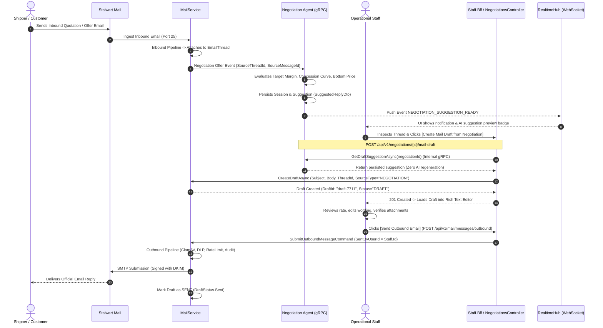

# Aurora Mail Platform — Negotiation Integration & Human-in-the-Loop AI

> **Status**: AUTHORITATIVE / PRODUCTION ARCHITECTURE (CODE-FIRST)  
> **Source-of-Truth**: Audited against `NegotiationsController.cs`, `NegotiationService.GetDraftSuggestion`, `CreateDraftMessageCommandHandler`, `SubmitOutboundMessageCommandHandler`, and `negotiation.proto`.

---

## 1. Architectural Guardrail: Zero Autonomous Outbound Mail

In Aurora, AI negotiation agents (e.g. Rate Negotiation Agent, Bidding Copilot) **ARE STRICTLY FORBIDDEN FROM DIRECTLY SENDING OUTBOUND EMAILS**.

```
❌ PROHIBITED (Autonomous AI Sending):
Inbound Offer ──> AI Agent Evaluates ──> AI Directly Sends Email to Customer

✅ AUTHORITATIVE (Human-in-the-Loop MVP):
Inbound Offer ──> EmailThread ──> Negotiation Agent Evaluates ──> SuggestedReplyDto
                                                                      │
                                   Staff Clicks [Create Mail Draft] ◄─┘
                                   (POST /api/v1/negotiations/{id}/mail-draft)
                                       │
                                       ▼
                                  EmailDraft (SourceType="NEGOTIATION", Threaded)
                                       │
                                   Staff Reviews & Edits in Rich Editor
                                       │
                                   Staff Clicks [Send Email]
                                   (POST /api/v1/mail/messages/outbound)
                                       │
                                       ▼
                                  Outbound Security Pipeline & SMTP
```

---

## 2. End-to-End Sequence Flow



---

## 3. Detailed Data Structures & Contracts

### 3.1 Negotiation Suggestion Response (`protos/negotiation.proto`)
```protobuf
message SuggestedReplyDto {
  string subject_suggestion = 1;
  string body               = 2;
  string language           = 3; // 'en', 'vi', etc.
}

message SubmitOfferResponse {
  string session_id                = 1;
  string shipment_id               = 2;
  int32  round                     = 3;
  string decision                  = 4; // 'ACCEPT' | 'COUNTER_OFFER' | 'HUMAN_HANDOFF' | 'REJECT'
  double counter_offer_price       = 5;
  string currency                  = 6; // e.g. "USD"
  string ai_speech                 = 7;
  string status                    = 8; // 'OPEN' | 'ACCEPTED' | 'HANDOFF' | 'REJECTED'
  
  SuggestedReplyDto suggested_reply          = 10;
  bool              suggested_reply_available = 11;
  bool              ai_draft_used            = 12;
  bool              fallback_used            = 13;
}
```

### 3.2 Draft Creation Controller (`NegotiationsController.cs`)
When `POST /api/v1/negotiations/{negotiationId}/mail-draft` is invoked:
1. **Zero AI Regeneration**: The BFF does not re-invoke an LLM. It queries the persisted, validated suggestion from `NegotiationService.GetDraftSuggestionAsync`.
2. **Recipient Auto-Resolution**: Resolves the original sender address from `SourceMessageId`.
3. **Threading Linkage**: Links `draft.ThreadId` to the parent `EmailThread` and sets `SourceType = "NEGOTIATION"`, `SourceId = negotiationId`.
4. **Idempotency**: Generates `idempotencyKey = "neg-draft-{tenantId}-{negotiationId}"` so repeated clicks safely return the existing draft.

---

## 4. Invariants for Frontend Implementers

1. **Explicit Staff Action**: Never auto-call `/api/v1/negotiations/{id}/mail-draft` on page load. It must only trigger when a user clicks the **[Create Mail Draft]** button.
2. **Draft Preview State**: The UI must display the suggestion alongside the freight rate metrics (floor price, initial quote, target margin %).
3. **Thread Context**: After draft creation, the draft editor should be embedded directly within the active `EmailThread` conversation view.
