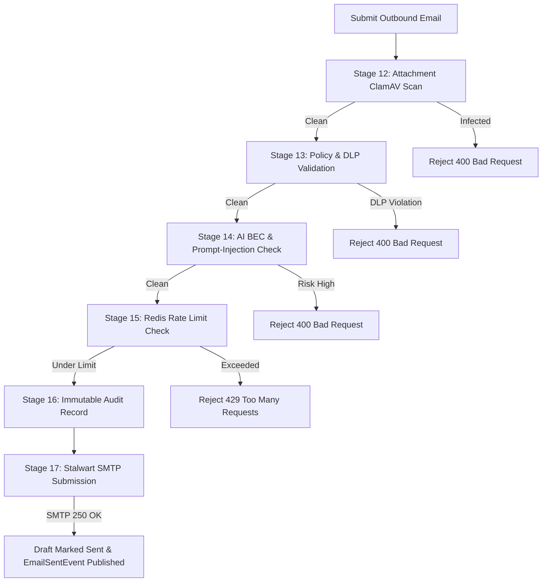

# Aurora Mail Platform — Security Pipeline & Threat Management

> **Status**: AUTHORITATIVE / PRODUCTION ARCHITECTURE (CODE-FIRST)  
> **Source-of-Truth**: Audited against `PipelineRunners.cs`, `InboundStages.cs`, `OutboundStages.cs`, `SecurityCheckResult`, `QuarantineRecord`, `ClamAvScannerClient`, `SpamAssassinClient`, `AiGovernanceClient`, and `MailSecurityService.cs`.

---

## 1. Pipeline Overview & Design Principles

Aurora implements a **Two-Way Defense-in-Depth Pipeline**:
- **Inbound Security Pipeline (12 Stages)**: Protects tenant users and systems from malicious attachments, spam, spoofed sender headers, and Business Email Compromise (BEC) phishing attacks.
- **Outbound Security Pipeline (6 Stages)**: Prevents accidental data leaks, prompt-injection propagation, compromised employee account spamming, and reputational blacklisting.

```
Inbound Email (SMTP: Port 25)
      │
      ▼
┌─────────────────────────────────────────────────────────────┐
│               12-Stage Inbound Security Pipeline            │
│ TLS -> Headers -> Recipient -> SPF/DKIM/DMARC -> Tenant/Domain
│ -> ClamAV -> SpamAssassin -> AI BEC -> Forgery -> Category  │
└──────────────────────────────┬──────────────────────────────┘
                               │
            ┌──────────────────┴──────────────────┐
            ▼                                     ▼
      [Threat Detected]                      [Passed Clean]
            │                                     │
            ▼                                     ▼
      QuarantineRecord                     ProcessedMessage
      (Pending Manager Review)             (Thread Ingestion & Outbox)
```

---

## 2. Inbound Pipeline Stage Breakdown

### Stage 0: TLS Verification (`SecurityCheckStage.TlsVerification`)
- Verifies that the inbound SMTP connection used TLS 1.2 or TLS 1.3.
- Checks cipher suite strength and certificate status.

### Stage 1: Header Parsing (`SecurityCheckStage.HeaderParsing`)
- Extracts and validates standard RFC 5322 headers: `From`, `To`, `Cc`, `Subject`, `Message-ID`, `Date`, `In-Reply-To`, `References`.
- Normalizes subject line for threading (stripping `Re:`, `Fwd:`, `Tr:`, `RE: ` prefixes).

### Stage 2: Recipient Validation (`SecurityCheckStage.RecipientValidation`)
- Validates that recipient email addresses are syntactically valid and belong to a configured tenant domain or shared mailbox.

### Stages 3, 4, 5: SPF, DKIM & DMARC Authentication
- **SPF (`SpfValidation`)**: Validates sender IP against DNS TXT `v=spf1 ...` records.
- **DKIM (`DkimValidation`)**: Cryptographically verifies `DKIM-Signature` headers using public keys retrieved from DNS (`<selector>._domainkey.<domain>`).
- **DMARC (`DmarcEvaluation`)**: Validates alignment between RFC 5322 `From` domain and SPF/DKIM validated domains according to the sender's DMARC policy (`p=none`, `p=quarantine`, `p=reject`).

### Stage 6: Tenant & Domain Resolution (`SecurityCheckStage.TenantValidation`)
- Resolves the matching `TenantId` from the recipient domain.
- Loads tenant-specific security threshold overrides from `Domain` entity (`SpamRejectThreshold`, `PhishingQuarantineThreshold`, `SpamTagThreshold`).

### Stage 7: Attachment Validation & Antivirus Scan (`SecurityCheckStage.AttachmentValidation`)
- Extracts all MIME body parts and attachments.
- Validates file extensions against tenant blocklists (e.g. `.exe`, `.bat`, `.vbs`, `.scr`, `.js`, `.cmd`).
- Streams file streams directly to the local **ClamAV Daemon** (`tcp://clamav:3310` using `INSTREAM` protocol).
- **Short-Circuit Trigger**: If a virus/trojan is detected, the pipeline immediately halts, marks the message as `IsQuarantined = true`, and creates a `QuarantineRecord`.

### Stage 8: SpamAssassin Scoring (`SecurityCheckStage.SpamScoring`)
- Streams headers and body text to **Apache SpamAssassin** (`tcp://spamassassin:783`).
- Parses returned `SpamScore` (e.g. `4.2`).
- **Decision Logic**:
  - `SpamScore >= Domain.SpamRejectThreshold` (Default `10.0`): Immediate short-circuit quarantine.
  - `SpamScore >= Domain.SpamTagThreshold` (Default `5.0`): Tagged with `[SPAM]` prefix in subject.

### Stage 9: AI BEC & Zero-Day Phishing Detection (`SecurityCheckStage.AiPhishingDetection`)
- Inbound body text and sender metadata are evaluated by `AiGovernance` via gRPC.
- Evaluates:
  - **Executive Impersonation**: High-similarity display names with mismatched email domains.
  - **Financial Alteration**: Requests to change wire instructions or bank account details.
  - **Credential Harvesting**: Suspicious links masking underlying URLs.
- Returns `PhishingScore` (0.0 to 1.0). If `PhishingScore >= Domain.PhishingQuarantineThreshold` (Default `0.7`), short-circuits to quarantine.

### Stage 10: Header Forgery Analysis (`SecurityCheckStage.HeaderForgeryAnalysis`)
- Evaluates intermediate `Received` relay hops for forged timestamps or spoofed internal IP ranges.

### Stage 11: Email Category Classification (`SecurityCheckStage.Classification`)
- Classifies email intent into: `BookingRequest`, `ShipmentUpdate`, `Quotation`, `Complaint`, `Spam`, or `Unknown`.

---

## 3. Outbound Pipeline Stage Breakdown

Outbound email submission (`POST /api/v1/mail/messages/outbound`) executes 6 security stages:



### Stage 12: Outbound Attachment Validation
- Scans all outgoing attached files with ClamAV.

### Stage 13: Policy & Data Loss Prevention (DLP)
- Verifies recipient email syntax, unallowed external forwarding rules, and sensitive credit card / national ID regexes.

### Stage 14: AI Risk & Prompt-Injection Defense
- Detects prompt-injection traces or anomalous text generated by compromised AI models.

### Stage 15: Sliding-Window Rate Limiting
- Evaluates tenant hourly outbound volume using Redis sliding-window counters (`ratelimit:outbound:{tenantId}`).
- Prevents compromised credentials from sending high-volume spam campaigns.

### Stage 16: Immutable Audit Record
- Writes an `AuditRecord` linking `ActorId` (`SentByUserId`), recipients, content hash, and timestamp.

### Stage 17: Stalwart Authenticated SMTP Submission
- Submits RFC 5322 MIME message to Stalwart via SMTP submission port.
- Stalwart signs the message with tenant DKIM private key (`aurora-2025`) and initiates internet delivery.

---

## 4. Quarantine & Threat Management Lifecycle

When a message is quarantined:
1. It is **NOT** delivered to any user mailbox or thread queue.
2. A `QuarantineRecord` is created (`Status: PENDING`).
3. An `EmailQuarantinedEvent` is published to RabbitMQ.
4. Managers and Security Leads review threats in the Quarantine Dashboard (`GET /api/v1/mail/quarantine`).

### 4.1 Releasing a Quarantined Email (`POST /api/v1/mail/quarantine/{id}/release`)
- **Permission Required**: `mail:quarantine:release`.
- Fetches raw EML from Cloudflare R2 (`R2RawEmlPath`).
- Updates `QuarantineRecord.Status = Released`.
- Ingests the message into the corresponding shared mailbox and creates/attaches to the conversation thread.

### 4.2 Purging a Quarantined Threat (`DELETE /api/v1/admin/mail/quarantine/{id}`)
- **Permission Required**: `mail:quarantine:delete`.
- Permanently deletes raw EML and marks `QuarantineRecord.Status = Deleted`.
