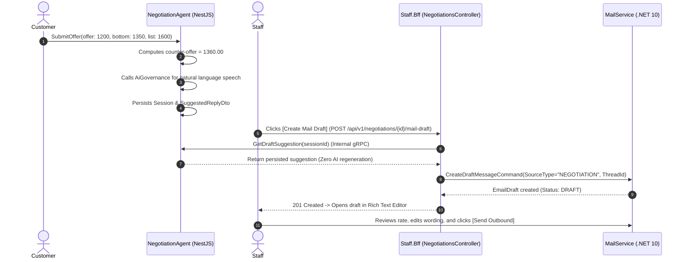

# Freight Rate Negotiation Agent — Deep Technical Details

> **Service Layer**: Strategy Engine, Concession Curves, State Machine & HitL Integration  
> **Source-of-Truth**: `src/nestjs/negotiation-agent-service`, `negotiation-strategy.domain-service.ts`, `NegotiationsController.cs`.

---

## 1. Domain Model & Mathematical Concession Formula

The negotiation engine operates strictly on deterministic mathematical rules in `NegotiationStrategyDomainService`:

```
Input Parameters:
- OfferPrice ($O$)
- BottomPrice ($B$)
- ListPrice ($L$)
- CurrentRound ($R$)
- MaxRounds ($R_{max} = 3$)
- CustomerTier ($T \in \{\text{STANDARD}, \text{VIP}, \text{ENTERPRISE}\}$)
```

### 1.1 Decision Rules:
1. **VIP / Enterprise Escalation**:
   $$\text{If } T \in \{\text{VIP}, \text{ENTERPRISE}\} \implies \text{Decision} = \text{HUMAN\_HANDOFF}$$
2. **Floor Price Acceptance**:
   $$\text{If } O \ge B \implies \text{Decision} = \text{ACCEPT}, \quad \text{ApprovedAmount} = O$$
3. **Max Rounds Exceeded**:
   $$\text{If } R \ge R_{max} \implies \text{Decision} = \text{HUMAN\_HANDOFF}, \quad \text{ApprovedAmount} = B$$
4. **Counter-Offer Concession Step**:
   $$\text{CounterOfferPrice} = \max\left(B, \; O + (L - O) \times 0.4\right)$$
   $$\text{Decision} = \text{COUNTER\_OFFER}$$

---

## 2. Integration with BFF & MailService (`Human-in-the-Loop`)



---

## 3. Resilience, Concurrency & Idempotency

- **Idempotent Draft Generation**: Draft creation requests pass `idempotencyKey = "neg-draft-{tenantId}-{negotiationId}"`. Repeated clicks return the existing draft instance rather than creating duplicates.
- **State Machine Isolation**: Once a session reaches `ACCEPTED`, `HANDOFF`, or `REJECTED`, further offers are blocked.
- **Fail-Closed gRPC**: All gRPC calls between BFF and Negotiation Agent use timeout deadlines and typed error codes.
