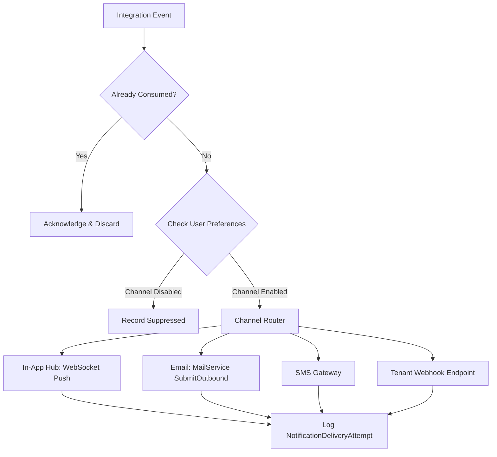

# Multi-Channel Notification & Alerting Service — Deep Technical Details

> **Service Layer**: Event Consumers, Channel Routing, Idempotency & Delivery Attempts  
> **Source-of-Truth**: `src/dotnet/Notification`, `NotificationMessage.cs`, `ConsumedIntegrationEvent.cs`, `NotificationDbContext.cs`.

---

## 1. Idempotent Integration Event Consumption

To handle network partitions and message redelivery from RabbitMQ without sending duplicate SMS or emails:

```csharp
public async Task Consume(ConsumeContext<ShipmentStatusChangedEvent> context)
{
    var messageId = context.MessageId ?? Guid.NewGuid();

    // 1. Idempotency Check
    var alreadyProcessed = await _dbContext.ConsumedIntegrationEvents
        .AnyAsync(e => e.EventId == messageId, context.CancellationToken);

    if (alreadyProcessed)
    {
        _logger.LogInformation("Event {EventId} already consumed; skipping duplicate.", messageId);
        return;
    }

    // 2. Evaluate User Notification Preferences
    var preference = await _preferenceService.GetPreferenceAsync(context.Message.TenantId, context.Message.RecipientUserId);
    if (!preference.IsChannelEnabled(NotificationChannel.Email))
    {
        return;
    }

    // 3. Render Template & Dispatch to MailService / WebSocket
    var notification = new NotificationMessage
    {
        TenantId = context.Message.TenantId,
        RecipientUserId = context.Message.RecipientUserId,
        Category = NotificationCategory.ShipmentMilestones,
        Channel = NotificationChannel.Email,
        Title = $"Shipment {context.Message.TrackingNumber} Status Update",
        Body = $"Your shipment has updated to {context.Message.NewStatus}."
    };

    _dbContext.NotificationMessages.Add(notification);
    _dbContext.ConsumedIntegrationEvents.Add(new ConsumedIntegrationEvent {
        EventId = messageId,
        EventType = nameof(ShipmentStatusChangedEvent),
        ConsumedAt = DateTimeOffset.UtcNow
    });

    await _dbContext.SaveChangesAsync(context.CancellationToken);
}
```

---

## 2. Multi-Channel Router & Resilience Strategy



---

## 3. Delivery Retry & Failure Handling

- **Exponential Backoff**: If an external SMS gateway or webhook returns `503` or timeouts, the message is scheduled for retry at $t = 2^n \times 10\text{s}$ (up to 3 attempts).
- **Delivery Audit**: Every attempt persists `ResponseStatusCode`, `DurationMs`, and `ErrorMessage` in `NotificationDeliveryAttempt`.
