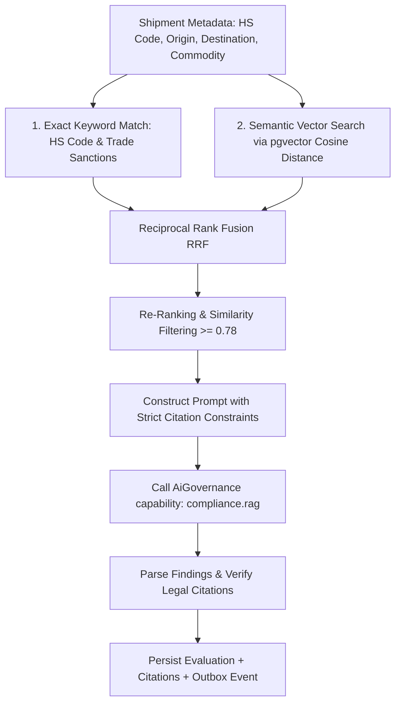

# Regulatory Compliance RAG Service — Deep Technical Details

> **Service Layer**: RAG Architecture, pgvector Indexing, Citation Tracing & Overrides  
> **Source-of-Truth**: `src/dotnet/RegulatoryCompliance`, `ComplianceEvaluation.cs`, `ComplianceCitation.cs`, `RegulatoryChunk.cs`, `RegulatoryComplianceDbContext.cs`.

---

## 1. Vector Storage & Hybrid Retrieval Architecture

### 1.1 `pgvector` Schema & HNSW Indexing
Vector chunks are stored natively in PostgreSQL using `pgvector`:
```sql
CREATE TABLE regulatory_chunks (
    id UUID PRIMARY KEY,
    tenant_id UUID NOT NULL,
    document_version_id UUID NOT NULL,
    article_number VARCHAR(100),
    title VARCHAR(500),
    chunk_text TEXT NOT NULL,
    embedding vector(1536) NOT NULL,
    created_at TIMESTAMPTZ NOT NULL
);

CREATE INDEX idx_regulatory_chunks_embedding_hnsw 
ON regulatory_chunks 
USING hnsw (embedding vector_cosine_ops)
WITH (m = 16, ef_construction = 64);
```

### 1.2 Hybrid Retrieval Pipeline


---

## 2. Mandatory Legal Citation Verification

To eliminate hallucinations in regulatory filings, every `ComplianceFinding` must link to at least one verified `ComplianceCitation`:

```csharp
public class ComplianceCitation : TenantAuditableEntity
{
    public Guid FindingId { get; set; }
    public string SourceDocument { get; set; } = string.Empty; // e.g. "VN Customs Decree 08/2015/ND-CP"
    public string ArticleNumber { get; set; } = string.Empty;  // e.g. "Article 16, Section 2"
    public string TextExcerpt { get; set; } = string.Empty;    // Exact verbatim statute excerpt
    public double SimilarityScore { get; set; }
}
```

If the LLM generates a finding without matching a retrieved text chunk in the citation index, the pipeline flags the finding as unverified and escalates to a compliance officer.

---

## 3. Compliance Override Workflow (`compliance:override`)

When a shipment is flagged for trade restrictions, a compliance manager can grant an exception:
```http
POST /api/v1/compliance/evaluations/{id}/override
```
```json
{
  "justification": "Approved under US-Vietnam Bilateral Trade Agreement Annex 3 with attached Certificate of Origin Form E.",
  "supportingDocumentId": "doc-cert-origin-8891"
}
```
- Sets `Status = ComplianceEvaluationStatus.Overridden`.
- Captures `OverriddenByUserId` and `OverriddenAt`.
- Emits `ComplianceEvaluationOverriddenEvent` via Outbox, unblocking shipment booking transitions.
