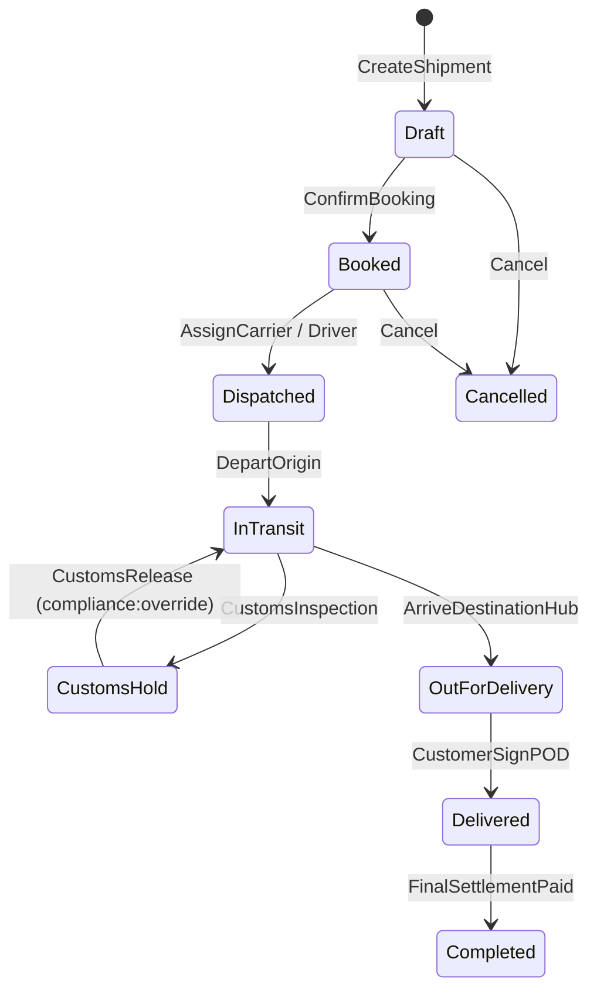

# Shipment Workflow & State Machine Service — Deep Technical Details

> **Service Layer**: State Machine Transitions, Outbox Pattern, Milestones & Concurrency  
> **Source-of-Truth**: `src/dotnet/ShipmentWorkflow`, `Shipment.cs`, `ShipmentMilestone.cs`, `ShipmentWorkflowDbContext.cs`.

---

## 1. Shipment State Machine Transitions

The core lifecycle is governed by an explicit transition matrix:



---

## 2. Milestone Tracking & Real-Time Event Ingestion

Milestones represent geographic and operational checkpoints:

```csharp
public class ShipmentMilestone : TenantAuditableEntity
{
    public Guid ShipmentId { get; set; }
    public string MilestoneName { get; set; } = string.Empty; // e.g. "Vessel Departure", "Customs Clearance"
    public MilestoneType Type { get; set; }
    public DateTimeOffset? EstimatedAt { get; set; }
    public DateTimeOffset? ActualAt { get; set; }
    public MilestoneStatus Status { get; set; } = MilestoneStatus.Pending;
    public double? Latitude { get; set; }
    public double? Longitude { get; set; }
}
```

When GPS geofence events or carrier EDI feeds arrive:
1. Matches active milestone by geofence or EDI code.
2. Sets `ActualAt = UtcNow` and `Status = MilestoneStatus.Completed`.
3. If milestone is terminal (e.g. `ProofOfDelivery`), automatically triggers `ShipmentStatus.Delivered`.

---

## 3. Transactional Outbox & Event Publishing

Domain events are written to table `outbox_messages` in the same database transaction as shipment status changes:

```csharp
var outboxMessage = new OutboxMessage
{
    Id = Guid.NewGuid(),
    TenantId = shipment.TenantId,
    EventType = nameof(ShipmentStatusChangedEvent),
    PayloadJson = JsonSerializer.Serialize(new ShipmentStatusChangedEvent {
        ShipmentId = shipment.Id,
        TenantId = shipment.TenantId,
        PreviousStatus = previousStatus,
        NewStatus = shipment.Status,
        Timestamp = DateTimeOffset.UtcNow
    }),
    CreatedAt = DateTimeOffset.UtcNow
};
_dbContext.OutboxMessages.Add(outboxMessage);
await _dbContext.SaveChangesAsync(cancellationToken);
```

---

## 4. Concurrency & Multi-Tenancy

- **Optimistic Locking**: `Shipment.Version` increments on every update; prevents concurrent milestone overwrites.
- **Tenant Scoping**: EF Core global query filters ensure strict tenant isolation.
- **Soft Delete**: `IsDeleted` flag preserves referential integrity for billing and historical tracking.
