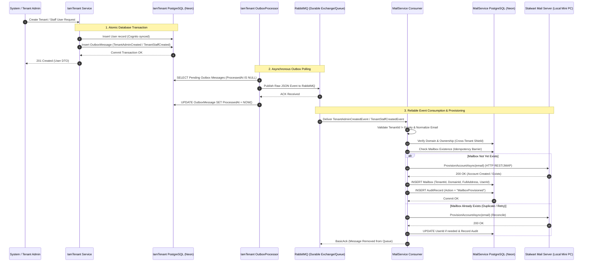

# Aurora Mailbox Auto-Provisioning Architecture & Flow Documentation

> **Cross-Reference**: For the full authoritative Mail Platform architecture and APIs, refer to [docs/technical/mail/ARCHITECTURE.md](file:///D:/IT/CD/aurora-server/docs/technical/mail/ARCHITECTURE.md) and [docs/technical/mail/OVERVIEW.md](file:///D:/IT/CD/aurora-server/docs/technical/mail/OVERVIEW.md).

This document defines the distributed event-driven auto-provisioning system for Aurora Mailboxes across `IamTenant`, `RabbitMQ`, `MailService`, and the underlying `Stalwart` mail server.

---

## 1. Executive Summary & Architectural Role

Aurora implements an **Event-Driven Automatic Mailbox Provisioning Pattern**:
- When the System provisions a **Tenant Admin** or a Tenant Admin creates a **Staff/User**, `IamTenant` commits the user record and enqueues a provisioning event into its **Transactional Outbox** in the same database transaction.
- The `OutboxProcessorBackgroundService` publishes the event to durable exchanges on `RabbitMQ`.
- `MailService`'s `TenantUserProvisionedConsumer` consumes the event, validates cross-tenant domain ownership, ensures idempotency, provisions the account in `Stalwart`, and registers the `Mailbox` entity in `MailServiceDbContext`.
- **Client-side orchestration is forbidden**: The Frontend/BFF never makes a second independent call to create a mailbox during user registration.
- The manual `POST /api/v1/admin/mail/mailboxes` API remains active strictly for **shared department mailboxes (e.g. `support@domain.com`, `sales@domain.com`)**, manual administrative override, and system repair/recovery.

---

## 2. Distributed Architecture Diagram

---

## 3. Provisioning Scenarios & Workflows

### 3.1 Scenario 1: Tenant Admin Mailbox Provisioning
1. **Trigger**: System Admin provisions a new Tenant (`POST /api/v1/system/tenants`).
2. **Execution in `IamTenant`**:
   - Creates Tenant entity and AWS Cognito Admin User Pool.
   - Creates Tenant Admin User record (`admin@company.com`).
   - Inserts `TenantAdminCreatedEvent` into `OutboxMessages` within the **same DbContext transaction**.
3. **Propagation**:
   - `OutboxProcessorBackgroundService` reads pending outbox messages and publishes to exchange `tenant_admin_created_event`.
4. **Processing in `MailService`**:
   - `TenantUserProvisionedConsumer` consumes `TenantAdminCreatedEvent`.
   - Auto-registers the primary tenant domain if not yet configured.
   - Calls `IStalwartManagementClient.ProvisionAccountAsync(email)`.
   - Persists `Mailbox` with `TenantId = msg.TenantId`, `UserId = msg.UserId`, `Status = Active`.
   - Logs `AuditRecord` (`Action = "MailboxProvisioned"`, `ActorType = System`).

---

### 3.2 Scenario 2: Staff / Employee User Mailbox Provisioning
1. **Trigger**: Tenant Admin invites/creates staff member (`POST /api/v1/admin/staff`).
2. **Execution in `IamTenant`**:
   - Validates that email ends with `@tenant.CompanyDomain`.
   - Creates Cognito user in Tenant User Pool.
   - Creates `User` and `UserRole` mappings.
   - Inserts `TenantStaffCreatedEvent` into `OutboxMessages` within the **same DbContext transaction**.
3. **Propagation**:
   - `OutboxProcessorBackgroundService` publishes event to exchange `tenant_staff_created_event`.
4. **Processing in `MailService`**:
   - `TenantUserProvisionedConsumer` consumes `TenantStaffCreatedEvent`.
   - Validates that the email domain belongs strictly to `msg.TenantId`.
   - Calls `IStalwartManagementClient.ProvisionAccountAsync(email)`.
   - Persists `Mailbox` and emits `AuditRecord`.

---

### 3.3 Scenario 3: RabbitMQ Outage (Broker Unavailable)
1. **Event Enqueue**: During a RabbitMQ network partition or broker restart, `IamTenant` successfully saves the User and `OutboxMessage` in PostgreSQL.
2. **Resilience**: The HTTP request to create staff returns `201 Created` without blocking or failing.
3. **Recovery**:
   - `OutboxProcessorBackgroundService` catches the broker connection exception, logs the failure, and increments `RetryCount`.
   - `ProcessedAt` remains `NULL`.
   - Once RabbitMQ recovers, the outbox processor picks up the pending record on the next 10-second polling cycle and publishes it without message loss.

---

### 3.4 Scenario 4: Downstream Consumer Failure (Stalwart Down / DB Lock)
1. **MassTransit Retry Pipeline**:
   - If `IStalwartManagementClient` or `MailServiceDbContext` fails due to a transient error, MassTransit's exponential backoff retry policy triggers:
     - **Attempt 1**: 1s delay
     - **Attempt 2**: 2s delay
     - **Attempt 3**: 4s delay
     - **Attempt 4**: 8s delay
     - **Attempt 5**: 16s–30s delay
2. **Dead Letter Queue (DLQ)**:
   - If all 5 retries fail (e.g. prolonged Stalwart outage or poison message), MassTransit moves the message to `tenant_user_provisioned_consumer_error`.
   - The error queue preserves the original message, complete exception stack trace, and fault headers (`MT-Fault-Message`).
   - SRE/Admin can requeue messages once the underlying service is restored.

---

### 3.5 Scenario 5: Duplicate Event Delivery & Idempotency Barrier
1. **Context**: At-least-once message delivery in distributed systems may deliver the same event multiple times due to network ACKs timing out.
2. **Idempotency Guard**:
   - `MailService` enforces a unique index on `Mailbox.FullAddress` in PostgreSQL (`b.HasIndex(m => m.FullAddress).IsUnique()`).
   - `TenantUserProvisionedConsumer` queries `Mailbox` for `(FullAddress == email || (TenantId == tenantId && UserId == userId))`.
   - If the mailbox already exists:
     - Reconciles state with Stalwart (ensures account exists).
     - Updates `UserId` if it was null.
     - Emits an informational log and completes cleanly without error.
   - **Result**: Zero duplicate records, zero uncaught exceptions, zero duplicate Stalwart accounts.

---

### 3.6 Scenario 6: Cross-Tenant Security Shield
1. **Context**: A malicious or malformed event arrives claiming `Tenant B` wants to provision `user@company-a.com` where `company-a.com` is owned by `Tenant A`.
2. **Enforcement**:
   - `TenantUserProvisionedConsumer` queries `Domains` for `domainName`.
   - If the domain exists and `domain.TenantId != msg.TenantId`:
     - Throws `InvalidOperationException("Security violation: Domain is owned by another tenant.")`.
     - Message is blocked from execution and moved to DLQ for security audit.

---

## 4. Failure Classification & Resolution Matrix

| Failure Type | Root Cause | System Behavior | Recovery Action |
| :--- | :--- | :--- | :--- |
| **Transient Stalwart Error** | Stalwart container rebooting or HTTP 503 | MassTransit retries 5 times with exponential backoff (1s–30s) | Recovers automatically once container is ready. |
| **RabbitMQ Outage** | Message broker down during user creation | Outbox record remains pending (`ProcessedAt = null`) in `iam_tenant` DB | OutboxProcessor automatically drains pending messages when broker reconnects. |
| **Malformed Event Payload** | Empty `TenantId` or invalid email format (`test@@invalid`) | Consumer throws `ArgumentException`; after retries moves to `_error` queue | Operator inspects DLQ, fixes producer bug if schema violated. |
| **Cross-Tenant Hijack Attempt** | Event specifies domain owned by another tenant | Consumer throws `InvalidOperationException`; logged as security warning | Message dead-lettered; alert sent to security audit trail. |
| **Duplicate Message** | RabbitMQ redelivery or duplicate outbox drain | Consumer identifies existing `FullAddress`, reconciles Stalwart, returns success | Handled idempotently with 0 human intervention. |
| **Prolonged Infrastructure Outage** | Neon DB or Stalwart down > 10 minutes | Outbox messages stay in DB; in-flight messages land in MassTransit `_error` queue | After restoring DB/Stalwart, run DLQ shovel or requeue command. |

---

## 5. Comparison: Auto-Provisioning vs Manual `CreateMailbox` API

| Attribute | Automatic Event-Driven Provisioning | Manual `CreateMailbox` API (`POST /api/v1/admin/mail/mailboxes`) |
| :--- | :--- | :--- |
| **Trigger** | User/Staff creation in `IamTenant` | Admin explicitly invokes BFF route |
| **Transport** | RabbitMQ (`TenantAdminCreatedEvent`, `TenantStaffCreatedEvent`) | gRPC `MailManagement.CreateMailbox` via BFF |
| **Target Use-Case** | Individual staff & tenant admin personal mailboxes | Shared mailboxes (`support@`, `sales@`), department mailboxes, manual repair |
| **User Association** | Tied directly to `UserId` | Can have `UserId = null` (shared mailbox) |
| **Idempotency** | At-least-once duplicate reconciliation | Returns existing mailbox if address already exists |
| **Authorization** | System-to-System via RabbitMQ consumer | `mail:create` permission checked by `AuthInterceptor` |
| **Orchestration Requirement** | 100% automated (Zero client coordination) | Explicit admin action from Admin Portal UI |
